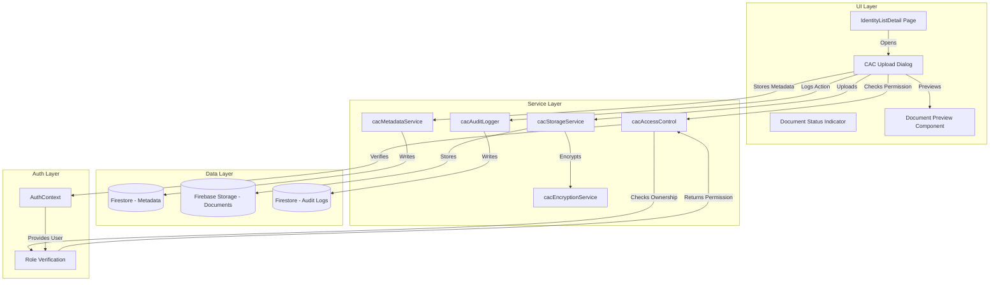
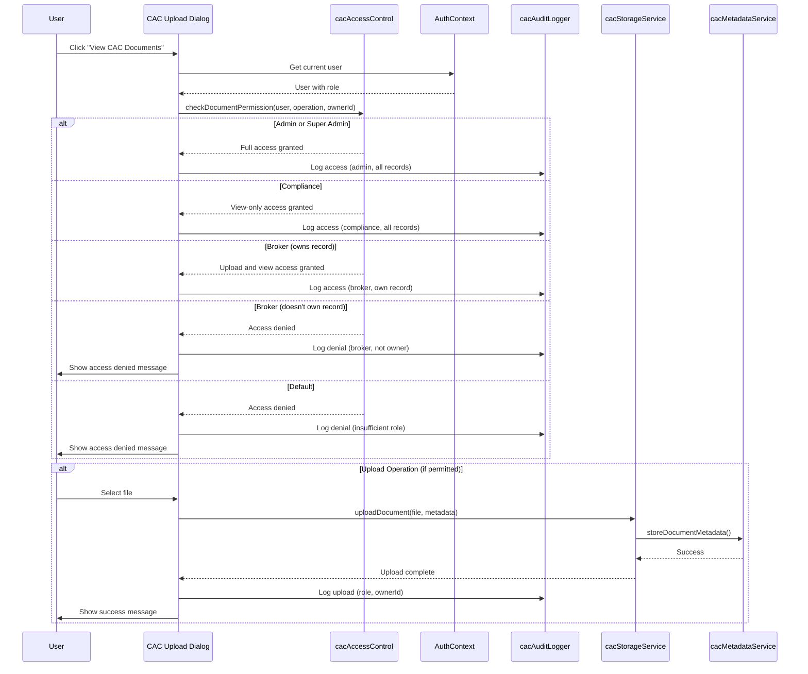

# Design Document: Admin CAC Document Upload with Role-Based Access Control

## Overview

This design extends the existing CAC document management system to enable authorized users (admins, super_admins, compliance officers, and brokers) to upload and manage CAC documents on behalf of customers with role-based access control. The system maintains all existing security measures including AES-256-GCM encryption, comprehensive audit logging, and access control while introducing scoped permissions based on user roles and document ownership.

### Key Design Principles

1. **Role-Based Access Control**: Four distinct roles with different permission levels
   - **Admin/Super Admin**: Full access to all records and operations
   - **Compliance**: View-only access to all records
   - **Broker**: Upload and view access only to records they created
   - **Default**: No access to admin features

2. **Security-First Approach**: Reuse existing security infrastructure
   - Existing encryption service (AES-256-GCM)
   - Existing storage service with path validation
   - Existing metadata service with Firestore integration
   - Existing access control with permission verification
   - Enhanced audit logging with role and ownership context

3. **Ownership-Based Scoping**: Brokers can only access their own records
   - Identity records track the creating user (ownerId)
   - All operations verify ownership for broker role
   - Audit logs capture ownership context

4. **Seamless Integration**: Extend existing components
   - Enhance CACDocumentUpload component for admin use
   - Integrate with existing CACDocumentPreview component
   - Leverage existing cacAccessControl service
   - Extend cacAuditLogger with role context

## Architecture

### System Components



### Role-Based Access Control Flow



### Access Control Matrix

| Role | View All Records | View Own Records | Upload to All Records | Upload to Own Records | Download All | Download Own | Audit Log Access |
|------|-----------------|------------------|----------------------|----------------------|--------------|--------------|------------------|
| Super Admin | ✅ | ✅ | ✅ | ✅ | ✅ | ✅ | ✅ Full |
| Admin | ✅ | ✅ | ✅ | ✅ | ✅ | ✅ | ✅ Full |
| Compliance | ✅ | ✅ | ❌ | ❌ | ✅ | ✅ | ✅ Read-only |
| Broker | ❌ | ✅ | ❌ | ✅ | ❌ | ✅ | ✅ Own records |
| Default | ❌ | ❌ | ❌ | ❌ | ❌ | ❌ | ❌ |

## Components and Interfaces

### 1. Enhanced cacAccessControl Service

**Purpose**: Extend existing access control to support compliance role and ownership-based scoping.

**New Functions**:

```typescript
/**
 * Checks if user has compliance role
 */
export function isComplianceRole(role: User['role'] | undefined): boolean {
  return role === 'compliance';
}

/**
 * Checks if user can view document based on role and ownership
 * - Admin/Super Admin: Can view all documents
 * - Compliance: Can view all documents (read-only)
 * - Broker: Can view only documents for records they own
 */
export function canViewDocument(
  user: User | null, 
  ownerId: string
): boolean {
  validateUser(user);

  // Admin and super admin can view all
  if (isAdminRole(user.role)) {
    return true;
  }

  // Compliance can view all (read-only)
  if (isComplianceRole(user.role)) {
    return true;
  }

  // Broker can view only their own records
  if (isBrokerRole(user.role)) {
    if (user.uid === ownerId) {
      return true;
    }
    throw new PermissionError(
      PermissionErrorType.NOT_OWNER,
      'You do not have permission to view this document'
    );
  }

  throw new PermissionError(
    PermissionErrorType.INSUFFICIENT_ROLE,
    'You do not have permission to view this document',
    'broker',
    user.role
  );
}

/**
 * Checks if user can upload document based on role and ownership
 * - Admin/Super Admin: Can upload to all records
 * - Compliance: Cannot upload (view-only)
 * - Broker: Can upload only to records they own
 */
export function canUploadDocument(
  user: User | null, 
  ownerId: string
): boolean {
  validateUser(user);

  // Admin and super admin can upload to all
  if (isAdminRole(user.role)) {
    return true;
  }

  // Compliance cannot upload (view-only)
  if (isComplianceRole(user.role)) {
    throw new PermissionError(
      PermissionErrorType.INSUFFICIENT_ROLE,
      'Compliance role has view-only access',
      'admin',
      user.role
    );
  }

  // Broker can upload only to their own records
  if (isBrokerRole(user.role)) {
    if (user.uid === ownerId) {
      return true;
    }
    throw new PermissionError(
      PermissionErrorType.NOT_OWNER,
      'You do not have permission to upload documents to this record'
    );
  }

  throw new PermissionError(
    PermissionErrorType.INSUFFICIENT_ROLE,
    'You do not have permission to upload documents',
    'broker',
    user.role
  );
}
```

### 2. Enhanced cacAuditLogger Service

**Purpose**: Extend audit logging to capture role and ownership context.

**Enhanced Log Entry Interface**:

```typescript
export interface CACAuditLogEntry {
  eventType: 'cac_document_access';
  action: DocumentAction;
  documentId: string;
  documentType: CACDocumentType;
  identityRecordId: string;
  userId: string;
  userEmail: string;
  userName: string;
  userRole: string; // NEW: User's role at time of action
  ownerId: string; // NEW: Owner of the identity record
  isOwner: boolean; // NEW: Whether user is the owner
  initiatedBy: 'admin' | 'broker' | 'compliance' | 'customer'; // NEW: Who initiated
  result: 'success' | 'failure';
  failureReason?: string;
  ipAddress?: string;
  userAgent?: string;
  metadata?: Record<string, any>;
  createdAt: any;
}
```

**New Logging Functions**:

```typescript
/**
 * Logs document upload with role and ownership context
 */
export async function logDocumentUploadWithContext(params: {
  documentId: string;
  documentType: CACDocumentType;
  identityRecordId: string;
  userId: string;
  userEmail: string;
  userName: string;
  userRole: string;
  ownerId: string;
  fileName: string;
  fileSize: number;
  ipAddress?: string;
  userAgent?: string;
}): Promise<void>;

/**
 * Logs document view with role and ownership context
 */
export async function logDocumentViewWithContext(params: {
  documentId: string;
  documentType: CACDocumentType;
  identityRecordId: string;
  userId: string;
  userEmail: string;
  userName: string;
  userRole: string;
  ownerId: string;
  ipAddress?: string;
  userAgent?: string;
}): Promise<void>;

/**
 * Logs access denial with detailed reason
 */
export async function logAccessDenialWithContext(params: {
  documentId?: string;
  documentType?: CACDocumentType;
  identityRecordId?: string;
  userId: string;
  userEmail: string;
  userName: string;
  userRole: string;
  ownerId?: string;
  attemptedAction: DocumentAction;
  reason: string;
  ipAddress?: string;
  userAgent?: string;
}): Promise<void>;
```

### 3. CAC Upload Dialog Component

**Purpose**: Extended dialog for viewing and uploading CAC documents with role-based UI.

**Component Structure**:

```typescript
interface CACUploadDialogProps {
  identityRecordId: string;
  ownerId: string; // NEW: Owner of the identity record
  onClose: () => void;
  onUploadComplete?: () => void;
}

interface CACUploadDialogState {
  documents: CACDocumentMetadata[];
  loading: boolean;
  uploading: boolean;
  uploadProgress: Record<CACDocumentType, number>;
  errors: Record<CACDocumentType, string>;
  canUpload: boolean; // Based on role and ownership
  canView: boolean; // Based on role and ownership
  userRole: string;
  isOwner: boolean;
}
```

**UI Variations by Role**:

1. **Admin/Super Admin View**:
   - Shows all three document slots
   - Upload fields for missing documents
   - Preview and download buttons for existing documents
   - Full edit capabilities

2. **Compliance View**:
   - Shows all three document slots
   - No upload fields (view-only)
   - Preview and download buttons for existing documents
   - "View Only" badge displayed

3. **Broker View (Own Record)**:
   - Shows all three document slots
   - Upload fields for missing documents
   - Preview and download buttons for existing documents
   - "Your Record" badge displayed

4. **Broker View (Not Owner)**:
   - Access denied message
   - Explanation of ownership requirement
   - Contact admin suggestion

5. **Default Role**:
   - Access denied message
   - Insufficient permissions explanation

### 4. Document Status Indicator Component

**Purpose**: Display document completion status with role-based clickability.

**Component Structure**:

```typescript
interface DocumentStatusIndicatorProps {
  identityRecordId: string;
  ownerId: string;
  onViewDocuments?: () => void;
}

interface DocumentStatusIndicatorState {
  uploadedCount: number;
  totalCount: number;
  isComplete: boolean;
  canAccess: boolean; // Based on role and ownership
  missingDocuments: CACDocumentType[];
}
```

**Display Logic**:

```typescript
// Status badge colors
const getStatusColor = (uploadedCount: number, totalCount: number) => {
  if (uploadedCount === 0) return 'red'; // No documents
  if (uploadedCount === totalCount) return 'green'; // Complete
  return 'yellow'; // Partial
};

// Clickability based on role and ownership
const isClickable = (user: User, ownerId: string) => {
  if (isAdminRole(user.role)) return true;
  if (isComplianceRole(user.role)) return true;
  if (isBrokerRole(user.role) && user.uid === ownerId) return true;
  return false;
};
```

## Data Models

### Identity Record with Owner Tracking

```typescript
interface IdentityRecord {
  id: string;
  listId: string;
  companyName: string;
  rcNumber: string;
  email: string;
  phone: string;
  address: string;
  ownerId: string; // NEW: User ID of the creator (broker or admin)
  ownerEmail: string; // NEW: Email of the creator
  ownerRole: string; // NEW: Role of the creator at time of creation
  createdAt: Date;
  updatedAt: Date;
  verificationStatus: string;
  // ... other fields
}
```

### Enhanced CAC Document Metadata

```typescript
interface CACDocumentMetadata {
  id: string;
  documentType: CACDocumentType;
  filename: string;
  fileSize: number;
  mimeType: string;
  uploadedAt: Date;
  uploaderId: string;
  uploaderEmail: string; // NEW: Email of uploader
  uploaderRole: string; // NEW: Role of uploader
  identityRecordId: string;
  ownerId: string; // NEW: Owner of the identity record
  storagePath: string;
  encryptionMetadata: EncryptionMetadata;
  status: DocumentStatus;
  version: number;
  isCurrent: boolean;
  uploadSource: 'admin' | 'broker' | 'compliance' | 'customer'; // NEW: Source of upload
}
```

### Enhanced Audit Log Entry

```typescript
interface CACAuditLogEntry {
  eventType: 'cac_document_access';
  action: DocumentAction;
  documentId: string;
  documentType: CACDocumentType;
  identityRecordId: string;
  userId: string;
  userEmail: string;
  userName: string;
  userRole: string; // NEW: User's role
  ownerId: string; // NEW: Record owner
  isOwner: boolean; // NEW: Whether user is owner
  initiatedBy: 'admin' | 'broker' | 'compliance' | 'customer'; // NEW
  result: 'success' | 'failure';
  failureReason?: string;
  ipAddress?: string;
  userAgent?: string;
  metadata?: Record<string, any>;
  createdAt: Timestamp;
}
```

### Firestore Indexes

**Required Indexes for cac-document-audit-logs**:

```json
{
  "collectionGroup": "cac-document-audit-logs",
  "queryScope": "COLLECTION",
  "fields": [
    { "fieldPath": "userRole", "order": "ASCENDING" },
    { "fieldPath": "createdAt", "order": "DESCENDING" }
  ]
},
{
  "collectionGroup": "cac-document-audit-logs",
  "queryScope": "COLLECTION",
  "fields": [
    { "fieldPath": "ownerId", "order": "ASCENDING" },
    { "fieldPath": "createdAt", "order": "DESCENDING" }
  ]
},
{
  "collectionGroup": "cac-document-audit-logs",
  "queryScope": "COLLECTION",
  "fields": [
    { "fieldPath": "isOwner", "order": "ASCENDING" },
    { "fieldPath": "userRole", "order": "ASCENDING" },
    { "fieldPath": "createdAt", "order": "DESCENDING" }
  ]
}
```

**Required Indexes for cac-document-metadata**:

```json
{
  "collectionGroup": "cac-document-metadata",
  "queryScope": "COLLECTION",
  "fields": [
    { "fieldPath": "ownerId", "order": "ASCENDING" },
    { "fieldPath": "isCurrent", "order": "ASCENDING" },
    { "fieldPath": "uploadedAt", "order": "DESCENDING" }
  ]
},
{
  "collectionGroup": "cac-document-metadata",
  "queryScope": "COLLECTION",
  "fields": [
    { "fieldPath": "uploaderRole", "order": "ASCENDING" },
    { "fieldPath": "uploadedAt", "order": "DESCENDING" }
  ]
}
```

## Firestore Security Rules

### Enhanced Rules for Role-Based Access

```javascript
rules_version = '2';
service cloud.firestore {
  match /databases/{database}/documents {
    
    // Helper function to check if user is admin or super admin
    function isAdmin() {
      return request.auth != null && 
             get(/databases/$(database)/documents/userroles/$(request.auth.uid)).data.role in ['admin', 'super admin'];
    }
    
    // Helper function to check if user is compliance
    function isCompliance() {
      return request.auth != null && 
             get(/databases/$(database)/documents/userroles/$(request.auth.uid)).data.role == 'compliance';
    }
    
    // Helper function to check if user is broker
    function isBroker() {
      return request.auth != null && 
             get(/databases/$(database)/documents/userroles/$(request.auth.uid)).data.role == 'broker';
    }
    
    // Helper function to check if user owns the record
    function isOwner(ownerId) {
      return request.auth != null && request.auth.uid == ownerId;
    }
    
    // CAC Document Metadata Rules
    match /cac-document-metadata/{documentId} {
      // Read: Admin, compliance, and brokers (own records only)
      allow read: if isAdmin() || 
                     isCompliance() || 
                     (isBroker() && isOwner(resource.data.ownerId));
      
      // Write: Admin and brokers (own records only)
      allow create: if isAdmin() || 
                       (isBroker() && isOwner(request.resource.data.ownerId));
      
      allow update: if isAdmin() || 
                       (isBroker() && isOwner(resource.data.ownerId));
      
      allow delete: if isAdmin();
    }
    
    // CAC Audit Logs Rules
    match /cac-document-audit-logs/{logId} {
      // Read: Admin, compliance (all), brokers (own records only)
      allow read: if isAdmin() || 
                     isCompliance() || 
                     (isBroker() && isOwner(resource.data.ownerId));
      
      // Write: All authenticated users (for logging)
      allow create: if request.auth != null;
      
      // No updates or deletes (audit logs are immutable)
      allow update, delete: if false;
    }
    
    // Identity Records Rules (existing, enhanced with owner field)
    match /identity-lists/{listId}/entries/{entryId} {
      // Read: Admin, compliance, and brokers (own records only)
      allow read: if isAdmin() || 
                     isCompliance() || 
                     (isBroker() && isOwner(resource.data.ownerId));
      
      // Write: Admin and brokers (own records only)
      allow create: if isAdmin() || isBroker();
      
      allow update: if isAdmin() || 
                       (isBroker() && isOwner(resource.data.ownerId));
      
      allow delete: if isAdmin();
    }
  }
}
```

### Firebase Storage Rules

```javascript
rules_version = '2';
service firebase.storage {
  match /b/{bucket}/o {
    
    // Helper function to get user role from Firestore
    function getUserRole() {
      return firestore.get(/databases/(default)/documents/userroles/$(request.auth.uid)).data.role;
    }
    
    // Helper function to check if user is admin
    function isAdmin() {
      let role = getUserRole();
      return role == 'admin' || role == 'super admin';
    }
    
    // Helper function to check if user is compliance
    function isCompliance() {
      return getUserRole() == 'compliance';
    }
    
    // Helper function to check if user is broker
    function isBroker() {
      return getUserRole() == 'broker';
    }
    
    // Helper function to extract owner ID from path
    function getOwnerIdFromPath(path) {
      // Path format: cac-documents/{ownerId}/{documentType}/{filename}
      return path.split('/')[1];
    }
    
    // CAC Documents Storage Rules
    match /cac-documents/{ownerId}/{documentType}/{filename} {
      // Read: Admin, compliance, and brokers (own records only)
      allow read: if request.auth != null && 
                     (isAdmin() || 
                      isCompliance() || 
                      (isBroker() && request.auth.uid == ownerId));
      
      // Write: Admin and brokers (own records only)
      allow write: if request.auth != null && 
                      (isAdmin() || 
                       (isBroker() && request.auth.uid == ownerId));
      
      // Delete: Admin only
      allow delete: if request.auth != null && isAdmin();
    }
  }
}
```

## API Endpoint Specifications

### 1. Upload Document Endpoint

**Endpoint**: `POST /api/cac-documents/upload`

**Request**:
```typescript
{
  identityRecordId: string;
  documentType: CACDocumentType;
  file: File;
  ownerId: string; // Owner of the identity record
}
```

**Response**:
```typescript
{
  success: boolean;
  documentId?: string;
  metadata?: CACDocumentMetadata;
  error?: string;
  errorCode?: string;
}
```

**Authorization Logic**:
```typescript
// Verify user is authenticated
if (!req.user) {
  return res.status(401).json({ error: 'Unauthorized' });
}

// Check role-based permissions
const userRole = req.user.role;
const ownerId = req.body.ownerId;

if (userRole === 'admin' || userRole === 'super admin') {
  // Admin can upload to any record
  proceed();
} else if (userRole === 'compliance') {
  // Compliance cannot upload
  return res.status(403).json({ 
    error: 'Compliance role has view-only access' 
  });
} else if (userRole === 'broker') {
  // Broker can only upload to their own records
  if (req.user.uid !== ownerId) {
    return res.status(403).json({ 
      error: 'You can only upload documents to records you created' 
    });
  }
  proceed();
} else {
  return res.status(403).json({ 
    error: 'Insufficient permissions' 
  });
}
```

### 2. Get Documents Endpoint

**Endpoint**: `GET /api/cac-documents/:identityRecordId`

**Query Parameters**:
```typescript
{
  ownerId: string; // Owner of the identity record
}
```

**Response**:
```typescript
{
  success: boolean;
  documents?: CACDocumentMetadata[];
  error?: string;
}
```

**Authorization Logic**:
```typescript
// Verify user is authenticated
if (!req.user) {
  return res.status(401).json({ error: 'Unauthorized' });
}

// Check role-based permissions
const userRole = req.user.role;
const ownerId = req.query.ownerId;

if (userRole === 'admin' || userRole === 'super admin' || userRole === 'compliance') {
  // Admin and compliance can view all records
  proceed();
} else if (userRole === 'broker') {
  // Broker can only view their own records
  if (req.user.uid !== ownerId) {
    return res.status(403).json({ 
      error: 'You can only view documents for records you created' 
    });
  }
  proceed();
} else {
  return res.status(403).json({ 
    error: 'Insufficient permissions' 
  });
}
```

### 3. Download Document Endpoint

**Endpoint**: `GET /api/cac-documents/download/:documentId`

**Query Parameters**:
```typescript
{
  ownerId: string; // Owner of the identity record
}
```

**Response**: Binary file stream with decrypted document

**Authorization Logic**: Same as Get Documents endpoint

## UI/UX Design

### CAC Upload Dialog Layout

```
┌─────────────────────────────────────────────────────────────┐
│  CAC Documents - [Company Name]                    [X]      │
│  [Role Badge: Admin/Compliance/Broker/Your Record]          │
├─────────────────────────────────────────────────────────────┤
│                                                              │
│  Certificate of Incorporation                                │
│  ┌────────────────────────────────────────────────────┐    │
│  │ [✓] Uploaded on 2024-01-15 by admin@example.com   │    │
│  │ [Preview] [Download]                                │    │
│  └────────────────────────────────────────────────────┘    │
│                                                              │
│  Particulars of Directors                                    │
│  ┌────────────────────────────────────────────────────┐    │
│  │ [!] Missing - Upload Required                       │    │
│  │ [Choose File] [Upload]                              │    │
│  │ Progress: ████████░░ 80%                            │    │
│  └────────────────────────────────────────────────────┘    │
│                                                              │
│  Share Allotment (Status Update)                             │
│  ┌────────────────────────────────────────────────────┐    │
│  │ [!] Missing - Upload Required                       │    │
│  │ [Choose File] [Upload]                              │    │
│  └────────────────────────────────────────────────────┘    │
│                                                              │
│  [Close]                                                     │
└─────────────────────────────────────────────────────────────┘
```

### Role-Specific UI Variations

**Admin/Super Admin**:
- Full upload and view capabilities
- "Admin Access" badge in blue
- All action buttons enabled

**Compliance**:
- View and download only
- "View Only - Compliance" badge in purple
- Upload buttons hidden
- Preview and download buttons enabled

**Broker (Own Record)**:
- Upload and view capabilities
- "Your Record" badge in green
- All action buttons enabled for own records

**Broker (Not Owner)**:
```
┌─────────────────────────────────────────────────────────────┐
│  Access Denied                                      [X]      │
├─────────────────────────────────────────────────────────────┤
│                                                              │
│  🔒 You don't have permission to access this record         │
│                                                              │
│  This record was created by another broker. You can only    │
│  view and upload documents for records you created.         │
│                                                              │
│  If you need access to this record, please contact an       │
│  administrator.                                              │
│                                                              │
│  [Close]                                                     │
└─────────────────────────────────────────────────────────────┘
```

### Document Status Indicator

**In Identity List Table**:

```
| Company Name | RC Number | CAC Documents | Actions |
|--------------|-----------|---------------|---------|
| ABC Corp     | RC123456  | ✅ 3/3       | [View]  |
| XYZ Ltd      | RC789012  | ⚠️ 2/3       | [View]  |
| DEF Inc      | RC345678  | ❌ 0/3       | [View]  |
```

**Tooltip on Hover**:
```
CAC Documents Status:
✅ Certificate of Incorporation
✅ Particulars of Directors
❌ Share Allotment (Missing)
```

### Mobile Responsive Design

**Mobile Layout (< 768px)**:

```
┌─────────────────────────┐
│ CAC Documents      [X]  │
│ ABC Corporation         │
│ [Admin Access]          │
├─────────────────────────┤
│                         │
│ Certificate of Inc.     │
│ ┌─────────────────────┐ │
│ │ ✓ Uploaded          │ │
│ │ 2024-01-15          │ │
│ │ [Preview]           │ │
│ │ [Download]          │ │
│ └─────────────────────┘ │
│                         │
│ Particulars of Dir.     │
│ ┌─────────────────────┐ │
│ │ ! Missing           │ │
│ │ [Choose File]       │ │
│ │ [Upload]            │ │
│ └─────────────────────┘ │
│                         │
│ Share Allotment         │
│ ┌─────────────────────┐ │
│ │ ! Missing           │ │
│ │ [Choose File]       │ │
│ │ [Upload]            │ │
│ └─────────────────────┘ │
│                         │
│ [Close]                 │
└─────────────────────────┘
```


## Correctness Properties

*A property is a characteristic or behavior that should hold true across all valid executions of a system-essentially, a formal statement about what the system should do. Properties serve as the bridge between human-readable specifications and machine-verifiable correctness guarantees.*

### Property Reflection

After analyzing all acceptance criteria, I identified the following redundancies and consolidations:

**Redundancy Analysis**:

1. Properties 1.2, 1.3, 1.4 (role-based upload permissions) can be consolidated into a single comprehensive property about role-based access control
2. Properties 2.9 and 2.10 (role-specific dialog display) overlap with properties about access control and can be consolidated
3. Properties 3.3, 3.4, 3.5 (role-based upload validation) overlap with property 1 and can be consolidated
4. Properties 4.1, 4.2, 4.3 (audit log field completeness) can be consolidated into one property about complete audit logging
5. Properties 4.5 and 4.6 (ownership logging) can be consolidated into one property about ownership context in logs
6. Properties 6.5 and 6.6 (clickability based on role) can be consolidated into one property
7. Properties 8.7, 8.8, 8.9, 8.10 (role-based preview/download access) overlap with general access control and can be consolidated
8. Properties about UI examples (2.1, 3.9, 3.10, 7.1-7.7, 8.2, 8.4, 9.1-9.4, 9.6, 11.1-11.6, 12.3, 12.4, 14.1-14.6, 15.1, 15.3-15.7) are specific test cases, not universal properties

**Consolidated Properties**:

After consolidation, we have the following unique, non-redundant properties:

### Property 1: Role-Based Access Control

*For any* user and identity record, the system SHALL grant access permissions based on the user's role and ownership:
- Admin and super_admin: Full access to all records
- Compliance: View-only access to all records
- Broker: Full access only to records where user.uid === record.ownerId
- Default: No access

**Validates: Requirements 1.1, 1.2, 1.3, 1.4, 2.9, 2.10, 3.3, 3.4, 3.5, 6.5, 6.6, 8.7, 8.8, 8.9, 8.10**

### Property 2: Permission Verification Audit Logging

*For any* permission check (successful or failed), the system SHALL create an audit log entry containing user ID, user role, identity record ID, owner ID, action attempted, and result.

**Validates: Requirements 1.7, 4.4, 4.6**

### Property 3: File Type Validation

*For any* file selected for upload, the system SHALL accept only files with MIME types matching PDF, JPEG, or PNG, and reject all other file types with a descriptive error message.

**Validates: Requirements 3.1**

### Property 4: File Size Validation

*For any* file selected for upload, the system SHALL accept only files with size ≤ 10MB and reject larger files with a descriptive error message indicating the size limit.

**Validates: Requirements 3.2**

### Property 5: Document Encryption Before Storage

*For any* document that passes validation, the system SHALL encrypt the document using AES-256-GCM before storing it in Firebase Storage, ensuring the stored version differs from the original.

**Validates: Requirements 3.6, 5.7**

### Property 6: Storage Path Format Consistency

*For any* document upload (admin, broker, or customer initiated), the system SHALL use the storage path format `cac-documents/{ownerId}/{documentType}/{uniqueId}_{filename}` consistently.

**Validates: Requirements 3.7, 5.6**

### Property 7: Complete Document Metadata Creation

*For any* successful document upload, the system SHALL create Firestore metadata containing all required fields: documentId, documentType, filename, fileSize, mimeType, uploadedAt, uploaderId, uploaderEmail, uploaderRole, identityRecordId, ownerId, storagePath, encryptionMetadata, status, version, isCurrent, and uploadSource.

**Validates: Requirements 3.8**

### Property 8: Complete Upload Audit Logging

*For any* document upload (successful or failed), the system SHALL create an audit log entry containing eventType, action, documentId, documentType, identityRecordId, userId, userEmail, userName, userRole, ownerId, isOwner, initiatedBy, result, timestamp, and failure reason (if applicable).

**Validates: Requirements 4.1, 4.2, 4.3, 4.8, 4.9**

### Property 9: Ownership Context in Audit Logs

*For any* broker action on an identity record, the system SHALL log whether the broker is the owner (user.uid === record.ownerId) and include the ownerId in the audit log.

**Validates: Requirements 4.5, 4.6**

### Property 10: Document Status Count Accuracy

*For any* identity record, the Document_Status_Indicator SHALL display the count as `{uploaded}/{total}` where uploaded equals the number of documents with status='uploaded' and total equals 3 (the three required CAC document types).

**Validates: Requirements 6.1**

### Property 11: Document Status Indicator Tooltip Completeness

*For any* identity record with missing documents, the tooltip SHALL list all document types where status ≠ 'uploaded'.

**Validates: Requirements 6.9**

### Property 12: Metadata Display Completeness

*For any* uploaded document displayed in the Existing_Document_Viewer, the UI SHALL contain the filename, upload date (formatted), and uploader email/name.

**Validates: Requirements 2.6, 8.5**

### Property 13: Conditional Upload Field Display

*For any* document type in the CAC_Upload_Dialog, an upload field SHALL be displayed if and only if: (1) the document status is 'missing' AND (2) the user has upload permissions (admin, super_admin, or broker with ownership).

**Validates: Requirements 2.3, 2.4, 12.1, 12.2**

### Property 14: Preview and Download Button Display

*For any* uploaded document, preview and download buttons SHALL be displayed if and only if the user has view permissions (admin, super_admin, compliance, or broker with ownership).

**Validates: Requirements 2.2, 8.1, 8.3**

### Property 15: Validation Failure Audit Logging

*For any* file validation failure (type, size, or corruption), the system SHALL create an audit log entry containing the validation rule that failed, the file details, user information, and timestamp.

**Validates: Requirements 9.7**

### Property 16: Document Replacement Version Archival

*For any* document replacement operation, the system SHALL create a version history entry for the old document before storing the new document, and the old document's isCurrent flag SHALL be set to false.

**Validates: Requirements 12.5, 12.7**

### Property 17: Replacement Audit Logging

*For any* document replacement, the system SHALL create an audit log entry containing both the old document ID and the new document ID, along with the replacement reason.

**Validates: Requirements 12.6**

### Property 18: Exponential Backoff Retry Timing

*For any* sequence of retry attempts, the delay between attempt N and attempt N+1 SHALL be greater than the delay between attempt N-1 and attempt N, implementing exponential backoff.

**Validates: Requirements 14.4**

### Property 19: Retry Attempt Audit Logging

*For any* upload retry attempt, the system SHALL create an audit log entry indicating it is a retry, including the attempt number and the result (success or failure).

**Validates: Requirements 14.7**

### Property 20: Concurrent Upload Separate Logging

*For any* set of concurrent document uploads, each upload SHALL generate its own audit log entry with a unique timestamp, even if uploads occur simultaneously.

**Validates: Requirements 11.7**


## Error Handling

### Error Categories

1. **Permission Errors**
   - Insufficient role (default user attempting access)
   - Ownership mismatch (broker accessing non-owned record)
   - View-only role attempting upload (compliance user)

2. **Validation Errors**
   - Invalid file type (not PDF, JPEG, or PNG)
   - File size exceeds 10MB
   - Corrupted or unreadable file
   - Missing required metadata

3. **Storage Errors**
   - Firebase Storage upload failure
   - Network connectivity issues
   - Storage quota exceeded
   - Path validation failure

4. **Encryption Errors**
   - Encryption service unavailable
   - Invalid encryption key
   - Encryption process failure

5. **Metadata Errors**
   - Firestore write failure
   - Invalid metadata format
   - Duplicate document ID
   - Missing required fields

6. **Audit Logging Errors**
   - Audit log write failure (non-blocking)
   - Invalid log entry format

### Error Handling Strategy

```typescript
interface ErrorHandlingStrategy {
  // Permission errors: Block operation, show clear message
  handlePermissionError(error: PermissionError): void {
    // Log the denial
    logAccessDenial(error);
    
    // Show user-friendly message based on error type
    if (error.type === PermissionErrorType.NOT_OWNER) {
      showMessage('You can only access records you created. Contact an admin for access to other records.');
    } else if (error.type === PermissionErrorType.INSUFFICIENT_ROLE) {
      showMessage('Your account does not have permission for this action. Contact an admin to request access.');
    } else if (error.type === PermissionErrorType.UNAUTHORIZED) {
      showMessage('Please sign in to access documents.');
      redirectToLogin();
    }
  }
  
  // Validation errors: Block upload, show specific guidance
  handleValidationError(error: ValidationError): void {
    // Log validation failure
    logValidationFailure(error);
    
    // Show specific guidance
    if (error.type === 'INVALID_FILE_TYPE') {
      showMessage('Please select a PDF, JPEG, or PNG file. Other file types are not supported.');
    } else if (error.type === 'FILE_TOO_LARGE') {
      showMessage(`File size is ${error.fileSize}MB. Please compress the file to under 10MB and try again.`);
    } else if (error.type === 'FILE_CORRUPTED') {
      showMessage('The selected file appears to be corrupted. Please try a different file.');
    }
  }
  
  // Storage errors: Retry with backoff, show progress
  handleStorageError(error: StorageError): void {
    // Log the error
    logStorageError(error);
    
    // Implement retry logic
    if (error.isRetryable && retryCount < MAX_RETRIES) {
      const delay = calculateExponentialBackoff(retryCount);
      showMessage(`Upload failed. Retrying in ${delay}ms... (Attempt ${retryCount + 1}/${MAX_RETRIES})`);
      setTimeout(() => retryUpload(), delay);
    } else {
      showMessage('Upload failed after multiple attempts. Please check your connection and try again.');
      showRetryButton();
    }
  }
  
  // Encryption errors: Block operation, log for investigation
  handleEncryptionError(error: EncryptionError): void {
    // Log critical error
    logCriticalError(error);
    
    // Show user message
    showMessage('Document encryption failed. Please try again or contact support if the issue persists.');
  }
  
  // Metadata errors: Retry, fallback to manual entry
  handleMetadataError(error: MetadataError): void {
    // Log the error
    logMetadataError(error);
    
    // Attempt retry
    if (retryCount < MAX_RETRIES) {
      retryMetadataWrite();
    } else {
      showMessage('Failed to save document information. The document was uploaded but metadata may be incomplete.');
    }
  }
  
  // Audit logging errors: Log to console, don't block operation
  handleAuditLogError(error: AuditLogError): void {
    // Log to console (audit failures shouldn't block operations)
    console.error('Audit log write failed:', error);
    
    // Attempt to log to backup location
    logToBackupAuditStore(error.logEntry);
  }
}
```

### Error Recovery Mechanisms

1. **Automatic Retry with Exponential Backoff**
   ```typescript
   function calculateExponentialBackoff(attemptNumber: number): number {
     const baseDelay = 1000; // 1 second
     const maxDelay = 30000; // 30 seconds
     const delay = Math.min(baseDelay * Math.pow(2, attemptNumber), maxDelay);
     return delay;
   }
   ```

2. **File Retention After Failure**
   - Keep selected file in component state
   - Allow retry without re-selection
   - Clear only on explicit user action or success

3. **Partial Upload Recovery**
   - Track upload progress
   - Resume from last successful chunk (if supported)
   - Provide manual retry option

4. **Graceful Degradation**
   - If audit logging fails, continue operation
   - If real-time updates fail, provide manual refresh
   - If preview fails, still allow download

### User-Facing Error Messages

| Error Type | User Message | Action Buttons |
|------------|--------------|----------------|
| Permission Denied (Not Owner) | "You can only access records you created. Contact an admin for access to other records." | [Close] |
| Permission Denied (Insufficient Role) | "Your account does not have permission for this action. Contact an admin to request access." | [Close] |
| Invalid File Type | "Please select a PDF, JPEG, or PNG file. Other file types are not supported." | [Choose Different File] |
| File Too Large | "File size is {size}MB. Please compress the file to under 10MB and try again." | [Choose Different File] |
| Upload Failed (Retryable) | "Upload failed. Retrying in {delay}s... (Attempt {n}/{max})" | [Cancel] |
| Upload Failed (Max Retries) | "Upload failed after multiple attempts. Please check your connection and try again." | [Retry] [Close] |
| Encryption Failed | "Document encryption failed. Please try again or contact support if the issue persists." | [Retry] [Close] |
| Network Error | "Network connection lost. Please check your internet connection and try again." | [Retry] [Close] |

## Testing Strategy

### Dual Testing Approach

This feature requires both unit tests and property-based tests for comprehensive coverage:

- **Unit Tests**: Verify specific examples, edge cases, error conditions, and UI interactions
- **Property Tests**: Verify universal properties across all inputs using randomized test data

### Property-Based Testing Configuration

**Library**: fast-check (for TypeScript/JavaScript)

**Configuration**:
```typescript
import fc from 'fast-check';

// Configure property tests to run minimum 100 iterations
const propertyTestConfig = {
  numRuns: 100,
  verbose: true,
  seed: Date.now()
};

// Example property test structure
describe('Feature: admin-cac-document-upload, Property 1: Role-Based Access Control', () => {
  it('should grant access based on role and ownership', () => {
    fc.assert(
      fc.property(
        fc.record({
          user: userArbitrary(),
          record: identityRecordArbitrary()
        }),
        ({ user, record }) => {
          const hasAccess = canAccessRecord(user, record);
          
          if (isAdminRole(user.role)) {
            expect(hasAccess).toBe(true);
          } else if (isComplianceRole(user.role)) {
            expect(hasAccess).toBe(true);
          } else if (isBrokerRole(user.role)) {
            expect(hasAccess).toBe(user.uid === record.ownerId);
          } else {
            expect(hasAccess).toBe(false);
          }
        }
      ),
      propertyTestConfig
    );
  });
});
```

### Test Coverage Requirements

**Property Tests** (20 tests):
1. Property 1: Role-Based Access Control
2. Property 2: Permission Verification Audit Logging
3. Property 3: File Type Validation
4. Property 4: File Size Validation
5. Property 5: Document Encryption Before Storage
6. Property 6: Storage Path Format Consistency
7. Property 7: Complete Document Metadata Creation
8. Property 8: Complete Upload Audit Logging
9. Property 9: Ownership Context in Audit Logs
10. Property 10: Document Status Count Accuracy
11. Property 11: Document Status Indicator Tooltip Completeness
12. Property 12: Metadata Display Completeness
13. Property 13: Conditional Upload Field Display
14. Property 14: Preview and Download Button Display
15. Property 15: Validation Failure Audit Logging
16. Property 16: Document Replacement Version Archival
17. Property 17: Replacement Audit Logging
18. Property 18: Exponential Backoff Retry Timing
19. Property 19: Retry Attempt Audit Logging
20. Property 20: Concurrent Upload Separate Logging

**Unit Tests** (covering examples and edge cases):
1. Dialog opens with three document slots
2. Success message displays after upload
3. Error message displays on upload failure
4. Progress indicator updates during upload
5. Upload button disables during upload
6. Upload cancellation works
7. Multiple uploads show individual progress
8. Retry button appears after failure
9. Preview button opens preview component
10. Download button triggers download
11. Invalid file type shows error with allowed types
12. Oversized file shows error with size limit
13. Corrupted file shows error message
14. Validation errors appear before upload
15. Error clears when valid file selected
16. File retained after network failure
17. Retry button works after failure
18. Retry with same file works
19. Retry counter displays correctly
20. Manual intervention suggested after 3 failures
21. Status indicator updates after upload
22. Metadata changes update dialog
23. Other admin uploads show notification
24. Concurrent uploads handled gracefully
25. Dialog unsubscribes on close
26. Multiple file selection works
27. Concurrent uploads complete successfully
28. Failed upload doesn't stop others
29. Upload results summary displays
30. Concurrency limit enforced
31. Complete status shows green checkmark
32. Incomplete status shows warning
33. Replacement requires confirmation
34. Replacement shows warning
35. Access denied message for broker (not owner)
36. Access denied message for default role

### Integration Tests

1. **End-to-End Upload Flow**
   - Admin selects file → validates → encrypts → uploads → stores metadata → logs audit → updates UI

2. **Role-Based Access Flow**
   - Different roles access same record → verify correct permissions → verify audit logs

3. **Concurrent User Flow**
   - Multiple admins upload to same record → verify no conflicts → verify all uploads succeed

4. **Error Recovery Flow**
   - Upload fails → retry with backoff → eventually succeeds → verify complete state

5. **Real-Time Update Flow**
   - User A uploads → User B sees update → verify real-time sync

### Test Data Generators

```typescript
// Arbitrary generators for property tests
const userArbitrary = () => fc.record({
  uid: fc.uuid(),
  email: fc.emailAddress(),
  name: fc.string({ minLength: 1, maxLength: 50 }),
  role: fc.constantFrom('admin', 'super admin', 'compliance', 'broker', 'default')
});

const identityRecordArbitrary = () => fc.record({
  id: fc.uuid(),
  ownerId: fc.uuid(),
  ownerEmail: fc.emailAddress(),
  ownerRole: fc.constantFrom('admin', 'broker'),
  companyName: fc.string({ minLength: 1, maxLength: 100 }),
  rcNumber: fc.string({ minLength: 6, maxLength: 10 })
});

const documentTypeArbitrary = () => fc.constantFrom(
  'certificate_of_incorporation',
  'particulars_of_directors',
  'share_allotment'
);

const fileArbitrary = () => fc.record({
  name: fc.string({ minLength: 1, maxLength: 100 }),
  size: fc.integer({ min: 0, max: 20 * 1024 * 1024 }), // 0-20MB
  type: fc.constantFrom('application/pdf', 'image/jpeg', 'image/png', 'text/plain', 'application/zip')
});
```

### Performance Testing

1. **Upload Performance**
   - Measure time to upload 10MB file
   - Target: < 30 seconds on average connection

2. **Concurrent Upload Performance**
   - Upload 3 documents simultaneously
   - Target: All complete within 60 seconds

3. **Real-Time Update Latency**
   - Measure time from upload complete to UI update
   - Target: < 2 seconds

4. **Audit Log Write Performance**
   - Measure time to write audit log
   - Target: < 500ms (non-blocking)

### Security Testing

1. **Permission Bypass Attempts**
   - Attempt to upload with insufficient role
   - Attempt to access non-owned records as broker
   - Verify all attempts are blocked and logged

2. **Path Traversal Attempts**
   - Attempt to upload with malicious filenames (../, etc.)
   - Verify path sanitization prevents traversal

3. **Encryption Verification**
   - Upload document, retrieve from storage
   - Verify stored version is encrypted (differs from original)

4. **Audit Log Tampering**
   - Attempt to modify audit logs
   - Verify Firestore rules prevent modification

## Implementation Notes

### Phase 1: Access Control Enhancement
1. Extend cacAccessControl with compliance role support
2. Add ownership-based permission checks
3. Update permission error messages
4. Add comprehensive unit tests

### Phase 2: Audit Logging Enhancement
1. Extend CACAuditLogEntry interface with role and ownership fields
2. Implement new logging functions with context
3. Create Firestore indexes for new query patterns
4. Add audit logging tests

### Phase 3: UI Components
1. Create enhanced CAC Upload Dialog with role-based UI
2. Implement Document Status Indicator with ownership checks
3. Add role badges and access denied messages
4. Implement responsive design
5. Add UI component tests

### Phase 4: Integration
1. Integrate dialog with IdentityListDetail page
2. Connect to existing CAC services
3. Implement real-time updates
4. Add integration tests

### Phase 5: Security Rules
1. Update Firestore security rules for role-based access
2. Update Firebase Storage rules for ownership checks
3. Test security rules with different roles
4. Document security rule changes

### Phase 6: Testing and Validation
1. Run all property-based tests (100+ iterations each)
2. Run all unit tests
3. Run integration tests
4. Perform manual testing with different roles
5. Security audit and penetration testing

### Migration Considerations

**Existing Identity Records**:
- Add ownerId field to existing records
- Default to first admin user or "system"
- Run migration script to populate ownerId

**Existing CAC Documents**:
- Add uploaderRole and uploadSource fields
- Default uploaderRole to "admin" for existing documents
- Default uploadSource to "admin" for existing documents

**Existing Audit Logs**:
- No migration needed (new fields optional)
- New logs will include enhanced context
- Old logs remain queryable

### Deployment Checklist

- [ ] Run all tests (unit, property, integration)
- [ ] Update Firestore indexes
- [ ] Deploy Firestore security rules
- [ ] Deploy Firebase Storage rules
- [ ] Run migration scripts for existing data
- [ ] Deploy frontend code
- [ ] Verify role-based access in production
- [ ] Monitor audit logs for issues
- [ ] Document new features for users
- [ ] Train compliance team on new audit capabilities

