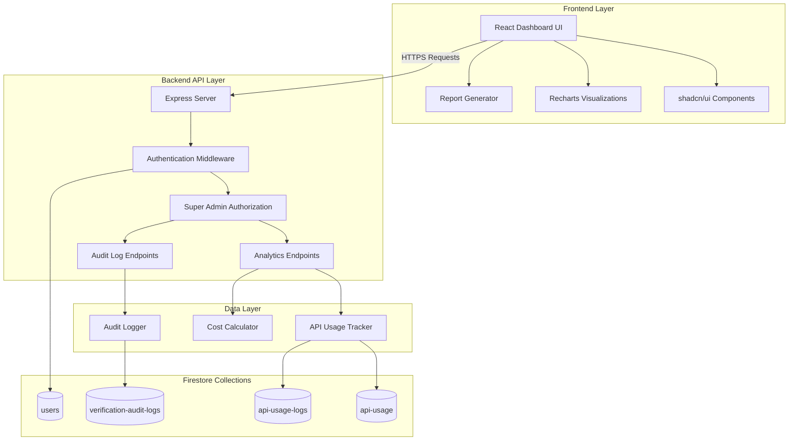

# Design Document: API Analytics & Cost Tracking Dashboard

## Overview

The API Analytics & Cost Tracking Dashboard is a React-based web application that provides super admin users with comprehensive visibility into API usage, cost tracking, and operational insights. The dashboard leverages existing backend API endpoints and Firestore data collections (`api-usage`, `api-usage-logs`, `verification-audit-logs`) to present data through interactive charts, filterable tables, and exportable reports.

The system follows a secure backend-first architecture where the React frontend calls authenticated backend API endpoints to fetch analytics data. The backend handles all data aggregation, filtering, and access control. This approach ensures data security, prevents unauthorized access, and maintains a single source of truth for business logic. The frontend focuses on visualization and user interaction, while all sensitive operations remain server-side.

## Architecture

### High-Level Architecture



### Component Architecture

The dashboard follows a modular component structure with clear separation between frontend and backend:

**Backend Layer** (Existing + New Endpoints):
1. **Existing Endpoints** (already implemented):
   - `GET /api/identity/api-usage/monthly/:month` - Monthly usage summary
   - `GET /api/identity/api-usage/stats` - Usage statistics for date range
   - `GET /api/identity/api-usage/alerts` - Usage limit alerts
   - `GET /api/audit/logs` - Query audit logs
   - `GET /api/audit/stats` - Audit log statistics

2. **New Endpoints** (to be implemented):
   - `GET /api/analytics/overview` - Dashboard overview metrics
   - `GET /api/analytics/broker-usage` - Broker attribution data
   - `GET /api/analytics/cost-tracking` - Cost tracking with projections
   - `GET /api/analytics/budget-config` - Get/update budget configuration
   - `POST /api/analytics/budget-config` - Save budget configuration
   - `GET /api/analytics/export` - Generate and download reports

**Frontend Layer**:
1. **Page Components**: Top-level route components
   - `AdminAnalyticsDashboard.tsx` - Main dashboard page
   - Protected by super admin route guard

2. **Feature Components**: Reusable dashboard sections
   - `MetricsOverview.tsx` - Key metrics cards
   - `UsageCharts.tsx` - Visualization components
   - `UserAttributionTable.tsx` - Broker usage breakdown
   - `CostTracker.tsx` - Budget monitoring
   - `AuditLogsViewer.tsx` - Searchable logs table
   - `ReportGenerator.tsx` - Export functionality

3. **Shared Components**: Common UI elements
   - shadcn/ui components (Card, Table, Button, etc.)
   - Custom chart wrappers for Recharts

4. **Hooks**: API integration and state management
   - `useAnalyticsDashboard.ts` - Fetch dashboard data from backend
   - `useRealtimeUpdates.ts` - Polling for data updates
   - `useReportGenerator.ts` - Report generation logic

5. **Services**: API client and data processing
   - `analyticsApi.ts` - Backend API client
   - `reportService.ts` - Report formatting and export
   - `costCalculator.ts` - Client-side cost display logic

## Components and Interfaces

### Data Models

#### AnalyticsSummary Interface
```typescript
interface AnalyticsSummary {
  totalCalls: number;
  totalCost: number;
  successRate: number;
  failureRate: number;
  dataproCalls: number;
  dataproCost: number;
  verifydataCalls: number;
  verifydataCost: number;
  periodStart: Date;
  periodEnd: Date;
  previousPeriodComparison: {
    callsChange: number;
    costChange: number;
    successRateChange: number;
  };
}
```

#### UsageDataPoint Interface
```typescript
interface UsageDataPoint {
  date: string;
  dataproCalls: number;
  verifydataCalls: number;
  totalCalls: number;
  dataproCost: number;
  verifydataCost: number;
  totalCost: number;
  successCount: number;
  failureCount: number;
}
```

#### UserAttribution Interface
```typescript
interface UserAttribution {
  userId: string;
  userName: string;
  userEmail: string;
  userRole: string; // 'broker' | 'admin' | 'compliance' | 'super_admin'
  totalCalls: number;
  dataproCalls: number;
  verifydataCalls: number;
  totalCost: number;
  successRate: number;
  lastActivity: Date;
}
```

#### AuditLogEntry Interface
```typescript
interface AuditLogEntry {
  id: string;
  timestamp: Date;
  userId: string | null;
  userName: string;
  userEmail: string;
  userType: 'user' | 'customer' | 'system'; // Determines how to display the user
  provider: 'datapro' | 'verifydata';
  verificationType: 'nin' | 'cac';
  status: 'success' | 'failure' | 'pending';
  cost: number;
  ipAddress: string;
  deviceInfo: string;
  errorMessage?: string;
  requestData?: Record<string, any>;
  responseData?: Record<string, any>;
}
```

#### BudgetConfig Interface
```typescript
interface BudgetConfig {
  monthlyLimit: number;
  warningThreshold: number; // percentage (e.g., 80)
  criticalThreshold: number; // percentage (e.g., 100)
  notificationEnabled: boolean;
}
```

#### FilterState Interface
```typescript
interface FilterState {
  dateRange: {
    start: Date;
    end: Date;
  };
  provider: 'all' | 'datapro' | 'verifydata';
  status: 'all' | 'success' | 'failure';
  brokerId?: string;
}
```

### Core Services

#### Backend API Endpoints (New)

The following endpoints need to be added to `server.js`. These endpoints will use the existing `apiUsageTracker.cjs` and `auditLogger.cjs` utilities to fetch and aggregate data server-side.

**CRITICAL**: All analytics endpoints MUST use `requireSuperAdmin` middleware to enforce super admin only access.

```javascript
/**
 * GET /api/analytics/overview
 * Get dashboard overview metrics
 * Super admin only
 * 
 * Query params:
 * - month: YYYY-MM format (optional, defaults to current month)
 * 
 * Response:
 * {
 *   totalCalls: number,
 *   totalCost: number,
 *   successRate: number,
 *   failureRate: number,
 *   dataproCalls: number,
 *   dataproCost: number,
 *   verifydataCalls: number,
 *   verifydataCost: number,
 *   previousPeriodComparison: {
 *     callsChange: number,
 *     costChange: number,
 *     successRateChange: number
 *   }
 * }
 * 
 * Implementation:
 * - Use getMonthlyUsageSummary() for current and previous month
 * - Calculate costs: Datapro ₦50/call, VerifyData ₦100/call
 * - Calculate percentage changes for comparison
 */
app.get('/api/analytics/overview', requireAuth, requireSuperAdmin, async (req, res) => {
  try {
    const month = req.query.month || new Date().toISOString().substring(0, 7);
    
    // Get current month summary
    const currentSummary = await getMonthlyUsageSummary(db, month);
    
    // Get previous month for comparison
    const prevMonthDate = new Date(month + '-01');
    prevMonthDate.setMonth(prevMonthDate.getMonth() - 1);
    const prevMonth = prevMonthDate.toISOString().substring(0, 7);
    const prevSummary = await getMonthlyUsageSummary(db, prevMonth);
    
    // Calculate totals
    const totalCalls = (currentSummary.datapro?.totalCalls || 0) + (currentSummary.verifydata?.totalCalls || 0);
    const totalCost = (currentSummary.datapro?.estimatedCost || 0) + (currentSummary.verifydata?.estimatedCost || 0);
    const successCalls = (currentSummary.datapro?.successCalls || 0) + (currentSummary.verifydata?.successCalls || 0);
    const failedCalls = (currentSummary.datapro?.failedCalls || 0) + (currentSummary.verifydata?.failedCalls || 0);
    
    // Calculate rates
    const successRate = totalCalls > 0 ? (successCalls / totalCalls) * 100 : 0;
    const failureRate = totalCalls > 0 ? (failedCalls / totalCalls) * 100 : 0;
    
    // Calculate previous period totals
    const prevTotalCalls = (prevSummary.datapro?.totalCalls || 0) + (prevSummary.verifydata?.totalCalls || 0);
    const prevTotalCost = (prevSummary.datapro?.estimatedCost || 0) + (prevSummary.verifydata?.estimatedCost || 0);
    const prevSuccessCalls = (prevSummary.datapro?.successCalls || 0) + (prevSummary.verifydata?.successCalls || 0);
    const prevSuccessRate = prevTotalCalls > 0 ? (prevSuccessCalls / prevTotalCalls) * 100 : 0;
    
    // Calculate changes
    const callsChange = prevTotalCalls > 0 ? ((totalCalls - prevTotalCalls) / prevTotalCalls) * 100 : 0;
    const costChange = prevTotalCost > 0 ? ((totalCost - prevTotalCost) / prevTotalCost) * 100 : 0;
    const successRateChange = prevSuccessRate > 0 ? successRate - prevSuccessRate : 0;
    
    res.json({
      totalCalls,
      totalCost,
      successRate: Math.round(successRate * 100) / 100,
      failureRate: Math.round(failureRate * 100) / 100,
      dataproCalls: currentSummary.datapro?.totalCalls || 0,
      dataproCost: currentSummary.datapro?.estimatedCost || 0,
      verifydataCalls: currentSummary.verifydata?.totalCalls || 0,
      verifydataCost: currentSummary.verifydata?.estimatedCost || 0,
      previousPeriodComparison: {
        callsChange: Math.round(callsChange * 100) / 100,
        costChange: Math.round(costChange * 100) / 100,
        successRateChange: Math.round(successRateChange * 100) / 100
      }
    });
  } catch (error) {
    console.error('Error fetching analytics overview:', error);
    res.status(500).json({ error: 'Failed to fetch analytics overview' });
  }
});

/**
 * GET /api/analytics/user-attribution
 * Get user attribution metrics for all users who create lists
 * Super admin only
 * 
 * Query params:
 * - startDate: YYYY-MM-DD (required)
 * - endDate: YYYY-MM-DD (required)
 * - sortBy: 'calls' | 'cost' | 'successRate' | 'role' (optional, default: 'calls')
 * - order: 'asc' | 'desc' (optional, default: 'desc')
 * 
 * Response:
 * {
 *   users: [
 *     {
 *       userId: string,
 *       userName: string,
 *       userEmail: string,
 *       userRole: string,
 *       totalCalls: number,
 *       dataproCalls: number,
 *       verifydataCalls: number,
 *       totalCost: number,
 *       successRate: number,
 *       lastActivity: Date
 *     }
 *   ]
 * }
 * 
 * Implementation:
 * - Query api-usage-logs collection filtered by date range
 * - Group by listId (not userId, since customer verifications have userId = null)
 * - For each listId, look up identity-lists.createdBy to get the user who created the list
 * - Aggregate all verifications (bulk + customer) by the createdBy user
 * - Fetch user details including role from users collection
 * - Calculate totals and success rates per user
 * - Sort by specified field
 */
app.get('/api/analytics/user-attribution', requireAuth, requireSuperAdmin, async (req, res) => {
  try {
    const { startDate, endDate, sortBy = 'calls', order = 'desc' } = req.query;
    
    if (!startDate || !endDate) {
      return res.status(400).json({ error: 'startDate and endDate are required' });
    }
    
    // Query api-usage-logs for date range
    const logsSnapshot = await db.collection('api-usage-logs')
      .where('date', '>=', startDate)
      .where('date', '<=', endDate)
      .get();
    
    // Group by listId first
    const listStats = new Map();
    
    logsSnapshot.forEach(doc => {
      const data = doc.data();
      const listId = data.listId || 'unknown';
      
      if (!listStats.has(listId)) {
        listStats.set(listId, {
          totalCalls: 0,
          dataproCalls: 0,
          verifydataCalls: 0,
          successCalls: 0,
          failedCalls: 0,
          lastActivity: data.timestamp
        });
      }
      
      const stats = listStats.get(listId);
      stats.totalCalls++;
      
      if (data.apiProvider === 'datapro') {
        stats.dataproCalls++;
      } else if (data.apiProvider === 'verifydata') {
        stats.verifydataCalls++;
      }
      
      if (data.success) {
        stats.successCalls++;
      } else {
        stats.failedCalls++;
      }
      
      if (data.timestamp > stats.lastActivity) {
        stats.lastActivity = data.timestamp;
      }
    });
    
    // Look up createdBy for each listId and aggregate by user
    const userStats = new Map();
    
    for (const [listId, stats] of listStats.entries()) {
      if (listId === 'unknown') continue;
      
      try {
        const listDoc = await db.collection('identity-lists').doc(listId).get();
        if (!listDoc.exists) continue;
        
        const listData = listDoc.data();
        const createdBy = listData.createdBy || 'unknown';
        
        if (!userStats.has(createdBy)) {
          userStats.set(createdBy, {
            userId: createdBy,
            totalCalls: 0,
            dataproCalls: 0,
            verifydataCalls: 0,
            successCalls: 0,
            failedCalls: 0,
            lastActivity: stats.lastActivity
          });
        }
        
        const userStat = userStats.get(createdBy);
        userStat.totalCalls += stats.totalCalls;
        userStat.dataproCalls += stats.dataproCalls;
        userStat.verifydataCalls += stats.verifydataCalls;
        userStat.successCalls += stats.successCalls;
        userStat.failedCalls += stats.failedCalls;
        
        if (stats.lastActivity > userStat.lastActivity) {
          userStat.lastActivity = stats.lastActivity;
        }
      } catch (error) {
        console.error(`Error fetching list ${listId}:`, error);
      }
    }
    
    // Fetch user details and calculate costs
    const users = [];
    for (const [userId, stats] of userStats.entries()) {
      let userName = 'Unknown User';
      let userEmail = 'unknown@example.com';
      let userRole = 'unknown';
      
      if (userId !== 'unknown') {
        try {
          const userDoc = await db.collection('users').doc(userId).get();
          if (userDoc.exists) {
            const userData = userDoc.data();
            userName = userData.displayName || userData.email || 'Unknown User';
            userEmail = userData.email || 'unknown@example.com';
            userRole = userData.role || 'broker'; // Default to broker if role not set
          }
        } catch (error) {
          console.error(`Error fetching user ${userId}:`, error);
        }
      }
      
      const totalCost = (stats.dataproCalls * 50) + (stats.verifydataCalls * 100);
      const successRate = stats.totalCalls > 0 ? (stats.successCalls / stats.totalCalls) * 100 : 0;
      
      users.push({
        userId,
        userName,
        userEmail,
        userRole,
        totalCalls: stats.totalCalls,
        dataproCalls: stats.dataproCalls,
        verifydataCalls: stats.verifydataCalls,
        totalCost,
        successRate: Math.round(successRate * 100) / 100,
        lastActivity: stats.lastActivity
      });
    }
    
    // Sort users
    users.sort((a, b) => {
      let aVal, bVal;
      if (sortBy === 'cost') {
        aVal = a.totalCost;
        bVal = b.totalCost;
      } else if (sortBy === 'successRate') {
        aVal = a.successRate;
        bVal = b.successRate;
      } else if (sortBy === 'role') {
        aVal = a.userRole;
        bVal = b.userRole;
        // For string comparison
        return order === 'asc' ? aVal.localeCompare(bVal) : bVal.localeCompare(aVal);
      } else {
        aVal = a.totalCalls;
        bVal = b.totalCalls;
      }
      
      return order === 'asc' ? aVal - bVal : bVal - aVal;
    });
    
    res.json({ users });
  } catch (error) {
    console.error('Error fetching user attribution:', error);
    res.status(500).json({ error: 'Failed to fetch user attribution' });
  }
});

/**
 * GET /api/analytics/cost-tracking
 * Get cost tracking with budget monitoring
 * Super admin only
 * 
 * Query params:
 * - month: YYYY-MM format (optional, defaults to current month)
 * 
 * Response:
 * {
 *   currentSpending: number,
 *   budgetLimit: number,
 *   utilization: number,
 *   projectedCost: number,
 *   alertLevel: 'normal' | 'warning' | 'critical',
 *   daysElapsed: number,
 *   daysInMonth: number
 * }
 * 
 * Implementation:
 * - Get monthly usage summary
 * - Fetch budget config from Firestore
 * - Calculate utilization percentage
 * - Project end-of-month cost based on daily average
 * - Determine alert level based on thresholds
 */
app.get('/api/analytics/cost-tracking', requireAuth, requireSuperAdmin, async (req, res) => {
  try {
    const month = req.query.month || new Date().toISOString().substring(0, 7);
    
    // Get monthly summary
    const summary = await getMonthlyUsageSummary(db, month);
    const currentSpending = (summary.datapro?.estimatedCost || 0) + (summary.verifydata?.estimatedCost || 0);
    
    // Get budget config
    const budgetDoc = await db.collection('config').doc('budget').get();
    const budgetConfig = budgetDoc.exists ? budgetDoc.data() : {
      monthlyLimit: 100000,
      warningThreshold: 80,
      criticalThreshold: 100
    };
    
    // Calculate utilization
    const utilization = (currentSpending / budgetConfig.monthlyLimit) * 100;
    
    // Calculate projection
    const now = new Date();
    const monthStart = new Date(month + '-01');
    const monthEnd = new Date(monthStart);
    monthEnd.setMonth(monthEnd.getMonth() + 1);
    monthEnd.setDate(0); // Last day of month
    
    const daysInMonth = monthEnd.getDate();
    const daysElapsed = month === now.toISOString().substring(0, 7) 
      ? now.getDate() 
      : daysInMonth;
    
    const dailyAverage = daysElapsed > 0 ? currentSpending / daysElapsed : 0;
    const projectedCost = dailyAverage * daysInMonth;
    
    // Determine alert level
    let alertLevel = 'normal';
    if (utilization >= budgetConfig.criticalThreshold) {
      alertLevel = 'critical';
    } else if (utilization >= budgetConfig.warningThreshold) {
      alertLevel = 'warning';
    }
    
    res.json({
      currentSpending,
      budgetLimit: budgetConfig.monthlyLimit,
      utilization: Math.round(utilization * 100) / 100,
      projectedCost: Math.round(projectedCost),
      alertLevel,
      daysElapsed,
      daysInMonth
    });
  } catch (error) {
    console.error('Error fetching cost tracking:', error);
    res.status(500).json({ error: 'Failed to fetch cost tracking' });
  }
});

/**
 * GET /api/analytics/budget-config
 * Get budget configuration
 * Super admin only
 * 
 * Response:
 * {
 *   monthlyLimit: number,
 *   warningThreshold: number,
 *   criticalThreshold: number,
 *   notificationEnabled: boolean
 * }
 */
app.get('/api/analytics/budget-config', requireAuth, requireSuperAdmin, async (req, res) => {
  try {
    const budgetDoc = await db.collection('config').doc('budget').get();
    
    if (!budgetDoc.exists) {
      // Return defaults
      return res.json({
        monthlyLimit: 100000,
        warningThreshold: 80,
        criticalThreshold: 100,
        notificationEnabled: true
      });
    }
    
    res.json(budgetDoc.data());
  } catch (error) {
    console.error('Error fetching budget config:', error);
    res.status(500).json({ error: 'Failed to fetch budget config' });
  }
});

/**
 * POST /api/analytics/budget-config
 * Update budget configuration
 * Super admin only
 * 
 * Body:
 * {
 *   monthlyLimit: number,
 *   warningThreshold: number,
 *   criticalThreshold: number,
 *   notificationEnabled: boolean
 * }
 */
app.post('/api/analytics/budget-config', requireAuth, requireSuperAdmin, async (req, res) => {
  try {
    const { monthlyLimit, warningThreshold, criticalThreshold, notificationEnabled } = req.body;
    
    // Validate inputs
    if (typeof monthlyLimit !== 'number' || monthlyLimit <= 0) {
      return res.status(400).json({ error: 'monthlyLimit must be a positive number' });
    }
    
    if (typeof warningThreshold !== 'number' || warningThreshold < 0 || warningThreshold > 100) {
      return res.status(400).json({ error: 'warningThreshold must be between 0 and 100' });
    }
    
    if (typeof criticalThreshold !== 'number' || criticalThreshold < 0 || criticalThreshold > 100) {
      return res.status(400).json({ error: 'criticalThreshold must be between 0 and 100' });
    }
    
    if (warningThreshold >= criticalThreshold) {
      return res.status(400).json({ error: 'warningThreshold must be less than criticalThreshold' });
    }
    
    // Save config
    await db.collection('config').doc('budget').set({
      monthlyLimit,
      warningThreshold,
      criticalThreshold,
      notificationEnabled: notificationEnabled !== false,
      updatedAt: admin.firestore.FieldValue.serverTimestamp(),
      updatedBy: req.user.uid
    });
    
    res.json({ success: true });
  } catch (error) {
    console.error('Error updating budget config:', error);
    res.status(500).json({ error: 'Failed to update budget config' });
  }
});

/**
 * GET /api/analytics/export
 * Generate and download report
 * Super admin only
 * 
 * Query params:
 * - format: 'pdf' | 'excel' | 'csv' (required)
 * - startDate: YYYY-MM-DD (required)
 * - endDate: YYYY-MM-DD (required)
 * - sections: comma-separated list of sections to include (optional)
 * 
 * Response:
 * - Binary file download with appropriate Content-Type header
 * 
 * Implementation:
 * - Aggregate data based on date range
 * - Generate report in requested format
 * - Set appropriate headers for file download
 * - Validate report size to prevent memory issues
 */
app.get('/api/analytics/export', requireAuth, requireSuperAdmin, async (req, res) => {
  try {
    const { format, startDate, endDate, sections } = req.query;
    
    if (!format || !startDate || !endDate) {
      return res.status(400).json({ error: 'format, startDate, and endDate are required' });
    }
    
    if (!['pdf', 'excel', 'csv'].includes(format)) {
      return res.status(400).json({ error: 'format must be pdf, excel, or csv' });
    }
    
    // Fetch data for report
    const stats = await getAPIUsageStats(db, startDate, endDate);
    const logsSnapshot = await db.collection('api-usage-logs')
      .where('date', '>=', startDate)
      .where('date', '<=', endDate)
      .limit(10000) // Limit to prevent memory issues
      .get();
    
    if (logsSnapshot.size >= 10000) {
      return res.status(400).json({ 
        error: 'Report too large. Please reduce date range or use CSV format for large datasets.' 
      });
    }
    
    // Generate report based on format
    // (Implementation will be in ReportService on frontend for now)
    // For MVP, return raw data and let frontend generate the file
    
    const logs = [];
    logsSnapshot.forEach(doc => {
      logs.push({ id: doc.id, ...doc.data() });
    });
    
    res.json({
      stats,
      logs,
      metadata: {
        startDate,
        endDate,
        generatedAt: new Date().toISOString(),
        generatedBy: req.user.email
      }
    });
  } catch (error) {
    console.error('Error exporting report:', error);
    res.status(500).json({ error: 'Failed to export report' });
  }
});
```

#### Frontend API Client

```typescript
class AnalyticsAPI {
  private baseURL = '/api/analytics';

  /**
   * Fetches dashboard overview metrics
   */
  async fetchOverview(month?: string): Promise<AnalyticsSummary> {
    const params = month ? `?month=${month}` : '';
    const response = await fetch(`${this.baseURL}/overview${params}`, {
      credentials: 'include' // Include session cookie
    });
    if (!response.ok) throw new Error('Failed to fetch overview');
    return response.json();
  }

  /**
   * Fetches user attribution data
   */
  async fetchUserAttribution(
    startDate: string,
    endDate: string,
    sortBy?: string,
    order?: string
  ): Promise<UserAttribution[]> {
    const params = new URLSearchParams({
      startDate,
      endDate,
      ...(sortBy && { sortBy }),
      ...(order && { order })
    });
    const response = await fetch(`${this.baseURL}/user-attribution?${params}`, {
      credentials: 'include'
    });
    if (!response.ok) throw new Error('Failed to fetch user attribution');
    const data = await response.json();
    return data.users;
  }

  /**
   * Fetches cost tracking data
   */
  async fetchCostTracking(month?: string): Promise<CostTrackingData> {
    const params = month ? `?month=${month}` : '';
    const response = await fetch(`${this.baseURL}/cost-tracking${params}`, {
      credentials: 'include'
    });
    if (!response.ok) throw new Error('Failed to fetch cost tracking');
    return response.json();
  }

  /**
   * Fetches budget configuration
   */
  async fetchBudgetConfig(): Promise<BudgetConfig> {
    const response = await fetch(`${this.baseURL}/budget-config`, {
      credentials: 'include'
    });
    if (!response.ok) throw new Error('Failed to fetch budget config');
    return response.json();
  }

  /**
   * Updates budget configuration
   */
  async updateBudgetConfig(config: BudgetConfig): Promise<void> {
    const response = await fetch(`${this.baseURL}/budget-config`, {
      method: 'POST',
      headers: { 'Content-Type': 'application/json' },
      credentials: 'include',
      body: JSON.stringify(config)
    });
    if (!response.ok) throw new Error('Failed to update budget config');
  }

  /**
   * Generates and downloads report
   */
  async exportReport(
    format: 'pdf' | 'excel' | 'csv',
    startDate: string,
    endDate: string,
    sections: string[]
  ): Promise<Blob> {
    const params = new URLSearchParams({
      format,
      startDate,
      endDate,
      sections: sections.join(',')
    });
    const response = await fetch(`${this.baseURL}/export?${params}`, {
      credentials: 'include'
    });
    if (!response.ok) throw new Error('Failed to export report');
    return response.blob();
  }
}
```

#### CostCalculator (Client-side utility)

```typescript
class CostCalculator {
  private readonly DATAPRO_COST = 50; // ₦50 per call
  private readonly VERIFYDATA_COST = 100; // ₦100 per call

  /**
   * Calculates total cost for given usage (client-side display only)
   */
  calculateTotalCost(
    dataproCalls: number,
    verifydataCalls: number
  ): number {
    return (dataproCalls * this.DATAPRO_COST) + (verifydataCalls * this.VERIFYDATA_COST);
  }

  /**
   * Calculates budget utilization percentage
   */
  calculateBudgetUtilization(
    currentSpending: number,
    budgetLimit: number
  ): number {
    return (currentSpending / budgetLimit) * 100;
  }

  /**
   * Determines alert level based on spending
   */
  getAlertLevel(
    utilization: number,
    config: BudgetConfig
  ): 'normal' | 'warning' | 'critical' {
    if (utilization >= config.criticalThreshold) return 'critical';
    if (utilization >= config.warningThreshold) return 'warning';
    return 'normal';
  }
}
```

### React Hooks

#### useAnalyticsDashboard Hook

```typescript
function useAnalyticsDashboard(filters: FilterState) {
  const [summary, setSummary] = useState<AnalyticsSummary | null>(null);
  const [userAttribution, setUserAttribution] = useState<UserAttribution[]>([]);
  const [costTracking, setCostTracking] = useState<CostTrackingData | null>(null);
  const [loading, setLoading] = useState(true);
  const [error, setError] = useState<Error | null>(null);

  const analyticsAPI = new AnalyticsAPI();

  useEffect(() => {
    async function fetchData() {
      try {
        setLoading(true);
        setError(null);

        // Fetch all dashboard data from backend
        const [overviewData, userData, costData] = await Promise.all([
          analyticsAPI.fetchOverview(filters.month),
          analyticsAPI.fetchUserAttribution(filters.startDate, filters.endDate),
          analyticsAPI.fetchCostTracking(filters.month)
        ]);

        setSummary(overviewData);
        setUserAttribution(userData);
        setCostTracking(costData);
      } catch (err) {
        setError(err as Error);
      } finally {
        setLoading(false);
      }
    }

    fetchData();
  }, [filters]);

  const refetch = () => {
    // Trigger re-fetch by updating a dependency
  };

  return {
    summary,
    userAttribution,
    costTracking,
    loading,
    error,
    refetch
  };
}
```

#### useRealtimeUpdates Hook

```typescript
function useRealtimeUpdates(
  refreshInterval: number = 30000 // 30 seconds
) {
  const [lastUpdate, setLastUpdate] = useState<Date | null>(null);
  const [connected, setConnected] = useState(true);

  useEffect(() => {
    // Poll backend for updates instead of Firestore listeners
    const interval = setInterval(() => {
      setLastUpdate(new Date());
      // Trigger data refetch in parent component
    }, refreshInterval);

    return () => clearInterval(interval);
  }, [refreshInterval]);

  return {
    connected,
    lastUpdate
  };
}
```

### UI Components

#### MetricsOverview Component

Displays key metrics in card format:
- Total API Calls (with period comparison)
- Total Cost (with budget utilization)
- Success Rate (with trend indicator)
- Provider Breakdown (Datapro vs VerifyData)

Uses shadcn/ui Card components with custom styling.

#### UsageCharts Component

Renders multiple chart types using Recharts:
1. **Line Chart**: Daily API call volumes over time
2. **Bar Chart**: Cost comparison by provider
3. **Pie Chart**: Success vs failure distribution
4. **Area Chart**: Cost trends with projections

All charts support:
- Interactive tooltips
- Responsive sizing
- Custom color schemes
- Export to image

#### UserAttributionTable Component

Displays user attribution in sortable table:
- Columns: User Name, Email, Role, Total Calls, Cost, Success Rate, Last Activity
- Sorting by any column (including role)
- Click to expand detailed view
- Pagination for large datasets
- Export to CSV
- Highlight users exceeding normal usage patterns

#### CostTracker Component

Budget monitoring interface:
- Progress bar showing budget utilization
- Current spending vs budget limit
- Projected end-of-month cost
- Alert indicators (warning/critical)
- Budget configuration modal

#### AuditLogsViewer Component

Searchable and filterable logs table:
- Columns: Timestamp, User (with type indicator), Provider, Status, Cost
- User column displays:
  - Name + Email for logged-in users
  - "Customer" or customer name for anonymous actions
  - "System" for system-initiated actions
- Search by user name, email, provider, status
- Date range picker
- Status filter dropdown
- Provider filter dropdown
- User type filter (user/customer/system)
- Expandable rows for full details
- Pagination controls
- Sortable by User column

#### ReportGenerator Component

Export functionality interface:
- Format selection (PDF, Excel, CSV)
- Section selection checkboxes
- Date range for report
- Generate button with loading state
- Download progress indicator

## Data Models

### Firestore Collection Structures

#### api-usage Collection
```typescript
{
  date: string; // YYYY-MM-DD format
  dataproCalls: number;
  verifydataCalls: number;
  totalCalls: number;
  dataproCost: number;
  verifydataCost: number;
  totalCost: number;
  successCount: number;
  failureCount: number;
  createdAt: Timestamp;
  updatedAt: Timestamp;
}
```

#### api-usage-logs Collection
```typescript
{
  timestamp: Timestamp;
  userId: string;
  provider: string;
  verificationType: string;
  status: string;
  cost: number;
  createdAt: Timestamp;
}
```

#### verification-audit-logs Collection
```typescript
{
  timestamp: Timestamp;
  userId: string;
  userName: string;
  provider: string;
  verificationType: string;
  status: string;
  cost: number;
  ipAddress: string;
  deviceInfo: string;
  errorMessage?: string;
  requestData?: object;
  responseData?: object;
  createdAt: Timestamp;
}
```

### Query Optimization Strategy

1. **Composite Indexes**: Create Firestore indexes for common query patterns
   - `api-usage`: (date, provider)
   - `api-usage-logs`: (userId, timestamp)
   - `verification-audit-logs`: (timestamp, status, provider)

2. **Aggregation Collections**: Use pre-aggregated data for performance
   - Daily aggregates in `api-usage` collection
   - Monthly aggregates in `api-usage-monthly` collection

3. **Pagination**: Implement cursor-based pagination for large result sets

4. **Caching**: Cache frequently accessed data in browser storage
   - Session storage for filter state
   - Local storage for budget configuration

## Correctness Properties

*A property is a characteristic or behavior that should hold true across all valid executions of a system—essentially, a formal statement about what the system should do. Properties serve as the bridge between human-readable specifications and machine-verifiable correctness guarantees.*


### Property 1: Access Control Validation

*For any* user attempting to access the dashboard, the system should verify their role and only grant access if they have super admin privileges, otherwise redirecting to an unauthorized page.

**Validates: Requirements 1.1, 1.2**

### Property 2: Access Audit Logging

*For any* dashboard access attempt (successful or failed), the system should create an audit log entry with timestamp, user ID, and access result.

**Validates: Requirements 1.5**

### Property 3: Permission Re-validation on Auth Changes

*For any* authentication state change event, the system should re-validate the user's permissions and update access accordingly.

**Validates: Requirements 1.4**

### Property 4: Cost Calculation Correctness

*For any* set of API calls, the total cost should equal (datapro_calls × ₦50) + (verifydata_calls × ₦100), and the sum of provider costs should equal the total cost.

**Validates: Requirements 2.2, 2.5, 5.2, 6.1, 6.8**

### Property 5: Success Rate Calculation

*For any* set of verification attempts, the success rate should equal (successful_calls / total_calls) × 100, and success_rate + failure_rate should equal 100%.

**Validates: Requirements 2.3, 2.4, 5.3**

### Property 6: Period Comparison Calculation

*For any* two time periods with usage data, the comparison metrics should correctly calculate the percentage change: ((current - previous) / previous) × 100.

**Validates: Requirements 2.6**

### Property 7: Date Range Filtering

*For any* selected date range and data collection, all returned records should have timestamps that fall within the specified start and end dates (inclusive).

**Validates: Requirements 4.1, 7.4**

### Property 8: Provider Filtering

*For any* selected API provider filter (datapro or verifydata), all returned records should match the selected provider exactly.

**Validates: Requirements 4.2, 7.8**

### Property 9: Status Filtering

*For any* selected status filter (success or failure), all returned records should match the selected status exactly.

**Validates: Requirements 4.3, 7.7**

### Property 10: Multi-Filter Combination

*For any* combination of active filters (date range, provider, status), all returned records should satisfy ALL filter conditions simultaneously (AND logic).

**Validates: Requirements 4.4**

### Property 11: Filter Reset Completeness

*For any* dashboard state with active filters, clearing all filters should return the complete unfiltered dataset.

**Validates: Requirements 4.5**

### Property 12: Filter Persistence Round-Trip

*For any* filter configuration, saving to session storage and then loading should produce an equivalent filter state.

**Validates: Requirements 4.6**

### Property 13: Date Range Validation

*For any* date range input, the system should reject ranges where start_date > end_date or where dates are in invalid formats.

**Validates: Requirements 4.7**

### Property 14: User Ranking Correctness

*For any* list of users with usage data, when sorted by call volume, each user should have a call count greater than or equal to the next user in the list.

**Validates: Requirements 5.1**

### Property 15: Multi-Column Sorting

*For any* sortable column in the user attribution table (including role), the data should be correctly ordered by that column's values in ascending or descending order.

**Validates: Requirements 5.5**

### Property 16: User Drill-Down Filtering

*For any* selected user, the detailed usage view should contain only records where the list was created by that user (via identity-lists.createdBy).

**Validates: Requirements 5.6**

### Property 17: Average Calculation

*For any* set of users with usage data, the average calls per user should equal total_calls / number_of_users.

**Validates: Requirements 5.7**

### Property 18: Anomaly Detection Threshold

*For any* user whose usage exceeds the defined threshold (e.g., 2 standard deviations above mean), the system should flag that user as exceeding normal patterns.

**Validates: Requirements 5.8**

### Property 18a: User Attribution Aggregation by ListId

*For any* set of api-usage-logs records, when grouped by listId and then aggregated by identity-lists.createdBy, the total calls per user should equal the sum of all calls for all lists created by that user.

**Validates: Requirements 5.9, 5.10**

### Property 18b: User Role Display

*For any* user in the attribution table, the displayed role should match the role field from the users collection for that userId.

**Validates: Requirements 5.4, 5.11**

### Property 19: Budget Utilization Calculation

*For any* current spending amount and budget limit, the utilization percentage should equal (current_spending / budget_limit) × 100.

**Validates: Requirements 6.2**

### Property 20: Cost Projection Formula

*For any* current spending, days elapsed, and total days in month, the projected cost should equal (current_spending / days_elapsed) × total_days_in_month.

**Validates: Requirements 6.3, 6.7**

### Property 21: Budget Alert Thresholds

*For any* budget utilization percentage, the system should display a warning when utilization ≥ 80% and a critical alert when utilization ≥ 100%.

**Validates: Requirements 6.4, 6.5**

### Property 22: Budget Configuration Persistence

*For any* budget configuration values, saving and then loading the configuration should produce equivalent values.

**Validates: Requirements 6.6**

### Property 23: Audit Log Chronological Ordering

*For any* list of audit logs, when displayed, each log entry should have a timestamp less than or equal to the previous entry (reverse chronological order).

**Validates: Requirements 7.1**

### Property 24: Audit Log Completeness

*For any* audit log entry, it should contain all required fields: timestamp, user information (name, email, type), provider, status, and cost.

**Validates: Requirements 7.2, 8.1**

### Property 24a: Audit Log User Type Display

*For any* audit log entry, the user display should correctly show name+email for logged-in users, "Customer" or customer name for anonymous actions, and "System" for system-initiated actions based on the userType field.

**Validates: Requirements 8.2, 8.3, 8.4**

### Property 24b: Audit Log User Column Sorting

*For any* audit log list sorted by the User column, entries should be ordered alphabetically by the displayed user name.

**Validates: Requirements 8.5**

### Property 24c: Audit Log User Search

*For any* search term applied to audit logs, when searching by user, all returned results should have the search term in either the userName or userEmail field.

**Validates: Requirements 8.6**

### Property 25: Audit Log Search Filtering (General)

*For any* search term applied to audit logs, all returned results should contain the search term in at least one searchable field (user name, user email, provider, status, etc.).

**Validates: Requirements 7.3**

### Property 26: Pagination Correctness

*For any* paginated dataset with page size N and page number P, the returned records should be records [(P-1)×N] through [P×N-1] from the complete ordered dataset.

**Validates: Requirements 7.6**

### Property 27: CSV Generation Correctness

*For any* dataset and column specification, the generated CSV should have a header row with column names and data rows matching the input data exactly.

**Validates: Requirements 9.3**

### Property 28: Report Filter Consistency

*For any* active filter state, the data included in generated reports should match exactly the data visible in the filtered dashboard view.

**Validates: Requirements 9.4**

### Property 29: Report Metadata Completeness

*For any* generated report, it should include summary statistics, generation timestamp, and user information in the metadata section.

**Validates: Requirements 9.5, 9.7**

### Property 30: Selective Report Generation

*For any* set of selected report sections, the generated report should contain only those sections and exclude unselected sections.

**Validates: Requirements 9.6**

### Property 31: Report Size Validation

*For any* report generation request, if the estimated size exceeds the configured limit, the system should reject the request with a descriptive error message.

**Validates: Requirements 9.8**

### Property 32: Error Message Inclusion

*For any* failed operation, the error message displayed to the user should include a description of what went wrong.

**Validates: Requirements 13.2**

### Property 33: Error Logging Completeness

*For any* error that occurs in the system, an entry should be logged to the console with error details, timestamp, and context.

**Validates: Requirements 13.5**

## Error Handling

### Error Categories

1. **Authentication Errors**
   - Expired session: Redirect to login with return URL
   - Insufficient permissions: Show unauthorized page
   - Network auth failure: Display retry option

2. **Data Fetch Errors**
   - Firestore query failure: Show error message with retry button
   - Timeout: Display timeout message and retry option
   - Permission denied: Show access error

3. **Report Generation Errors**
   - Size limit exceeded: Prompt user to reduce date range or sections
   - Export library failure: Show error with alternative format options
   - Memory issues: Suggest using CSV for large datasets

4. **Validation Errors**
   - Invalid date range: Highlight field and show validation message
   - Invalid budget value: Show inline error message
   - Missing required fields: Prevent submission and highlight errors

### Error Recovery Strategies

1. **Automatic Retry**: For transient network errors, implement exponential backoff retry
2. **Graceful Degradation**: If real-time updates fail, fall back to manual refresh
3. **User Feedback**: Always provide clear error messages and actionable next steps
4. **Error Boundaries**: Wrap components in React error boundaries to prevent full page crashes
5. **Logging**: Log all errors to console and optionally to error tracking service

### Error UI Components

- Toast notifications for non-critical errors
- Modal dialogs for critical errors requiring user action
- Inline validation messages for form errors
- Connection status indicator in header
- Retry buttons for failed operations

## Testing Strategy

### Dual Testing Approach

The testing strategy combines unit tests for specific examples and edge cases with property-based tests for universal correctness properties. This dual approach ensures comprehensive coverage:

- **Unit tests** validate specific scenarios, edge cases, and error conditions
- **Property-based tests** verify universal properties across randomized inputs
- Together, they provide confidence in both specific behaviors and general correctness

### Property-Based Testing

**Library**: fast-check (JavaScript/TypeScript property-based testing library)

**Configuration**:
- Minimum 100 iterations per property test
- Each test tagged with feature name and property number
- Tag format: `Feature: api-analytics-dashboard, Property {N}: {property description}`

**Property Test Coverage**:
- All 33 correctness properties must have corresponding property-based tests
- Each property test should generate randomized inputs covering the full input space
- Tests should verify the property holds for all generated inputs

**Example Property Test Structure**:
```typescript
// Feature: api-analytics-dashboard, Property 4: Cost Calculation Correctness
test('cost calculation is always correct', () => {
  fc.assert(
    fc.property(
      fc.nat(1000), // datapro calls
      fc.nat(1000), // verifydata calls
      (dataproCalls, verifydataCalls) => {
        const result = calculateTotalCost(dataproCalls, verifydataCalls);
        const expected = (dataproCalls * 50) + (verifydataCalls * 100);
        expect(result.total).toBe(expected);
        expect(result.dataproCost + result.verifydataCost).toBe(expected);
      }
    ),
    { numRuns: 100 }
  );
});
```

### Unit Testing

**Framework**: Vitest (fast unit test framework for Vite projects)

**Unit Test Focus Areas**:
1. **Component Rendering**: Verify components render with expected props
2. **User Interactions**: Test button clicks, form submissions, filter changes
3. **Edge Cases**: Empty datasets, single records, maximum values
4. **Error States**: Network failures, validation errors, permission denials
5. **Integration Points**: Component communication, context updates, hook behavior

**Example Unit Test Structure**:
```typescript
describe('MetricsOverview Component', () => {
  it('displays zero state when no data available', () => {
    render(<MetricsOverview data={null} />);
    expect(screen.getByText('No data available')).toBeInTheDocument();
  });

  it('displays metrics when data is provided', () => {
    const mockData = { totalCalls: 100, totalCost: 7500 };
    render(<MetricsOverview data={mockData} />);
    expect(screen.getByText('100')).toBeInTheDocument();
    expect(screen.getByText('₦7,500')).toBeInTheDocument();
  });
});
```

### Integration Testing

**Focus**: End-to-end user workflows
- Dashboard load → filter application → report generation
- Authentication → permission check → data access
- Real-time updates → data refresh → UI update

### Test Data Strategy

1. **Mock Data**: Use realistic mock data for unit tests
2. **Generators**: Create data generators for property tests
3. **Fixtures**: Maintain test fixtures for common scenarios
4. **Firestore Emulator**: Use Firebase emulator for integration tests

### Coverage Goals

- Unit test coverage: >80% for business logic
- Property test coverage: 100% of correctness properties
- Integration test coverage: All critical user paths
- Component test coverage: All interactive components

### Continuous Testing

- Run unit tests on every commit
- Run property tests in CI/CD pipeline
- Run integration tests before deployment
- Monitor test execution time and optimize slow tests
