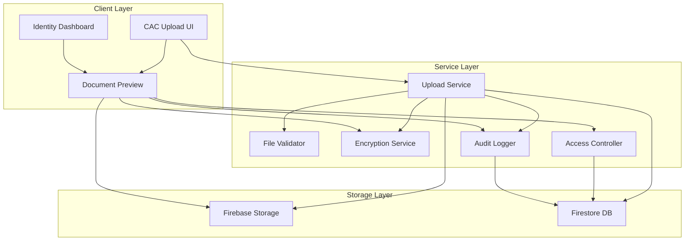
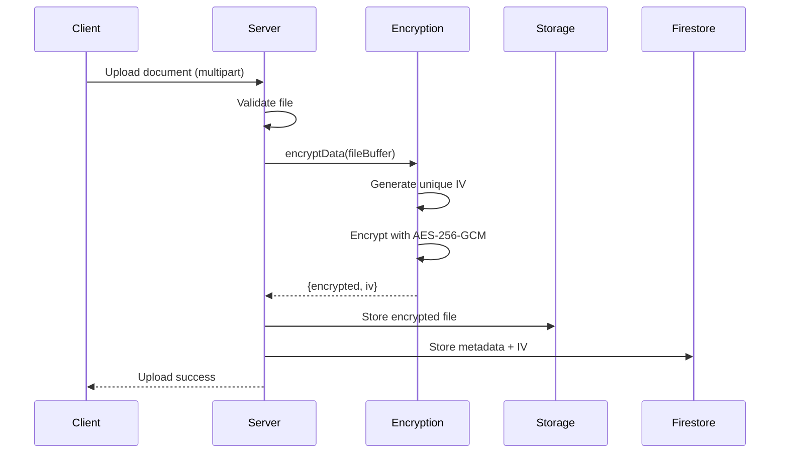
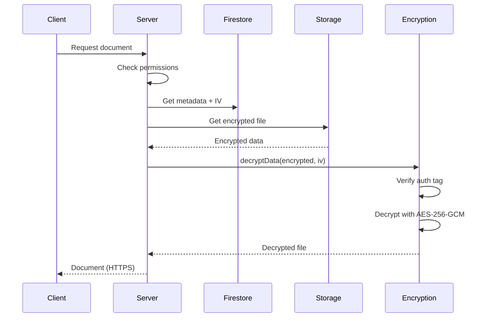
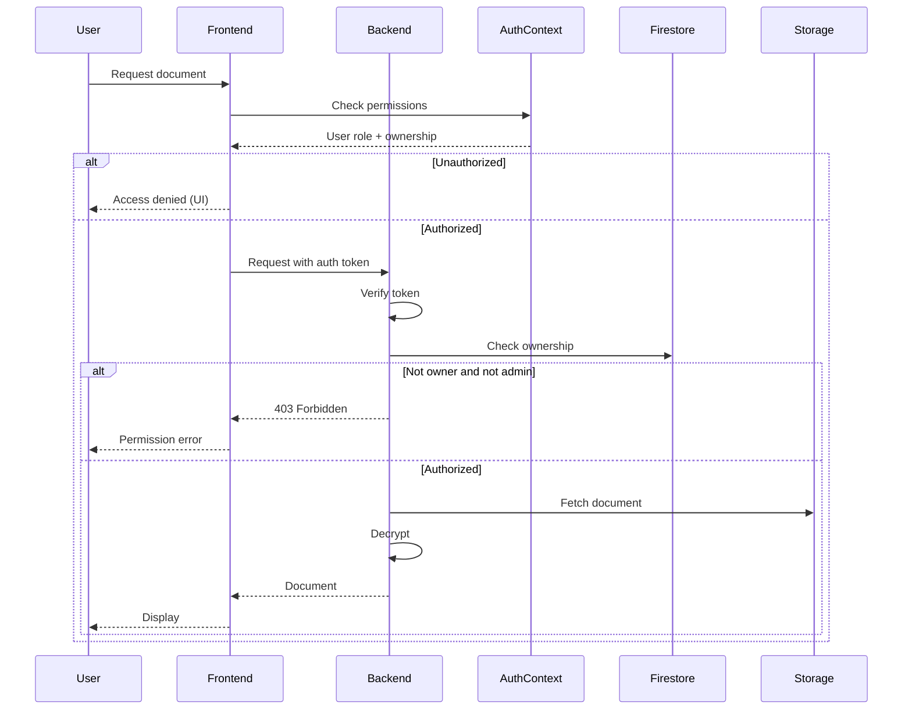

# Design Document: CAC Document Upload Management

## Overview

The CAC Document Upload Management feature implements secure document collection, storage, and management for Corporate Affairs Commission (CAC) documents required from corporate clients. This feature extends the existing identity collection infrastructure to handle three mandatory CAC documents: Certificate of Incorporation, Particulars of Directors, and Share Allotment (Status Update).

### Business Context

Nigerian insurance underwriters must collect and verify CAC documents from corporate clients before risk acceptance, as mandated by regulatory requirements. This feature provides a secure, auditable system for collecting, storing, and managing these sensitive corporate documents while maintaining compliance with data protection regulations.

### Key Features

- Three-document upload interface for required CAC documents
- Client-side and server-side file validation (type, size, content)
- AES-256-GCM encryption for documents at rest
- Role-based access control for document viewing and downloading
- Comprehensive audit logging for all document operations
- Document preview with PDF viewer and image zoom
- Document replacement with version history
- Real-time status indicators in the identity dashboard
- Chunked uploads for large files with resume capability
- Responsive design for mobile and desktop

### Integration Points

- **UploadDialog Component**: Extended to support CAC document uploads
- **AuthContext**: Used for authentication and role-based authorization
- **encryption.cjs**: Leveraged for document encryption/decryption
- **storage.rules**: Extended with CAC document storage paths
- **IdentityListsDashboard**: Enhanced with document status indicators
- **Firestore**: Document metadata and audit logs storage
- **Firebase Storage**: Encrypted document storage

## Architecture

### System Components




### Component Responsibilities

#### 1. CAC Upload UI Component
- Renders three distinct upload fields for each CAC document type
- Handles file selection and drag-and-drop
- Displays upload progress and status indicators
- Shows validation errors and user feedback
- Supports document replacement workflow

#### 2. File Validator
- Validates file types (PDF, JPEG, PNG)
- Enforces 10MB file size limit
- Performs content validation to detect malicious files
- Provides specific error messages for validation failures

#### 3. Upload Service
- Orchestrates the upload workflow
- Implements chunked uploads for files > 5MB
- Supports upload resume after interruption
- Handles concurrent uploads efficiently
- Manages upload retries and error recovery

#### 4. Encryption Service
- Encrypts documents using AES-256-GCM before storage
- Generates unique IVs for each encryption operation
- Decrypts documents for viewing/downloading
- Uses existing encryption.cjs utilities
- Stores encryption metadata with documents

#### 5. Access Controller
- Enforces role-based access control
- Verifies user permissions before document operations
- Allows access for admin, super_admin, and record-owning brokers
- Hides UI elements from unauthorized users
- Logs access denial events

#### 6. Document Preview Component
- Displays documents in a modal dialog
- Renders PDFs using PDF viewer component
- Shows images with zoom controls
- Implements lazy loading and caching
- Shows loading indicators during fetch
- Includes download button for authorized users

#### 7. Audit Logger
- Logs all document operations (upload, view, download, replace)
- Captures user ID, document ID, timestamp, and action type
- Logs failed access attempts with reasons
- Stores logs in Firestore with queryable indexes
- Integrates with existing audit infrastructure

#### 8. Identity Dashboard Enhancement
- Displays status indicators for three CAC documents
- Shows upload timestamps for uploaded documents
- Provides click-to-preview functionality
- Updates status in real-time
- Integrates into existing table structure


## Components and Interfaces

### Frontend Components

#### CACDocumentUploader Component

```typescript
interface CACDocumentUploaderProps {
  identityRecordId: string;
  onUploadComplete: (documentType: CACDocumentType, documentId: string) => void;
  onUploadError: (error: Error) => void;
}

interface CACDocumentType {
  type: 'certificate_of_incorporation' | 'particulars_of_directors' | 'share_allotment';
  label: string;
  required: boolean;
}

interface UploadState {
  file: File | null;
  progress: number;
  status: 'idle' | 'uploading' | 'success' | 'error';
  error: string | null;
  documentId: string | null;
}
```

**Key Methods:**
- `handleFileSelect(documentType: CACDocumentType, file: File): void`
- `validateFile(file: File): ValidationResult`
- `uploadDocument(documentType: CACDocumentType, file: File): Promise<string>`
- `handleReplace(documentType: CACDocumentType, file: File): Promise<void>`

#### CACDocumentPreview Component

```typescript
interface CACDocumentPreviewProps {
  documentId: string;
  documentType: CACDocumentType;
  onClose: () => void;
  onDownload?: () => void;
}

interface PreviewState {
  loading: boolean;
  error: string | null;
  documentUrl: string | null;
  documentMetadata: DocumentMetadata | null;
}
```

**Key Methods:**
- `fetchDocument(documentId: string): Promise<DocumentData>`
- `decryptDocument(encryptedData: EncryptedDocument): Promise<Blob>`
- `renderPDF(blob: Blob): void`
- `renderImage(blob: Blob): void`
- `handleDownload(): Promise<void>`

#### CACDocumentStatus Component

```typescript
interface CACDocumentStatusProps {
  identityRecordId: string;
  documents: CACDocumentMetadata[];
  onPreview: (documentId: string) => void;
}

interface CACDocumentMetadata {
  documentType: CACDocumentType;
  documentId: string | null;
  status: 'uploaded' | 'missing';
  uploadedAt: Date | null;
  uploadedBy: string | null;
  filename: string | null;
}
```

**Key Methods:**
- `getDocumentStatus(documentType: CACDocumentType): DocumentStatus`
- `handleStatusClick(documentId: string): void`
- `subscribeToUpdates(identityRecordId: string): Unsubscribe`

### Backend Services

#### CACDocumentService

```typescript
interface CACDocumentService {
  uploadDocument(
    identityRecordId: string,
    documentType: CACDocumentType,
    file: Buffer,
    metadata: UploadMetadata
  ): Promise<DocumentUploadResult>;
  
  getDocument(
    documentId: string,
    userId: string
  ): Promise<EncryptedDocument>;
  
  replaceDocument(
    documentId: string,
    newFile: Buffer,
    metadata: UploadMetadata,
    userId: string
  ): Promise<DocumentUploadResult>;
  
  deleteDocument(
    documentId: string,
    userId: string
  ): Promise<void>;
  
  getDocumentMetadata(
    identityRecordId: string
  ): Promise<CACDocumentMetadata[]>;
}

interface UploadMetadata {
  filename: string;
  mimeType: string;
  fileSize: number;
  uploadedBy: string;
}

interface DocumentUploadResult {
  documentId: string;
  storagePath: string;
  encryptionMetadata: EncryptionMetadata;
}

interface EncryptedDocument {
  encrypted: string;
  iv: string;
  metadata: DocumentMetadata;
}
```

#### FileValidationService

```typescript
interface FileValidationService {
  validateFileType(file: File | Buffer, mimeType: string): ValidationResult;
  validateFileSize(fileSize: number): ValidationResult;
  validateFileContent(file: Buffer): Promise<ValidationResult>;
  validateAll(file: File | Buffer, mimeType: string): Promise<ValidationResult>;
}

interface ValidationResult {
  valid: boolean;
  errors: string[];
}
```

#### AccessControlService

```typescript
interface AccessControlService {
  canViewDocument(userId: string, documentId: string): Promise<boolean>;
  canDownloadDocument(userId: string, documentId: string): Promise<boolean>;
  canReplaceDocument(userId: string, documentId: string): Promise<boolean>;
  canDeleteDocument(userId: string, documentId: string): Promise<boolean>;
  getDocumentOwner(documentId: string): Promise<string>;
}
```

#### AuditLogService

```typescript
interface AuditLogService {
  logDocumentUpload(
    userId: string,
    documentId: string,
    identityRecordId: string,
    documentType: CACDocumentType
  ): Promise<void>;
  
  logDocumentView(
    userId: string,
    documentId: string
  ): Promise<void>;
  
  logDocumentDownload(
    userId: string,
    documentId: string
  ): Promise<void>;
  
  logDocumentReplace(
    userId: string,
    oldDocumentId: string,
    newDocumentId: string
  ): Promise<void>;
  
  logAccessDenied(
    userId: string,
    documentId: string,
    reason: string
  ): Promise<void>;
  
  logError(
    userId: string,
    operation: string,
    error: Error
  ): Promise<void>;
}

interface AuditLogEntry {
  id: string;
  userId: string;
  documentId: string;
  action: 'upload' | 'view' | 'download' | 'replace' | 'delete' | 'access_denied';
  timestamp: Date;
  metadata: Record<string, any>;
}
```


## Data Models

### Firestore Collections

#### cac_documents Collection

```typescript
interface CACDocument {
  id: string;                          // Auto-generated document ID
  identityRecordId: string;            // Reference to identity list entry
  documentType: 'certificate_of_incorporation' | 'particulars_of_directors' | 'share_allotment';
  
  // Storage information
  storagePath: string;                 // Firebase Storage path
  encryptedData: {
    encrypted: string;                 // Base64 encrypted content
    iv: string;                        // Base64 initialization vector
  };
  
  // Metadata
  filename: string;                    // Original filename
  mimeType: string;                    // MIME type (application/pdf, image/jpeg, image/png)
  fileSize: number;                    // File size in bytes
  
  // Encryption metadata
  encryptionAlgorithm: string;         // 'aes-256-gcm'
  encryptionKeyVersion: string;        // Key version for rotation support
  
  // Ownership and timestamps
  uploadedBy: string;                  // User ID who uploaded
  uploadedAt: Date;                    // Upload timestamp
  updatedAt: Date;                     // Last update timestamp
  
  // Version history
  version: number;                     // Current version number
  previousVersionId: string | null;    // Reference to previous version
  isLatest: boolean;                   // True for current version
  
  // Status
  status: 'active' | 'archived' | 'deleted';
}
```

**Indexes:**
- `identityRecordId` + `documentType` + `isLatest` (for fetching current documents)
- `uploadedBy` + `uploadedAt` (for user document history)
- `identityRecordId` + `uploadedAt` (for record document timeline)

#### cac_document_audit_logs Collection

```typescript
interface CACAuditLog {
  id: string;                          // Auto-generated log ID
  documentId: string;                  // Reference to document
  identityRecordId: string;            // Reference to identity record
  
  // Action details
  action: 'upload' | 'view' | 'download' | 'replace' | 'delete' | 'access_denied' | 'error';
  userId: string;                      // User who performed action
  timestamp: Date;                     // When action occurred
  
  // Additional context
  metadata: {
    documentType?: string;
    oldDocumentId?: string;            // For replace actions
    newDocumentId?: string;            // For replace actions
    errorMessage?: string;             // For error actions
    denialReason?: string;             // For access_denied actions
    ipAddress?: string;                // User IP address
    userAgent?: string;                // User browser/device
  };
}
```

**Indexes:**
- `documentId` + `timestamp` (for document access history)
- `userId` + `timestamp` (for user activity history)
- `identityRecordId` + `timestamp` (for record audit trail)
- `action` + `timestamp` (for action-specific queries)

### Firebase Storage Structure

```
/cac-documents/
  /{identityRecordId}/
    /certificate_of_incorporation/
      /{documentId}_{timestamp}_{filename}
    /particulars_of_directors/
      /{documentId}_{timestamp}_{filename}
    /share_allotment/
      /{documentId}_{timestamp}_{filename}
  /archived/
    /{identityRecordId}/
      /{documentType}/
        /{documentId}_{timestamp}_{filename}
```

**Path Structure Benefits:**
- Organized by identity record for easy management
- Separated by document type for clear categorization
- Includes document ID and timestamp for uniqueness
- Archived documents moved to separate path
- Supports Firebase Storage security rules

### Extended Identity List Entry

```typescript
interface IdentityListEntry {
  // ... existing fields ...
  
  // CAC document references
  cacDocuments: {
    certificateOfIncorporation: {
      documentId: string | null;
      status: 'uploaded' | 'missing';
      uploadedAt: Date | null;
      uploadedBy: string | null;
    };
    particularsOfDirectors: {
      documentId: string | null;
      status: 'uploaded' | 'missing';
      uploadedAt: Date | null;
      uploadedBy: string | null;
    };
    shareAllotment: {
      documentId: string | null;
      status: 'uploaded' | 'missing';
      uploadedAt: Date | null;
      uploadedBy: string | null;
    };
  };
  
  // Document completion tracking
  cacDocumentsComplete: boolean;       // True when all 3 documents uploaded
  cacDocumentsCompletedAt: Date | null; // When all documents were completed
}
```


## Encryption Approach

### Encryption Strategy

The system uses AES-256-GCM encryption for all CAC documents at rest, leveraging the existing `server-utils/encryption.cjs` utilities. This approach ensures:

- **Confidentiality**: Documents are encrypted before storage
- **Integrity**: GCM mode provides authentication tags to detect tampering
- **Uniqueness**: Each encryption uses a unique IV (Initialization Vector)
- **Key Management**: Encryption keys stored securely in environment variables

### Encryption Workflow



### Decryption Workflow



### Encryption Implementation Details

**Using Existing Utilities:**

```javascript
// server-utils/encryption.cjs functions used:
const { encryptData, decryptData, isEncrypted } = require('./encryption.cjs');

// Encrypt document before storage
const { encrypted, iv } = encryptData(fileBuffer.toString('base64'));

// Decrypt document for viewing/download
const decrypted = decryptData(encrypted, iv);
const fileBuffer = Buffer.from(decrypted, 'base64');
```

**Encryption Metadata Storage:**

```typescript
interface EncryptionMetadata {
  algorithm: 'aes-256-gcm';
  keyVersion: string;              // For key rotation support
  iv: string;                      // Base64 encoded IV
  authTag: string;                 // Included in encrypted data
}
```

### Key Management

- **Environment Variable**: `ENCRYPTION_KEY` (32-byte hex string)
- **Key Rotation**: Version tracking supports future key rotation
- **Key Security**: Never logged or exposed in responses
- **Key Generation**: Use `generateEncryptionKey()` from encryption.cjs

### Security Considerations

1. **Transport Security**: All document transfers use HTTPS
2. **Memory Safety**: Sensitive data cleared after use
3. **Error Handling**: Encryption failures logged without exposing data
4. **Access Control**: Decryption only after permission verification
5. **Audit Trail**: All encryption/decryption operations logged


## Firebase Storage Configuration

### Storage Rules Extension

Add the following rules to `storage.rules`:

```javascript
// CAC Documents Storage Rules
match /cac-documents/{identityRecordId}/{documentType}/{fileName} {
  // Upload: Only authenticated users with broker, admin, or super_admin roles
  allow create: if request.auth != null
                && (normalizedRole() == 'broker' 
                    || normalizedRole() == 'admin' 
                    || normalizedRole() == 'super admin')
                && isValidCACFileType()
                && isValidCACFileSize();
  
  // Read: Only authenticated users with appropriate permissions
  // Permission check done in backend, but basic auth required
  allow read: if request.auth != null
              && (normalizedRole() == 'broker' 
                  || normalizedRole() == 'admin' 
                  || normalizedRole() == 'super admin'
                  || normalizedRole() == 'compliance');
  
  // Update: Not allowed (documents are immutable, use replace instead)
  allow update: if false;
  
  // Delete: Only admins (for cleanup and archival)
  allow delete: if request.auth != null
                && (normalizedRole() == 'admin' 
                    || normalizedRole() == 'super admin');
}

// Archived CAC Documents
match /cac-documents/archived/{identityRecordId}/{documentType}/{fileName} {
  // Only admins can read archived documents
  allow read: if request.auth != null
              && (normalizedRole() == 'admin' 
                  || normalizedRole() == 'super admin');
  
  // No write access to archived documents
  allow write: if false;
}

// Helper function for CAC file type validation
function isValidCACFileType() {
  return request.resource.contentType == 'application/pdf'
      || request.resource.contentType.matches('image/jpeg')
      || request.resource.contentType.matches('image/png');
}

// Helper function for CAC file size validation (10MB limit)
function isValidCACFileSize() {
  return request.resource.size <= 10 * 1024 * 1024;
}
```

### Storage Path Strategy

**Active Documents:**
- Path: `/cac-documents/{identityRecordId}/{documentType}/{documentId}_{timestamp}_{filename}`
- Example: `/cac-documents/abc123/certificate_of_incorporation/doc456_1234567890_certificate.pdf`

**Archived Documents:**
- Path: `/cac-documents/archived/{identityRecordId}/{documentType}/{documentId}_{timestamp}_{filename}`
- Example: `/cac-documents/archived/abc123/certificate_of_incorporation/doc456_1234567890_certificate.pdf`

**Benefits:**
- Hierarchical organization by identity record
- Clear separation by document type
- Unique filenames prevent collisions
- Archived documents isolated but accessible
- Supports efficient cleanup and management


## UI Component Specifications

### CACDocumentUploader Component

**Location**: `src/components/identity/CACDocumentUploader.tsx`

**Visual Design:**

```
┌─────────────────────────────────────────────────────────┐
│ CAC Document Upload                                      │
├─────────────────────────────────────────────────────────┤
│                                                           │
│ Certificate of Incorporation *                           │
│ ┌───────────────────────────────────────────────────┐   │
│ │ 📄 Drag & drop or click to upload                 │   │
│ │    PDF, JPEG, PNG (Max 10MB)                      │   │
│ └───────────────────────────────────────────────────┘   │
│ ✓ certificate.pdf (2.3 MB) - Uploaded                   │
│ [Replace] [Preview]                                      │
│                                                           │
│ Particulars of Directors *                               │
│ ┌───────────────────────────────────────────────────┐   │
│ │ 📄 Drag & drop or click to upload                 │   │
│ │    PDF, JPEG, PNG (Max 10MB)                      │   │
│ └───────────────────────────────────────────────────┘   │
│ ⏳ Uploading... 45%                                      │
│ ████████████░░░░░░░░░░░░░░                              │
│                                                           │
│ Share Allotment (Status Update) *                        │
│ ┌───────────────────────────────────────────────────┐   │
│ │ 📄 Drag & drop or click to upload                 │   │
│ │    PDF, JPEG, PNG (Max 10MB)                      │   │
│ └───────────────────────────────────────────────────┘   │
│ ❌ File too large. Maximum size is 10MB                 │
│                                                           │
└─────────────────────────────────────────────────────────┘
```

**State Management:**

```typescript
interface DocumentUploadState {
  certificateOfIncorporation: UploadState;
  particularsOfDirectors: UploadState;
  shareAllotment: UploadState;
}

interface UploadState {
  file: File | null;
  documentId: string | null;
  status: 'idle' | 'uploading' | 'success' | 'error';
  progress: number;
  error: string | null;
  uploadedAt: Date | null;
}
```

**Key Features:**
- Three independent upload zones
- Drag-and-drop support
- Real-time progress indicators
- File validation feedback
- Replace functionality for uploaded documents
- Preview button for uploaded documents
- Responsive layout (stacks vertically on mobile)

### CACDocumentPreview Component

**Location**: `src/components/identity/CACDocumentPreview.tsx`

**Visual Design:**

```
┌─────────────────────────────────────────────────────────┐
│ Certificate of Incorporation                        [X]  │
├─────────────────────────────────────────────────────────┤
│                                                           │
│  ┌─────────────────────────────────────────────────┐    │
│  │                                                   │    │
│  │                                                   │    │
│  │           [PDF Viewer or Image Display]          │    │
│  │                                                   │    │
│  │                                                   │    │
│  └─────────────────────────────────────────────────┘    │
│                                                           │
│  [Zoom In] [Zoom Out] [Fit to Width] [Download]         │
│                                                           │
│  Uploaded: Jan 15, 2024 by John Doe                     │
│  File: certificate.pdf (2.3 MB)                          │
│                                                           │
└─────────────────────────────────────────────────────────┘
```

**Features:**
- Full-screen modal dialog
- PDF.js integration for PDF rendering
- Image zoom controls for JPEG/PNG
- Loading spinner during fetch
- Download button (permission-based)
- Document metadata display
- Keyboard navigation (ESC to close)
- Touch-friendly controls on mobile

### CACDocumentStatus Component

**Location**: `src/components/identity/CACDocumentStatus.tsx`

**Visual Design (Dashboard Integration):**

```
┌─────────────────────────────────────────────────────────┐
│ Identity Record: ABC Corp                                │
├─────────────────────────────────────────────────────────┤
│ ... other fields ...                                     │
│                                                           │
│ CAC Documents:                                           │
│ ✓ Certificate of Incorporation (Jan 15, 2024)           │
│ ✓ Particulars of Directors (Jan 15, 2024)               │
│ ❌ Share Allotment - Missing                             │
│                                                           │
│ [Upload Missing Documents]                               │
└─────────────────────────────────────────────────────────┘
```

**Status Indicators:**
- ✓ Green checkmark for uploaded documents
- ❌ Red X for missing documents
- 📄 Clickable to preview (if uploaded)
- Timestamp display for uploaded documents
- Real-time updates via Firestore listeners

### Mobile Responsive Design

**Breakpoints:**
- Desktop: > 768px (side-by-side layout)
- Tablet: 481px - 768px (stacked with padding)
- Mobile: ≤ 480px (full-width stacked)

**Mobile Optimizations:**
- Touch-friendly upload zones (min 44px height)
- Simplified preview controls
- Bottom sheet for document actions
- Native file picker integration
- Camera access for document capture
- Optimized image loading


## Integration with Existing Systems

### UploadDialog Component Integration

The CAC document uploader extends the existing `UploadDialog` component pattern:

**Shared Functionality:**
- File validation logic
- Drag-and-drop handling
- Progress indicators
- Error messaging
- Success feedback

**CAC-Specific Extensions:**
- Three-document layout instead of single file
- Document type tracking
- Encryption before upload
- Version history management
- Real-time status updates

**Integration Approach:**

```typescript
// Reuse existing utilities
import { isValidFileType, isFileSizeValid, formatFileSize } from '../../utils/fileParser';
import { useDropzone } from 'react-dropzone';

// Extend for CAC-specific validation
const isValidCACFileType = (file: File) => {
  const validTypes = ['application/pdf', 'image/jpeg', 'image/png'];
  return validTypes.includes(file.type);
};

const isValidCACFileSize = (file: File) => {
  const MAX_SIZE = 10 * 1024 * 1024; // 10MB
  return file.size <= MAX_SIZE;
};
```

### AuthContext Integration

**Permission Checking:**

```typescript
import { useAuth } from '../../contexts/AuthContext';

const CACDocumentUploader = () => {
  const { user, hasRole, isAdmin } = useAuth();
  
  // Check if user can upload documents
  const canUpload = hasRole('broker') || isAdmin();
  
  // Check if user can view documents
  const canView = hasRole('broker') || hasRole('compliance') || isAdmin();
  
  // Check if user owns the record
  const ownsRecord = record.uploadedBy === user?.uid;
  
  return (
    // UI based on permissions
  );
};
```

**Role-Based Access Matrix:**

| Role | Upload | View Own | View All | Download | Replace | Delete |
|------|--------|----------|----------|----------|---------|--------|
| Broker | ✓ | ✓ | ✗ | ✓ | ✓ | ✗ |
| Admin | ✓ | ✓ | ✓ | ✓ | ✓ | ✓ |
| Super Admin | ✓ | ✓ | ✓ | ✓ | ✓ | ✓ |
| Compliance | ✗ | ✗ | ✓ | ✓ | ✗ | ✗ |
| Default | ✗ | ✗ | ✗ | ✗ | ✗ | ✗ |

### IdentityListsDashboard Integration

**Dashboard Enhancement:**

```typescript
// Add CAC document status to list entries
interface EnhancedListEntry extends IdentityListEntry {
  cacDocuments: {
    certificateOfIncorporation: DocumentStatus;
    particularsOfDirectors: DocumentStatus;
    shareAllotment: DocumentStatus;
  };
  cacDocumentsComplete: boolean;
}

// Display in dashboard table
const renderCACStatus = (entry: EnhancedListEntry) => {
  const { cacDocuments } = entry;
  const uploadedCount = Object.values(cacDocuments)
    .filter(doc => doc.status === 'uploaded').length;
  
  return (
    <Box>
      <Typography variant="caption">
        {uploadedCount}/3 documents uploaded
      </Typography>
      <LinearProgress 
        variant="determinate" 
        value={(uploadedCount / 3) * 100} 
      />
    </Box>
  );
};
```

**Real-Time Updates:**

```typescript
// Subscribe to document updates
useEffect(() => {
  const unsubscribe = onSnapshot(
    doc(db, 'identity-lists', listId, 'entries', entryId),
    (snapshot) => {
      const data = snapshot.data();
      setCACDocuments(data.cacDocuments);
    }
  );
  
  return unsubscribe;
}, [listId, entryId]);
```

### Encryption Service Integration

**Using Existing Utilities:**

```typescript
// Backend: server-utils/encryption.cjs
const { encryptData, decryptData } = require('./encryption.cjs');

// Encrypt document before storage
const encryptDocument = async (fileBuffer: Buffer) => {
  const base64Data = fileBuffer.toString('base64');
  const { encrypted, iv } = encryptData(base64Data);
  
  return {
    encrypted,
    iv,
    algorithm: 'aes-256-gcm',
    keyVersion: process.env.ENCRYPTION_KEY_VERSION || 'v1'
  };
};

// Decrypt document for viewing
const decryptDocument = async (encrypted: string, iv: string) => {
  const decrypted = decryptData(encrypted, iv);
  return Buffer.from(decrypted, 'base64');
};
```

**Error Handling:**

```typescript
try {
  const decrypted = await decryptDocument(encrypted, iv);
  return decrypted;
} catch (error) {
  // Log encryption failure
  await logEncryptionError(documentId, error);
  throw new Error('Failed to decrypt document. Please contact support.');
}
```

### Audit Logging Integration

**Using Existing Infrastructure:**

```typescript
// Leverage existing audit logger
const { logAuditEvent } = require('./auditLogger.cjs');

// Log CAC document operations
const logCACDocumentOperation = async (operation: string, details: any) => {
  await logAuditEvent({
    category: 'cac_document',
    action: operation,
    userId: details.userId,
    resourceId: details.documentId,
    metadata: {
      documentType: details.documentType,
      identityRecordId: details.identityRecordId,
      ...details.additionalMetadata
    },
    timestamp: new Date()
  });
};
```


## Security Considerations

### Authentication and Authorization

**Multi-Layer Security:**

1. **Firebase Authentication**: All requests require valid Firebase auth token
2. **Role-Based Access Control**: Permissions checked at service layer
3. **Record Ownership**: Brokers can only access their own records
4. **Storage Rules**: Firebase Storage rules enforce file type and size limits
5. **Firestore Rules**: Database rules prevent unauthorized data access

**Security Flow:**



### Data Protection

**Encryption at Rest:**
- All documents encrypted with AES-256-GCM before storage
- Unique IV for each document prevents pattern analysis
- Authentication tags detect tampering
- Encryption keys stored securely in environment variables

**Encryption in Transit:**
- All API calls use HTTPS/TLS 1.3
- Firebase Storage uses HTTPS for all transfers
- No plaintext documents transmitted over network

**Memory Safety:**
- Decrypted documents cleared from memory after use
- No caching of decrypted content on client
- Session-based caching only (cleared on logout)

### Input Validation

**Client-Side Validation:**
- File type checking (PDF, JPEG, PNG only)
- File size limit (10MB maximum)
- Filename sanitization
- MIME type verification

**Server-Side Validation:**
- Duplicate file type validation
- File content inspection (magic number checking)
- Malicious file detection
- Size limit enforcement
- Filename sanitization and length limits

**Validation Implementation:**

```typescript
// Client-side
const validateFile = (file: File): ValidationResult => {
  const errors: string[] = [];
  
  // Type validation
  const validTypes = ['application/pdf', 'image/jpeg', 'image/png'];
  if (!validTypes.includes(file.type)) {
    errors.push('File must be PDF, JPEG, or PNG');
  }
  
  // Size validation
  const maxSize = 10 * 1024 * 1024; // 10MB
  if (file.size > maxSize) {
    errors.push('File size must not exceed 10MB');
  }
  
  // Filename validation
  if (file.name.length > 255) {
    errors.push('Filename too long');
  }
  
  return {
    valid: errors.length === 0,
    errors
  };
};

// Server-side
const validateFileContent = async (buffer: Buffer, mimeType: string): Promise<ValidationResult> => {
  const errors: string[] = [];
  
  // Magic number validation
  const magicNumbers = {
    'application/pdf': Buffer.from([0x25, 0x50, 0x44, 0x46]), // %PDF
    'image/jpeg': Buffer.from([0xFF, 0xD8, 0xFF]),
    'image/png': Buffer.from([0x89, 0x50, 0x4E, 0x47])
  };
  
  const expectedMagic = magicNumbers[mimeType];
  if (expectedMagic && !buffer.slice(0, expectedMagic.length).equals(expectedMagic)) {
    errors.push('File content does not match declared type');
  }
  
  // Additional malware scanning could be added here
  
  return {
    valid: errors.length === 0,
    errors
  };
};
```

### Audit Trail

**Comprehensive Logging:**
- All document operations logged (upload, view, download, replace, delete)
- Failed access attempts logged with reasons
- Encryption/decryption operations logged
- User actions tracked with timestamps and IP addresses

**Log Retention:**
- Audit logs retained for 7 years (regulatory compliance)
- Logs stored in Firestore with indexed queries
- Regular log analysis for security monitoring

**Privacy Considerations:**
- No document content logged
- Only metadata and operation types logged
- User identifiers hashed in long-term storage
- GDPR-compliant data retention policies

### Threat Mitigation

**Common Threats and Mitigations:**

| Threat | Mitigation |
|--------|-----------|
| Unauthorized Access | Role-based access control, ownership checks |
| Data Breach | Encryption at rest, HTTPS in transit |
| Malicious Files | Content validation, file type checking |
| File Injection | Filename sanitization, path traversal prevention |
| Replay Attacks | Token expiration, timestamp validation |
| Brute Force | Rate limiting on API endpoints |
| Data Tampering | GCM authentication tags, audit logging |
| Privilege Escalation | Strict role hierarchy, permission checks |

### Compliance

**Regulatory Requirements:**
- **NDPR (Nigeria Data Protection Regulation)**: Encryption at rest, access controls
- **NAICOM Guidelines**: Document retention, audit trails
- **ISO 27001**: Security controls, incident response
- **GDPR (if applicable)**: Data subject rights, breach notification


## Performance Optimizations

### Upload Performance

**Chunked Upload Strategy:**

```typescript
interface ChunkedUploadConfig {
  chunkSize: 256 * 1024; // 256KB chunks
  maxConcurrentChunks: 3;
  retryAttempts: 3;
  retryDelay: 1000; // 1 second
}

const uploadLargeFile = async (file: File, config: ChunkedUploadConfig) => {
  const totalChunks = Math.ceil(file.size / config.chunkSize);
  const uploadedChunks: number[] = [];
  
  for (let i = 0; i < totalChunks; i++) {
    const start = i * config.chunkSize;
    const end = Math.min(start + config.chunkSize, file.size);
    const chunk = file.slice(start, end);
    
    await uploadChunk(chunk, i, totalChunks);
    uploadedChunks.push(i);
    
    // Update progress
    const progress = (uploadedChunks.length / totalChunks) * 100;
    onProgress(progress);
  }
};
```

**Firebase Resumable Upload:**

```typescript
import { ref, uploadBytesResumable } from 'firebase/storage';

const uploadWithResume = (file: File, path: string) => {
  const storageRef = ref(storage, path);
  const uploadTask = uploadBytesResumable(storageRef, file);
  
  uploadTask.on('state_changed',
    (snapshot) => {
      // Progress
      const progress = (snapshot.bytesTransferred / snapshot.totalBytes) * 100;
      onProgress(progress);
    },
    (error) => {
      // Error - can resume from last successful chunk
      console.error('Upload error:', error);
      onError(error);
    },
    () => {
      // Complete
      onComplete(uploadTask.snapshot);
    }
  );
  
  return uploadTask; // Can be paused/resumed/cancelled
};
```

**Concurrent Upload Handling:**

```typescript
const uploadMultipleDocuments = async (documents: DocumentUpload[]) => {
  // Limit concurrent uploads to prevent overwhelming the client
  const MAX_CONCURRENT = 2;
  const queue = [...documents];
  const results: UploadResult[] = [];
  
  while (queue.length > 0) {
    const batch = queue.splice(0, MAX_CONCURRENT);
    const batchResults = await Promise.all(
      batch.map(doc => uploadDocument(doc))
    );
    results.push(...batchResults);
  }
  
  return results;
};
```

### Preview Performance

**Lazy Loading:**

```typescript
const CACDocumentList = ({ documents }: { documents: CACDocument[] }) => {
  const [visibleDocuments, setVisibleDocuments] = useState<Set<string>>(new Set());
  
  // Intersection Observer for lazy loading
  const observerRef = useRef<IntersectionObserver>();
  
  useEffect(() => {
    observerRef.current = new IntersectionObserver(
      (entries) => {
        entries.forEach(entry => {
          if (entry.isIntersecting) {
            const documentId = entry.target.getAttribute('data-document-id');
            if (documentId) {
              setVisibleDocuments(prev => new Set(prev).add(documentId));
            }
          }
        });
      },
      { rootMargin: '50px' } // Load 50px before visible
    );
    
    return () => observerRef.current?.disconnect();
  }, []);
  
  return (
    <div>
      {documents.map(doc => (
        <DocumentPreview
          key={doc.id}
          document={doc}
          loadContent={visibleDocuments.has(doc.id)}
          observerRef={observerRef}
        />
      ))}
    </div>
  );
};
```

**Caching Strategy:**

```typescript
// Session-based cache for decrypted documents
class DocumentCache {
  private cache = new Map<string, CachedDocument>();
  private maxSize = 50 * 1024 * 1024; // 50MB cache limit
  private currentSize = 0;
  
  set(documentId: string, data: Blob, metadata: DocumentMetadata) {
    // Evict oldest if cache full
    if (this.currentSize + data.size > this.maxSize) {
      this.evictOldest();
    }
    
    this.cache.set(documentId, {
      data,
      metadata,
      timestamp: Date.now(),
      size: data.size
    });
    
    this.currentSize += data.size;
  }
  
  get(documentId: string): CachedDocument | null {
    const cached = this.cache.get(documentId);
    if (!cached) return null;
    
    // Cache valid for 5 minutes
    const age = Date.now() - cached.timestamp;
    if (age > 5 * 60 * 1000) {
      this.cache.delete(documentId);
      this.currentSize -= cached.size;
      return null;
    }
    
    return cached;
  }
  
  private evictOldest() {
    let oldest: [string, CachedDocument] | null = null;
    
    for (const [id, doc] of this.cache.entries()) {
      if (!oldest || doc.timestamp < oldest[1].timestamp) {
        oldest = [id, doc];
      }
    }
    
    if (oldest) {
      this.cache.delete(oldest[0]);
      this.currentSize -= oldest[1].size;
    }
  }
  
  clear() {
    this.cache.clear();
    this.currentSize = 0;
  }
}

// Clear cache on logout
const { logout } = useAuth();
const documentCache = useRef(new DocumentCache());

const handleLogout = async () => {
  documentCache.current.clear();
  await logout();
};
```

**Thumbnail Generation:**

```typescript
// Generate thumbnail for images
const generateThumbnail = async (imageBlob: Blob): Promise<Blob> => {
  return new Promise((resolve, reject) => {
    const img = new Image();
    const canvas = document.createElement('canvas');
    const ctx = canvas.getContext('2d');
    
    img.onload = () => {
      // Resize to max 300px width
      const maxWidth = 300;
      const scale = maxWidth / img.width;
      canvas.width = maxWidth;
      canvas.height = img.height * scale;
      
      ctx?.drawImage(img, 0, 0, canvas.width, canvas.height);
      
      canvas.toBlob((blob) => {
        if (blob) resolve(blob);
        else reject(new Error('Failed to generate thumbnail'));
      }, 'image/jpeg', 0.7);
    };
    
    img.onerror = reject;
    img.src = URL.createObjectURL(imageBlob);
  });
};
```

### Database Query Optimization

**Indexed Queries:**

```typescript
// Firestore composite indexes for efficient queries
// firestore.indexes.json
{
  "indexes": [
    {
      "collectionGroup": "cac_documents",
      "queryScope": "COLLECTION",
      "fields": [
        { "fieldPath": "identityRecordId", "order": "ASCENDING" },
        { "fieldPath": "documentType", "order": "ASCENDING" },
        { "fieldPath": "isLatest", "order": "ASCENDING" }
      ]
    },
    {
      "collectionGroup": "cac_document_audit_logs",
      "queryScope": "COLLECTION",
      "fields": [
        { "fieldPath": "documentId", "order": "ASCENDING" },
        { "fieldPath": "timestamp", "order": "DESCENDING" }
      ]
    }
  ]
}
```

**Batch Operations:**

```typescript
// Batch read for multiple documents
const getDocumentsForIdentity = async (identityRecordId: string) => {
  const snapshot = await getDocs(
    query(
      collection(db, 'cac_documents'),
      where('identityRecordId', '==', identityRecordId),
      where('isLatest', '==', true)
    )
  );
  
  return snapshot.docs.map(doc => ({
    id: doc.id,
    ...doc.data()
  }));
};

// Batch write for audit logs
const logMultipleOperations = async (operations: AuditLogEntry[]) => {
  const batch = writeBatch(db);
  
  operations.forEach(op => {
    const ref = doc(collection(db, 'cac_document_audit_logs'));
    batch.set(ref, op);
  });
  
  await batch.commit();
};
```

### Network Optimization

**Request Compression:**
- Enable gzip compression on API responses
- Use Firebase Storage CDN for document delivery
- Implement HTTP/2 for multiplexed requests

**Bandwidth Management:**
- Progressive image loading (thumbnail → full)
- Adaptive quality based on network speed
- Prefetch next document in list

**Error Recovery:**
- Exponential backoff for retries
- Circuit breaker for failing endpoints
- Graceful degradation on slow networks


## Correctness Properties

*A property is a characteristic or behavior that should hold true across all valid executions of a system—essentially, a formal statement about what the system should do. Properties serve as the bridge between human-readable specifications and machine-verifiable correctness guarantees.*

### Property Reflection

After analyzing all acceptance criteria, I identified several areas where properties can be consolidated to eliminate redundancy:

**Consolidations Made:**
1. **Access control properties** (4.1-4.4, 4.7, 6.4, 9.7): Combined into comprehensive authorization properties
2. **Audit logging properties** (5.1-5.3, 9.6): Consolidated into single logging property for all operations
3. **Error messaging properties** (12.1-12.6): Combined into comprehensive error handling property
4. **Encryption round-trip** (3.4, 9.2): Single property covers both encryption and decryption
5. **Duplicate validation properties** (2.1, 2.3-2.5): Consolidated into comprehensive validation property

This reflection ensures each property provides unique validation value without logical redundancy.

### Property 1: File Selection Display

*For any* file selected for upload, the UI should display both the filename and file size.

**Validates: Requirements 1.2**

### Property 2: Upload Progress Indication

*For any* file upload in progress, a progress indicator showing the upload percentage should be visible in the UI.

**Validates: Requirements 1.3, 8.5**

### Property 3: Upload Success Feedback

*For any* successfully completed file upload, a success indicator should be displayed to the user.

**Validates: Requirements 1.4**

### Property 4: Upload Failure Feedback

*For any* failed file upload, an error message containing the failure reason should be displayed to the user.

**Validates: Requirements 1.5, 8.6, 9.5, 12.2**

### Property 5: File Type Support

*For any* file with MIME type of PDF, JPEG, or PNG, the upload should be accepted; for any other file type, the upload should be rejected.

**Validates: Requirements 1.6, 2.1**

### Property 6: Comprehensive File Validation

*For any* file selected for upload, validation should check file type, file size (≤10MB), and file content, rejecting invalid files with specific error messages indicating which validation rule failed.

**Validates: Requirements 2.1, 2.2, 2.3, 2.4, 2.5, 2.6, 12.1**

### Property 7: Encryption Before Storage

*For any* document upload, the file content should be encrypted using AES-256-GCM before being stored in Firebase Storage.

**Validates: Requirements 3.1, 3.2**

### Property 8: Unique Document Identifiers

*For any* two documents stored in the system, they should have different unique identifiers.

**Validates: Requirements 3.3**

### Property 9: Encryption Round-Trip

*For any* document, encrypting then decrypting should produce content identical to the original.

**Validates: Requirements 3.4, 9.2**

### Property 10: Document Metadata Completeness

*For any* uploaded document, the stored metadata should include filename, file size, MIME type, upload timestamp, uploader ID, document type, identity record ID, storage path, and encryption metadata.

**Validates: Requirements 3.6, 14.1, 14.2, 14.3, 14.4, 14.5**

### Property 11: Identity Record References

*For any* document uploaded for an identity record, a bidirectional reference should exist between the document and the identity record.

**Validates: Requirements 3.7**

### Property 12: Authorization Enforcement

*For any* document operation (view, download, replace, delete), the system should verify the user has sufficient permissions before allowing the operation, denying access with a permission error message for unauthorized users and hiding UI controls from unauthorized users.

**Validates: Requirements 4.1, 4.2, 4.3, 4.4, 4.6, 4.7, 6.4, 9.7, 12.3**

### Property 13: Comprehensive Audit Logging

*For any* document operation (upload, view, download, replace, delete, or failed access attempt), an audit log entry should be created containing user ID, document ID, timestamp, action type, and relevant metadata (including failure reasons for denied access).

**Validates: Requirements 5.1, 5.2, 5.3, 5.4, 5.5, 5.7, 9.6, 11.4, 12.7**

### Property 14: Preview Modal Display

*For any* uploaded document clicked by an authorized user, a modal dialog containing the document preview should be displayed.

**Validates: Requirements 6.1**

### Property 15: Document Type-Specific Rendering

*For any* PDF document preview, a PDF viewer component should be used; for any image document preview, zoom controls should be provided.

**Validates: Requirements 6.2, 6.3**

### Property 16: Preview Loading Indication

*For any* document preview request, a loading indicator should be displayed while the document is being fetched.

**Validates: Requirements 6.5**

### Property 17: Preview Error Handling

*For any* failed preview generation, an error message should be displayed to the user.

**Validates: Requirements 6.6**

### Property 18: Preview Download Button

*For any* authorized user viewing a document preview, a download button should be present in the preview modal.

**Validates: Requirements 6.7**

### Property 19: Document Status Display

*For any* uploaded document, the Identity Dashboard should display an "uploaded" status indicator with timestamp; for any missing document, a "missing" status indicator should be displayed.

**Validates: Requirements 7.2, 7.3, 7.4**

### Property 20: Status Click-to-Preview

*For any* uploaded document status indicator clicked by a user, the document preview should be triggered.

**Validates: Requirements 7.5**

### Property 21: Real-Time Status Updates

*For any* document upload completion, the Identity Dashboard status should update immediately without requiring a page refresh.

**Validates: Requirements 7.7**

### Property 22: Chunked Upload for Large Files

*For any* document with size exceeding 5MB, chunked upload should be used instead of single-request upload.

**Validates: Requirements 8.1**

### Property 23: Upload Resume Capability

*For any* interrupted upload, the system should allow resuming from the last successfully uploaded chunk.

**Validates: Requirements 8.2**

### Property 24: Concurrent Upload Handling

*For any* set of documents uploaded simultaneously, all uploads should complete successfully without interference.

**Validates: Requirements 8.4**

### Property 25: Secure Download Initiation

*For any* authorized user clicking a download button, a secure document download should initiate.

**Validates: Requirements 9.1**

### Property 26: Filename Preservation

*For any* document download, the downloaded file should have the same filename as the originally uploaded file.

**Validates: Requirements 9.3**

### Property 27: Download Progress Indication

*For any* document download in progress, a progress indicator should be visible to the user.

**Validates: Requirements 9.4**

### Property 28: Session-Based Caching

*For any* document accessed multiple times within the same session, subsequent accesses should retrieve the document from cache rather than re-fetching and re-decrypting.

**Validates: Requirements 10.2**

### Property 29: Progressive Preview Loading

*For any* document preview request, a thumbnail or lower-resolution version should be displayed before the full document loads.

**Validates: Requirements 10.4**

### Property 30: Replace Button Visibility

*For any* document that has been uploaded, a "Replace" button should be visible in the UI.

**Validates: Requirements 11.1**

### Property 31: Replace File Selection

*For any* "Replace" button clicked, the system should allow the user to select a new file for upload.

**Validates: Requirements 11.2**

### Property 32: Version Archival

*For any* document replacement, the previous version should be archived with a timestamp and remain accessible in version history.

**Validates: Requirements 11.3, 11.5, 14.6**

### Property 33: Status Timestamp Update

*For any* document replacement, the displayed upload timestamp should update to reflect the new document's upload time.

**Validates: Requirements 11.6**

### Property 34: Comprehensive Error Messaging

*For any* error that occurs (validation failure, network issue, permission denial, encryption failure, storage quota exceeded), the system should display a specific error message with actionable guidance and log the error for monitoring.

**Validates: Requirements 12.1, 12.2, 12.3, 12.4, 12.5, 12.6, 12.7**

### Property 35: Metadata Queryability

*For any* document metadata field (document type, identity record ID, upload timestamp, uploader ID), queries filtering by that field should return correct results.

**Validates: Requirements 14.7**


## Error Handling

### Error Categories

#### 1. Validation Errors

**Client-Side Validation:**
```typescript
interface ValidationError {
  type: 'validation';
  field: string;
  rule: 'file_type' | 'file_size' | 'filename_length' | 'required';
  message: string;
  guidance: string;
}

// Example validation errors
const validationErrors = {
  invalidFileType: {
    type: 'validation',
    field: 'document',
    rule: 'file_type',
    message: 'Invalid file type',
    guidance: 'Please select a PDF, JPEG, or PNG file'
  },
  fileTooLarge: {
    type: 'validation',
    field: 'document',
    rule: 'file_size',
    message: 'File size exceeds limit',
    guidance: 'Please select a file smaller than 10MB'
  },
  filenameTooLong: {
    type: 'validation',
    field: 'filename',
    rule: 'filename_length',
    message: 'Filename is too long',
    guidance: 'Please rename the file to be less than 255 characters'
  }
};
```

**Server-Side Validation:**
```typescript
// Content validation errors
const contentValidationErrors = {
  mimeTypeMismatch: {
    type: 'validation',
    field: 'content',
    rule: 'content_type',
    message: 'File content does not match declared type',
    guidance: 'The file may be corrupted or incorrectly labeled. Please verify the file and try again'
  },
  maliciousContent: {
    type: 'validation',
    field: 'content',
    rule: 'security',
    message: 'File failed security validation',
    guidance: 'This file cannot be uploaded for security reasons. Please contact support if you believe this is an error'
  }
};
```

#### 2. Network Errors

```typescript
interface NetworkError {
  type: 'network';
  operation: 'upload' | 'download' | 'fetch';
  message: string;
  retryable: boolean;
  retryCount?: number;
}

const networkErrors = {
  uploadFailed: {
    type: 'network',
    operation: 'upload',
    message: 'Upload failed due to network error',
    retryable: true,
    guidance: 'Please check your internet connection and try again'
  },
  downloadFailed: {
    type: 'network',
    operation: 'download',
    message: 'Download failed due to network error',
    retryable: true,
    guidance: 'Please check your internet connection and try again'
  },
  timeout: {
    type: 'network',
    operation: 'upload',
    message: 'Upload timed out',
    retryable: true,
    guidance: 'The upload is taking longer than expected. Please try again or contact support if the issue persists'
  }
};
```

#### 3. Permission Errors

```typescript
interface PermissionError {
  type: 'permission';
  operation: 'view' | 'download' | 'upload' | 'replace' | 'delete';
  message: string;
  requiredRole: string[];
}

const permissionErrors = {
  viewDenied: {
    type: 'permission',
    operation: 'view',
    message: 'You do not have permission to view this document',
    requiredRole: ['admin', 'super_admin', 'broker', 'compliance'],
    guidance: 'Please contact your administrator if you need access to this document'
  },
  uploadDenied: {
    type: 'permission',
    operation: 'upload',
    message: 'You do not have permission to upload documents',
    requiredRole: ['admin', 'super_admin', 'broker'],
    guidance: 'Only brokers and administrators can upload documents'
  }
};
```

#### 4. Encryption Errors

```typescript
interface EncryptionError {
  type: 'encryption';
  operation: 'encrypt' | 'decrypt';
  message: string;
  severity: 'critical';
}

const encryptionErrors = {
  encryptionFailed: {
    type: 'encryption',
    operation: 'encrypt',
    message: 'Failed to encrypt document',
    severity: 'critical',
    guidance: 'A security error occurred. Please try again or contact support'
  },
  decryptionFailed: {
    type: 'encryption',
    operation: 'decrypt',
    message: 'Failed to decrypt document',
    severity: 'critical',
    guidance: 'Unable to access document. The file may be corrupted. Please contact support'
  },
  keyMissing: {
    type: 'encryption',
    operation: 'encrypt',
    message: 'Encryption key not configured',
    severity: 'critical',
    guidance: 'System configuration error. Please contact support immediately'
  }
};
```

#### 5. Storage Errors

```typescript
interface StorageError {
  type: 'storage';
  operation: 'write' | 'read' | 'delete';
  message: string;
  code?: string;
}

const storageErrors = {
  quotaExceeded: {
    type: 'storage',
    operation: 'write',
    message: 'Storage quota exceeded',
    code: 'storage/quota-exceeded',
    guidance: 'Storage limit reached. Please contact your administrator to increase storage capacity'
  },
  notFound: {
    type: 'storage',
    operation: 'read',
    message: 'Document not found',
    code: 'storage/object-not-found',
    guidance: 'The requested document could not be found. It may have been deleted'
  },
  unauthorized: {
    type: 'storage',
    operation: 'read',
    message: 'Unauthorized access to storage',
    code: 'storage/unauthorized',
    guidance: 'You do not have permission to access this document'
  }
};
```

### Error Handling Strategy

#### Retry Logic

```typescript
interface RetryConfig {
  maxAttempts: number;
  initialDelay: number;
  maxDelay: number;
  backoffMultiplier: number;
}

const retryWithBackoff = async <T>(
  operation: () => Promise<T>,
  config: RetryConfig = {
    maxAttempts: 3,
    initialDelay: 1000,
    maxDelay: 10000,
    backoffMultiplier: 2
  }
): Promise<T> => {
  let lastError: Error;
  let delay = config.initialDelay;
  
  for (let attempt = 1; attempt <= config.maxAttempts; attempt++) {
    try {
      return await operation();
    } catch (error) {
      lastError = error as Error;
      
      // Don't retry on non-retryable errors
      if (!isRetryableError(error)) {
        throw error;
      }
      
      // Don't retry on last attempt
      if (attempt === config.maxAttempts) {
        break;
      }
      
      // Wait before retry
      await new Promise(resolve => setTimeout(resolve, delay));
      
      // Exponential backoff
      delay = Math.min(delay * config.backoffMultiplier, config.maxDelay);
    }
  }
  
  throw lastError!;
};

const isRetryableError = (error: any): boolean => {
  // Network errors are retryable
  if (error.code === 'network-error' || error.code === 'timeout') {
    return true;
  }
  
  // Some Firebase errors are retryable
  const retryableCodes = [
    'storage/retry-limit-exceeded',
    'storage/server-file-wrong-size',
    'unavailable'
  ];
  
  return retryableCodes.includes(error.code);
};
```

#### Error Logging

```typescript
const logError = async (error: AppError, context: ErrorContext) => {
  // Log to console in development
  if (process.env.NODE_ENV === 'development') {
    console.error('Error occurred:', {
      error,
      context,
      timestamp: new Date().toISOString()
    });
  }
  
  // Log to Firestore for monitoring
  await addDoc(collection(db, 'error_logs'), {
    type: error.type,
    message: error.message,
    operation: context.operation,
    userId: context.userId,
    documentId: context.documentId,
    timestamp: new Date(),
    stack: error.stack,
    userAgent: navigator.userAgent,
    url: window.location.href
  });
  
  // Log to audit trail if security-related
  if (error.type === 'permission' || error.type === 'encryption') {
    await logAuditEvent({
      category: 'security',
      action: 'error',
      userId: context.userId,
      resourceId: context.documentId,
      metadata: {
        errorType: error.type,
        errorMessage: error.message
      }
    });
  }
};
```

#### User Feedback

```typescript
const displayError = (error: AppError) => {
  // Use toast notifications for non-critical errors
  if (error.severity !== 'critical') {
    toast.error(error.message, {
      description: error.guidance,
      action: error.retryable ? {
        label: 'Retry',
        onClick: () => retryOperation()
      } : undefined
    });
  } else {
    // Use modal dialog for critical errors
    showErrorDialog({
      title: 'Error',
      message: error.message,
      guidance: error.guidance,
      actions: [
        {
          label: 'Contact Support',
          onClick: () => openSupportDialog()
        },
        {
          label: 'Close',
          onClick: () => closeErrorDialog()
        }
      ]
    });
  }
};
```

### Graceful Degradation

**Offline Support:**
```typescript
// Detect offline state
const [isOnline, setIsOnline] = useState(navigator.onLine);

useEffect(() => {
  const handleOnline = () => setIsOnline(true);
  const handleOffline = () => setIsOnline(false);
  
  window.addEventListener('online', handleOnline);
  window.addEventListener('offline', handleOffline);
  
  return () => {
    window.removeEventListener('online', handleOnline);
    window.removeEventListener('offline', handleOffline);
  };
}, []);

// Queue uploads when offline
if (!isOnline) {
  queueUploadForLater(document);
  toast.info('You are offline. Upload will resume when connection is restored.');
}
```

**Partial Failure Handling:**
```typescript
// Handle partial success in batch operations
const uploadMultipleDocuments = async (documents: File[]) => {
  const results = await Promise.allSettled(
    documents.map(doc => uploadDocument(doc))
  );
  
  const successful = results.filter(r => r.status === 'fulfilled');
  const failed = results.filter(r => r.status === 'rejected');
  
  if (successful.length > 0) {
    toast.success(`${successful.length} document(s) uploaded successfully`);
  }
  
  if (failed.length > 0) {
    toast.error(`${failed.length} document(s) failed to upload`, {
      description: 'Click to see details',
      onClick: () => showFailedUploads(failed)
    });
  }
};
```


## Testing Strategy

### Dual Testing Approach

The testing strategy employs both unit tests and property-based tests to ensure comprehensive coverage:

- **Unit Tests**: Verify specific examples, edge cases, error conditions, and integration points
- **Property-Based Tests**: Verify universal properties across all inputs through randomization

Together, these approaches provide comprehensive coverage where unit tests catch concrete bugs and property-based tests verify general correctness.

### Property-Based Testing Configuration

**Library Selection:**
- **Frontend**: `fast-check` (TypeScript/JavaScript property-based testing library)
- **Backend**: `fast-check` (Node.js compatible)

**Configuration:**
- Minimum 100 iterations per property test (due to randomization)
- Each property test tagged with reference to design document property
- Tag format: `Feature: cac-document-upload-management, Property {number}: {property_text}`

**Example Property Test:**

```typescript
import fc from 'fast-check';
import { describe, it, expect } from 'vitest';

describe('CAC Document Upload - Property Tests', () => {
  /**
   * Feature: cac-document-upload-management
   * Property 6: Comprehensive File Validation
   * 
   * For any file selected for upload, validation should check file type,
   * file size (≤10MB), and file content, rejecting invalid files with
   * specific error messages indicating which validation rule failed.
   */
  it('should validate all files and provide specific error messages', () => {
    fc.assert(
      fc.property(
        fc.record({
          name: fc.string({ minLength: 1, maxLength: 255 }),
          size: fc.integer({ min: 0, max: 20 * 1024 * 1024 }), // 0-20MB
          type: fc.oneof(
            fc.constant('application/pdf'),
            fc.constant('image/jpeg'),
            fc.constant('image/png'),
            fc.constant('application/zip'), // Invalid type
            fc.constant('text/plain') // Invalid type
          )
        }),
        (fileProps) => {
          const result = validateFile(fileProps);
          
          // Should always return a validation result
          expect(result).toHaveProperty('valid');
          expect(result).toHaveProperty('errors');
          
          // If invalid, should have specific error messages
          if (!result.valid) {
            expect(result.errors.length).toBeGreaterThan(0);
            result.errors.forEach(error => {
              expect(error).toMatch(/file type|file size|filename/i);
            });
          }
          
          // Validate specific rules
          const validTypes = ['application/pdf', 'image/jpeg', 'image/png'];
          const maxSize = 10 * 1024 * 1024;
          
          if (!validTypes.includes(fileProps.type)) {
            expect(result.valid).toBe(false);
            expect(result.errors.some(e => e.includes('file type'))).toBe(true);
          }
          
          if (fileProps.size > maxSize) {
            expect(result.valid).toBe(false);
            expect(result.errors.some(e => e.includes('file size'))).toBe(true);
          }
        }
      ),
      { numRuns: 100 }
    );
  });

  /**
   * Feature: cac-document-upload-management
   * Property 9: Encryption Round-Trip
   * 
   * For any document, encrypting then decrypting should produce
   * content identical to the original.
   */
  it('should preserve document content through encryption round-trip', () => {
    fc.assert(
      fc.property(
        fc.uint8Array({ minLength: 100, maxLength: 1024 * 1024 }), // 100B - 1MB
        async (originalContent) => {
          // Encrypt
          const { encrypted, iv } = await encryptDocument(
            Buffer.from(originalContent)
          );
          
          // Decrypt
          const decrypted = await decryptDocument(encrypted, iv);
          
          // Should match original
          expect(Buffer.from(decrypted)).toEqual(Buffer.from(originalContent));
        }
      ),
      { numRuns: 100 }
    );
  });

  /**
   * Feature: cac-document-upload-management
   * Property 8: Unique Document Identifiers
   * 
   * For any two documents stored in the system, they should have
   * different unique identifiers.
   */
  it('should generate unique identifiers for all documents', () => {
    fc.assert(
      fc.property(
        fc.array(
          fc.record({
            identityRecordId: fc.uuid(),
            documentType: fc.oneof(
              fc.constant('certificate_of_incorporation'),
              fc.constant('particulars_of_directors'),
              fc.constant('share_allotment')
            ),
            filename: fc.string({ minLength: 1, maxLength: 100 })
          }),
          { minLength: 2, maxLength: 100 }
        ),
        async (documents) => {
          const documentIds = await Promise.all(
            documents.map(doc => generateDocumentId(doc))
          );
          
          // All IDs should be unique
          const uniqueIds = new Set(documentIds);
          expect(uniqueIds.size).toBe(documentIds.length);
        }
      ),
      { numRuns: 100 }
    );
  });
});
```

### Unit Testing Strategy

**Test Organization:**

```
src/__tests__/cac-document-upload/
├── upload/
│   ├── fileValidation.test.ts
│   ├── chunkedUpload.test.ts
│   ├── uploadProgress.test.ts
│   └── uploadRetry.test.ts
├── preview/
│   ├── documentPreview.test.tsx
│   ├── pdfRendering.test.tsx
│   ├── imageZoom.test.tsx
│   └── previewCaching.test.ts
├── security/
│   ├── encryption.test.ts
│   ├── accessControl.test.ts
│   ├── auditLogging.test.ts
│   └── permissionChecks.test.ts
├── integration/
│   ├── uploadWorkflow.test.ts
│   ├── replaceWorkflow.test.ts
│   ├── downloadWorkflow.test.ts
│   └── dashboardIntegration.test.ts
└── properties/
    ├── fileValidation.property.test.ts
    ├── encryption.property.test.ts
    ├── authorization.property.test.ts
    ├── auditLogging.property.test.ts
    └── metadata.property.test.ts
```

**Example Unit Tests:**

```typescript
describe('CAC Document Upload - Unit Tests', () => {
  describe('File Validation', () => {
    it('should accept valid PDF files', () => {
      const file = new File(['content'], 'test.pdf', { type: 'application/pdf' });
      const result = validateFile(file);
      expect(result.valid).toBe(true);
      expect(result.errors).toHaveLength(0);
    });

    it('should reject files larger than 10MB', () => {
      const largeContent = new Uint8Array(11 * 1024 * 1024); // 11MB
      const file = new File([largeContent], 'large.pdf', { type: 'application/pdf' });
      const result = validateFile(file);
      expect(result.valid).toBe(false);
      expect(result.errors).toContain('File size must not exceed 10MB');
    });

    it('should reject unsupported file types', () => {
      const file = new File(['content'], 'test.txt', { type: 'text/plain' });
      const result = validateFile(file);
      expect(result.valid).toBe(false);
      expect(result.errors).toContain('File must be PDF, JPEG, or PNG');
    });
  });

  describe('Access Control', () => {
    it('should allow admin to view any document', async () => {
      const admin = { uid: 'admin1', role: 'admin' };
      const document = { id: 'doc1', uploadedBy: 'broker1' };
      
      const canView = await canViewDocument(admin.uid, document.id);
      expect(canView).toBe(true);
    });

    it('should allow broker to view own documents', async () => {
      const broker = { uid: 'broker1', role: 'broker' };
      const document = { id: 'doc1', uploadedBy: 'broker1' };
      
      const canView = await canViewDocument(broker.uid, document.id);
      expect(canView).toBe(true);
    });

    it('should deny broker from viewing other broker documents', async () => {
      const broker = { uid: 'broker1', role: 'broker' };
      const document = { id: 'doc1', uploadedBy: 'broker2' };
      
      const canView = await canViewDocument(broker.uid, document.id);
      expect(canView).toBe(false);
    });
  });

  describe('Audit Logging', () => {
    it('should log document upload with all required fields', async () => {
      const uploadData = {
        userId: 'user1',
        documentId: 'doc1',
        identityRecordId: 'identity1',
        documentType: 'certificate_of_incorporation'
      };
      
      await logDocumentUpload(uploadData);
      
      const logs = await getAuditLogs({ documentId: 'doc1' });
      expect(logs).toHaveLength(1);
      expect(logs[0]).toMatchObject({
        action: 'upload',
        userId: 'user1',
        documentId: 'doc1',
        metadata: {
          documentType: 'certificate_of_incorporation',
          identityRecordId: 'identity1'
        }
      });
      expect(logs[0].timestamp).toBeInstanceOf(Date);
    });

    it('should log failed access attempts', async () => {
      const accessData = {
        userId: 'user1',
        documentId: 'doc1',
        reason: 'Insufficient permissions'
      };
      
      await logAccessDenied(accessData);
      
      const logs = await getAuditLogs({ 
        documentId: 'doc1',
        action: 'access_denied'
      });
      expect(logs).toHaveLength(1);
      expect(logs[0].metadata.denialReason).toBe('Insufficient permissions');
    });
  });

  describe('Document Replacement', () => {
    it('should archive previous version when replacing', async () => {
      const oldDocument = await uploadDocument({
        identityRecordId: 'identity1',
        documentType: 'certificate_of_incorporation',
        file: Buffer.from('old content')
      });
      
      const newDocument = await replaceDocument({
        documentId: oldDocument.id,
        file: Buffer.from('new content'),
        userId: 'user1'
      });
      
      // Old document should be archived
      const oldDoc = await getDocument(oldDocument.id);
      expect(oldDoc.status).toBe('archived');
      expect(oldDoc.isLatest).toBe(false);
      
      // New document should be active
      const newDoc = await getDocument(newDocument.id);
      expect(newDoc.status).toBe('active');
      expect(newDoc.isLatest).toBe(true);
      expect(newDoc.previousVersionId).toBe(oldDocument.id);
    });
  });
});
```

### Integration Testing

**End-to-End Workflows:**

```typescript
describe('CAC Document Upload - Integration Tests', () => {
  it('should complete full upload workflow', async () => {
    // 1. User selects file
    const file = new File(['content'], 'certificate.pdf', { type: 'application/pdf' });
    
    // 2. File is validated
    const validation = await validateFile(file);
    expect(validation.valid).toBe(true);
    
    // 3. File is encrypted
    const encrypted = await encryptDocument(await file.arrayBuffer());
    expect(encrypted).toHaveProperty('encrypted');
    expect(encrypted).toHaveProperty('iv');
    
    // 4. File is uploaded to storage
    const storagePath = await uploadToStorage(encrypted, file.name);
    expect(storagePath).toMatch(/^cac-documents\//);
    
    // 5. Metadata is saved to Firestore
    const metadata = await saveDocumentMetadata({
      storagePath,
      filename: file.name,
      documentType: 'certificate_of_incorporation',
      identityRecordId: 'identity1',
      uploadedBy: 'user1',
      encryptionMetadata: {
        algorithm: 'aes-256-gcm',
        iv: encrypted.iv
      }
    });
    expect(metadata.id).toBeDefined();
    
    // 6. Audit log is created
    const logs = await getAuditLogs({ documentId: metadata.id });
    expect(logs).toHaveLength(1);
    expect(logs[0].action).toBe('upload');
    
    // 7. Dashboard status is updated
    const identityRecord = await getIdentityRecord('identity1');
    expect(identityRecord.cacDocuments.certificateOfIncorporation.status).toBe('uploaded');
  });
});
```

### Performance Testing

**Load Testing:**

```typescript
describe('CAC Document Upload - Performance Tests', () => {
  it('should handle concurrent uploads efficiently', async () => {
    const files = Array.from({ length: 10 }, (_, i) => 
      new File(['content'], `doc${i}.pdf`, { type: 'application/pdf' })
    );
    
    const startTime = Date.now();
    const results = await uploadMultipleDocuments(files);
    const duration = Date.now() - startTime;
    
    // All uploads should succeed
    expect(results.filter(r => r.success)).toHaveLength(10);
    
    // Should complete in reasonable time (< 30 seconds for 10 files)
    expect(duration).toBeLessThan(30000);
  });

  it('should cache documents for repeated access', async () => {
    const documentId = 'doc1';
    
    // First access - should fetch and decrypt
    const start1 = Date.now();
    await getDocumentForPreview(documentId);
    const duration1 = Date.now() - start1;
    
    // Second access - should use cache
    const start2 = Date.now();
    await getDocumentForPreview(documentId);
    const duration2 = Date.now() - start2;
    
    // Cached access should be significantly faster
    expect(duration2).toBeLessThan(duration1 * 0.5);
  });
});
```

### Test Coverage Goals

- **Unit Test Coverage**: ≥ 80% code coverage
- **Property Test Coverage**: All 35 correctness properties tested
- **Integration Test Coverage**: All major workflows tested
- **Edge Case Coverage**: All error conditions tested


## Implementation Notes

### Development Phases

**Phase 1: Core Infrastructure (Week 1)**
- Set up Firestore collections and indexes
- Extend Firebase Storage rules
- Implement encryption service wrapper
- Create base data models and types

**Phase 2: Upload Functionality (Week 2)**
- Implement CACDocumentUploader component
- Add file validation (client and server)
- Implement chunked upload with resume
- Add progress indicators and error handling

**Phase 3: Security and Access Control (Week 3)**
- Implement access control service
- Add permission checks to all operations
- Implement audit logging
- Add encryption/decryption to upload/download flows

**Phase 4: Preview and Download (Week 4)**
- Implement CACDocumentPreview component
- Add PDF viewer integration
- Implement image zoom controls
- Add caching layer
- Implement download functionality

**Phase 5: Dashboard Integration (Week 5)**
- Implement CACDocumentStatus component
- Integrate status indicators into IdentityListsDashboard
- Add real-time updates
- Implement click-to-preview functionality

**Phase 6: Document Replacement (Week 6)**
- Implement replace workflow
- Add version history tracking
- Implement archival system
- Update audit logging for replacements

**Phase 7: Testing and Polish (Week 7-8)**
- Write unit tests (target 80% coverage)
- Write property-based tests (all 35 properties)
- Write integration tests
- Performance testing and optimization
- UI/UX refinements
- Mobile responsiveness testing

### Technology Stack

**Frontend:**
- React 18+ with TypeScript
- Material-UI (MUI) for components
- Firebase SDK (Auth, Firestore, Storage)
- react-dropzone for file uploads
- react-pdf for PDF viewing
- fast-check for property-based testing
- Vitest for unit testing

**Backend:**
- Node.js with Express
- Firebase Admin SDK
- Existing encryption.cjs utilities
- Existing auditLogger.cjs utilities

**Infrastructure:**
- Firebase Authentication
- Cloud Firestore
- Firebase Storage
- Firebase Hosting

### Dependencies

**New Dependencies:**
```json
{
  "dependencies": {
    "react-pdf": "^7.5.0",
    "pdfjs-dist": "^3.11.0"
  },
  "devDependencies": {
    "fast-check": "^3.15.0",
    "@types/react-pdf": "^7.5.0"
  }
}
```

**Existing Dependencies (Reused):**
- react-dropzone
- @mui/material
- firebase
- crypto (Node.js built-in)

### Configuration Requirements

**Environment Variables:**
```bash
# Existing (already configured)
ENCRYPTION_KEY=<32-byte-hex-string>
ENCRYPTION_KEY_VERSION=v1

# New (if needed)
CAC_STORAGE_BUCKET=<firebase-storage-bucket>
CAC_MAX_FILE_SIZE=10485760  # 10MB in bytes
CAC_ALLOWED_TYPES=application/pdf,image/jpeg,image/png
```

**Firestore Indexes:**
```json
{
  "indexes": [
    {
      "collectionGroup": "cac_documents",
      "queryScope": "COLLECTION",
      "fields": [
        { "fieldPath": "identityRecordId", "order": "ASCENDING" },
        { "fieldPath": "documentType", "order": "ASCENDING" },
        { "fieldPath": "isLatest", "order": "ASCENDING" }
      ]
    },
    {
      "collectionGroup": "cac_documents",
      "queryScope": "COLLECTION",
      "fields": [
        { "fieldPath": "uploadedBy", "order": "ASCENDING" },
        { "fieldPath": "uploadedAt", "order": "DESCENDING" }
      ]
    },
    {
      "collectionGroup": "cac_document_audit_logs",
      "queryScope": "COLLECTION",
      "fields": [
        { "fieldPath": "documentId", "order": "ASCENDING" },
        { "fieldPath": "timestamp", "order": "DESCENDING" }
      ]
    },
    {
      "collectionGroup": "cac_document_audit_logs",
      "queryScope": "COLLECTION",
      "fields": [
        { "fieldPath": "userId", "order": "ASCENDING" },
        { "fieldPath": "timestamp", "order": "DESCENDING" }
      ]
    },
    {
      "collectionGroup": "cac_document_audit_logs",
      "queryScope": "COLLECTION",
      "fields": [
        { "fieldPath": "identityRecordId", "order": "ASCENDING" },
        { "fieldPath": "timestamp", "order": "DESCENDING" }
      ]
    }
  ]
}
```

### Migration Considerations

**Existing Identity Records:**
- Add `cacDocuments` field to existing records with default "missing" status
- No data migration required for documents (new feature)
- Audit logs start fresh (no historical data)

**Backward Compatibility:**
- Feature is additive, no breaking changes to existing functionality
- Existing UploadDialog continues to work unchanged
- Identity dashboard gracefully handles records without CAC documents

### Monitoring and Observability

**Metrics to Track:**
- Upload success/failure rates
- Average upload time by file size
- Encryption/decryption performance
- Cache hit rates
- Access denial frequency
- Storage usage by document type
- Audit log volume

**Alerts to Configure:**
- High upload failure rate (> 5%)
- Encryption failures (any occurrence)
- Storage quota approaching limit (> 80%)
- Unusual access patterns (potential security issue)
- Performance degradation (upload time > 30s for 5MB file)

### Security Checklist

- [ ] Encryption keys configured and secured
- [ ] Firebase Storage rules deployed and tested
- [ ] Firestore security rules updated
- [ ] Access control tested for all roles
- [ ] Audit logging verified for all operations
- [ ] File validation tested with malicious files
- [ ] HTTPS enforced for all endpoints
- [ ] Rate limiting configured on API endpoints
- [ ] Error messages don't leak sensitive information
- [ ] Logs don't contain document content or encryption keys

### Deployment Checklist

- [ ] Environment variables configured
- [ ] Firestore indexes created
- [ ] Firebase Storage rules deployed
- [ ] Frontend build tested
- [ ] Backend endpoints tested
- [ ] Integration tests passing
- [ ] Property tests passing (all 35 properties)
- [ ] Performance tests passing
- [ ] Security audit completed
- [ ] Documentation updated
- [ ] User training materials prepared
- [ ] Rollback plan documented


## Summary

This design document provides a comprehensive technical specification for the CAC Document Upload Management feature. The system enables secure collection, storage, and management of three mandatory CAC documents (Certificate of Incorporation, Particulars of Directors, and Share Allotment) from corporate clients.

### Key Design Decisions

1. **Encryption-First Approach**: All documents encrypted with AES-256-GCM before storage, leveraging existing encryption utilities for consistency and security.

2. **Component Reuse**: Extends existing UploadDialog patterns and integrates seamlessly with AuthContext, IdentityListsDashboard, and audit logging infrastructure.

3. **Chunked Upload Strategy**: Files larger than 5MB use chunked uploads with resume capability, ensuring reliable uploads for large documents.

4. **Role-Based Access Control**: Multi-layer security with Firebase Authentication, role-based permissions, and record ownership checks.

5. **Comprehensive Audit Trail**: All document operations logged with full context for regulatory compliance and security monitoring.

6. **Performance Optimization**: Implements caching, lazy loading, and progressive rendering to ensure responsive user experience.

7. **Property-Based Testing**: 35 correctness properties ensure system behavior is verified across all possible inputs, not just specific test cases.

### Architecture Highlights

- **Three-tier architecture**: Client layer (React components) → Service layer (validation, encryption, access control) → Storage layer (Firebase Storage + Firestore)
- **Separation of concerns**: Clear boundaries between upload, preview, access control, and audit logging
- **Extensibility**: Version history and document type system support future enhancements
- **Resilience**: Retry logic, error recovery, and graceful degradation ensure system reliability

### Security Posture

- **Defense in depth**: Multiple security layers from client validation to server-side checks to storage rules
- **Encryption at rest and in transit**: AES-256-GCM encryption with HTTPS/TLS 1.3
- **Comprehensive audit logging**: All operations tracked for security monitoring and compliance
- **Principle of least privilege**: Role-based access control with ownership checks

### Compliance and Regulatory Alignment

- **NDPR Compliance**: Encryption at rest, access controls, audit trails
- **NAICOM Guidelines**: Document retention, secure storage, audit capabilities
- **ISO 27001**: Security controls, incident response, monitoring

### Success Criteria

The implementation will be considered successful when:

1. All 15 requirements are fully implemented and tested
2. All 35 correctness properties pass property-based tests (100 iterations each)
3. Unit test coverage reaches ≥80%
4. Integration tests cover all major workflows
5. Security audit passes with no critical findings
6. Performance benchmarks met (upload < 30s for 10MB, preview < 3s for 5MB)
7. User acceptance testing completed successfully
8. Documentation complete and training delivered

### Next Steps

1. Review and approve this design document
2. Create detailed task breakdown from design
3. Set up development environment and infrastructure
4. Begin Phase 1 implementation (Core Infrastructure)
5. Establish CI/CD pipeline with automated testing
6. Schedule regular design review checkpoints

---

**Document Version**: 1.0  
**Last Updated**: 2024-01-15  
**Status**: Ready for Review  
**Reviewers**: Technical Lead, Security Team, Product Owner
