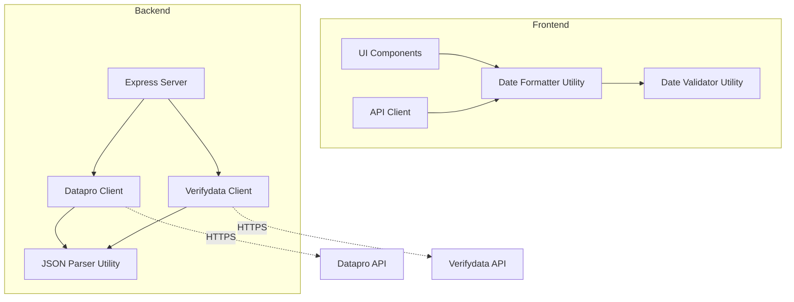
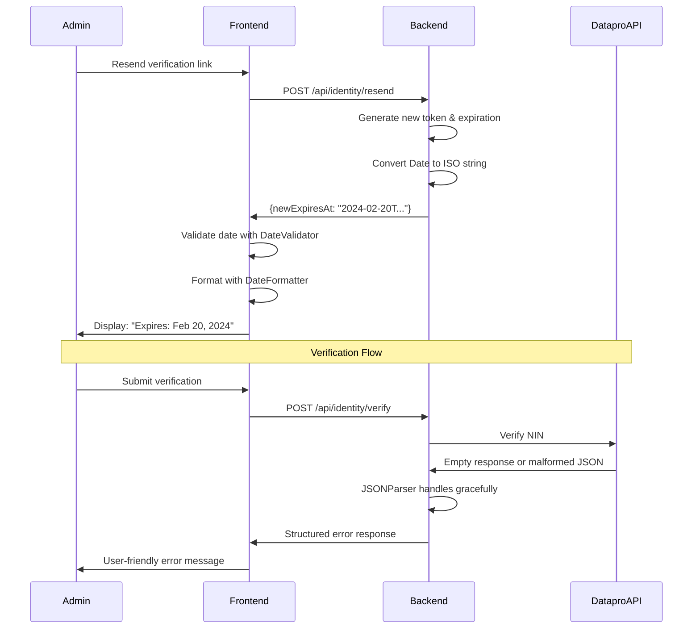

# Design Document: Date Formatting Fixes

## Overview

This design addresses critical date formatting and JSON parsing issues that cause "Invalid Date" displays and verification failures. The solution introduces centralized date utilities, robust JSON parsing, and consistent error handling across both frontend and backend.

### Problem Statement

The application currently suffers from three interconnected issues:

1. **Date Serialization Mismatch**: Backend returns Date objects that serialize to ISO strings, but frontend doesn't validate before formatting
2. **Empty JSON Responses**: Datapro and Verifydata APIs occasionally return empty responses, causing "Unexpected end of JSON input" errors
3. **Inconsistent Date Formatting**: Over 50 locations use `toLocaleDateString()` without validation, leading to "Invalid Date" displays

### Solution Approach

We'll create three core utilities:
- **Date Validator**: Validates and normalizes date values from various sources
- **Date Formatter**: Provides consistent, validated date formatting
- **JSON Parser**: Safely parses API responses with empty/malformed data handling

## Architecture

### Component Diagram



### Data Flow



## Components and Interfaces

### 1. Date Validator Utility (Frontend & Backend)

**Location**: 
- Frontend: `src/utils/dateValidator.ts`
- Backend: `server-utils/dateValidator.cjs`

**Purpose**: Validate and normalize date values from various sources

**Interface**:

```typescript
// Frontend (TypeScript)
interface DateValidatorOptions {
  allowNull?: boolean;
  defaultValue?: Date | string | null;
}

interface DateValidationResult {
  isValid: boolean;
  date: Date | null;
  error?: string;
}

export function validateDate(
  value: unknown,
  options?: DateValidatorOptions
): DateValidationResult;

export function isValidDate(value: unknown): boolean;

export function normalizeDate(value: unknown): Date | null;
```

```javascript
// Backend (CommonJS)
/**
 * @typedef {Object} DateValidatorOptions
 * @property {boolean} [allowNull]
 * @property {Date|string|null} [defaultValue]
 */

/**
 * @typedef {Object} DateValidationResult
 * @property {boolean} isValid
 * @property {Date|null} date
 * @property {string} [error]
 */

/**
 * @param {unknown} value
 * @param {DateValidatorOptions} [options]
 * @returns {DateValidationResult}
 */
function validateDate(value, options = {}) { }

/**
 * @param {unknown} value
 * @returns {boolean}
 */
function isValidDate(value) { }

/**
 * @param {unknown} value
 * @returns {Date|null}
 */
function normalizeDate(value) { }
```

**Behavior**:
- Accepts: Date objects, ISO strings, Firestore Timestamps, numbers (epoch), null/undefined
- Returns: Validated Date object or null
- Checks: `isNaN(date.getTime())` after parsing
- Handles: Firestore Timestamp `.toDate()` conversion

### 2. Date Formatter Utility (Frontend & Backend)

**Location**:
- Frontend: `src/utils/dateFormatter.ts`
- Backend: `server-utils/dateFormatter.cjs`

**Purpose**: Provide consistent, validated date formatting

**Interface**:

```typescript
// Frontend (TypeScript)
type DateFormatStyle = 'short' | 'medium' | 'long' | 'full';

interface DateFormatOptions {
  style?: DateFormatStyle;
  includeTime?: boolean;
  locale?: string;
  fallback?: string;
}

export function formatDate(
  value: unknown,
  options?: DateFormatOptions
): string;

export function formatDateShort(value: unknown): string;
export function formatDateLong(value: unknown): string;
export function formatDateTime(value: unknown): string;
```

**Format Styles**:
- `short`: "2/20/24"
- `medium`: "Feb 20, 2024" (default)
- `long`: "February 20, 2024"
- `full`: "Monday, February 20, 2024"

**Behavior**:
- Always validates using DateValidator first
- Returns fallback string if validation fails (default: "Date unavailable")
- Uses consistent locale (en-US by default)
- Never throws errors

### 3. JSON Parser Utility (Backend)

**Location**: `server-utils/jsonParser.cjs`

**Purpose**: Safely parse JSON responses with comprehensive error handling

**Interface**:

```javascript
/**
 * @typedef {Object} JSONParseResult
 * @property {boolean} success
 * @property {any} [data]
 * @property {string} [error]
 * @property {string} [errorCode]
 * @property {Object} [details]
 */

/**
 * @param {string} jsonString
 * @param {Object} [context]
 * @returns {JSONParseResult}
 */
function safeJSONParse(jsonString, context = {}) { }

/**
 * @param {string} jsonString
 * @returns {boolean}
 */
function isValidJSON(jsonString) { }
```

**Behavior**:
- Checks if string is empty or whitespace-only before parsing
- Catches JSON.parse errors and returns structured response
- Logs errors with context (masked sensitive data)
- Returns consistent error format with errorCode 'PARSE_ERROR'
- Includes response length in error details

### 4. Updated Datapro Client

**Location**: `server-services/dataproClient.cjs`

**Changes**:
- Replace inline `JSON.parse(data)` with `safeJSONParse(data, context)`
- Add empty response check before parsing
- Log response length on parse errors
- Include parse error details in return value

**Modified Code Section** (around line 217):

```javascript
// Before
try {
  parsedData = JSON.parse(data);
} catch (parseError) {
  console.error(`[DataproClient] Failed to parse response: ${parseError.message}`);
  return {
    success: false,
    error: 'Invalid response from verification service',
    errorCode: 'PARSE_ERROR',
    details: { parseError: parseError.message }
  };
}

// After
const parseResult = safeJSONParse(data, {
  source: 'DataproClient',
  nin: maskNIN(nin),
  statusCode,
  responseLength: data.length
});

if (!parseResult.success) {
  console.error(`[DataproClient] ${parseResult.error}`);
  return {
    success: false,
    error: 'Invalid response from verification service',
    errorCode: parseResult.errorCode,
    details: parseResult.details
  };
}

parsedData = parseResult.data;
```

### 5. Updated Verifydata Client

**Location**: `server-services/verifydataClient.cjs`

**Changes**: Same as Datapro Client
- Replace inline `JSON.parse(data)` with `safeJSONParse(data, context)`
- Add empty response check before parsing
- Log response length on parse errors
- Include parse error details in return value

**Modified Code Sections** (lines 217 and 270):

```javascript
// Status 200 response parsing
const parseResult = safeJSONParse(data, {
  source: 'VerifydataClient',
  rcNumber: maskRCNumber(rcNumber),
  statusCode,
  responseLength: data.length
});

if (!parseResult.success) {
  console.error(`[VerifydataClient] ${parseResult.error}`);
  return {
    success: false,
    error: 'Invalid response from verification service',
    errorCode: parseResult.errorCode,
    details: parseResult.details
  };
}

parsedData = parseResult.data;
```

### 6. Updated Frontend - Identity List Detail

**Location**: `src/pages/admin/IdentityListDetail.tsx`

**Changes** (line 670):

```typescript
// Before
setSuccessMessage(`Verification link resent to ${resendEntry.email}. Expires: ${new Date(result.newExpiresAt).toLocaleDateString()}`);

// After
import { formatDateLong } from '@/utils/dateFormatter';

const expirationDate = formatDateLong(result.newExpiresAt);
setSuccessMessage(`Verification link resent to ${resendEntry.email}. Expires: ${expirationDate}`);
```

**Additional Changes**:
- Replace all `toLocaleDateString()` calls with `formatDate()` (lines 497, 578)
- Replace `toLocaleString()` with `formatDateTime()` (line 1437)

### 7. Backend Date Serialization

**Location**: `server.js` (line 11255)

**Current Code**:
```javascript
const response = {
  success: true,
  newExpiresAt: newTokenExpiresAt,  // Date object
  resendCount: newResendCount
};
```

**Issue**: When Express serializes this to JSON, the Date object becomes an ISO string, but this is implicit and undocumented.

**Solution**: Explicitly convert to ISO string and document in type definitions

```javascript
const response = {
  success: true,
  newExpiresAt: newTokenExpiresAt.toISOString(),  // Explicit ISO string
  resendCount: newResendCount
};
```

**Type Definition Update** (`src/api/identityRoutes.ts`):

```typescript
interface ResendVerificationLinkResponse {
  success: boolean;
  newExpiresAt: string;  // ISO 8601 date string
  resendCount: number;
  warning?: string;
}
```

## Data Models

### Date Validation Result

```typescript
interface DateValidationResult {
  isValid: boolean;      // Whether the date is valid
  date: Date | null;     // Parsed Date object or null
  error?: string;        // Error message if invalid
}
```

### JSON Parse Result

```javascript
{
  success: boolean,      // Whether parsing succeeded
  data?: any,           // Parsed data if successful
  error?: string,       // Error message if failed
  errorCode?: string,   // Error code (e.g., 'PARSE_ERROR', 'EMPTY_RESPONSE')
  details?: {           // Additional error context
    parseError?: string,
    responseLength?: number,
    source?: string,
    statusCode?: number
  }
}
```

### Date Format Options

```typescript
interface DateFormatOptions {
  style?: 'short' | 'medium' | 'long' | 'full';
  includeTime?: boolean;
  locale?: string;
  fallback?: string;
}
```

## Correctness Properties

*A property is a characteristic or behavior that should hold true across all valid executions of a system—essentially, a formal statement about what the system should do. Properties serve as the bridge between human-readable specifications and machine-verifiable correctness guarantees.*


### Property 1: Date Validator Handles All Input Types

*For any* value (Date object, ISO string, Firestore Timestamp, number, null, undefined, invalid string, or object), the Date_Validator should correctly identify whether it's a valid date and return either a valid Date object or null, never returning an invalid Date that would produce NaN from getTime().

**Validates: Requirements 1.1, 1.3, 1.4, 1.5, 1.6**

### Property 2: Date Formatter Always Validates Before Formatting

*For any* input value (valid or invalid), when passed to the Date_Formatter, the formatter should validate the date first and never call toLocaleDateString() on an invalid date.

**Validates: Requirements 2.3, 3.2, 7.4**

### Property 3: Formatted Output Never Contains "Invalid Date"

*For any* input value passed to the Date_Formatter, the output string should never contain the text "Invalid Date", instead returning a fallback message like "Date unavailable".

**Validates: Requirements 3.3, 8.1**

### Property 4: Date Formatting Consistency

*For any* valid date, formatting it multiple times with the same options should produce identical output strings.

**Validates: Requirements 2.5**

### Property 5: Date Formatter Supports Multiple Formats

*For any* valid date, the formatter should successfully produce output for both date-only and date-time formats without errors.

**Validates: Requirements 2.4**

### Property 6: Firestore Timestamp Formatting

*For any* Firestore Timestamp object, the Date_Formatter should successfully format it without errors, producing a valid date string.

**Validates: Requirements 2.6**

### Property 7: Frontend Parses ISO Strings Correctly

*For any* valid ISO 8601 date string, the frontend Date_Validator should parse it into a valid Date object that can be formatted.

**Validates: Requirements 3.1**

### Property 8: Backend Serializes Dates as ISO Strings

*For any* Date object in a backend API response, it should be serialized as a valid ISO 8601 string (not a raw Date object).

**Validates: Requirements 3.5, 6.1, 6.4**

### Property 9: Backend Validates Dates Before Serialization

*For any* date value being serialized in the backend, if it's invalid, the system should reject it or convert it to null rather than serializing an invalid date.

**Validates: Requirements 6.5**

### Property 10: JSON Parser Handles Malformed Input

*For any* malformed JSON string (including empty strings, whitespace-only strings, or invalid JSON syntax), the JSON parser should return a structured error response with errorCode 'PARSE_ERROR' without throwing exceptions.

**Validates: Requirements 4.1, 4.2, 4.3, 4.4, 4.6**

### Property 11: Error Responses Have Consistent Structure

*For any* error in the JSON parser or API clients, the error response should include success: false, error message, errorCode, and details object.

**Validates: Requirements 5.4, 5.6**

### Property 12: User-Friendly Error Messages

*For any* error response shown to end users, the error message should be user-friendly (not containing technical details like stack traces or internal error codes).

**Validates: Requirements 5.3, 8.4**

### Property 13: Sensitive Data Masking

*For any* log message containing NIN or CAC numbers, the sensitive data should be masked (showing only first 4 characters).

**Validates: Requirements 5.5**

### Property 14: Parse Errors Trigger Retries

*For any* parse error in the Datapro or Verifydata clients, the system should retry the request up to MAX_RETRIES times before returning an error.

**Validates: Requirements 5.7**

### Property 15: Both API Clients Handle Errors Identically

*For any* error scenario (empty response, malformed JSON, network error), both the Datapro and Verifydata clients should handle it in the same way, returning the same error structure.

**Validates: Requirements 11.6**

## Error Handling

### Date Validation Errors

**Scenario**: Invalid date value provided to validator or formatter

**Handling**:
1. Validator returns `{ isValid: false, date: null, error: "..." }`
2. Formatter returns fallback string (default: "Date unavailable")
3. No exceptions thrown
4. Error logged for debugging (if context provided)

**Example**:
```typescript
// Invalid input
formatDate("not a date")  // Returns: "Date unavailable"
formatDate(undefined)     // Returns: "Date unavailable"
formatDate(NaN)          // Returns: "Date unavailable"
```

### JSON Parsing Errors

**Scenario**: Empty or malformed JSON response from external API

**Handling**:
1. Check if response is empty/whitespace before parsing
2. Wrap JSON.parse in try-catch
3. Return structured error with errorCode 'PARSE_ERROR' or 'EMPTY_RESPONSE'
4. Log error with context (masked sensitive data, response length, status code)
5. Trigger retry logic (up to MAX_RETRIES)

**Example**:
```javascript
// Empty response
safeJSONParse("")
// Returns: { success: false, errorCode: 'EMPTY_RESPONSE', error: '...', details: { responseLength: 0 } }

// Malformed JSON
safeJSONParse("{invalid")
// Returns: { success: false, errorCode: 'PARSE_ERROR', error: '...', details: { parseError: '...', responseLength: 8 } }
```

### API Client Errors

**Scenario**: Datapro or Verifydata API returns error or empty response

**Handling**:
1. Use safeJSONParse for all response parsing
2. Check parse result before accessing data
3. Return user-friendly error messages
4. Include technical details in error.details for staff
5. Mask sensitive data (NIN/CAC) in all logs
6. Retry on parse errors and 500 errors

**Error Response Structure**:
```javascript
{
  success: false,
  error: "User-friendly message",
  errorCode: "PARSE_ERROR" | "EMPTY_RESPONSE" | "NETWORK_ERROR" | ...,
  details: {
    statusCode: 200,
    responseLength: 0,
    parseError: "Unexpected end of JSON input",
    source: "DataproClient",
    nin: "1234*******",
    attempt: 1
  }
}
```

### Frontend Display Errors

**Scenario**: Date cannot be formatted for display

**Handling**:
1. Use formatDate() which internally validates
2. Display fallback message instead of "Invalid Date"
3. Log error to console for debugging
4. Continue rendering other UI elements

**Example**:
```typescript
// In React component
const expirationDisplay = formatDateLong(result.newExpiresAt);
// If invalid: "Date unavailable"
// If valid: "February 20, 2024"
```

## Testing Strategy

### Dual Testing Approach

This feature requires both unit tests and property-based tests:

**Unit Tests**: Verify specific examples, edge cases, and error conditions
- Empty string handling
- Null/undefined handling
- Specific date format examples
- Firestore Timestamp conversion examples
- Error message content

**Property Tests**: Verify universal properties across all inputs
- Date validator handles all input types (Property 1)
- Formatter never produces "Invalid Date" (Property 3)
- JSON parser handles all malformed input (Property 10)
- Error responses have consistent structure (Property 11)
- Both API clients behave identically (Property 15)

### Property-Based Testing Configuration

**Library**: Use `fast-check` for TypeScript/JavaScript property-based testing

**Configuration**:
- Minimum 100 iterations per property test
- Each test tagged with: `Feature: date-formatting-fixes, Property N: [property text]`
- Use custom arbitraries for:
  - Various date formats (ISO strings, epoch numbers, Date objects)
  - Firestore Timestamp objects
  - Malformed JSON strings
  - Empty/whitespace strings

**Example Property Test**:
```typescript
// Feature: date-formatting-fixes, Property 3: Formatted output never contains "Invalid Date"
import fc from 'fast-check';

test('formatDate never produces "Invalid Date"', () => {
  fc.assert(
    fc.property(
      fc.anything(),  // Any possible input
      (input) => {
        const result = formatDate(input);
        expect(result).not.toContain('Invalid Date');
      }
    ),
    { numRuns: 100 }
  );
});
```

### Test Coverage Requirements

**Date Validator** (`dateValidator.test.ts`):
- Unit tests for each input type (Date, string, number, Firestore Timestamp, null, undefined)
- Property test for handling all input types (Property 1)
- Edge cases: Invalid Date objects, malformed ISO strings, negative epoch times

**Date Formatter** (`dateFormatter.test.ts`):
- Unit tests for each format style (short, medium, long, full)
- Unit tests for date-only vs date-time formatting
- Property test for validation before formatting (Property 2)
- Property test for no "Invalid Date" output (Property 3)
- Property test for formatting consistency (Property 4)
- Property test for Firestore Timestamp support (Property 6)

**JSON Parser** (`jsonParser.test.ts`):
- Unit tests for empty string, whitespace-only string
- Unit tests for various malformed JSON
- Property test for handling all malformed input (Property 10)
- Property test for consistent error structure (Property 11)

**Datapro Client** (`dataproClient.test.cjs`):
- Unit tests for empty response handling
- Unit tests for malformed JSON response
- Property test for parse error retries (Property 14)
- Property test for sensitive data masking (Property 13)

**Verifydata Client** (`verifydataClient.test.cjs`):
- Unit tests for empty response handling
- Unit tests for malformed JSON response
- Property test for identical error handling to Datapro (Property 15)
- Property test for sensitive data masking (Property 13)

**Integration Tests** (`identityVerification.integration.test.ts`):
- End-to-end test for verification link resend with date display
- Test backend serialization to ISO string (Property 8)
- Test frontend parsing and formatting
- Test error scenarios with empty API responses

### Avoiding Excessive Unit Tests

Since property-based tests cover comprehensive input ranges, unit tests should focus on:
- Specific examples that demonstrate correct behavior
- Edge cases that are important to document
- Integration points between components
- Error conditions that need specific handling

Avoid writing many similar unit tests for different inputs—let property tests handle input variation.
