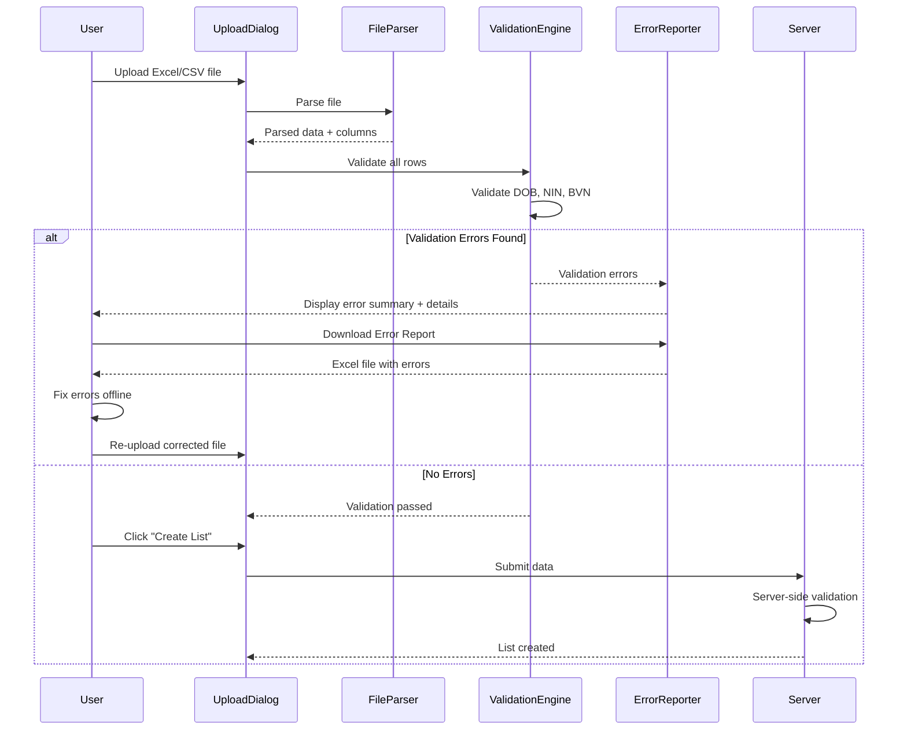

# Design Document: Identity Upload Validation Enhancement

## Overview

This feature enhances the identity collection Excel/CSV upload system with comprehensive validation to prevent data entry errors before list creation. The validation system operates on both client-side (for immediate feedback) and server-side (for security), validating Date of Birth (DOB), National Identification Number (NIN), and Bank Verification Number (BVN) fields.

The design integrates seamlessly with the existing upload workflow in `UploadDialog.tsx` and `fileParser.ts`, adding validation after file parsing but before list creation. Users receive clear, actionable error messages with row numbers and can download an error report for offline correction.

## Architecture

### High-Level Flow



### Component Architecture

The validation system consists of four main components:

1. **ValidationEngine**: Core validation logic for DOB, NIN, and BVN
2. **ErrorReporter**: UI component for displaying validation errors
3. **ErrorReportGenerator**: Generates downloadable Excel error reports
4. **Server Validator**: Server-side validation mirror for security

## Components and Interfaces

### 1. ValidationEngine

**Location**: `src/utils/validation/identityValidation.ts`

**Purpose**: Performs validation on parsed identity data

**Interface**:
```typescript
interface ValidationError {
  rowIndex: number;          // 0-based index in data array
  rowNumber: number;         // 1-based row number for display (includes header)
  column: string;            // Column name where error occurred
  value: any;                // The invalid value
  errorType: 'DOB_INVALID_YEAR' | 'DOB_UNDER_AGE' | 'NIN_INVALID' | 'BVN_INVALID';
  message: string;           // Human-readable error message
}

interface ValidationResult {
  valid: boolean;
  errors: ValidationError[];
  errorSummary: {
    totalErrors: number;
    affectedRows: number;
  };
}

interface ValidationOptions {
  templateType: 'individual' | 'corporate' | 'flexible';
  currentYear?: number;      // For testing purposes
}

// Main validation function
function validateIdentityData(
  rows: Record<string, any>[],
  columns: string[],
  options: ValidationOptions
): ValidationResult;

// Individual field validators
function validateDOB(value: any, rowIndex: number, column: string): ValidationError | null;
function validateNIN(value: any, rowIndex: number, column: string): ValidationError | null;
function validateBVN(value: any, rowIndex: number, column: string): ValidationError | null;
```

**Validation Logic**:

**DOB Validation**:
```typescript
function validateDOB(value: any, rowIndex: number, column: string): ValidationError | null {
  // 1. Extract year from value (handle multiple formats)
  const year = extractYear(value);
  
  // 2. Check if year is exactly 4 digits and in valid range (1900-currentYear)
  if (!year || year < 1900 || year > currentYear) {
    return {
      rowIndex,
      rowNumber: rowIndex + 2, // +1 for 0-based, +1 for header row
      column,
      value,
      errorType: 'DOB_INVALID_YEAR',
      message: `Invalid DOB - Year must be 4 digits between 1900-${currentYear}`
    };
  }
  
  // 3. Calculate age
  const age = currentYear - year;
  
  // 4. Check minimum age requirement
  if (age < 18) {
    return {
      rowIndex,
      rowNumber: rowIndex + 2,
      column,
      value,
      errorType: 'DOB_UNDER_AGE',
      message: 'DOB indicates age under 18'
    };
  }
  
  return null;
}

function extractYear(value: any): number | null {
  // Handle Excel serial numbers
  if (typeof value === 'number' && value > 1000) {
    const date = excelSerialToDate(value);
    return new Date(date).getFullYear();
  }
  
  // Handle string dates
  if (typeof value === 'string') {
    // Try parsing various formats: DD/MM/YYYY, MM/DD/YYYY, YYYY-MM-DD
    const datePatterns = [
      /^(\d{1,2})\/(\d{1,2})\/(\d{4})$/,  // DD/MM/YYYY or MM/DD/YYYY
      /^(\d{4})-(\d{1,2})-(\d{1,2})$/,    // YYYY-MM-DD
    ];
    
    for (const pattern of datePatterns) {
      const match = value.match(pattern);
      if (match) {
        // Extract year (last group for DD/MM/YYYY, first group for YYYY-MM-DD)
        const year = pattern.source.startsWith('^(\\d{4})') 
          ? parseInt(match[1]) 
          : parseInt(match[3]);
        
        // Validate it's a 4-digit year
        if (year >= 1000 && year <= 9999) {
          return year;
        }
      }
    }
  }
  
  // Handle Date objects
  if (value instanceof Date && !isNaN(value.getTime())) {
    return value.getFullYear();
  }
  
  return null;
}
```

**NIN/BVN Validation**:
```typescript
function validate11DigitIdentifier(
  value: any, 
  rowIndex: number, 
  column: string,
  identifierType: 'NIN' | 'BVN'
): ValidationError | null {
  // 1. Handle null/undefined
  if (value === null || value === undefined || value === '') {
    return null; // Empty values are allowed (optional fields)
  }
  
  // 2. Convert to string and trim whitespace
  const trimmed = String(value).trim();
  
  // 3. Validate format: exactly 11 digits
  if (!/^\d{11}$/.test(trimmed)) {
    return {
      rowIndex,
      rowNumber: rowIndex + 2,
      column,
      value,
      errorType: identifierType === 'NIN' ? 'NIN_INVALID' : 'BVN_INVALID',
      message: `${identifierType} must be exactly 11 digits`
    };
  }
  
  return null;
}

function validateNIN(value: any, rowIndex: number, column: string): ValidationError | null {
  return validate11DigitIdentifier(value, rowIndex, column, 'NIN');
}

function validateBVN(value: any, rowIndex: number, column: string): ValidationError | null {
  return validate11DigitIdentifier(value, rowIndex, column, 'BVN');
}
```

**Main Validation Function**:
```typescript
function validateIdentityData(
  rows: Record<string, any>[],
  columns: string[],
  options: ValidationOptions
): ValidationResult {
  const errors: ValidationError[] = [];
  const currentYear = options.currentYear || new Date().getFullYear();
  
  // Detect relevant columns
  const dobColumn = findDOBColumn(columns);
  const ninColumn = findNINColumn(columns);
  const bvnColumn = findBVNColumn(columns);
  
  // Validate each row
  for (let i = 0; i < rows.length; i++) {
    const row = rows[i];
    
    // Validate DOB (all templates)
    if (dobColumn && row[dobColumn]) {
      const error = validateDOB(row[dobColumn], i, dobColumn);
      if (error) errors.push(error);
    }
    
    // Validate NIN (Individual template only)
    if (options.templateType === 'individual' && ninColumn && row[ninColumn]) {
      const error = validateNIN(row[ninColumn], i, ninColumn);
      if (error) errors.push(error);
    }
    
    // Validate BVN (all templates)
    if (bvnColumn && row[bvnColumn]) {
      const error = validateBVN(row[bvnColumn], i, bvnColumn);
      if (error) errors.push(error);
    }
  }
  
  // Calculate summary
  const affectedRows = new Set(errors.map(e => e.rowIndex)).size;
  
  return {
    valid: errors.length === 0,
    errors,
    errorSummary: {
      totalErrors: errors.length,
      affectedRows
    }
  };
}
```

### 2. ErrorReporter Component

**Location**: `src/components/identity/ValidationErrorDisplay.tsx`

**Purpose**: Displays validation errors in the UploadDialog

**Interface**:
```typescript
interface ValidationErrorDisplayProps {
  validationResult: ValidationResult;
  onDownloadErrorReport: () => void;
}

function ValidationErrorDisplay({ 
  validationResult, 
  onDownloadErrorReport 
}: ValidationErrorDisplayProps): JSX.Element;
```

**UI Structure**:
```
┌─────────────────────────────────────────────────┐
│ ⚠️ Validation Failed                            │
│                                                  │
│ Found 5 validation errors in 3 rows            │
│                                                  │
│ [Download Error Report] button                  │
│                                                  │
│ Error Details:                                  │
│ ┌─────────────────────────────────────────────┐│
│ │ Row 5 | Date of Birth | Invalid DOB - Year ││
│ │       must be 4 digits between 1900-2025   ││
│ │       Value: "21998"                        ││
│ ├─────────────────────────────────────────────┤│
│ │ Row 12 | NIN | NIN must be exactly 11      ││
│ │        digits                                ││
│ │        Value: "1234567890"                  ││
│ └─────────────────────────────────────────────┘│
│                                                  │
│ Please fix the errors and re-upload the file.  │
└─────────────────────────────────────────────────┘
```

**Implementation**:
```typescript
function ValidationErrorDisplay({ validationResult, onDownloadErrorReport }: ValidationErrorDisplayProps) {
  const { errors, errorSummary } = validationResult;
  
  return (
    <Alert severity="error" sx={{ mb: 2 }}>
      <Typography variant="body2" sx={{ fontWeight: 'bold', mb: 1 }}>
        ⚠️ Validation Failed
      </Typography>
      
      <Typography variant="body2" sx={{ mb: 2 }}>
        Found {errorSummary.totalErrors} validation error{errorSummary.totalErrors !== 1 ? 's' : ''} in {errorSummary.affectedRows} row{errorSummary.affectedRows !== 1 ? 's' : ''}
      </Typography>
      
      <Button
        variant="outlined"
        size="small"
        startIcon={<DownloadIcon />}
        onClick={onDownloadErrorReport}
        sx={{ mb: 2 }}
      >
        Download Error Report
      </Button>
      
      <Typography variant="body2" sx={{ fontWeight: 'bold', mb: 1 }}>
        Error Details:
      </Typography>
      
      <TableContainer component={Paper} sx={{ maxHeight: 300 }}>
        <Table size="small">
          <TableHead>
            <TableRow>
              <TableCell>Row</TableCell>
              <TableCell>Column</TableCell>
              <TableCell>Error</TableCell>
              <TableCell>Value</TableCell>
            </TableRow>
          </TableHead>
          <TableBody>
            {errors.map((error, idx) => (
              <TableRow key={idx}>
                <TableCell>{error.rowNumber}</TableCell>
                <TableCell>{error.column}</TableCell>
                <TableCell>{error.message}</TableCell>
                <TableCell sx={{ fontFamily: 'monospace' }}>
                  {String(error.value)}
                </TableCell>
              </TableRow>
            ))}
          </TableBody>
        </Table>
      </TableContainer>
      
      <Typography variant="body2" sx={{ mt: 2, color: 'text.secondary' }}>
        Please fix the errors and re-upload the file.
      </Typography>
    </Alert>
  );
}
```

### 3. ErrorReportGenerator

**Location**: `src/utils/validation/errorReportGenerator.ts`

**Purpose**: Generates downloadable Excel files with validation errors

**Interface**:
```typescript
function generateErrorReport(
  originalData: Record<string, any>[],
  columns: string[],
  validationErrors: ValidationError[],
  originalFileName: string
): void;
```

**Implementation**:
```typescript
import * as XLSX from 'xlsx';

function generateErrorReport(
  originalData: Record<string, any>[],
  columns: string[],
  validationErrors: ValidationError[],
  originalFileName: string
): void {
  // Create error map for quick lookup
  const errorMap = new Map<number, string[]>();
  for (const error of validationErrors) {
    const existing = errorMap.get(error.rowIndex) || [];
    existing.push(`${error.column}: ${error.message}`);
    errorMap.set(error.rowIndex, existing);
  }
  
  // Filter rows with errors and add error column
  const errorRows = originalData
    .map((row, index) => {
      const errors = errorMap.get(index);
      if (!errors) return null;
      
      return {
        ...row,
        'Validation Errors': errors.join('; ')
      };
    })
    .filter(row => row !== null);
  
  // Create worksheet with all original columns + error column
  const worksheet = XLSX.utils.json_to_sheet(errorRows, {
    header: [...columns, 'Validation Errors']
  });
  
  // Create workbook
  const workbook = XLSX.utils.book_new();
  XLSX.utils.book_append_sheet(workbook, worksheet, 'Validation Errors');
  
  // Generate filename
  const baseFileName = originalFileName.replace(/\.(csv|xlsx|xls)$/i, '');
  const errorFileName = `${baseFileName}_errors.xlsx`;
  
  // Download file
  XLSX.writeFile(workbook, errorFileName);
}
```

### 4. Server-Side Validator

**Location**: `server-utils/identityUploadValidator.cjs`

**Purpose**: Mirror client-side validation on the server for security

**Interface**:
```javascript
/**
 * Validate identity data on server side
 * @param {Array<Object>} rows - Data rows
 * @param {Array<string>} columns - Column names
 * @param {Object} options - Validation options
 * @returns {Object} Validation result
 */
function validateIdentityData(rows, columns, options);
```

**Implementation**: Same validation logic as client-side, implemented in CommonJS for Node.js

## Data Models

### ValidationError
```typescript
interface ValidationError {
  rowIndex: number;          // 0-based index in data array
  rowNumber: number;         // 1-based row number for display
  column: string;            // Column name
  value: any;                // Invalid value
  errorType: 'DOB_INVALID_YEAR' | 'DOB_UNDER_AGE' | 'NIN_INVALID' | 'BVN_INVALID';
  message: string;           // Human-readable message
}
```

### ValidationResult
```typescript
interface ValidationResult {
  valid: boolean;
  errors: ValidationError[];
  errorSummary: {
    totalErrors: number;
    affectedRows: number;
  };
}
```

### ValidationOptions
```typescript
interface ValidationOptions {
  templateType: 'individual' | 'corporate' | 'flexible';
  currentYear?: number;      // For testing
}
```

## Correctness Properties

*A property is a characteristic or behavior that should hold true across all valid executions of a system—essentially, a formal statement about what the system should do. Properties serve as the bridge between human-readable specifications and machine-verifiable correctness guarantees.*

### Property 1: Year extraction consistency

*For any* valid date value in any supported format (DD/MM/YYYY, MM/DD/YYYY, YYYY-MM-DD, Excel serial), extracting the year component should produce the same year value regardless of the input format.

**Validates: Requirements 1.1, 1.6**

### Property 2: Invalid year rejection

*For any* year value that is not exactly 4 digits OR is outside the range [1900, current_year], the validation engine should reject it with the error message "Invalid DOB - Year must be 4 digits between 1900-[current_year]".

**Validates: Requirements 1.2, 1.3**

### Property 3: Age calculation correctness

*For any* valid birth year, the calculated age should equal (current_year - birth_year).

**Validates: Requirements 1.4**

### Property 4: Minimum age enforcement

*For any* date of birth that results in an age less than 18 years, the validation engine should reject it with the error message "DOB indicates age under 18".

**Validates: Requirements 1.5**

### Property 5: 11-digit identifier validation

*For any* identifier field (NIN or BVN), if the trimmed value does not match the pattern /^\d{11}$/, the validation engine should reject it with the error message "[NIN|BVN] must be exactly 11 digits".

**Validates: Requirements 2.1, 2.2, 2.3, 2.4, 3.1, 3.2, 3.3, 3.4**

### Property 6: Error summary accuracy

*For any* set of validation errors, the error summary should accurately report the total number of errors and the count of unique affected rows.

**Validates: Requirements 4.1**

### Property 7: Error detail completeness

*For any* validation error, the error detail should include the row number, column name, and specific error message.

**Validates: Requirements 4.2**

### Property 8: Error report completeness

*For any* uploaded file with validation errors, the generated error report should include all original data columns plus a "Validation Errors" column, and should contain only rows with errors.

**Validates: Requirements 5.2, 5.3, 5.4, 5.5**

### Property 9: Error report filename generation

*For any* original filename, the error report filename should be the original filename with "_errors" appended before the extension.

**Validates: Requirements 5.6**

### Property 10: Comprehensive row validation

*For any* uploaded file, validation should be performed on all rows in the file, not just the preview rows.

**Validates: Requirements 6.3**

### Property 11: Client-server validation consistency

*For any* invalid data, both client-side and server-side validation should reject it with the same error messages.

**Validates: Requirements 7.2**

## Error Handling

### Validation Errors

**Client-Side**:
- Display validation errors immediately after file parsing
- Block "Create List" button when errors exist
- Provide "Download Error Report" button
- Show clear instructions to fix and re-upload

**Server-Side**:
- Return 400 Bad Request with validation errors if data is invalid
- Include detailed error information in response
- Log validation failures for monitoring

### File Parsing Errors

- Maintain existing error handling for file parsing
- Show clear error messages for unsupported formats
- Handle corrupted files gracefully

### Error Report Generation Errors

- Catch and log any errors during Excel generation
- Show user-friendly error message if download fails
- Provide fallback to display errors in UI only

## Testing Strategy

### Dual Testing Approach

This feature requires both unit tests and property-based tests:

- **Unit tests**: Verify specific examples, edge cases, and UI interactions
- **Property tests**: Verify universal properties across all inputs
- Together they provide comprehensive coverage

### Property-Based Testing

We'll use **fast-check** for TypeScript property-based testing. Each property test should:
- Run minimum 100 iterations
- Reference its design document property
- Use tag format: **Feature: identity-upload-validation-enhancement, Property {number}: {property_text}**

**Property Test Examples**:

```typescript
// Property 1: Year extraction consistency
fc.assert(
  fc.property(
    fc.date({ min: new Date('1900-01-01'), max: new Date() }),
    (date) => {
      const year = date.getFullYear();
      
      // Test different formats produce same year
      const ddmmyyyy = `${date.getDate()}/${date.getMonth() + 1}/${year}`;
      const yyyymmdd = `${year}-${String(date.getMonth() + 1).padStart(2, '0')}-${String(date.getDate()).padStart(2, '0')}`;
      const excelSerial = dateToExcelSerial(date);
      
      expect(extractYear(ddmmyyyy)).toBe(year);
      expect(extractYear(yyyymmdd)).toBe(year);
      expect(extractYear(excelSerial)).toBe(year);
    }
  ),
  { numRuns: 100 }
);

// Property 5: 11-digit identifier validation
fc.assert(
  fc.property(
    fc.oneof(
      fc.string({ minLength: 1, maxLength: 10 }),  // Too short
      fc.string({ minLength: 12, maxLength: 20 }), // Too long
      fc.string({ minLength: 11, maxLength: 11 }).filter(s => !/^\d{11}$/.test(s)) // Wrong format
    ),
    (invalidValue) => {
      const error = validateNIN(invalidValue, 0, 'NIN');
      expect(error).not.toBeNull();
      expect(error?.message).toBe('NIN must be exactly 11 digits');
    }
  ),
  { numRuns: 100 }
);
```

### Unit Testing

Focus on:
- Specific date format examples (DD/MM/YYYY, MM/DD/YYYY, YYYY-MM-DD, Excel serial)
- Edge cases (leap years, boundary years like 1900 and current year)
- UI state changes (button disabled/enabled, error display)
- Error report generation with specific data
- Template-specific validation (Individual vs Corporate)
- Integration with existing upload flow

**Unit Test Examples**:

```typescript
describe('DOB Validation', () => {
  it('should accept valid DOB in DD/MM/YYYY format', () => {
    const error = validateDOB('15/03/1990', 0, 'Date of Birth');
    expect(error).toBeNull();
  });
  
  it('should reject typo "21998" as invalid year', () => {
    const error = validateDOB('15/03/21998', 0, 'Date of Birth');
    expect(error).not.toBeNull();
    expect(error?.errorType).toBe('DOB_INVALID_YEAR');
  });
  
  it('should reject DOB indicating age under 18', () => {
    const currentYear = new Date().getFullYear();
    const recentYear = currentYear - 10;
    const error = validateDOB(`15/03/${recentYear}`, 0, 'Date of Birth');
    expect(error).not.toBeNull();
    expect(error?.errorType).toBe('DOB_UNDER_AGE');
  });
});

describe('ValidationErrorDisplay', () => {
  it('should disable Create List button when errors exist', () => {
    const validationResult = {
      valid: false,
      errors: [/* some errors */],
      errorSummary: { totalErrors: 1, affectedRows: 1 }
    };
    
    render(<UploadDialog validationResult={validationResult} />);
    const createButton = screen.getByText('Create List');
    expect(createButton).toBeDisabled();
  });
  
  it('should show Download Error Report button when errors exist', () => {
    const validationResult = {
      valid: false,
      errors: [/* some errors */],
      errorSummary: { totalErrors: 1, affectedRows: 1 }
    };
    
    render(<ValidationErrorDisplay validationResult={validationResult} />);
    expect(screen.getByText('Download Error Report')).toBeInTheDocument();
  });
});
```

### Integration Testing

- Test complete upload flow with validation
- Test error report download
- Test server-side validation endpoint
- Test backward compatibility with existing uploads

### Test Coverage Goals

- Unit test coverage: >90% for validation logic
- Property test coverage: All 11 correctness properties
- Integration test coverage: All user workflows
- Edge case coverage: Boundary conditions, empty values, malformed data
