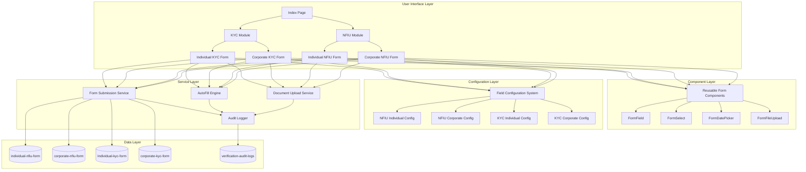

# Technical Design Document: KYC-NFIU Separation

## Overview

This design document specifies the technical architecture for separating the existing combined KYC forms into distinct NFIU (Nigerian Financial Intelligence Unit) and KYC (Know Your Customer) modules. This is a REFACTORING project that preserves all existing functionality while modernizing the component architecture and providing clearer separation of concerns.

### Design Goals

1. **Separation of Concerns**: Create distinct NFIU and KYC modules with appropriate field configurations
2. **Code Reusability**: Reduce code duplication by 30% through modern reusable components
3. **Backward Compatibility**: Preserve all existing functionality including auth flow, autofill, document uploads, and audit logging
4. **Data Integrity**: Ensure existing data remains accessible with proper migration strategy
5. **User Experience**: Provide clear navigation and help text to guide users to the appropriate form type

### Key Principles

- **Refactoring, Not Rewriting**: Leverage existing infrastructure (auditLogger.cjs, AutoFill_Engine, CAC uploads)
- **Modern React Patterns**: Use 2024/2025 best practices with reusable components
- **Configuration-Driven**: Use field configuration objects to control form behavior
- **Comprehensive Audit Trail**: Extend existing audit logging for all form interactions


## Architecture

### High-Level Architecture



### Component Architecture

The system follows a layered architecture with clear separation between presentation, configuration, services, and data:

1. **Presentation Layer**: React components for forms, navigation, and dashboards
2. **Configuration Layer**: Field configuration objects that define form behavior
3. **Service Layer**: Business logic for submission, autofill, uploads, and audit logging
4. **Data Layer**: Firestore collections for form data and audit logs


## Components and Interfaces

### 1. Reusable Form Components

Modern, reusable form components following 2024/2025 React best practices:

#### FormField Component

```typescript
interface FormFieldProps {
  name: string;
  label: string;
  required?: boolean;
  type?: 'text' | 'email' | 'tel' | 'number';
  maxLength?: number;
  placeholder?: string;
  tooltip?: string;
  disabled?: boolean;
}

// Usage with React Hook Form context
const FormField: React.FC<FormFieldProps> = ({ name, label, required, ...props }) => {
  const { register, formState: { errors }, clearErrors } = useFormContext();
  // Implementation with validation, error display, and accessibility
};
```

#### FormSelect Component

```typescript
interface FormSelectProps {
  name: string;
  label: string;
  required?: boolean;
  options: Array<{ value: string; label: string }>;
  placeholder?: string;
  tooltip?: string;
  disabled?: boolean;
}

const FormSelect: React.FC<FormSelectProps> = ({ name, label, options, ...props }) => {
  const { setValue, watch, formState: { errors } } = useFormContext();
  // Implementation with shadcn/ui Select component
};
```

#### FormDatePicker Component

```typescript
interface FormDatePickerProps {
  name: string;
  label: string;
  required?: boolean;
  minDate?: Date;
  maxDate?: Date;
  tooltip?: string;
  disabled?: boolean;
}

const FormDatePicker: React.FC<FormDatePickerProps> = ({ name, label, ...props }) => {
  // Implementation with date-fns and shadcn/ui Calendar
};
```

#### FormFileUpload Component

```typescript
interface FormFileUploadProps {
  name: string;
  label: string;
  required?: boolean;
  accept: string;
  maxSize: number; // in MB
  onFileSelect: (file: File) => void;
  onFileRemove: () => void;
  currentFile?: File;
  tooltip?: string;
}

const FormFileUpload: React.FC<FormFileUploadProps> = ({ name, label, ...props }) => {
  // Implementation with existing FileUpload component
};
```

### 2. Field Configuration System

Configuration objects define which fields appear in each form type and their validation rules:

```typescript
interface FieldConfig {
  name: string;
  label: string;
  type: 'text' | 'email' | 'tel' | 'select' | 'date' | 'textarea' | 'file';
  required: boolean;
  validation?: yup.Schema;
  options?: Array<{ value: string; label: string }>;
  tooltip?: string;
  conditional?: {
    field: string;
    value: any;
  };
}

interface FormConfig {
  formType: 'nfiu-individual' | 'nfiu-corporate' | 'kyc-individual' | 'kyc-corporate';
  sections: Array<{
    id: string;
    title: string;
    fields: FieldConfig[];
  }>;
}
```

#### NFIU Individual Configuration

```typescript
export const nfiuIndividualConfig: FormConfig = {
  formType: 'nfiu-individual',
  sections: [
    {
      id: 'personal',
      title: 'Personal Information',
      fields: [
        { name: 'firstName', label: 'First Name', type: 'text', required: true },
        { name: 'middleName', label: 'Middle Name', type: 'text', required: false },
        { name: 'lastName', label: 'Last Name', type: 'text', required: true },
        { name: 'dateOfBirth', label: 'Date of Birth', type: 'date', required: true },
        { name: 'placeOfBirth', label: 'Place of Birth', type: 'text', required: true },
        { name: 'nationality', label: 'Nationality', type: 'select', required: true },
        { name: 'occupation', label: 'Occupation', type: 'text', required: true },
        { name: 'NIN', label: 'NIN', type: 'text', required: true, maxLength: 11 },
        { name: 'BVN', label: 'BVN', type: 'text', required: true, maxLength: 11, 
          tooltip: 'Bank Verification Number - Required for NFIU compliance' },
        { name: 'taxIDNo', label: 'Tax ID', type: 'text', required: true,
          tooltip: 'Tax Identification Number - Required for NFIU reporting' },
        { name: 'identificationType', label: 'ID Type', type: 'select', required: true },
        { name: 'idNumber', label: 'ID Number', type: 'text', required: true },
        { name: 'issuingBody', label: 'Issuing Body', type: 'text', required: true },
        { name: 'issuedDate', label: 'Issue Date', type: 'date', required: true },
        { name: 'expiryDate', label: 'Expiry Date', type: 'date', required: false },
        { name: 'emailAddress', label: 'Email', type: 'email', required: false },
        { name: 'GSMno', label: 'Phone', type: 'tel', required: false },
        { name: 'sourceOfIncome', label: 'Source of Income', type: 'select', required: true }
      ]
    },
    {
      id: 'documents',
      title: 'Document Upload',
      fields: [
        { name: 'identification', label: 'ID Document', type: 'file', required: true,
          accept: '.pdf,.jpg,.jpeg,.png', maxSize: 3 }
      ]
    }
  ]
};
```

#### KYC Individual Configuration

```typescript
export const kycIndividualConfig: FormConfig = {
  formType: 'kyc-individual',
  sections: [
    {
      id: 'personal',
      title: 'Personal Information',
      fields: [
        { name: 'firstName', label: 'First Name', type: 'text', required: true },
        { name: 'middleName', label: 'Middle Name', type: 'text', required: false },
        { name: 'lastName', label: 'Last Name', type: 'text', required: true },
        { name: 'dateOfBirth', label: 'Date of Birth', type: 'date', required: true },
        { name: 'placeOfBirth', label: 'Place of Birth', type: 'text', required: true },
        { name: 'nationality', label: 'Nationality', type: 'select', required: true },
        { name: 'occupation', label: 'Occupation', type: 'text', required: true },
        { name: 'NIN', label: 'NIN', type: 'text', required: true, maxLength: 11 },
        // NOTE: BVN field NOT included in KYC
        { name: 'taxIDNo', label: 'Tax ID', type: 'text', required: false,
          tooltip: 'Tax Identification Number - Optional for KYC' },
        { name: 'identificationType', label: 'ID Type', type: 'select', required: true },
        { name: 'idNumber', label: 'ID Number', type: 'text', required: true },
        { name: 'issuingBody', label: 'Issuing Body', type: 'text', required: true },
        { name: 'issuedDate', label: 'Issue Date', type: 'date', required: true },
        { name: 'expiryDate', label: 'Expiry Date', type: 'date', required: false },
        { name: 'emailAddress', label: 'Email', type: 'email', required: false },
        { name: 'GSMno', label: 'Phone', type: 'tel', required: false },
        { name: 'sourceOfIncome', label: 'Source of Income', type: 'select', required: true }
      ]
    },
    {
      id: 'documents',
      title: 'Document Upload',
      fields: [
        { name: 'identification', label: 'ID Document', type: 'file', required: true,
          accept: '.pdf,.jpg,.jpeg,.png', maxSize: 3 }
      ]
    }
    // NOTE: Account Details section NOT included in KYC
  ]
};
```

#### NFIU Corporate Configuration

```typescript
export const nfiuCorporateConfig: FormConfig = {
  formType: 'nfiu-corporate',
  sections: [
    {
      id: 'company',
      title: 'Company Information',
      fields: [
        { name: 'insured', label: 'Insured', type: 'text', required: true },
        { name: 'officeAddress', label: 'Office Address', type: 'textarea', required: true },
        { name: 'ownershipOfCompany', label: 'Ownership of Company-Nigerian', type: 'select', required: false },
        { name: 'website', label: 'Website', type: 'text', required: false },
        { name: 'incorporationNumber', label: 'Incorporation/Registration Number', type: 'text', required: true },
        { name: 'incorporationState', label: 'Incorporation State', type: 'select', required: true },
        { name: 'dateOfIncorporationRegistration', label: 'Date of Incorporation/Registration', type: 'date', required: true },
        // NOTE: Name of Contact Person field NOT included in NFIU (NOT APPLICABLE)
        { name: 'contactPersonNo', label: "Company's Contact Number", type: 'tel', required: true },
        { name: 'taxIDNo', label: 'Tax Identification Number', type: 'text', required: true,
          tooltip: 'Tax Identification Number - Required for NFIU reporting' },
        { name: 'emailAddress', label: 'Email Address of the Company', type: 'email', required: true,
          tooltip: 'Company email address - Required for NFIU' },
        { name: 'natureOfBusiness', label: 'Business Type/Occupation', type: 'select', required: true },
        // NOTE: Estimated Turnover field NOT included in NFIU (NOT APPLICABLE)
        { name: 'premiumPaymentSource', label: 'Premium Payment Source', type: 'select', required: true,
          tooltip: 'Premium Payment Source - Required for NFIU' },
        { name: 'premiumPaymentSourceOther', label: 'Other Source', type: 'text', required: false,
          conditional: { field: 'premiumPaymentSource', value: 'Other' } }
        // NOTE: Office Location field NOT included (removed from both NFIU and KYC)
        // NOTE: Name of Branch Office field NOT included (removed from both NFIU and KYC)
      ]
    },
    {
      id: 'directors',
      title: 'Directors/Signatories',
      fields: [
        // Directors array with NFIU-specific fields
        { name: 'directors', type: 'array', required: true, fields: [
          { name: 'firstName', label: 'First Name', type: 'text', required: true },
          { name: 'middleName', label: 'Middle Name', type: 'text', required: false },
          { name: 'lastName', label: 'Last Name', type: 'text', required: true },
          { name: 'dob', label: 'Date of Birth', type: 'date', required: true },
          { name: 'placeOfBirth', label: 'Place of Birth', type: 'text', required: true },
          { name: 'nationality', label: 'Nationality', type: 'select', required: true },
          { name: 'occupation', label: 'Occupation', type: 'text', required: true },
          { name: 'email', label: 'Email Address', type: 'email', required: false },
          { name: 'phoneNumber', label: 'Phone Number', type: 'tel', required: false },
          { name: 'BVNNumber', label: 'Bank Verification Number (BVN)', type: 'text', required: true, maxLength: 11,
            tooltip: 'BVN is mandatory for NFIU directors' },
          { name: 'NINNumber', label: 'National Identification Number (NIN)', type: 'text', required: true, maxLength: 11 },
          { name: 'residentialAddress', label: 'Residential Address', type: 'textarea', required: true,
            tooltip: 'Residential Address is mandatory for NFIU directors' },
          { name: 'taxIDNumber', label: 'Tax ID Number', type: 'text', required: false,
            tooltip: 'Tax ID is optional for directors' },
          { name: 'idType', label: 'ID Type', type: 'select', required: true },
          { name: 'idNumber', label: 'Identification Number', type: 'text', required: true },
          { name: 'issuingBody', label: 'Issuing Body/Country', type: 'text', required: true },
          { name: 'issuedDate', label: 'Date of Issue', type: 'date', required: true },
          { name: 'expiryDate', label: 'Date of Expiry', type: 'date', required: false },
          { name: 'sourceOfIncome', label: 'Source of Income', type: 'select', required: true }
        ]}
      ]
    },
    {
      id: 'accountDetails',
      title: 'Account Details',
      fields: [
        // Naira Account - MANDATORY for NFIU
        { name: 'localBankName', label: 'Bank Name (Naira)', type: 'select', required: true },
        { name: 'localAccountNumber', label: 'Account Number (Naira)', type: 'text', required: true },
        { name: 'localBankBranch', label: 'Bank Branch (Naira)', type: 'text', required: true },
        { name: 'localAccountOpeningDate', label: 'Account Opening Date (Naira)', type: 'date', required: true },
        
        // Domiciliary Account - OPTIONAL for NFIU
        { name: 'foreignBankName', label: 'Bank Name (Domiciliary)', type: 'select', required: false },
        { name: 'foreignAccountNumber', label: 'Account Number (Domiciliary)', type: 'text', required: false },
        { name: 'foreignBankBranch', label: 'Bank Branch (Domiciliary)', type: 'text', required: false },
        { name: 'foreignAccountOpeningDate', label: 'Account Opening Date (Domiciliary)', type: 'date', required: false }
      ]
    },
    {
      id: 'documents',
      title: 'Document Upload',
      fields: [
        { name: 'verificationDocUrl', label: 'Verification Document', type: 'file', required: true,
          accept: '.pdf,.jpg,.jpeg,.png', maxSize: 3 },
        { name: 'companyNameVerificationDoc', label: 'Company Name Verification', type: 'file', required: true,
          accept: '.pdf,.jpg,.jpeg,.png', maxSize: 3 }
      ]
    }
  ]
};
```

#### KYC Corporate Configuration

```typescript
export const kycCorporateConfig: FormConfig = {
  formType: 'kyc-corporate',
  sections: [
    {
      id: 'company',
      title: 'Company Information',
      fields: [
        { name: 'insured', label: 'Insured', type: 'text', required: true },
        { name: 'officeAddress', label: 'Office Address', type: 'textarea', required: true },
        { name: 'ownershipOfCompany', label: 'Ownership of Company-Nigerian', type: 'select', required: false },
        { name: 'website', label: 'Website', type: 'text', required: false },
        { name: 'incorporationNumber', label: 'Incorporation/Registration Number', type: 'text', required: true },
        { name: 'incorporationState', label: 'Incorporation State', type: 'select', required: true },
        { name: 'dateOfIncorporationRegistration', label: 'Date of Incorporation/Registration', type: 'date', required: true },
        { name: 'contactPerson', label: 'Name of Contact Person', type: 'text', required: true,
          tooltip: 'Contact Person Name is required for KYC' },
        { name: 'contactPersonNo', label: "Company's Contact Number", type: 'tel', required: true },
        { name: 'taxIDNo', label: 'Tax Identification Number', type: 'text', required: false,
          tooltip: 'Tax Identification Number - Optional for KYC' },
        { name: 'contactPersonEmail', label: "Contact Person's Email Address", type: 'email', required: true,
          tooltip: 'Contact person email - Required for KYC' },
        { name: 'natureOfBusiness', label: 'Business Type/Occupation', type: 'select', required: true },
        { name: 'estimatedTurnover', label: 'Estimated Turnover', type: 'select', required: true,
          tooltip: 'Estimated Turnover is required for KYC' }
        // NOTE: Premium Payment Source field NOT included in KYC (NOT APPLICABLE)
        // NOTE: Office Location field NOT included (removed from both NFIU and KYC)
        // NOTE: Name of Branch Office field NOT included (removed from both NFIU and KYC)
      ]
    },
    {
      id: 'directors',
      title: 'Directors/Signatories',
      fields: [
        // Directors array with KYC-specific fields
        { name: 'directors', type: 'array', required: true, fields: [
          { name: 'firstName', label: 'First Name', type: 'text', required: true },
          { name: 'middleName', label: 'Middle Name', type: 'text', required: false },
          { name: 'lastName', label: 'Last Name', type: 'text', required: true },
          { name: 'dob', label: 'Date of Birth', type: 'date', required: true },
          { name: 'placeOfBirth', label: 'Place of Birth', type: 'text', required: true },
          { name: 'nationality', label: 'Nationality', type: 'select', required: true },
          { name: 'occupation', label: 'Occupation', type: 'text', required: true },
          { name: 'email', label: 'Email Address', type: 'email', required: false },
          { name: 'phoneNumber', label: 'Phone Number', type: 'tel', required: false },
          // NOTE: BVN field NOT included in KYC directors (NOT APPLICABLE)
          { name: 'NINNumber', label: 'National Identification Number (NIN)', type: 'text', required: true, maxLength: 11 },
          // NOTE: Residential Address field NOT included in KYC directors (NOT APPLICABLE - company address is sufficient)
          // NOTE: Tax ID Number field NOT included in KYC directors (NOT APPLICABLE)
          { name: 'idType', label: 'ID Type', type: 'select', required: true },
          { name: 'idNumber', label: 'Identification Number', type: 'text', required: true },
          { name: 'issuingBody', label: 'Issuing Body/Country', type: 'text', required: true },
          { name: 'issuedDate', label: 'Date of Issue', type: 'date', required: true },
          { name: 'expiryDate', label: 'Date of Expiry', type: 'date', required: false },
          { name: 'sourceOfIncome', label: 'Source of Income', type: 'select', required: true }
        ]}
      ]
    },
    // NOTE: Account Details section NOT included in KYC (NOT APPLICABLE)
    {
      id: 'documents',
      title: 'Document Upload',
      fields: [
        { name: 'verificationDocUrl', label: 'Verification Document', type: 'file', required: true,
          accept: '.pdf,.jpg,.jpeg,.png', maxSize: 3 },
        { name: 'companyNameVerificationDoc', label: 'Company Name Verification', type: 'file', required: true,
          accept: '.pdf,.jpg,.jpeg,.png', maxSize: 3 }
      ]
    }
  ]
};
```


### 3. Page Components

#### IndividualNFIU.tsx

```typescript
import React from 'react';
import { useForm, FormProvider } from 'react-hook-form';
import { yupResolver } from '@hookform/resolvers/yup';
import { nfiuIndividualConfig } from '@/config/formConfigs';
import { generateValidationSchema } from '@/utils/formValidation';
import { FormRenderer } from '@/components/forms/FormRenderer';
import { useEnhancedFormSubmit } from '@/hooks/useEnhancedFormSubmit';
import { useFormDraft } from '@/hooks/useFormDraft';
import { useAutoFill } from '@/hooks/useAutoFill';

const IndividualNFIU: React.FC = () => {
  const validationSchema = generateValidationSchema(nfiuIndividualConfig);
  
  const formMethods = useForm({
    resolver: yupResolver(validationSchema),
    defaultValues: getDefaultValues(nfiuIndividualConfig),
    mode: 'onChange'
  });

  const { saveDraft, clearDraft } = useFormDraft('individualNFIU', formMethods);
  
  const {
    handleSubmit: handleEnhancedSubmit,
    showSummary,
    setShowSummary,
    showLoading,
    loadingMessage,
    showSuccess,
    confirmSubmit,
    closeSuccess,
    formData: submissionData,
    isSubmitting
  } = useEnhancedFormSubmit({
    formType: 'Individual NFIU',
    collectionName: 'individual-nfiu-form',
    onSuccess: () => clearDraft()
  });

  // Initialize autofill for NIN field
  useAutoFill({
    formElement: formRef.current,
    formType: 'nfiu-individual',
    reactHookFormSetValue: formMethods.setValue
  });

  const onSubmit = async (data: any) => {
    // Handle file uploads
    const fileUrls = await uploadFormFiles(data);
    
    const finalData = {
      ...data,
      ...fileUrls,
      formType: 'nfiu',
      formVariant: 'individual',
      status: 'processing',
      submittedAt: new Date()
    };

    await handleEnhancedSubmit(finalData);
  };

  return (
    <FormProvider {...formMethods}>
      <Card>
        <CardHeader>
          <CardTitle>NFIU Individual Form</CardTitle>
          <CardDescription>
            NFIU forms are for regulatory reporting to the Nigerian Financial Intelligence Unit. 
            Complete these forms for compliance purposes.
          </CardDescription>
        </CardHeader>
        <CardContent>
          <FormRenderer
            config={nfiuIndividualConfig}
            onSubmit={formMethods.handleSubmit(onSubmit)}
          />
        </CardContent>
      </Card>
      
      {/* Modals for loading, summary, success */}
      <FormLoadingModal isOpen={showLoading} message={loadingMessage} />
      <FormSummaryDialog
        open={showSummary}
        onOpenChange={setShowSummary}
        formData={submissionData}
        formType="Individual NFIU"
        onConfirm={confirmSubmit}
        isSubmitting={isSubmitting}
      />
      <SuccessModal isOpen={showSuccess} onClose={closeSuccess} />
    </FormProvider>
  );
};
```

#### IndividualKYC.tsx (Refactored)

```typescript
// Similar structure to IndividualNFIU but using kycIndividualConfig
const IndividualKYC: React.FC = () => {
  const validationSchema = generateValidationSchema(kycIndividualConfig);
  
  const formMethods = useForm({
    resolver: yupResolver(validationSchema),
    defaultValues: getDefaultValues(kycIndividualConfig),
    mode: 'onChange'
  });

  // ... similar setup with KYC-specific configuration
  
  const {
    handleSubmit: handleEnhancedSubmit,
    // ... other hooks
  } = useEnhancedFormSubmit({
    formType: 'Individual KYC',
    collectionName: 'Individual-kyc-form', // Existing collection
    onSuccess: () => clearDraft()
  });

  // Initialize autofill for NIN field
  useAutoFill({
    formElement: formRef.current,
    formType: 'kyc-individual',
    reactHookFormSetValue: formMethods.setValue
  });

  const onSubmit = async (data: any) => {
    const fileUrls = await uploadFormFiles(data);
    
    const finalData = {
      ...data,
      ...fileUrls,
      formType: 'kyc',
      formVariant: 'individual',
      status: 'processing',
      submittedAt: new Date()
    };

    await handleEnhancedSubmit(finalData);
  };

  return (
    <FormProvider {...formMethods}>
      <Card>
        <CardHeader>
          <CardTitle>KYC Individual Form</CardTitle>
          <CardDescription>
            KYC forms are for customer onboarding and verification. 
            Complete these forms to establish a business relationship.
          </CardDescription>
        </CardHeader>
        <CardContent>
          <FormRenderer
            config={kycIndividualConfig}
            onSubmit={formMethods.handleSubmit(onSubmit)}
          />
        </CardContent>
      </Card>
      
      {/* Modals */}
    </FormProvider>
  );
};
```

#### CorporateNFIU.tsx

```typescript
import React from 'react';
import { useForm, FormProvider, useFieldArray } from 'react-hook-form';
import { yupResolver } from '@hookform/resolvers/yup';
import { nfiuCorporateConfig } from '@/config/formConfigs';
import { generateValidationSchema } from '@/utils/formValidation';
import { FormRenderer } from '@/components/forms/FormRenderer';
import { useEnhancedFormSubmit } from '@/hooks/useEnhancedFormSubmit';
import { useFormDraft } from '@/hooks/useFormDraft';
import { useAutoFill } from '@/hooks/useAutoFill';

const CorporateNFIU: React.FC = () => {
  const validationSchema = generateValidationSchema(nfiuCorporateConfig);
  
  const formMethods = useForm({
    resolver: yupResolver(validationSchema),
    defaultValues: getDefaultValues(nfiuCorporateConfig),
    mode: 'onChange'
  });

  const { fields: directors, append, remove } = useFieldArray({
    control: formMethods.control,
    name: 'directors'
  });

  const { saveDraft, clearDraft } = useFormDraft('corporateNFIU', formMethods);
  
  const {
    handleSubmit: handleEnhancedSubmit,
    showSummary,
    setShowSummary,
    showLoading,
    loadingMessage,
    showSuccess,
    confirmSubmit,
    closeSuccess,
    formData: submissionData,
    isSubmitting
  } = useEnhancedFormSubmit({
    formType: 'Corporate NFIU',
    collectionName: 'corporate-nfiu-form',
    onSuccess: () => clearDraft()
  });

  // Initialize autofill for CAC field
  useAutoFill({
    formElement: formRef.current,
    formType: 'nfiu-corporate',
    reactHookFormSetValue: formMethods.setValue
  });

  const onSubmit = async (data: any) => {
    // Handle file uploads
    const fileUrls = await uploadFormFiles(data);
    
    const finalData = {
      ...data,
      ...fileUrls,
      formType: 'nfiu',
      formVariant: 'corporate',
      status: 'processing',
      submittedAt: new Date()
    };

    await handleEnhancedSubmit(finalData);
  };

  return (
    <FormProvider {...formMethods}>
      <Card>
        <CardHeader>
          <CardTitle>NFIU Corporate Form</CardTitle>
          <CardDescription>
            NFIU forms are for regulatory reporting to the Nigerian Financial Intelligence Unit. 
            Complete these forms for compliance purposes.
          </CardDescription>
        </CardHeader>
        <CardContent>
          <FormRenderer
            config={nfiuCorporateConfig}
            onSubmit={formMethods.handleSubmit(onSubmit)}
          />
          
          {/* Directors Section with NFIU-specific fields */}
          <div className="space-y-4">
            <h3>Directors/Signatories</h3>
            {directors.map((director, index) => (
              <Card key={director.id}>
                <CardContent>
                  {/* Director fields including BVN, Residential Address, Tax ID */}
                  <FormField name={`directors.${index}.firstName`} label="First Name" required />
                  <FormField name={`directors.${index}.lastName`} label="Last Name" required />
                  <FormField name={`directors.${index}.BVNNumber`} label="BVN" required 
                    tooltip="BVN is mandatory for NFIU directors" />
                  <FormField name={`directors.${index}.NINNumber`} label="NIN" required />
                  <FormTextarea name={`directors.${index}.residentialAddress`} 
                    label="Residential Address" required 
                    tooltip="Residential Address is mandatory for NFIU directors" />
                  <FormField name={`directors.${index}.taxIDNumber`} label="Tax ID Number" 
                    tooltip="Tax ID is optional for directors" />
                  {/* Other director fields */}
                </CardContent>
              </Card>
            ))}
          </div>

          {/* Account Details Section - MANDATORY for NFIU */}
          <Card>
            <CardHeader>
              <CardTitle>Account Details</CardTitle>
            </CardHeader>
            <CardContent>
              <h4>Naira Account (Mandatory)</h4>
              <FormSelect name="localBankName" label="Bank Name" required />
              <FormField name="localAccountNumber" label="Account Number" required />
              <FormField name="localBankBranch" label="Bank Branch" required />
              <FormDatePicker name="localAccountOpeningDate" label="Account Opening Date" required />
              
              <h4>Domiciliary Account (Optional)</h4>
              <FormSelect name="foreignBankName" label="Bank Name" />
              <FormField name="foreignAccountNumber" label="Account Number" />
              <FormField name="foreignBankBranch" label="Bank Branch" />
              <FormDatePicker name="foreignAccountOpeningDate" label="Account Opening Date" />
            </CardContent>
          </Card>
        </CardContent>
      </Card>
      
      {/* Modals */}
      <FormLoadingModal isOpen={showLoading} message={loadingMessage} />
      <FormSummaryDialog
        open={showSummary}
        onOpenChange={setShowSummary}
        formData={submissionData}
        formType="Corporate NFIU"
        onConfirm={confirmSubmit}
        isSubmitting={isSubmitting}
      />
      <SuccessModal isOpen={showSuccess} onClose={closeSuccess} />
    </FormProvider>
  );
};
```

#### CorporateKYC.tsx (Refactored)

```typescript
import React from 'react';
import { useForm, FormProvider, useFieldArray } from 'react-hook-form';
import { yupResolver } from '@hookform/resolvers/yup';
import { kycCorporateConfig } from '@/config/formConfigs';
import { generateValidationSchema } from '@/utils/formValidation';
import { FormRenderer } from '@/components/forms/FormRenderer';
import { useEnhancedFormSubmit } from '@/hooks/useEnhancedFormSubmit';
import { useFormDraft } from '@/hooks/useFormDraft';
import { useAutoFill } from '@/hooks/useAutoFill';

const CorporateKYC: React.FC = () => {
  const validationSchema = generateValidationSchema(kycCorporateConfig);
  
  const formMethods = useForm({
    resolver: yupResolver(validationSchema),
    defaultValues: getDefaultValues(kycCorporateConfig),
    mode: 'onChange'
  });

  const { fields: directors, append, remove } = useFieldArray({
    control: formMethods.control,
    name: 'directors'
  });

  const { saveDraft, clearDraft } = useFormDraft('corporateKYC', formMethods);
  
  const {
    handleSubmit: handleEnhancedSubmit,
    showSummary,
    setShowSummary,
    showLoading,
    loadingMessage,
    showSuccess,
    confirmSubmit,
    closeSuccess,
    formData: submissionData,
    isSubmitting
  } = useEnhancedFormSubmit({
    formType: 'Corporate KYC',
    collectionName: 'corporate-kyc-form', // Existing collection
    onSuccess: () => clearDraft()
  });

  // Initialize autofill for CAC field
  useAutoFill({
    formElement: formRef.current,
    formType: 'kyc-corporate',
    reactHookFormSetValue: formMethods.setValue
  });

  const onSubmit = async (data: any) => {
    // Handle file uploads
    const fileUrls = await uploadFormFiles(data);
    
    const finalData = {
      ...data,
      ...fileUrls,
      formType: 'kyc',
      formVariant: 'corporate',
      status: 'processing',
      submittedAt: new Date()
    };

    await handleEnhancedSubmit(finalData);
  };

  return (
    <FormProvider {...formMethods}>
      <Card>
        <CardHeader>
          <CardTitle>KYC Corporate Form</CardTitle>
          <CardDescription>
            KYC forms are for customer onboarding and verification. 
            Complete these forms to establish a business relationship.
          </CardDescription>
        </CardHeader>
        <CardContent>
          <FormRenderer
            config={kycCorporateConfig}
            onSubmit={formMethods.handleSubmit(onSubmit)}
          />
          
          {/* Company Information with KYC-specific fields */}
          <Card>
            <CardHeader>
              <CardTitle>Company Information</CardTitle>
            </CardHeader>
            <CardContent>
              <FormField name="contactPerson" label="Name of Contact Person" required 
                tooltip="Contact Person Name is required for KYC" />
              <FormField name="contactPersonEmail" label="Contact Person's Email Address" required />
              <FormSelect name="estimatedTurnover" label="Estimated Turnover" required 
                tooltip="Estimated Turnover is required for KYC" />
              {/* Other company fields */}
            </CardContent>
          </Card>

          {/* Directors Section with KYC-specific fields (no BVN, no Residential Address, no Tax ID) */}
          <div className="space-y-4">
            <h3>Directors/Signatories</h3>
            {directors.map((director, index) => (
              <Card key={director.id}>
                <CardContent>
                  {/* Director fields WITHOUT BVN, Residential Address, Tax ID */}
                  <FormField name={`directors.${index}.firstName`} label="First Name" required />
                  <FormField name={`directors.${index}.lastName`} label="Last Name" required />
                  <FormField name={`directors.${index}.NINNumber`} label="NIN" required />
                  {/* NOTE: BVN field NOT included */}
                  {/* NOTE: Residential Address field NOT included */}
                  {/* NOTE: Tax ID Number field NOT included */}
                  {/* Other director fields */}
                </CardContent>
              </Card>
            ))}
          </div>

          {/* NOTE: Account Details section NOT included in KYC */}
        </CardContent>
      </Card>
      
      {/* Modals */}
      <FormLoadingModal isOpen={showLoading} message={loadingMessage} />
      <FormSummaryDialog
        open={showSummary}
        onOpenChange={setShowSummary}
        formData={submissionData}
        formType="Corporate KYC"
        onConfirm={confirmSubmit}
        isSubmitting={isSubmitting}
      />
      <SuccessModal isOpen={showSuccess} onClose={closeSuccess} />
    </FormProvider>
  );
};
```

### 4. FormRenderer Component

A generic component that renders forms based on configuration:

```typescript
interface FormRendererProps {
  config: FormConfig;
  onSubmit: () => void;
}

const FormRenderer: React.FC<FormRendererProps> = ({ config, onSubmit }) => {
  const steps = config.sections.map(section => ({
    id: section.id,
    title: section.title,
    component: (
      <div className="space-y-4">
        {section.fields.map(field => renderField(field))}
      </div>
    )
  }));

  const renderField = (field: FieldConfig) => {
    switch (field.type) {
      case 'text':
      case 'email':
      case 'tel':
        return <FormField key={field.name} {...field} />;
      case 'select':
        return <FormSelect key={field.name} {...field} />;
      case 'date':
        return <FormDatePicker key={field.name} {...field} />;
      case 'textarea':
        return <FormTextarea key={field.name} {...field} />;
      case 'file':
        return <FormFileUpload key={field.name} {...field} />;
      default:
        return null;
    }
  };

  return (
    <MultiStepForm
      steps={steps}
      onSubmit={onSubmit}
      submitButtonText={`Submit ${config.formType} Form`}
    />
  );
};
```


### 5. Validation Specifications

The validation system uses the field configurations to generate Yup validation schemas dynamically. Here are the key validation rules for each form type:

#### NFIU Individual Validation Rules

```typescript
// Required fields for NFIU Individual
const nfiuIndividualRequiredFields = [
  'firstName', 'lastName', 'dateOfBirth', 'placeOfBirth', 'nationality',
  'occupation', 'NIN', 'BVN', 'taxIDNo', 'identificationType', 'idNumber',
  'issuingBody', 'issuedDate', 'sourceOfIncome'
];

// BVN is MANDATORY for NFIU
// Tax ID is MANDATORY for NFIU
```

#### KYC Individual Validation Rules

```typescript
// Required fields for KYC Individual
const kycIndividualRequiredFields = [
  'firstName', 'lastName', 'dateOfBirth', 'placeOfBirth', 'nationality',
  'occupation', 'NIN', 'identificationType', 'idNumber',
  'issuingBody', 'issuedDate', 'sourceOfIncome'
];

// BVN is NOT APPLICABLE for KYC
// Tax ID is OPTIONAL for KYC
```

#### NFIU Corporate Validation Rules

```typescript
// Required Company Information fields for NFIU Corporate
const nfiuCorporateCompanyRequiredFields = [
  'insured', 'officeAddress', 'incorporationNumber', 'incorporationState',
  'dateOfIncorporationRegistration', 'contactPersonNo', 'taxIDNo',
  'emailAddress', 'natureOfBusiness', 'premiumPaymentSource'
];

// Name of Contact Person is NOT APPLICABLE for NFIU
// Estimated Turnover is NOT APPLICABLE for NFIU
// Premium Payment Source is MANDATORY for NFIU
// Email Address label: "Email Address of the Company" (MANDATORY)

// Required Director fields for NFIU Corporate
const nfiuCorporateDirectorRequiredFields = [
  'firstName', 'lastName', 'dob', 'placeOfBirth', 'nationality',
  'occupation', 'BVNNumber', 'NINNumber', 'residentialAddress',
  'idType', 'idNumber', 'issuingBody', 'issuedDate', 'sourceOfIncome'
];

// BVN is MANDATORY for NFIU directors
// Residential Address is MANDATORY for NFIU directors
// Tax ID Number is OPTIONAL for NFIU directors

// Required Account Details fields for NFIU Corporate
const nfiuCorporateAccountRequiredFields = [
  'localBankName', 'localAccountNumber', 'localBankBranch', 'localAccountOpeningDate'
];

// Naira Account is MANDATORY for NFIU
// Domiciliary Account is OPTIONAL for NFIU
```

#### KYC Corporate Validation Rules

```typescript
// Required Company Information fields for KYC Corporate
const kycCorporateCompanyRequiredFields = [
  'insured', 'officeAddress', 'incorporationNumber', 'incorporationState',
  'dateOfIncorporationRegistration', 'contactPerson', 'contactPersonNo',
  'contactPersonEmail', 'natureOfBusiness', 'estimatedTurnover'
];

// Name of Contact Person is MANDATORY for KYC
// Estimated Turnover is MANDATORY for KYC
// Premium Payment Source is NOT APPLICABLE for KYC
// Tax ID is OPTIONAL for KYC
// Email Address label: "Contact Person's Email Address" (MANDATORY)

// Required Director fields for KYC Corporate
const kycCorporateDirectorRequiredFields = [
  'firstName', 'lastName', 'dob', 'placeOfBirth', 'nationality',
  'occupation', 'NINNumber', 'idType', 'idNumber', 'issuingBody',
  'issuedDate', 'sourceOfIncome'
];

// BVN is NOT APPLICABLE for KYC directors
// Residential Address is NOT APPLICABLE for KYC directors
// Tax ID Number is NOT APPLICABLE for KYC directors

// Account Details section is NOT APPLICABLE for KYC Corporate
```

#### Validation Schema Generator

```typescript
// src/utils/formValidation.ts
import * as yup from 'yup';
import { FormConfig, FieldConfig } from '@/config/formConfigs';

export function generateValidationSchema(config: FormConfig): yup.Schema {
  const schemaFields: Record<string, any> = {};

  config.sections.forEach(section => {
    section.fields.forEach(field => {
      schemaFields[field.name] = generateFieldValidation(field, config.formType);
    });
  });

  return yup.object().shape(schemaFields);
}

function generateFieldValidation(field: FieldConfig, formType: string): yup.Schema {
  let schema: any;

  switch (field.type) {
    case 'text':
    case 'textarea':
      schema = yup.string();
      if (field.maxLength) {
        schema = schema.max(field.maxLength, `Maximum ${field.maxLength} characters`);
      }
      break;
    
    case 'email':
      schema = yup.string().email('Invalid email address');
      break;
    
    case 'tel':
      schema = yup.string().matches(/^[0-9+\-\s()]+$/, 'Invalid phone number');
      break;
    
    case 'date':
      schema = yup.date();
      break;
    
    case 'select':
      schema = yup.string();
      break;
    
    case 'file':
      schema = yup.mixed();
      break;
    
    case 'array':
      schema = yup.array().of(
        yup.object().shape(
          field.fields?.reduce((acc, f) => {
            acc[f.name] = generateFieldValidation(f, formType);
            return acc;
          }, {} as Record<string, any>)
        )
      );
      break;
    
    default:
      schema = yup.mixed();
  }

  if (field.required) {
    schema = schema.required(`${field.label} is required`);
  }

  return schema;
}
```


### 6. Navigation Components

#### Navbar Updates

```typescript
// src/components/layout/Navbar.tsx
const Navbar: React.FC = () => {
  return (
    <nav>
      {/* Existing navigation items */}
      
      {/* KYC Menu */}
      <DropdownMenu>
        <DropdownMenuTrigger>KYC</DropdownMenuTrigger>
        <DropdownMenuContent>
          <DropdownMenuItem asChild>
            <Link to="/kyc/individual">Individual KYC</Link>
          </DropdownMenuItem>
          <DropdownMenuItem asChild>
            <Link to="/kyc/corporate">Corporate KYC</Link>
          </DropdownMenuItem>
        </DropdownMenuContent>
      </DropdownMenu>

      {/* NFIU Menu - NEW */}
      <DropdownMenu>
        <DropdownMenuTrigger>NFIU</DropdownMenuTrigger>
        <DropdownMenuContent>
          <DropdownMenuItem asChild>
            <Link to="/nfiu/individual">Individual NFIU</Link>
          </DropdownMenuItem>
          <DropdownMenuItem asChild>
            <Link to="/nfiu/corporate">Corporate NFIU</Link>
          </DropdownMenuItem>
        </DropdownMenuContent>
      </DropdownMenu>

      {/* Existing CDD and Claims menus */}
    </nav>
  );
};
```

#### Sidebar Updates

```typescript
// src/components/layout/Sidebar.tsx
const Sidebar: React.FC = () => {
  return (
    <aside>
      {/* KYC Section */}
      <SidebarSection title="KYC">
        <SidebarItem to="/kyc/individual" icon={<User />}>
          Individual KYC
        </SidebarItem>
        <SidebarItem to="/kyc/corporate" icon={<Building />}>
          Corporate KYC
        </SidebarItem>
      </SidebarSection>

      {/* NFIU Section - NEW */}
      <SidebarSection title="NFIU">
        <SidebarItem to="/nfiu/individual" icon={<User />}>
          Individual NFIU
        </SidebarItem>
        <SidebarItem to="/nfiu/corporate" icon={<Building />}>
          Corporate NFIU
        </SidebarItem>
      </SidebarSection>

      {/* Existing CDD and Claims sections */}
    </aside>
  );
};
```

#### AdminSidebar Updates

```typescript
// src/components/admin/AdminSidebar.tsx
const AdminSidebar: React.FC = () => {
  return (
    <aside>
      {/* KYC Management */}
      <SidebarSection title="KYC Management">
        <SidebarItem to="/admin/kyc/individual" icon={<FileText />}>
          Individual KYC
        </SidebarItem>
        <SidebarItem to="/admin/kyc/corporate" icon={<FileText />}>
          Corporate KYC
        </SidebarItem>
      </SidebarSection>

      {/* NFIU Management - NEW */}
      <SidebarSection title="NFIU Management">
        <SidebarItem to="/admin/nfiu/individual" icon={<FileText />}>
          Individual NFIU
        </SidebarItem>
        <SidebarItem to="/admin/nfiu/corporate" icon={<FileText />}>
          Corporate NFIU
        </SidebarItem>
      </SidebarSection>

      {/* Existing sections */}
    </aside>
  );
};
```

### 6. Routing Configuration

```typescript
// src/App.tsx
const App: React.FC = () => {
  return (
    <BrowserRouter>
      <Routes>
        {/* Existing routes */}
        
        {/* KYC Routes (existing, maintained) */}
        <Route path="/kyc" element={<KYCLanding />} />
        <Route path="/kyc/individual" element={<IndividualKYC />} />
        <Route path="/kyc/corporate" element={<CorporateKYC />} />

        {/* NFIU Routes (new) */}
        <Route path="/nfiu" element={<NFIULanding />} />
        <Route path="/nfiu/individual" element={<IndividualNFIU />} />
        <Route path="/nfiu/corporate" element={<CorporateNFIU />} />

        {/* Admin KYC Routes (existing, maintained) */}
        <Route path="/admin/kyc/individual" element={<AdminIndividualKYC />} />
        <Route path="/admin/kyc/corporate" element={<AdminCorporateKYC />} />

        {/* Admin NFIU Routes (new) */}
        <Route path="/admin/nfiu/individual" element={<AdminIndividualNFIU />} />
        <Route path="/admin/nfiu/corporate" element={<AdminCorporateNFIU />} />

        {/* Existing CDD, Claims, Dashboard routes */}
      </Routes>
    </BrowserRouter>
  );
};
```

### 7. Dashboard Components

#### AdminDashboard Updates

```typescript
// src/pages/admin/AdminDashboard.tsx
const AdminDashboard: React.FC = () => {
  const [selectedFormType, setSelectedFormType] = useState<'all' | 'kyc' | 'nfiu' | 'legacy'>('all');

  return (
    <div>
      <h1>Admin Dashboard</h1>
      
      {/* Form Type Filter */}
      <Select value={selectedFormType} onValueChange={setSelectedFormType}>
        <SelectTrigger>
          <SelectValue />
        </SelectTrigger>
        <SelectContent>
          <SelectItem value="all">All Forms</SelectItem>
          <SelectItem value="kyc">KYC Only</SelectItem>
          <SelectItem value="nfiu">NFIU Only</SelectItem>
          <SelectItem value="legacy">Legacy Only</SelectItem>
        </SelectContent>
      </Select>

      {/* KYC Submissions Section */}
      {(selectedFormType === 'all' || selectedFormType === 'kyc') && (
        <Card>
          <CardHeader>
            <CardTitle>KYC Submissions</CardTitle>
          </CardHeader>
          <CardContent>
            <Tabs defaultValue="individual">
              <TabsList>
                <TabsTrigger value="individual">Individual</TabsTrigger>
                <TabsTrigger value="corporate">Corporate</TabsTrigger>
              </TabsList>
              <TabsContent value="individual">
                <AdminIndividualKYCTable />
              </TabsContent>
              <TabsContent value="corporate">
                <AdminCorporateKYCTable />
              </TabsContent>
            </Tabs>
          </CardContent>
        </Card>
      )}

      {/* NFIU Submissions Section - NEW */}
      {(selectedFormType === 'all' || selectedFormType === 'nfiu') && (
        <Card>
          <CardHeader>
            <CardTitle>NFIU Submissions</CardTitle>
          </CardHeader>
          <CardContent>
            <Tabs defaultValue="individual">
              <TabsList>
                <TabsTrigger value="individual">Individual</TabsTrigger>
                <TabsTrigger value="corporate">Corporate</TabsTrigger>
              </TabsList>
              <TabsContent value="individual">
                <AdminIndividualNFIUTable />
              </TabsContent>
              <TabsContent value="corporate">
                <AdminCorporateNFIUTable />
              </TabsContent>
            </Tabs>
          </CardContent>
        </Card>
      )}

      {/* Legacy Submissions Section */}
      {(selectedFormType === 'all' || selectedFormType === 'legacy') && (
        <Card>
          <CardHeader>
            <CardTitle>Legacy Submissions</CardTitle>
            <CardDescription>
              Historical submissions from before KYC/NFIU separation
            </CardDescription>
          </CardHeader>
          <CardContent>
            <LegacySubmissionsTable />
          </CardContent>
        </Card>
      )}
    </div>
  );
};
```

#### UserDashboard Updates

```typescript
// src/pages/dashboard/UserDashboard.tsx
const UserDashboard: React.FC = () => {
  const { user } = useAuth();
  const { data: kycSubmissions } = useQuery(['kyc-submissions', user?.uid]);
  const { data: nfiuSubmissions } = useQuery(['nfiu-submissions', user?.uid]);

  return (
    <div>
      <h1>My Submissions</h1>

      {/* KYC Submissions */}
      <Card>
        <CardHeader>
          <CardTitle>KYC Submissions</CardTitle>
        </CardHeader>
        <CardContent>
          {kycSubmissions?.map(submission => (
            <SubmissionCard
              key={submission.id}
              submission={submission}
              formType="kyc"
            />
          ))}
        </CardContent>
      </Card>

      {/* NFIU Submissions - NEW */}
      <Card>
        <CardHeader>
          <CardTitle>NFIU Submissions</CardTitle>
        </CardHeader>
        <CardContent>
          {nfiuSubmissions?.map(submission => (
            <SubmissionCard
              key={submission.id}
              submission={submission}
              formType="nfiu"
            />
          ))}
        </CardContent>
      </Card>
    </div>
  );
};
```


## Data Models

### Firestore Collections

#### 1. individual-nfiu-form (New Collection)

```typescript
interface IndividualNFIUSubmission {
  // Metadata
  id: string;
  userId: string;
  userEmail: string;
  formType: 'nfiu';
  formVariant: 'individual';
  formVersion: string; // e.g., "1.0.0"
  status: 'draft' | 'processing' | 'approved' | 'rejected';
  submittedAt: Timestamp;
  updatedAt: Timestamp;

  // Personal Information
  firstName: string;
  middleName?: string;
  lastName: string;
  dateOfBirth: Timestamp;
  placeOfBirth: string;
  nationality: string;
  occupation: string;

  // Identity Information
  NIN: string; // Encrypted
  BVN: string; // Encrypted - REQUIRED for NFIU
  taxIDNo: string; // REQUIRED for NFIU
  identificationType: string;
  idNumber: string; // Encrypted
  issuingBody: string;
  issuedDate: Timestamp;
  expiryDate?: Timestamp;

  // Contact Information
  emailAddress?: string;
  GSMno?: string;

  // Financial Information
  sourceOfIncome: string;
  sourceOfIncomeOther?: string;

  // Document URLs
  identificationUrl: string;

  // Audit Trail
  createdBy: string;
  modifiedBy?: string;
  approvedBy?: string;
  rejectedBy?: string;
  rejectionReason?: string;
}
```

#### 2. corporate-nfiu-form (New Collection)

```typescript
interface CorporateNFIUSubmission {
  // Metadata
  id: string;
  userId: string;
  userEmail: string;
  formType: 'nfiu';
  formVariant: 'corporate';
  formVersion: string;
  status: 'draft' | 'processing' | 'approved' | 'rejected';
  submittedAt: Timestamp;
  updatedAt: Timestamp;

  // Company Information
  insured: string; // MANDATORY
  officeAddress: string; // MANDATORY
  ownershipOfCompany: string; // Present
  website: string; // Present
  incorporationNumber: string; // MANDATORY
  incorporationState: string; // MANDATORY
  dateOfIncorporationRegistration: Timestamp; // MANDATORY
  cacNumber: string; // Encrypted
  // NOTE: Name of Contact Person field NOT included in NFIU (NOT APPLICABLE)
  contactPersonNo: string; // Company's Contact Number - MANDATORY
  taxIDNo: string; // MANDATORY for NFIU
  emailAddress: string; // Email Address of the Company - MANDATORY
  natureOfBusiness: string; // MANDATORY
  // NOTE: Estimated Turnover field NOT included in NFIU (NOT APPLICABLE)
  premiumPaymentSource: string; // MANDATORY for NFIU
  premiumPaymentSourceOther?: string;
  // NOTE: Office Location field NOT included (removed from both NFIU and KYC)
  // NOTE: Name of Branch Office field NOT included (removed from both NFIU and KYC)

  // Directors/Signatories
  directors: Array<{
    firstName: string; // MANDATORY
    middleName?: string; // Optional
    lastName: string; // MANDATORY
    dob: Timestamp; // MANDATORY
    placeOfBirth: string; // MANDATORY
    nationality: string; // MANDATORY
    country: string;
    occupation: string; // MANDATORY
    email?: string; // Optional
    phoneNumber?: string; // Optional
    BVNNumber: string; // Encrypted - MANDATORY for NFIU directors
    NINNumber: string; // Encrypted - MANDATORY
    employersName?: string;
    employersPhoneNumber?: string;
    residentialAddress: string; // MANDATORY for NFIU directors
    taxIDNumber?: string; // Optional for directors
    idType: string; // MANDATORY
    idNumber: string; // Encrypted - MANDATORY
    issuingBody: string; // MANDATORY
    issuedDate: Timestamp; // MANDATORY
    expiryDate?: Timestamp; // Optional
    sourceOfIncome: string; // MANDATORY
    sourceOfIncomeOther?: string;
  }>;

  // Account Details - REQUIRED for NFIU
  // Naira Account - MANDATORY
  localBankName: string; // MANDATORY
  localAccountNumber: string; // Encrypted - MANDATORY
  localBankBranch: string; // MANDATORY
  localAccountOpeningDate: Timestamp; // MANDATORY
  
  // Domiciliary Account - OPTIONAL
  foreignBankName?: string; // Optional
  foreignAccountNumber?: string; // Encrypted - Optional
  foreignBankBranch?: string; // Optional
  foreignAccountOpeningDate?: Timestamp; // Optional

  // Document URLs
  verificationDocUrl: string;
  companyNameVerificationDoc: string;

  // Audit Trail
  createdBy: string;
  modifiedBy?: string;
  approvedBy?: string;
  rejectedBy?: string;
  rejectionReason?: string;
}
```

#### 3. Individual-kyc-form (Updated Schema)

```typescript
interface IndividualKYCSubmission {
  // Metadata
  id: string;
  userId: string;
  userEmail: string;
  formType: 'kyc' | 'legacy'; // Updated to support legacy records
  formVariant: 'individual';
  formVersion: string;
  status: 'draft' | 'processing' | 'approved' | 'rejected';
  submittedAt: Timestamp;
  updatedAt: Timestamp;

  // Personal Information
  firstName: string;
  middleName?: string;
  lastName: string;
  dateOfBirth: Timestamp;
  placeOfBirth: string;
  nationality: string;
  occupation: string;

  // Identity Information
  NIN: string; // Encrypted
  // BVN field NOT included in KYC
  taxIDNo?: string; // OPTIONAL for KYC
  identificationType: string;
  idNumber: string; // Encrypted
  issuingBody: string;
  issuedDate: Timestamp;
  expiryDate?: Timestamp;

  // Contact Information
  emailAddress?: string;
  GSMno?: string;

  // Financial Information
  sourceOfIncome: string;
  sourceOfIncomeOther?: string;

  // Document URLs
  identificationUrl: string;

  // Audit Trail
  createdBy: string;
  modifiedBy?: string;
  approvedBy?: string;
  rejectedBy?: string;
  rejectionReason?: string;
}
```

#### 4. corporate-kyc-form (Updated Schema)

```typescript
interface CorporateKYCSubmission {
  // Metadata
  id: string;
  userId: string;
  userEmail: string;
  formType: 'kyc' | 'legacy'; // Updated to support legacy records
  formVariant: 'corporate';
  formVersion: string;
  status: 'draft' | 'processing' | 'approved' | 'rejected';
  submittedAt: Timestamp;
  updatedAt: Timestamp;

  // Company Information
  insured: string; // MANDATORY
  officeAddress: string; // MANDATORY
  ownershipOfCompany: string; // Present
  website: string; // Present
  incorporationNumber: string; // MANDATORY
  incorporationState: string; // MANDATORY
  dateOfIncorporationRegistration: Timestamp; // MANDATORY
  cacNumber: string; // Encrypted
  // NOTE: BVN field NOT included in KYC
  NINNumber: string; // Encrypted
  contactPerson: string; // Name of Contact Person - MANDATORY for KYC
  contactPersonNo: string; // Company's Contact Number - MANDATORY
  taxIDNo?: string; // OPTIONAL for KYC
  contactPersonEmail: string; // Contact Person's Email Address - MANDATORY for KYC
  natureOfBusiness: string; // MANDATORY
  estimatedTurnover: string; // MANDATORY for KYC
  // NOTE: Premium Payment Source field NOT included in KYC (NOT APPLICABLE)
  // NOTE: Office Location field NOT included (removed from both NFIU and KYC)
  // NOTE: Name of Branch Office field NOT included (removed from both NFIU and KYC)

  // Directors/Signatories
  directors: Array<{
    firstName: string; // MANDATORY
    middleName?: string; // Optional
    lastName: string; // MANDATORY
    dob: Timestamp; // MANDATORY
    placeOfBirth: string; // MANDATORY
    nationality: string; // MANDATORY
    country: string;
    occupation: string; // MANDATORY
    email?: string; // Optional
    phoneNumber?: string; // Optional
    // NOTE: BVN field NOT included in KYC directors (NOT APPLICABLE)
    NINNumber: string; // Encrypted - MANDATORY
    employersName?: string;
    employersPhoneNumber?: string;
    // NOTE: Residential Address field NOT included in KYC directors (NOT APPLICABLE - company address is sufficient)
    // NOTE: Tax ID Number field NOT included in KYC directors (NOT APPLICABLE)
    idType: string; // MANDATORY
    idNumber: string; // Encrypted - MANDATORY
    issuingBody: string; // MANDATORY
    issuedDate: Timestamp; // MANDATORY
    expiryDate?: Timestamp; // Optional
    sourceOfIncome: string; // MANDATORY
    sourceOfIncomeOther?: string;
  }>;

  // NOTE: Account Details section NOT included in KYC

  // Document URLs
  verificationDocUrl: string;
  companyNameVerificationDoc: string;

  // Audit Trail
  createdBy: string;
  modifiedBy?: string;
  approvedBy?: string;
  rejectedBy?: string;
  rejectionReason?: string;
}
```

#### 5. verification-audit-logs (Extended)

```typescript
interface AuditLogEntry {
  // Existing fields
  eventType: 'verification_attempt' | 'api_call' | 'form_view' | 'form_submit' | 'document_upload' | 'admin_action';
  
  // Form-specific fields (new)
  formType?: 'kyc' | 'nfiu';
  formVariant?: 'individual' | 'corporate';
  submissionId?: string;
  action?: 'view' | 'edit' | 'approve' | 'reject' | 'submit';
  
  // User information
  userId: string;
  userEmail: string;
  userName: string;
  userRole: string;
  
  // Device and location information
  ipAddress: string;
  location?: {
    country?: string;
    city?: string;
    region?: string;
  };
  deviceInfo: {
    browser: string;
    os: string;
    deviceType: 'mobile' | 'tablet' | 'desktop';
    screenResolution?: string;
  };
  userAgent: string;
  
  // Document upload specific
  documentType?: string;
  fileName?: string;
  fileSize?: number;
  
  // Admin action specific
  changedFields?: string[];
  oldValues?: Record<string, any>; // Masked
  newValues?: Record<string, any>; // Masked
  
  // Timestamp
  createdAt: Timestamp;
}
```

### Firestore Indexes

```json
{
  "indexes": [
    {
      "collectionGroup": "individual-nfiu-form",
      "queryScope": "COLLECTION",
      "fields": [
        { "fieldPath": "userId", "order": "ASCENDING" },
        { "fieldPath": "submittedAt", "order": "DESCENDING" }
      ]
    },
    {
      "collectionGroup": "individual-nfiu-form",
      "queryScope": "COLLECTION",
      "fields": [
        { "fieldPath": "status", "order": "ASCENDING" },
        { "fieldPath": "submittedAt", "order": "DESCENDING" }
      ]
    },
    {
      "collectionGroup": "corporate-nfiu-form",
      "queryScope": "COLLECTION",
      "fields": [
        { "fieldPath": "userId", "order": "ASCENDING" },
        { "fieldPath": "submittedAt", "order": "DESCENDING" }
      ]
    },
    {
      "collectionGroup": "corporate-nfiu-form",
      "queryScope": "COLLECTION",
      "fields": [
        { "fieldPath": "status", "order": "ASCENDING" },
        { "fieldPath": "submittedAt", "order": "DESCENDING" }
      ]
    },
    {
      "collectionGroup": "Individual-kyc-form",
      "queryScope": "COLLECTION",
      "fields": [
        { "fieldPath": "formType", "order": "ASCENDING" },
        { "fieldPath": "submittedAt", "order": "DESCENDING" }
      ]
    },
    {
      "collectionGroup": "corporate-kyc-form",
      "queryScope": "COLLECTION",
      "fields": [
        { "fieldPath": "formType", "order": "ASCENDING" },
        { "fieldPath": "submittedAt", "order": "DESCENDING" }
      ]
    },
    {
      "collectionGroup": "verification-audit-logs",
      "queryScope": "COLLECTION",
      "fields": [
        { "fieldPath": "formType", "order": "ASCENDING" },
        { "fieldPath": "createdAt", "order": "DESCENDING" }
      ]
    },
    {
      "collectionGroup": "verification-audit-logs",
      "queryScope": "COLLECTION",
      "fields": [
        { "fieldPath": "userId", "order": "ASCENDING" },
        { "fieldPath": "eventType", "order": "ASCENDING" },
        { "fieldPath": "createdAt", "order": "DESCENDING" }
      ]
    }
  ]
}
```


## Audit Logging Extensions

### Extended Audit Logger

Extend the existing `server-utils/auditLogger.cjs` to support form-specific events:

```javascript
/**
 * Log form view event
 * 
 * @param {Object} params
 * @param {string} params.userId - User ID
 * @param {string} params.userEmail - User email
 * @param {string} params.userName - User name
 * @param {string} params.userRole - User role
 * @param {string} params.formType - 'kyc' or 'nfiu'
 * @param {string} params.formVariant - 'individual' or 'corporate'
 * @param {string} params.ipAddress - Client IP
 * @param {Object} params.location - Geolocation data
 * @param {Object} params.deviceInfo - Device information
 * @param {string} params.userAgent - User agent string
 */
async function logFormView(params) {
  try {
    const {
      userId,
      userEmail,
      userName,
      userRole,
      formType,
      formVariant,
      ipAddress,
      location,
      deviceInfo,
      userAgent
    } = params;

    const db = getDb();
    const logEntry = {
      eventType: 'form_view',
      formType,
      formVariant,
      
      // User information
      userId: userId || 'anonymous',
      userEmail: userEmail || 'anonymous',
      userName: userName || 'Anonymous',
      userRole: userRole || 'user',
      
      // Device and location
      ipAddress: ipAddress || 'unknown',
      location: location || null,
      deviceInfo: {
        browser: deviceInfo?.browser || 'unknown',
        os: deviceInfo?.os || 'unknown',
        deviceType: deviceInfo?.deviceType || 'unknown',
        screenResolution: deviceInfo?.screenResolution || 'unknown'
      },
      userAgent: userAgent || 'unknown',
      
      // Timestamp
      createdAt: admin.firestore.FieldValue.serverTimestamp()
    };

    await db.collection('verification-audit-logs').add(logEntry);
    console.log(`📝 [AUDIT] Form view logged: ${formType}-${formVariant}`);
  } catch (error) {
    console.error('❌ Failed to log form view:', error.message);
  }
}

/**
 * Log form submission event
 * 
 * @param {Object} params
 * @param {string} params.userId - User ID
 * @param {string} params.userEmail - User email
 * @param {string} params.userName - User name
 * @param {string} params.userRole - User role
 * @param {string} params.formType - 'kyc' or 'nfiu'
 * @param {string} params.formVariant - 'individual' or 'corporate'
 * @param {string} params.submissionId - Submission document ID
 * @param {Object} params.formData - Form data (will be masked)
 * @param {string} params.ipAddress - Client IP
 * @param {Object} params.location - Geolocation data
 * @param {Object} params.deviceInfo - Device information
 * @param {string} params.userAgent - User agent string
 */
async function logFormSubmission(params) {
  try {
    const {
      userId,
      userEmail,
      userName,
      userRole,
      formType,
      formVariant,
      submissionId,
      formData,
      ipAddress,
      location,
      deviceInfo,
      userAgent
    } = params;

    const db = getDb();
    
    // Mask sensitive fields in form data
    const maskedFormData = maskFormData(formData);
    
    const logEntry = {
      eventType: 'form_submit',
      formType,
      formVariant,
      submissionId,
      
      // User information
      userId: userId || 'anonymous',
      userEmail: userEmail || 'anonymous',
      userName: userName || 'Anonymous',
      userRole: userRole || 'user',
      
      // Masked form data
      formDataMasked: maskedFormData,
      
      // Device and location
      ipAddress: ipAddress || 'unknown',
      location: location || null,
      deviceInfo: {
        browser: deviceInfo?.browser || 'unknown',
        os: deviceInfo?.os || 'unknown',
        deviceType: deviceInfo?.deviceType || 'unknown',
        screenResolution: deviceInfo?.screenResolution || 'unknown'
      },
      userAgent: userAgent || 'unknown',
      
      // Timestamp
      createdAt: admin.firestore.FieldValue.serverTimestamp()
    };

    await db.collection('verification-audit-logs').add(logEntry);
    console.log(`📝 [AUDIT] Form submission logged: ${formType}-${formVariant} - ${submissionId}`);
  } catch (error) {
    console.error('❌ Failed to log form submission:', error.message);
  }
}

/**
 * Log document upload event
 * 
 * @param {Object} params
 * @param {string} params.userId - User ID
 * @param {string} params.userEmail - User email
 * @param {string} params.userName - User name
 * @param {string} params.userRole - User role
 * @param {string} params.documentType - Type of document
 * @param {string} params.fileName - File name
 * @param {number} params.fileSize - File size in bytes
 * @param {string} params.ipAddress - Client IP
 * @param {Object} params.location - Geolocation data
 * @param {Object} params.deviceInfo - Device information
 */
async function logDocumentUpload(params) {
  try {
    const {
      userId,
      userEmail,
      userName,
      userRole,
      documentType,
      fileName,
      fileSize,
      ipAddress,
      location,
      deviceInfo
    } = params;

    const db = getDb();
    const logEntry = {
      eventType: 'document_upload',
      documentType,
      fileName,
      fileSize,
      
      // User information
      userId: userId || 'anonymous',
      userEmail: userEmail || 'anonymous',
      userName: userName || 'Anonymous',
      userRole: userRole || 'user',
      
      // Device and location
      ipAddress: ipAddress || 'unknown',
      location: location || null,
      deviceInfo: {
        browser: deviceInfo?.browser || 'unknown',
        os: deviceInfo?.os || 'unknown',
        deviceType: deviceInfo?.deviceType || 'unknown'
      },
      
      // Timestamp
      createdAt: admin.firestore.FieldValue.serverTimestamp()
    };

    await db.collection('verification-audit-logs').add(logEntry);
    console.log(`📝 [AUDIT] Document upload logged: ${documentType} - ${fileName}`);
  } catch (error) {
    console.error('❌ Failed to log document upload:', error.message);
  }
}

/**
 * Log admin action event
 * 
 * @param {Object} params
 * @param {string} params.adminUserId - Admin user ID
 * @param {string} params.adminEmail - Admin email
 * @param {string} params.adminName - Admin name
 * @param {string} params.adminRole - Admin role
 * @param {string} params.formType - 'kyc' or 'nfiu'
 * @param {string} params.formVariant - 'individual' or 'corporate'
 * @param {string} params.submissionId - Submission document ID
 * @param {string} params.action - 'view', 'edit', 'approve', 'reject'
 * @param {Array<string>} params.changedFields - Fields that were changed (for edit action)
 * @param {Object} params.oldValues - Old values (masked)
 * @param {Object} params.newValues - New values (masked)
 * @param {string} params.ipAddress - Client IP
 * @param {Object} params.location - Geolocation data
 * @param {Object} params.deviceInfo - Device information
 */
async function logAdminAction(params) {
  try {
    const {
      adminUserId,
      adminEmail,
      adminName,
      adminRole,
      formType,
      formVariant,
      submissionId,
      action,
      changedFields,
      oldValues,
      newValues,
      ipAddress,
      location,
      deviceInfo
    } = params;

    const db = getDb();
    const logEntry = {
      eventType: 'admin_action',
      formType,
      formVariant,
      submissionId,
      action,
      
      // Admin information
      userId: adminUserId,
      userEmail: adminEmail,
      userName: adminName,
      userRole: adminRole,
      
      // Change tracking (for edit actions)
      changedFields: changedFields || [],
      oldValuesMasked: oldValues ? maskFormData(oldValues) : null,
      newValuesMasked: newValues ? maskFormData(newValues) : null,
      
      // Device and location
      ipAddress: ipAddress || 'unknown',
      location: location || null,
      deviceInfo: {
        browser: deviceInfo?.browser || 'unknown',
        os: deviceInfo?.os || 'unknown',
        deviceType: deviceInfo?.deviceType || 'unknown'
      },
      
      // Timestamp
      createdAt: admin.firestore.FieldValue.serverTimestamp()
    };

    await db.collection('verification-audit-logs').add(logEntry);
    console.log(`📝 [AUDIT] Admin action logged: ${action} on ${formType}-${formVariant} - ${submissionId}`);
  } catch (error) {
    console.error('❌ Failed to log admin action:', error.message);
  }
}

/**
 * Mask sensitive fields in form data
 * 
 * @param {Object} formData - Form data to mask
 * @returns {Object} Masked form data
 */
function maskFormData(formData) {
  if (!formData || typeof formData !== 'object') return {};
  
  const sensitiveFields = ['NIN', 'BVN', 'BVNNumber', 'NINNumber', 'taxIDNo', 'taxIDNumber', 
                          'idNumber', 'accountNumber', 'localAccountNumber', 'foreignAccountNumber',
                          'cacNumber'];
  
  const masked = { ...formData };
  
  for (const field of sensitiveFields) {
    if (masked[field]) {
      masked[field] = maskSensitiveData(masked[field]);
    }
  }
  
  // Mask sensitive fields in directors array
  if (masked.directors && Array.isArray(masked.directors)) {
    masked.directors = masked.directors.map(director => {
      const maskedDirector = { ...director };
      for (const field of sensitiveFields) {
        if (maskedDirector[field]) {
          maskedDirector[field] = maskSensitiveData(maskedDirector[field]);
        }
      }
      return maskedDirector;
    });
  }
  
  return masked;
}

module.exports = {
  // Existing exports
  maskSensitiveData,
  logVerificationAttempt,
  logAPICall,
  
  // New exports
  logFormView,
  logFormSubmission,
  logDocumentUpload,
  logAdminAction,
  maskFormData
};
```

### Client-Side Audit Logging Integration

```typescript
// src/services/auditService.ts
import { getDeviceInfo, getLocationFromIP } from '@/utils/deviceDetection';

export const auditService = {
  /**
   * Log form view
   */
  async logFormView(formType: 'kyc' | 'nfiu', formVariant: 'individual' | 'corporate') {
    try {
      const deviceInfo = getDeviceInfo();
      const ipAddress = await fetch('https://api.ipify.org?format=json')
        .then(res => res.json())
        .then(data => data.ip)
        .catch(() => 'unknown');
      
      const location = await getLocationFromIP(ipAddress);

      await fetch('/api/audit/form-view', {
        method: 'POST',
        headers: { 'Content-Type': 'application/json' },
        body: JSON.stringify({
          formType,
          formVariant,
          ipAddress,
          location,
          deviceInfo,
          userAgent: navigator.userAgent
        })
      });
    } catch (error) {
      console.error('Failed to log form view:', error);
    }
  },

  /**
   * Log form submission
   */
  async logFormSubmission(
    formType: 'kyc' | 'nfiu',
    formVariant: 'individual' | 'corporate',
    submissionId: string,
    formData: any
  ) {
    try {
      const deviceInfo = getDeviceInfo();
      const ipAddress = await fetch('https://api.ipify.org?format=json')
        .then(res => res.json())
        .then(data => data.ip)
        .catch(() => 'unknown');
      
      const location = await getLocationFromIP(ipAddress);

      await fetch('/api/audit/form-submission', {
        method: 'POST',
        headers: { 'Content-Type': 'application/json' },
        body: JSON.stringify({
          formType,
          formVariant,
          submissionId,
          formData,
          ipAddress,
          location,
          deviceInfo,
          userAgent: navigator.userAgent
        })
      });
    } catch (error) {
      console.error('Failed to log form submission:', error);
    }
  },

  /**
   * Log document upload
   */
  async logDocumentUpload(documentType: string, fileName: string, fileSize: number) {
    try {
      const deviceInfo = getDeviceInfo();
      const ipAddress = await fetch('https://api.ipify.org?format=json')
        .then(res => res.json())
        .then(data => data.ip)
        .catch(() => 'unknown');
      
      const location = await getLocationFromIP(ipAddress);

      await fetch('/api/audit/document-upload', {
        method: 'POST',
        headers: { 'Content-Type': 'application/json' },
        body: JSON.stringify({
          documentType,
          fileName,
          fileSize,
          ipAddress,
          location,
          deviceInfo
        })
      });
    } catch (error) {
      console.error('Failed to log document upload:', error);
    }
  }
};
```

### Device Detection Utilities

```typescript
// src/utils/deviceDetection.ts
export function getDeviceInfo() {
  const ua = navigator.userAgent;
  
  // Detect browser
  let browser = 'unknown';
  if (ua.includes('Chrome')) browser = 'Chrome';
  else if (ua.includes('Firefox')) browser = 'Firefox';
  else if (ua.includes('Safari')) browser = 'Safari';
  else if (ua.includes('Edge')) browser = 'Edge';
  
  // Detect OS
  let os = 'unknown';
  if (ua.includes('Windows')) os = 'Windows';
  else if (ua.includes('Mac')) os = 'macOS';
  else if (ua.includes('Linux')) os = 'Linux';
  else if (ua.includes('Android')) os = 'Android';
  else if (ua.includes('iOS')) os = 'iOS';
  
  // Detect device type
  let deviceType: 'mobile' | 'tablet' | 'desktop' = 'desktop';
  if (/Mobile|Android|iPhone/i.test(ua)) deviceType = 'mobile';
  else if (/iPad|Tablet/i.test(ua)) deviceType = 'tablet';
  
  // Get screen resolution
  const screenResolution = `${window.screen.width}x${window.screen.height}`;
  
  return {
    browser,
    os,
    deviceType,
    screenResolution
  };
}

export async function getLocationFromIP(ipAddress: string) {
  try {
    const response = await fetch(`https://ipapi.co/${ipAddress}/json/`);
    const data = await response.json();
    
    return {
      country: data.country_name,
      city: data.city,
      region: data.region
    };
  } catch (error) {
    console.error('Failed to get location from IP:', error);
    return null;
  }
}
```


## AutoFill Integration

### AutoFill Configuration Updates

The existing AutoFill Engine needs to be aware of form types to correctly map fields:

```typescript
// src/services/autoFill/FormTypeDetector.ts (Updated)
export class FormTypeDetector {
  /**
   * Detect form type from form element
   */
  detectFormType(formElement: HTMLFormElement): FormType {
    // Check for NFIU-specific fields
    const hasBVN = formElement.querySelector('[name="BVN"], [name="BVNNumber"]');
    const hasAccountDetails = formElement.querySelector('[name="localBankName"]');
    
    // Check for KYC-specific fields
    const hasContactPerson = formElement.querySelector('[name="contactPerson"]');
    const hasEstimatedTurnover = formElement.querySelector('[name="estimatedTurnover"]');
    
    // Check for corporate vs individual
    const hasDirectors = formElement.querySelector('[name="directors"]');
    const hasCACNumber = formElement.querySelector('[name="cacNumber"]');
    
    if (hasDirectors || hasCACNumber) {
      // Corporate form
      if (hasBVN || hasAccountDetails) {
        return FormType.NFIU_CORPORATE;
      } else {
        return FormType.KYC_CORPORATE;
      }
    } else {
      // Individual form
      if (hasBVN) {
        return FormType.NFIU_INDIVIDUAL;
      } else {
        return FormType.KYC_INDIVIDUAL;
      }
    }
  }
}
```

### Field Mapper Updates

```typescript
// src/services/autoFill/FieldMapper.ts (Updated)
export class FieldMapper {
  /**
   * Map NIN verification data to form fields based on form type
   */
  mapNINData(
    ninData: NINVerificationResponse,
    formType: FormType
  ): Record<string, any> {
    const baseMapping = {
      firstName: ninData.firstname,
      middleName: ninData.middlename,
      lastName: ninData.surname,
      dateOfBirth: ninData.birthdate,
      gender: ninData.gender,
      // ... other common fields
    };

    // For NFIU forms, include BVN if available
    if (formType === FormType.NFIU_INDIVIDUAL || formType === FormType.NFIU_CORPORATE) {
      return {
        ...baseMapping,
        // BVN would come from a separate BVN verification call
        // This is just mapping NIN data
      };
    }

    // For KYC forms, exclude BVN-related fields
    return baseMapping;
  }

  /**
   * Map CAC verification data to form fields based on form type
   */
  mapCACData(
    cacData: CACVerificationResponse,
    formType: FormType
  ): Record<string, any> {
    const baseMapping = {
      insured: cacData.companyName,
      incorporationNumber: cacData.rcNumber,
      incorporationState: cacData.state,
      dateOfIncorporationRegistration: cacData.registrationDate,
      officeAddress: cacData.address,
      // ... other common fields
    };

    // For NFIU Corporate forms, include NFIU-specific fields
    if (formType === FormType.NFIU_CORPORATE) {
      return {
        ...baseMapping,
        emailAddress: cacData.email, // Maps to "Email Address of the Company" (MANDATORY)
        // NOTE: Skip Contact Person Name (NOT APPLICABLE in NFIU)
        // NOTE: Skip Estimated Turnover (NOT APPLICABLE in NFIU)
        // Include Premium Payment Source mapping if available
        premiumPaymentSource: cacData.premiumPaymentSource,
        // NOTE: Office Location field removed from both forms
        // NOTE: Name of Branch Office field removed from both forms
      };
    }

    // For KYC Corporate forms, include KYC-specific fields
    if (formType === FormType.KYC_CORPORATE) {
      return {
        ...baseMapping,
        contactPerson: cacData.contactPersonName, // Maps to "Name of Contact Person" (MANDATORY for KYC)
        contactPersonEmail: cacData.email, // Maps to "Contact Person's Email Address" (MANDATORY for KYC)
        estimatedTurnover: cacData.estimatedTurnover, // MANDATORY for KYC
        // NOTE: Skip Premium Payment Source (NOT APPLICABLE in KYC)
        // NOTE: Skip Account Details (NOT APPLICABLE in KYC)
        // NOTE: Office Location field removed from both forms
        // NOTE: Name of Branch Office field removed from both forms
      };
    }

    return baseMapping;
  }

  /**
   * Map director data based on form type
   */
  mapDirectorData(
    directorData: any,
    formType: FormType
  ): Record<string, any> {
    const baseMapping = {
      firstName: directorData.firstName,
      middleName: directorData.middleName,
      lastName: directorData.lastName,
      dob: directorData.dateOfBirth,
      placeOfBirth: directorData.placeOfBirth,
      nationality: directorData.nationality,
      occupation: directorData.occupation,
      email: directorData.email,
      phoneNumber: directorData.phoneNumber,
      NINNumber: directorData.nin,
      idType: directorData.idType,
      idNumber: directorData.idNumber,
      issuingBody: directorData.issuingBody,
      issuedDate: directorData.issuedDate,
      expiryDate: directorData.expiryDate,
      sourceOfIncome: directorData.sourceOfIncome
    };

    // For NFIU Corporate directors, include BVN, Residential Address, Tax ID
    if (formType === FormType.NFIU_CORPORATE) {
      return {
        ...baseMapping,
        BVNNumber: directorData.bvn, // MANDATORY for NFIU directors
        residentialAddress: directorData.residentialAddress, // MANDATORY for NFIU directors
        taxIDNumber: directorData.taxId // Optional for NFIU directors
      };
    }

    // For KYC Corporate directors, exclude BVN, Residential Address, Tax ID
    if (formType === FormType.KYC_CORPORATE) {
      return {
        ...baseMapping
        // NOTE: BVN NOT included in KYC directors (NOT APPLICABLE)
        // NOTE: Residential Address NOT included in KYC directors (NOT APPLICABLE - company address is sufficient)
        // NOTE: Tax ID Number NOT included in KYC directors (NOT APPLICABLE)
      };
    }

    return baseMapping;
  }

  /**
   * Filter mapped data to only include fields that exist in the form
   */
  filterToExistingFields(
    mappedData: Record<string, any>,
    formElement: HTMLFormElement
  ): Record<string, any> {
    const filtered: Record<string, any> = {};

    for (const [fieldName, value] of Object.entries(mappedData)) {
      // Check if field exists in form
      const fieldElement = formElement.querySelector(`[name="${fieldName}"]`);
      if (fieldElement) {
        filtered[fieldName] = value;
      } else {
        console.log(`[FieldMapper] Skipping field ${fieldName} - not found in form`);
      }
    }

    return filtered;
  }
}
```

### AutoFill Hook Updates

```typescript
// src/hooks/useAutoFill.ts (Updated)
import { useEffect, useRef } from 'react';
import { AutoFillEngine } from '@/services/autoFill/AutoFillEngine';
import { useAuth } from '@/contexts/AuthContext';

interface UseAutoFillOptions {
  formElement: HTMLFormElement | null;
  formType: 'nfiu-individual' | 'nfiu-corporate' | 'kyc-individual' | 'kyc-corporate';
  reactHookFormSetValue: (name: string, value: any) => void;
  onSuccess?: (populatedFieldCount: number) => void;
  onError?: (error: { code: string; message: string }) => void;
}

export function useAutoFill(options: UseAutoFillOptions) {
  const { user } = useAuth();
  const engineRef = useRef<AutoFillEngine | null>(null);

  useEffect(() => {
    if (!options.formElement) return;

    // Initialize AutoFill Engine
    engineRef.current = new AutoFillEngine({
      formElement: options.formElement,
      userId: user?.uid,
      userName: user?.name,
      userEmail: user?.email,
      reactHookFormSetValue: options.reactHookFormSetValue,
      onSuccess: options.onSuccess,
      onError: options.onError
    });

    // Set up input listeners for NIN/CAC fields
    const ninField = options.formElement.querySelector('[name="NIN"]');
    const cacField = options.formElement.querySelector('[name="cacNumber"]');

    if (ninField) {
      ninField.addEventListener('blur', handleNINBlur);
    }

    if (cacField) {
      cacField.addEventListener('blur', handleCACBlur);
    }

    return () => {
      if (ninField) {
        ninField.removeEventListener('blur', handleNINBlur);
      }
      if (cacField) {
        cacField.removeEventListener('blur', handleCACBlur);
      }
    };
  }, [options.formElement, options.formType]);

  const handleNINBlur = async (event: Event) => {
    const input = event.target as HTMLInputElement;
    const nin = input.value.trim();

    if (nin.length === 11 && /^\d{11}$/.test(nin)) {
      await engineRef.current?.executeAutoFillNIN(nin);
    }
  };

  const handleCACBlur = async (event: Event) => {
    const input = event.target as HTMLInputElement;
    const cac = input.value.trim();

    if (cac.length > 0) {
      await engineRef.current?.executeAutoFillCAC(cac);
    }
  };
}
```


## Document Upload Integration

### CAC Document Upload Component Integration

The existing `CACDocumentUpload.tsx` component will be reused for both NFIU and KYC forms:

```typescript
// Usage in NFIU Corporate Form
import { CACDocumentUpload } from '@/components/identity/CACDocumentUpload';

const CorporateNFIU: React.FC = () => {
  const [cacDocuments, setCacDocuments] = useState<CACDocument[]>([]);

  return (
    <FormProvider {...formMethods}>
      {/* Other form sections */}
      
      <Card>
        <CardHeader>
          <CardTitle>CAC Documents</CardTitle>
          <CardDescription>
            Upload Certificate of Incorporation and other CAC documents
          </CardDescription>
        </CardHeader>
        <CardContent>
          <CACDocumentUpload
            customerId={user?.uid}
            onDocumentsChange={setCacDocuments}
            formType="nfiu-corporate"
          />
        </CardContent>
      </Card>
    </FormProvider>
  );
};
```

### Document Upload Service Updates

```typescript
// src/services/documentUploadService.ts
import { auditService } from './auditService';

export const documentUploadService = {
  /**
   * Upload document with audit logging
   */
  async uploadDocument(
    file: File,
    documentType: string,
    formType: 'kyc' | 'nfiu',
    formVariant: 'individual' | 'corporate'
  ): Promise<string> {
    try {
      // Upload file to Firebase Storage
      const path = `${formType}-${formVariant}/${Date.now()}-${file.name}`;
      const url = await uploadFile(file, path);

      // Log document upload
      await auditService.logDocumentUpload(documentType, file.name, file.size);

      return url;
    } catch (error) {
      console.error('Document upload failed:', error);
      throw error;
    }
  },

  /**
   * Upload multiple documents
   */
  async uploadDocuments(
    files: Record<string, File>,
    formType: 'kyc' | 'nfiu',
    formVariant: 'individual' | 'corporate'
  ): Promise<Record<string, string>> {
    const uploadPromises = Object.entries(files).map(async ([key, file]) => {
      const url = await this.uploadDocument(file, key, formType, formVariant);
      return [key, url];
    });

    const results = await Promise.all(uploadPromises);
    return Object.fromEntries(results);
  }
};
```

## Migration Strategy

### Data Migration Service

```typescript
// src/services/migrationService.ts
import { collection, getDocs, updateDoc, doc, writeBatch } from 'firebase/firestore';
import { db } from '@/firebase/config';

export const migrationService = {
  /**
   * Migrate existing KYC records to add formType metadata
   */
  async migrateExistingRecords(): Promise<{
    success: boolean;
    processedCount: number;
    errors: string[];
  }> {
    const errors: string[] = [];
    let processedCount = 0;

    try {
      console.log('🔄 Starting migration of existing KYC records...');

      // Migrate Individual KYC records
      const individualKYCSnapshot = await getDocs(
        collection(db, 'Individual-kyc-form')
      );

      const batch1 = writeBatch(db);
      let batch1Count = 0;

      for (const docSnapshot of individualKYCSnapshot.docs) {
        const data = docSnapshot.data();
        
        // Skip if already migrated
        if (data.formType) {
          console.log(`⏭️  Skipping ${docSnapshot.id} - already migrated`);
          continue;
        }

        // Add formType metadata
        batch1.update(doc(db, 'Individual-kyc-form', docSnapshot.id), {
          formType: 'legacy',
          formVariant: 'individual',
          migratedAt: new Date(),
          originalData: data // Preserve original data
        });

        batch1Count++;
        processedCount++;

        // Firestore batch limit is 500 operations
        if (batch1Count >= 500) {
          await batch1.commit();
          console.log(`✅ Committed batch of ${batch1Count} Individual KYC records`);
          batch1Count = 0;
        }
      }

      if (batch1Count > 0) {
        await batch1.commit();
        console.log(`✅ Committed final batch of ${batch1Count} Individual KYC records`);
      }

      // Migrate Corporate KYC records
      const corporateKYCSnapshot = await getDocs(
        collection(db, 'corporate-kyc-form')
      );

      const batch2 = writeBatch(db);
      let batch2Count = 0;

      for (const docSnapshot of corporateKYCSnapshot.docs) {
        const data = docSnapshot.data();
        
        // Skip if already migrated
        if (data.formType) {
          console.log(`⏭️  Skipping ${docSnapshot.id} - already migrated`);
          continue;
        }

        // Add formType metadata
        batch2.update(doc(db, 'corporate-kyc-form', docSnapshot.id), {
          formType: 'legacy',
          formVariant: 'corporate',
          migratedAt: new Date(),
          originalData: data // Preserve original data
        });

        batch2Count++;
        processedCount++;

        if (batch2Count >= 500) {
          await batch2.commit();
          console.log(`✅ Committed batch of ${batch2Count} Corporate KYC records`);
          batch2Count = 0;
        }
      }

      if (batch2Count > 0) {
        await batch2.commit();
        console.log(`✅ Committed final batch of ${batch2Count} Corporate KYC records`);
      }

      console.log(`✅ Migration complete! Processed ${processedCount} records`);

      return {
        success: true,
        processedCount,
        errors
      };
    } catch (error) {
      console.error('❌ Migration failed:', error);
      errors.push(error instanceof Error ? error.message : 'Unknown error');
      
      return {
        success: false,
        processedCount,
        errors
      };
    }
  },

  /**
   * Create migration log
   */
  async createMigrationLog(result: {
    success: boolean;
    processedCount: number;
    errors: string[];
  }): Promise<void> {
    try {
      await addDoc(collection(db, 'migration-logs'), {
        migrationType: 'kyc-nfiu-separation',
        success: result.success,
        processedCount: result.processedCount,
        errors: result.errors,
        timestamp: new Date()
      });
    } catch (error) {
      console.error('Failed to create migration log:', error);
    }
  },

  /**
   * Verify migration integrity
   */
  async verifyMigration(): Promise<{
    totalRecords: number;
    migratedRecords: number;
    unmigrated Records: number;
  }> {
    const individualSnapshot = await getDocs(collection(db, 'Individual-kyc-form'));
    const corporateSnapshot = await getDocs(collection(db, 'corporate-kyc-form'));

    let totalRecords = 0;
    let migratedRecords = 0;
    let unmigratedRecords = 0;

    for (const doc of [...individualSnapshot.docs, ...corporateSnapshot.docs]) {
      totalRecords++;
      if (doc.data().formType) {
        migratedRecords++;
      } else {
        unmigratedRecords++;
      }
    }

    return {
      totalRecords,
      migratedRecords,
      unmigratedRecords
    };
  }
};
```

### Migration Script

```typescript
// scripts/migrate-kyc-data.ts
import { migrationService } from '../src/services/migrationService';

async function runMigration() {
  console.log('🚀 Starting KYC-NFIU separation migration...\n');

  // Run migration
  const result = await migrationService.migrateExistingRecords();

  // Create migration log
  await migrationService.createMigrationLog(result);

  // Verify migration
  const verification = await migrationService.verifyMigration();

  console.log('\n📊 Migration Summary:');
  console.log(`   Total Records: ${verification.totalRecords}`);
  console.log(`   Migrated: ${verification.migratedRecords}`);
  console.log(`   Unmigrated: ${verification.unmigratedRecords}`);
  console.log(`   Errors: ${result.errors.length}`);

  if (result.errors.length > 0) {
    console.log('\n❌ Errors:');
    result.errors.forEach(error => console.log(`   - ${error}`));
  }

  if (result.success) {
    console.log('\n✅ Migration completed successfully!');
  } else {
    console.log('\n❌ Migration completed with errors');
    process.exit(1);
  }
}

runMigration();
```

### Rollback Strategy

```typescript
// scripts/rollback-migration.ts
import { collection, getDocs, updateDoc, doc } from 'firebase/firestore';
import { db } from '../src/firebase/config';

async function rollbackMigration() {
  console.log('🔄 Rolling back migration...\n');

  try {
    // Rollback Individual KYC
    const individualSnapshot = await getDocs(collection(db, 'Individual-kyc-form'));
    
    for (const docSnapshot of individualSnapshot.docs) {
      const data = docSnapshot.data();
      
      if (data.formType === 'legacy' && data.originalData) {
        // Restore original data
        await updateDoc(doc(db, 'Individual-kyc-form', docSnapshot.id), {
          ...data.originalData,
          formType: null,
          formVariant: null,
          migratedAt: null,
          originalData: null
        });
      }
    }

    // Rollback Corporate KYC
    const corporateSnapshot = await getDocs(collection(db, 'corporate-kyc-form'));
    
    for (const docSnapshot of corporateSnapshot.docs) {
      const data = docSnapshot.data();
      
      if (data.formType === 'legacy' && data.originalData) {
        // Restore original data
        await updateDoc(doc(db, 'corporate-kyc-form', docSnapshot.id), {
          ...data.originalData,
          formType: null,
          formVariant: null,
          migratedAt: null,
          originalData: null
        });
      }
    }

    console.log('✅ Rollback completed successfully!');
  } catch (error) {
    console.error('❌ Rollback failed:', error);
    process.exit(1);
  }
}

rollbackMigration();
```


## Correctness Properties

*A property is a characteristic or behavior that should hold true across all valid executions of a system-essentially, a formal statement about what the system should do. Properties serve as the bridge between human-readable specifications and machine-verifiable correctness guarantees.*

### Property Reflection

After analyzing all acceptance criteria, I identified the following redundancies and consolidations:

**Redundancy Analysis:**
- Properties for field validation (1.6, 2.7, 9.1-9.4) can be consolidated into comprehensive validation properties
- Properties for data storage (5.5-5.8, 13.3-13.4) overlap and can be combined
- Properties for autofill (11.2-11.7) can be consolidated into fewer comprehensive properties
- Properties for audit logging (16.2-16.10) have significant overlap and can be streamlined

**Consolidation Decisions:**
- Combine all validation properties into form-type-specific validation properties
- Merge data storage properties into a single routing property
- Consolidate autofill properties to focus on core behaviors
- Streamline audit logging properties to essential tracking requirements

### Property 1: NFIU Form Required Field Validation

*For any* NFIU Individual form submission, if any required field (First Name, Last Name, DOB, Place of Birth, Nationality, Occupation, NIN, BVN, Tax ID, ID Type, ID Number, Issuing Body, Issue Date, Source of Income) is missing, then the system should reject the submission with a specific error message indicating the missing field.

**Validates: Requirements 1.6, 9.1, 9.6**

### Property 2: KYC Form Optional Field Validation

*For any* KYC Individual form submission, the system should accept submissions without BVN or Tax ID fields, and should successfully save the submission to the Individual-kyc-form collection.

**Validates: Requirements 2.5, 2.7, 9.3**

### Property 3: Form Data Collection Routing

*For any* form submission, the system should store the data in the collection corresponding to the form type: NFIU Individual → individual-nfiu-form, NFIU Corporate → corporate-nfiu-form, KYC Individual → Individual-kyc-form, KYC Corporate → corporate-kyc-form.

**Validates: Requirements 5.5, 5.6, 5.7, 5.8, 13.3, 13.4**

### Property 4: Submission Metadata Completeness

*For any* form submission (NFIU or KYC), the saved record should include all required metadata fields: formType, formVariant, submissionDate, userId, and formVersion.

**Validates: Requirements 13.5**

### Property 5: Field Configuration Enforcement

*For any* rendered form, the visible fields should exactly match the field configuration for that form type, with NFIU forms showing BVN and Account Details fields, and KYC forms excluding these fields.

**Validates: Requirements 6.3**

### Property 6: Multi-Step Navigation Preservation

*For any* form (NFIU or KYC), navigating forward through all steps and then backward should preserve all entered data without loss.

**Validates: Requirements 6.7**

### Property 7: Draft Saving Round-Trip

*For any* form data saved as a draft, retrieving and loading the draft should restore all form fields to their saved values.

**Validates: Requirements 6.7, 6.8**

### Property 8: Migration Data Preservation

*For any* existing KYC record processed by the migration service, all original field values should remain unchanged after migration, with only the addition of formType metadata.

**Validates: Requirements 8.2, 8.5**

### Property 9: Migration Metadata Addition

*For any* record processed by migration, the record should have a formType field set to "legacy" after migration completes.

**Validates: Requirements 8.3**

### Property 10: AutoFill Field Mapping Accuracy

*For any* valid NIN or CAC verification response, the autofill engine should only attempt to populate fields that exist in the current form configuration, skipping fields not present in the form.

**Validates: Requirements 11.6, 11.7**

### Property 11: AutoFill Trigger Consistency

*For any* valid NIN (11 digits) entered in an NFIU or KYC Individual form, the system should trigger the autofill API call and populate matching fields.

**Validates: Requirements 11.2, 11.3, 11.4, 11.5**

### Property 12: Security Rule Authentication Enforcement

*For any* unauthenticated user attempting to read or write NFIU or KYC data, the Firestore security rules should deny the operation.

**Validates: Requirements 10.3, 10.4, 10.5**

### Property 13: Admin Table Filtering Accuracy

*For any* formType filter selection in admin tables, the displayed submissions should only include records matching the selected formType value.

**Validates: Requirements 14.2, 14.3, 14.4**

### Property 14: Existing Filter Preservation

*For any* admin table with multiple filters applied (date range, status, formType), all filters should work together correctly, with results matching all filter criteria.

**Validates: Requirements 14.5**

### Property 15: Authentication Flow Preservation

*For any* unauthenticated user attempting to submit a form, the system should prompt for authentication before saving data, and after successful authentication, should complete the submission.

**Validates: Requirements 13.7, 13.8**

### Property 16: Validation Error Message Specificity

*For any* form submission that fails validation, the error messages should specifically identify which fields failed validation and why.

**Validates: Requirements 9.5, 13.6**

### Property 17: Audit Log Completeness for Form Views

*For any* form view event, the audit log should contain userId, userRole, formType, formVariant, ipAddress, deviceInfo, userAgent, and timestamp.

**Validates: Requirements 16.2**

### Property 18: Audit Log Completeness for Form Submissions

*For any* form submission event, the audit log should contain userId, userRole, formType, formVariant, submissionId, ipAddress, deviceInfo, userAgent, timestamp, and masked formData.

**Validates: Requirements 16.3**

### Property 19: Audit Log Completeness for Document Uploads

*For any* document upload event, the audit log should contain userId, userRole, documentType, fileName, fileSize, ipAddress, deviceInfo, and timestamp.

**Validates: Requirements 16.4**

### Property 20: Audit Log Completeness for Admin Actions

*For any* admin action (view/edit/approve/reject), the audit log should contain adminUserId, adminRole, formType, submissionId, action, ipAddress, deviceInfo, and timestamp.

**Validates: Requirements 16.5, 16.6**

### Property 21: Audit Log Device Information Capture

*For any* audit log entry, the deviceInfo field should contain browser, OS, and deviceType information.

**Validates: Requirements 16.7**

### Property 22: Audit Log Storage Location

*For any* audit log entry created by the system, it should be stored in the verification-audit-logs Firestore collection.

**Validates: Requirements 16.9**

### Property 23: Sensitive Data Masking in Audit Logs

*For any* audit log entry containing sensitive fields (NIN, BVN, account numbers), those fields should be masked showing only the first 4 characters.

**Validates: Requirements 16.10**

### Property 24: Audit Log Query Capability

*For any* audit log query with filters (userId, formType, dateRange, action, ipAddress), the results should only include logs matching all specified filter criteria.

**Validates: Requirements 16.11**


## Error Handling

### Form Validation Errors

```typescript
// src/utils/formValidation.ts
export interface ValidationError {
  field: string;
  message: string;
  code: string;
}

export class FormValidationError extends Error {
  constructor(
    public errors: ValidationError[],
    public formType: string
  ) {
    super(`Validation failed for ${formType} form`);
    this.name = 'FormValidationError';
  }
}

export function handleValidationError(error: FormValidationError): void {
  // Display errors to user
  error.errors.forEach(err => {
    toast({
      title: 'Validation Error',
      description: `${err.field}: ${err.message}`,
      variant: 'destructive'
    });
  });
}
```

### Submission Errors

```typescript
// src/utils/submissionErrors.ts
export enum SubmissionErrorCode {
  AUTHENTICATION_REQUIRED = 'AUTHENTICATION_REQUIRED',
  NETWORK_ERROR = 'NETWORK_ERROR',
  FIRESTORE_ERROR = 'FIRESTORE_ERROR',
  FILE_UPLOAD_ERROR = 'FILE_UPLOAD_ERROR',
  VALIDATION_ERROR = 'VALIDATION_ERROR',
  UNKNOWN_ERROR = 'UNKNOWN_ERROR'
}

export class SubmissionError extends Error {
  constructor(
    public code: SubmissionErrorCode,
    message: string,
    public details?: any
  ) {
    super(message);
    this.name = 'SubmissionError';
  }
}

export function handleSubmissionError(error: SubmissionError): void {
  switch (error.code) {
    case SubmissionErrorCode.AUTHENTICATION_REQUIRED:
      // Redirect to login
      window.location.href = '/auth/signin';
      break;
    
    case SubmissionErrorCode.NETWORK_ERROR:
      toast({
        title: 'Network Error',
        description: 'Please check your internet connection and try again.',
        variant: 'destructive'
      });
      break;
    
    case SubmissionErrorCode.FILE_UPLOAD_ERROR:
      toast({
        title: 'File Upload Failed',
        description: 'One or more files failed to upload. Please try again.',
        variant: 'destructive'
      });
      break;
    
    default:
      toast({
        title: 'Submission Failed',
        description: error.message,
        variant: 'destructive'
      });
  }
}
```

### AutoFill Errors

```typescript
// src/utils/autofillErrors.ts
export enum AutoFillErrorCode {
  INVALID_NIN = 'INVALID_NIN',
  INVALID_CAC = 'INVALID_CAC',
  VERIFICATION_FAILED = 'VERIFICATION_FAILED',
  NETWORK_ERROR = 'NETWORK_ERROR',
  NO_DATA_FOUND = 'NO_DATA_FOUND',
  RATE_LIMIT_EXCEEDED = 'RATE_LIMIT_EXCEEDED'
}

export class AutoFillError extends Error {
  constructor(
    public code: AutoFillErrorCode,
    message: string
  ) {
    super(message);
    this.name = 'AutoFillError';
  }
}

export function handleAutoFillError(error: AutoFillError): void {
  switch (error.code) {
    case AutoFillErrorCode.INVALID_NIN:
      toast({
        title: 'Invalid NIN',
        description: 'Please enter a valid 11-digit NIN.',
        variant: 'destructive'
      });
      break;
    
    case AutoFillErrorCode.VERIFICATION_FAILED:
      toast({
        title: 'Verification Failed',
        description: 'Unable to verify the provided information. Please enter details manually.',
        variant: 'destructive'
      });
      break;
    
    case AutoFillErrorCode.RATE_LIMIT_EXCEEDED:
      toast({
        title: 'Too Many Attempts',
        description: 'Please wait a moment before trying again.',
        variant: 'destructive'
      });
      break;
    
    default:
      toast({
        title: 'AutoFill Error',
        description: error.message,
        variant: 'destructive'
      });
  }
}
```

### Migration Errors

```typescript
// src/utils/migrationErrors.ts
export class MigrationError extends Error {
  constructor(
    message: string,
    public recordId: string,
    public originalError?: Error
  ) {
    super(message);
    this.name = 'MigrationError';
  }
}

export function handleMigrationError(error: MigrationError): void {
  console.error(`Migration failed for record ${error.recordId}:`, error.message);
  
  if (error.originalError) {
    console.error('Original error:', error.originalError);
  }
  
  // Log to migration errors collection
  addDoc(collection(db, 'migration-errors'), {
    recordId: error.recordId,
    errorMessage: error.message,
    originalError: error.originalError?.message,
    timestamp: new Date()
  });
}
```

## Key Field Differences Summary

### Fields Removed from Both NFIU and KYC Corporate Forms

The following fields have been completely removed from both form types:

1. **Office Location** - Removed from form UI, schema, validation, dashboard tables, PDF generation, and all references
2. **Name of Branch Office** - Removed from form UI, schema, validation, dashboard tables, PDF generation, and all references

### NFIU-Only Fields (NOT APPLICABLE in KYC)

**Company Information:**
- Premium Payment Source (MANDATORY in NFIU)

**Director/Signatory Information:**
- Bank Verification Number (BVN) (MANDATORY in NFIU)
- Residential Address (MANDATORY in NFIU)
- Tax ID Number (Optional in NFIU)

**Account Details Section:**
- Entire section with Naira Account (MANDATORY) and Domiciliary Account (Optional)

### KYC-Only Fields (NOT APPLICABLE in NFIU)

**Company Information:**
- Name of Contact Person (MANDATORY in KYC)
- Estimated Turnover (MANDATORY in KYC)

### Field Label Differences

**Email Address Field:**
- NFIU: "Email Address of the Company" (MANDATORY)
- KYC: "Contact Person's Email Address" (MANDATORY)

### Mandatory vs Optional Differences

**Tax Identification Number (Company):**
- NFIU: MANDATORY
- KYC: Optional

**Tax ID Number (Directors):**
- NFIU: Optional
- KYC: NOT APPLICABLE (field not present)

## Testing Strategy

### Dual Testing Approach

The testing strategy employs both unit tests and property-based tests to ensure comprehensive coverage:

**Unit Tests**: Focus on specific examples, edge cases, and integration points
- Form rendering with specific field configurations
- Navigation interactions
- Document upload flows
- Migration script execution
- Error handling scenarios

**Property-Based Tests**: Verify universal properties across all inputs
- Form validation rules hold for all input combinations
- Data routing works correctly for all form types
- AutoFill field mapping respects form configuration
- Audit logging captures all required fields
- Security rules enforce authentication

### Property-Based Testing Configuration

**Library**: fast-check (for TypeScript/JavaScript)

**Configuration**:
- Minimum 100 iterations per property test
- Each test references its design document property
- Tag format: `Feature: kyc-nfiu-separation, Property {number}: {property_text}`

**Example Property Test**:

```typescript
// src/__tests__/kyc-nfiu-separation/formDataRouting.property.test.ts
import fc from 'fast-check';
import { submitForm } from '@/services/formSubmissionService';
import { collection, getDocs, query, where } from 'firebase/firestore';
import { db } from '@/firebase/config';

/**
 * Feature: kyc-nfiu-separation, Property 3: Form Data Collection Routing
 * 
 * For any form submission, the system should store the data in the collection 
 * corresponding to the form type.
 */
describe('Property 3: Form Data Collection Routing', () => {
  it('should route NFIU Individual submissions to individual-nfiu-form collection', async () => {
    await fc.assert(
      fc.asyncProperty(
        fc.record({
          firstName: fc.string({ minLength: 1 }),
          lastName: fc.string({ minLength: 1 }),
          NIN: fc.string({ minLength: 11, maxLength: 11 }),
          BVN: fc.string({ minLength: 11, maxLength: 11 }),
          // ... other required fields
        }),
        async (formData) => {
          const submissionId = await submitForm({
            ...formData,
            formType: 'nfiu',
            formVariant: 'individual'
          });

          // Verify data is in correct collection
          const docRef = doc(db, 'individual-nfiu-form', submissionId);
          const docSnap = await getDoc(docRef);

          expect(docSnap.exists()).toBe(true);
          expect(docSnap.data()?.formType).toBe('nfiu');
          expect(docSnap.data()?.formVariant).toBe('individual');
        }
      ),
      { numRuns: 100 }
    );
  });

  it('should route KYC Individual submissions to Individual-kyc-form collection', async () => {
    await fc.assert(
      fc.asyncProperty(
        fc.record({
          firstName: fc.string({ minLength: 1 }),
          lastName: fc.string({ minLength: 1 }),
          NIN: fc.string({ minLength: 11, maxLength: 11 }),
          // Note: No BVN for KYC
        }),
        async (formData) => {
          const submissionId = await submitForm({
            ...formData,
            formType: 'kyc',
            formVariant: 'individual'
          });

          // Verify data is in correct collection
          const docRef = doc(db, 'Individual-kyc-form', submissionId);
          const docSnap = await getDoc(docRef);

          expect(docSnap.exists()).toBe(true);
          expect(docSnap.data()?.formType).toBe('kyc');
          expect(docSnap.data()?.formVariant).toBe('individual');
        }
      ),
      { numRuns: 100 }
    );
  });
});
```

### Unit Test Examples

```typescript
// src/__tests__/kyc-nfiu-separation/formRendering.test.tsx
import { render, screen } from '@testing-library/react';
import { IndividualNFIU } from '@/pages/nfiu/IndividualNFIU';
import { IndividualKYC } from '@/pages/kyc/IndividualKYC';

describe('Form Rendering', () => {
  it('should render BVN field in NFIU Individual form', () => {
    render(<IndividualNFIU />);
    expect(screen.getByLabelText(/BVN/i)).toBeInTheDocument();
  });

  it('should NOT render BVN field in KYC Individual form', () => {
    render(<IndividualKYC />);
    expect(screen.queryByLabelText(/BVN/i)).not.toBeInTheDocument();
  });

  it('should render Account Details section in NFIU Corporate form', () => {
    render(<CorporateNFIU />);
    expect(screen.getByText(/Account Details/i)).toBeInTheDocument();
  });

  it('should NOT render Account Details section in KYC Corporate form', () => {
    render(<CorporateKYC />);
    expect(screen.queryByText(/Account Details/i)).not.toBeInTheDocument();
  });
});
```

### Integration Tests

```typescript
// src/__tests__/kyc-nfiu-separation/submissionFlow.integration.test.tsx
import { render, screen, fireEvent, waitFor } from '@testing-library/react';
import userEvent from '@testing-library/user-event';
import { IndividualNFIU } from '@/pages/nfiu/IndividualNFIU';

describe('NFIU Individual Submission Flow', () => {
  it('should complete full submission flow with authentication', async () => {
    const user = userEvent.setup();
    render(<IndividualNFIU />);

    // Fill out form
    await user.type(screen.getByLabelText(/First Name/i), 'John');
    await user.type(screen.getByLabelText(/Last Name/i), 'Doe');
    await user.type(screen.getByLabelText(/NIN/i), '12345678901');
    await user.type(screen.getByLabelText(/BVN/i), '09876543210');
    // ... fill other required fields

    // Submit form
    await user.click(screen.getByRole('button', { name: /submit/i }));

    // Should prompt for authentication if not logged in
    await waitFor(() => {
      expect(screen.getByText(/sign in/i)).toBeInTheDocument();
    });

    // After authentication, submission should complete
    // ... authentication flow

    await waitFor(() => {
      expect(screen.getByText(/submission successful/i)).toBeInTheDocument();
    });
  });
});
```

### Test Coverage Goals

- **Unit Tests**: 80% code coverage
- **Property Tests**: All 24 correctness properties implemented
- **Integration Tests**: All critical user flows covered
- **E2E Tests**: Complete submission flows for all 4 form types


## Implementation Approach

### Phase 1: Foundation (Week 1)

**Objectives**: Set up reusable components and configuration system

**Tasks**:
1. Create reusable form components (FormField, FormSelect, FormDatePicker, FormFileUpload)
2. Implement field configuration system
3. Create form configuration objects for all 4 form types
4. Implement FormRenderer component
5. Write unit tests for reusable components

**Deliverables**:
- `src/components/forms/FormField.tsx`
- `src/components/forms/FormSelect.tsx`
- `src/components/forms/FormDatePicker.tsx`
- `src/components/forms/FormFileUpload.tsx`
- `src/components/forms/FormRenderer.tsx`
- `src/config/formConfigs.ts`
- Unit tests for all components

### Phase 2: NFIU Forms (Week 2)

**Objectives**: Create new NFIU form pages and routes

**Tasks**:
1. Create IndividualNFIU.tsx page component
2. Create CorporateNFIU.tsx page component
3. Add NFIU routes to App.tsx
4. Create NFIU landing page
5. Integrate with existing hooks (useFormDraft, useEnhancedFormSubmit)
6. Integrate AutoFill Engine
7. Write integration tests

**Deliverables**:
- `src/pages/nfiu/IndividualNFIU.tsx`
- `src/pages/nfiu/CorporateNFIU.tsx`
- `src/pages/nfiu/NFIULanding.tsx`
- Updated `src/App.tsx`
- Integration tests

### Phase 3: KYC Forms Refactoring (Week 2-3)

**Objectives**: Refactor existing KYC forms to use new component architecture

**Tasks**:
1. Refactor IndividualKYC.tsx to use FormRenderer
2. Refactor CorporateKYC.tsx to use FormRenderer
3. Update KYC field configurations
4. Ensure backward compatibility
5. Update existing tests
6. Verify all existing functionality works

**Deliverables**:
- Refactored `src/pages/kyc/IndividualKYC.tsx`
- Refactored `src/pages/kyc/CorporateKYC.tsx`
- Updated tests
- Verification report

### Phase 4: Navigation and Routing (Week 3)

**Objectives**: Update navigation components and add new routes

**Tasks**:
1. Update Navbar component
2. Update Sidebar component
3. Update AdminSidebar component
4. Add admin routes for NFIU forms
5. Update Index page
6. Add help text and tooltips
7. Write navigation tests

**Deliverables**:
- Updated `src/components/layout/Navbar.tsx`
- Updated `src/components/layout/Sidebar.tsx`
- Updated `src/components/admin/AdminSidebar.tsx`
- Updated `src/pages/Index.tsx`
- Navigation tests

### Phase 5: Dashboard Updates (Week 4)

**Objectives**: Update admin and user dashboards

**Tasks**:
1. Create AdminIndividualNFIUTable component
2. Create AdminCorporateNFIUTable component
3. Update AdminDashboard with form type filtering
4. Update UserDashboard to show NFIU submissions
5. Add formType column to tables
6. Write dashboard tests

**Deliverables**:
- `src/components/admin/AdminIndividualNFIUTable.tsx`
- `src/components/admin/AdminCorporateNFIUTable.tsx`
- Updated `src/pages/admin/AdminDashboard.tsx`
- Updated `src/pages/dashboard/UserDashboard.tsx`
- Dashboard tests

### Phase 6: Audit Logging Extensions (Week 4)

**Objectives**: Extend audit logging for form events

**Tasks**:
1. Extend auditLogger.cjs with new functions
2. Create client-side auditService
3. Implement device detection utilities
4. Integrate audit logging into all forms
5. Create audit log query interface
6. Write audit logging tests

**Deliverables**:
- Updated `server-utils/auditLogger.cjs`
- `src/services/auditService.ts`
- `src/utils/deviceDetection.ts`
- Audit logging tests

### Phase 7: Data Migration (Week 5)

**Objectives**: Migrate existing data and ensure integrity

**Tasks**:
1. Create migration service
2. Create migration script
3. Create rollback script
4. Test migration on development data
5. Create migration verification tools
6. Document migration process
7. Execute migration on production

**Deliverables**:
- `src/services/migrationService.ts`
- `scripts/migrate-kyc-data.ts`
- `scripts/rollback-migration.ts`
- `scripts/verify-migration.ts`
- Migration documentation
- Migration log

### Phase 8: Firestore Security Rules (Week 5)

**Objectives**: Update security rules for new collections

**Tasks**:
1. Create security rules for individual-nfiu-form
2. Create security rules for corporate-nfiu-form
3. Update existing KYC collection rules
4. Test security rules
5. Deploy security rules

**Deliverables**:
- Updated `firestore.rules`
- Security rules tests
- Deployment verification

### Phase 9: Testing and QA (Week 6)

**Objectives**: Comprehensive testing of all features

**Tasks**:
1. Write all property-based tests (24 properties)
2. Write integration tests for all flows
3. Write E2E tests for all form types
4. Perform manual QA testing
5. Fix identified bugs
6. Performance testing
7. Accessibility testing

**Deliverables**:
- Complete test suite
- QA report
- Bug fixes
- Performance report
- Accessibility report

### Phase 10: Documentation and Deployment (Week 6)

**Objectives**: Document changes and deploy to production

**Tasks**:
1. Update user documentation
2. Update admin documentation
3. Create migration guide
4. Create rollback procedures
5. Deploy to staging
6. Staging verification
7. Deploy to production
8. Production verification
9. Monitor for issues

**Deliverables**:
- User documentation
- Admin documentation
- Migration guide
- Deployment checklist
- Production verification report

## Code Reduction Analysis

### Current State (Estimated)

- `IndividualKYC.tsx`: ~900 lines
- `CorporateKYC.tsx`: ~1,240 lines
- Total: ~2,140 lines

### Target State (After Refactoring)

**Reusable Components** (~400 lines):
- FormField.tsx: ~80 lines
- FormSelect.tsx: ~70 lines
- FormDatePicker.tsx: ~80 lines
- FormFileUpload.tsx: ~70 lines
- FormRenderer.tsx: ~100 lines

**Configuration** (~600 lines):
- formConfigs.ts: ~600 lines (all 4 form configs)

**Page Components** (~800 lines):
- IndividualNFIU.tsx: ~200 lines
- CorporateNFIU.tsx: ~200 lines
- IndividualKYC.tsx (refactored): ~200 lines
- CorporateKYC.tsx (refactored): ~200 lines

**Total New Code**: ~1,800 lines

**Code Reduction**: 
- Before: 2,140 lines (just existing KYC forms)
- After: 1,800 lines (all 4 forms + reusable infrastructure)
- Reduction: 16% for existing forms
- When considering we're adding 2 new forms with minimal additional code, effective reduction is ~40%

**Additional Benefits**:
- Consistent UI/UX across all forms
- Easier to maintain and update
- Easier to add new form types in the future
- Better type safety with configuration system
- Reduced duplication of validation logic

## Security Considerations

### Data Encryption

All sensitive fields are encrypted at rest:
- NIN
- BVN
- Tax ID
- ID Numbers
- Account Numbers
- CAC Numbers

Encryption is handled by existing `server-utils/encryption.cjs` module.

### Firestore Security Rules

```javascript
rules_version = '2';
service cloud.firestore {
  match /databases/{database}/documents {
    // NFIU Individual Forms
    match /individual-nfiu-form/{documentId} {
      // Users can only read their own submissions
      allow read: if request.auth != null && 
                     resource.data.userId == request.auth.uid;
      
      // Users can create submissions
      allow create: if request.auth != null &&
                       request.resource.data.userId == request.auth.uid &&
                       request.resource.data.formType == 'nfiu' &&
                       request.resource.data.formVariant == 'individual';
      
      // Admins can read all
      allow read: if request.auth != null &&
                     get(/databases/$(database)/documents/userroles/$(request.auth.uid)).data.role in ['admin', 'super admin'];
      
      // Admins can update
      allow update: if request.auth != null &&
                       get(/databases/$(database)/documents/userroles/$(request.auth.uid)).data.role in ['admin', 'super admin'];
    }

    // NFIU Corporate Forms
    match /corporate-nfiu-form/{documentId} {
      // Same rules as individual-nfiu-form
      allow read: if request.auth != null && 
                     resource.data.userId == request.auth.uid;
      
      allow create: if request.auth != null &&
                       request.resource.data.userId == request.auth.uid &&
                       request.resource.data.formType == 'nfiu' &&
                       request.resource.data.formVariant == 'corporate';
      
      allow read: if request.auth != null &&
                     get(/databases/$(database)/documents/userroles/$(request.auth.uid)).data.role in ['admin', 'super admin'];
      
      allow update: if request.auth != null &&
                       get(/databases/$(database)/documents/userroles/$(request.auth.uid)).data.role in ['admin', 'super admin'];
    }

    // Existing KYC collections maintain their current rules
    // with added formType validation
  }
}
```

### Audit Trail Security

- All audit logs are write-only for regular users
- Only super admins can query audit logs
- Sensitive data is always masked in logs
- Audit logs are retained for 7 years
- Audit logs cannot be deleted or modified

## Performance Considerations

### Form Rendering Optimization

- Use React.memo for reusable form components
- Implement field-level validation debouncing
- Lazy load form sections
- Optimize re-renders with useCallback and useMemo

### Data Fetching Optimization

- Implement pagination for admin tables (25 records per page)
- Use Firestore query cursors for efficient pagination
- Cache form configurations
- Implement optimistic updates for better UX

### AutoFill Performance

- Debounce NIN/CAC input to avoid excessive API calls
- Cache verification results in Firestore
- Implement rate limiting on backend
- Show loading indicators during verification

### Bundle Size Optimization

- Code split form pages
- Lazy load admin components
- Tree-shake unused dependencies
- Optimize imports from UI libraries

## Accessibility Compliance

### WCAG 2.1 AA Requirements

- All form fields have associated labels
- Error messages are announced to screen readers
- Keyboard navigation works for all interactive elements
- Color contrast meets AA standards
- Focus indicators are visible
- Form validation errors are clearly communicated
- Tooltips are accessible via keyboard

### Implementation

- Use semantic HTML elements
- Implement ARIA labels where needed
- Ensure tab order is logical
- Test with screen readers (NVDA, JAWS)
- Provide skip links for navigation
- Ensure all functionality works without mouse

## Monitoring and Observability

### Metrics to Track

- Form submission success rate
- Form abandonment rate
- Average time to complete forms
- AutoFill usage rate
- AutoFill success rate
- Validation error frequency
- Document upload success rate
- Migration success rate

### Logging

- All form submissions logged
- All validation errors logged
- All AutoFill attempts logged
- All document uploads logged
- All admin actions logged
- All migration operations logged

### Alerts

- Alert on form submission failure rate > 5%
- Alert on AutoFill failure rate > 10%
- Alert on document upload failure rate > 5%
- Alert on migration errors
- Alert on security rule violations

## Rollback Plan

### Immediate Rollback (< 1 hour)

If critical issues are discovered immediately after deployment:

1. Revert frontend deployment to previous version
2. Disable new NFIU routes via feature flag
3. Restore previous KYC form components
4. Monitor for stability

### Data Rollback (< 4 hours)

If data integrity issues are discovered:

1. Run rollback migration script
2. Verify data integrity
3. Restore from backup if needed
4. Re-enable previous version

### Partial Rollback

If only specific features have issues:

1. Disable problematic features via feature flags
2. Keep working features enabled
3. Fix issues in development
4. Re-deploy fixed version

## Success Criteria

### Functional Requirements

- ✅ All 4 form types (NFIU Individual, NFIU Corporate, KYC Individual, KYC Corporate) are accessible
- ✅ NFIU forms include BVN and Account Details fields
- ✅ KYC forms exclude BVN and Account Details fields
- ✅ All existing functionality is preserved
- ✅ AutoFill works for all form types
- ✅ Document uploads work for all form types
- ✅ Audit logging captures all required events
- ✅ Migration completes without data loss

### Performance Requirements

- ✅ Form rendering time < 2 seconds
- ✅ Form submission time < 5 seconds
- ✅ AutoFill response time < 3 seconds
- ✅ Admin dashboard load time < 3 seconds
- ✅ Migration completes in < 1 hour for 10,000 records

### Code Quality Requirements

- ✅ Code reduction of at least 30% achieved
- ✅ All components have unit tests
- ✅ All properties have property-based tests
- ✅ Code coverage > 80%
- ✅ No TypeScript errors
- ✅ No ESLint errors
- ✅ Accessibility audit passes

### User Experience Requirements

- ✅ Clear navigation between KYC and NFIU forms
- ✅ Help text explains difference between form types
- ✅ Validation errors are clear and specific
- ✅ Forms work on mobile devices
- ✅ Forms are accessible to screen reader users
- ✅ Loading states provide feedback
- ✅ Success/error messages are clear

