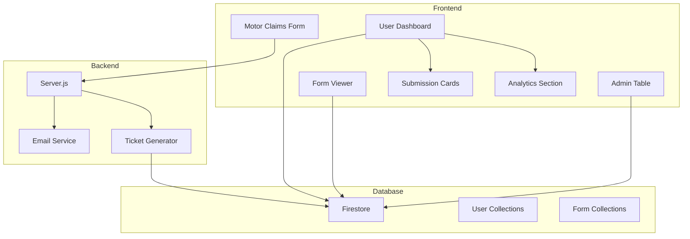

# Design Document: Motor Claims UX Improvements

## Overview

This design document outlines the technical implementation for improving the Motor Claims form user experience, implementing a ticket ID system, enhancing the user dashboard with submissions tracking and analytics, and fixing data consistency issues in admin tables and form viewers.

The implementation spans across frontend components (React/TypeScript), backend services (Node.js/Express), and database operations (Firebase Firestore).

## Architecture



## Components and Interfaces

### 1. Ticket ID Generator

The ticket ID generator creates unique identifiers for form submissions.

```typescript
interface TicketIdConfig {
  prefix: string;      // 3-letter form type prefix
  digits: number;      // Number of digits (8)
}

interface TicketIdResult {
  ticketId: string;    // e.g., "MOT-12345678"
  prefix: string;      // e.g., "MOT"
  number: string;      // e.g., "12345678"
}

// Form type to prefix mapping
const FORM_TYPE_PREFIXES: Record<string, string> = {
  'Motor Claim': 'MOT',
  'Fire Special Perils Claim': 'FIR',
  'Burglary Claim': 'BUR',
  'All Risk Claim': 'ALL',
  'Goods In Transit Claim': 'GIT',
  'Money Insurance Claim': 'MON',
  'Public Liability Claim': 'PUB',
  'Employers Liability Claim': 'EMP',
  'Group Personal Accident Claim': 'GPA',
  'Fidelity Guarantee Claim': 'FID',
  'Rent Assurance Claim': 'REN',
  'Contractors Plant Machinery Claim': 'CPM',
  'Combined GPA Employers Liability Claim': 'COM',
  'Professional Indemnity Claim': 'PRO',
  'Individual KYC': 'IKY',
  'Corporate KYC': 'CKY',
  'Individual CDD': 'ICD',
  'Corporate CDD': 'CCD',
  'Brokers CDD': 'BCD',
  'Agents CDD': 'ACD',
  'Partners CDD': 'PCD'
};

function generateTicketId(formType: string): TicketIdResult {
  const prefix = FORM_TYPE_PREFIXES[formType] || 'GEN';
  const randomNumber = Math.floor(10000000 + Math.random() * 90000000).toString();
  return {
    ticketId: `${prefix}-${randomNumber}`,
    prefix,
    number: randomNumber
  };
}
```

### 2. Motor Claims Form Updates

Add third party driver phone field and police report clarification message.

```typescript
// New field in schema
otherDriverPhone: yup.string().when('otherVehicleInvolved', {
  is: 'yes',
  then: (schema) => schema.required("Other driver phone number is required"),
  otherwise: (schema) => schema.notRequired()
});

// Police report message component
const PoliceReportNote: React.FC = () => (
  <p className="text-sm text-amber-700 bg-amber-50 p-2 rounded border border-amber-200">
    <Info className="inline h-4 w-4 mr-1" />
    Please note that police report is required for accidents involving bodily injury or death.
  </p>
);
```

### 3. User Dashboard Components

```typescript
// Analytics data interface
interface UserAnalytics {
  totalSubmissions: number;
  kycForms: number;
  claimForms: number;
  pendingCount: number;
  approvedCount: number;
  rejectedCount: number;
}

// Submission card interface
interface SubmissionCard {
  id: string;
  ticketId: string;
  formType: string;
  submittedAt: Date;
  status: 'processing' | 'approved' | 'rejected' | 'pending';
  collection: string;
}

// Dashboard layout structure
interface DashboardLayout {
  header: {
    welcomeMessage: string;
    userName: string;
  };
  analytics: UserAnalytics;
  submissions: SubmissionCard[];
  sidebar: {
    profile: UserProfile;
    passwordChange: PasswordChangeForm;
  };
}
```

### 4. Email Template Updates

```typescript
interface SubmissionEmailData {
  userName: string;
  formType: string;
  ticketId: string;
  submissionDate: string;
  dashboardUrl: string;
}

const submissionConfirmationTemplate = (data: SubmissionEmailData): string => `
  <div style="font-family: Arial, sans-serif; max-width: 600px; margin: 0 auto;">
    <div style="background: linear-gradient(90deg, #800020, #DAA520); padding: 20px; text-align: center;">
      <h1 style="color: white; margin: 0;">NEM Insurance</h1>
    </div>
    <div style="padding: 20px; background: #f9f9f9;">
      <h2 style="color: #800020;">Thank you for your submission!</h2>
      <p>Dear ${data.userName},</p>
      <p>We have successfully received your <strong>${data.formType}</strong> form.</p>
      
      <div style="background: #fff; border: 2px solid #800020; border-radius: 8px; padding: 15px; margin: 20px 0; text-align: center;">
        <p style="margin: 0; color: #666;">Your Ticket ID</p>
        <h2 style="margin: 10px 0; color: #800020; font-size: 28px;">${data.ticketId}</h2>
        <p style="margin: 0; font-size: 12px; color: #666;">Please reference this ID in all future correspondence</p>
      </div>
      
      <p>Our team will review your submission and get back to you shortly.</p>
      
      <div style="text-align: center; margin: 30px 0;">
        <a href="${data.dashboardUrl}" style="background: #800020; color: white; padding: 12px 30px; text-decoration: none; border-radius: 5px; display: inline-block;">
          View or Track Submission
        </a>
      </div>
      
      <hr style="border: 1px solid #ddd; margin: 20px 0;">
      <p style="color: #666; font-size: 12px;">
        This is an automated email. Please do not reply to this message.
      </p>
    </div>
  </div>
`;
```

### 5. Admin Table Field Mapping Fixes

```typescript
// Updated motor claims field mapping
const motorClaimsFieldMapping = {
  // Correct field mappings
  'otherVehicleMake': 'otherVehicleMake',  // Not otherVehicleMakeModel
  'otherDriverPhone': 'otherDriverPhone',   // New field
  'incidentTime': 'incidentTime',           // Ensure proper time formatting
  
  // Witnesses array handling
  witnesses: {
    type: 'array',
    format: (witnesses: Witness[]) => {
      if (!witnesses || witnesses.length === 0) return null; // Hide column if empty
      return witnesses.map((w, i) => ({
        label: `Witness ${i + 1}`,
        name: w.name,
        phone: w.phone,
        address: w.address
      }));
    }
  }
};

// Time formatting fix
const formatTime = (time: any): string => {
  if (!time) return 'N/A';
  if (typeof time === 'string') {
    // Handle HH:MM format
    if (/^\d{2}:\d{2}$/.test(time)) return time;
    // Handle ISO date string
    try {
      const date = new Date(time);
      if (!isNaN(date.getTime())) {
        return date.toLocaleTimeString('en-US', { hour: '2-digit', minute: '2-digit' });
      }
    } catch (e) {
      return time;
    }
  }
  return String(time);
};
```

## Data Models

### Form Submission with Ticket ID

```typescript
interface FormSubmission {
  id: string;                    // Firestore document ID
  ticketId: string;              // Generated ticket ID (e.g., MOT-12345678)
  formType: string;              // Form type name
  status: 'processing' | 'approved' | 'rejected' | 'pending';
  submittedAt: Timestamp;
  submittedBy: string;           // User email
  userUid: string;               // User UID for querying
  // ... form-specific fields
}
```

### User Submissions Query

```typescript
// Query to get user's submissions across all collections
const getUserSubmissions = async (userEmail: string): Promise<SubmissionCard[]> => {
  const collections = [
    'motor-claims', 'fire-claims', 'burglary-claims', 'all-risk-claims',
    'goods-in-transit-claims', 'money-insurance-claims', 'public-liability-claims',
    'employers-liability-claims', 'group-personal-accident-claims',
    'fidelity-guarantee-claims', 'rent-assurance-claims',
    'contractors-plant-machinery-claims', 'combined-gpa-employers-liability-claims',
    'professional-indemnity', 'Individual-kyc-form', 'corporate-kyc-form',
    'individual-kyc', 'corporate-kyc', 'brokers-kyc', 'agents-kyc', 'partners-kyc'
  ];
  
  const submissions: SubmissionCard[] = [];
  
  for (const collectionName of collections) {
    const q = query(
      collection(db, collectionName),
      where('submittedBy', '==', userEmail),
      orderBy('submittedAt', 'desc')
    );
    const snapshot = await getDocs(q);
    snapshot.docs.forEach(doc => {
      const data = doc.data();
      submissions.push({
        id: doc.id,
        ticketId: data.ticketId || 'N/A',
        formType: data.formType || collectionName,
        submittedAt: data.submittedAt?.toDate() || new Date(),
        status: data.status || 'processing',
        collection: collectionName
      });
    });
  }
  
  return submissions.sort((a, b) => b.submittedAt.getTime() - a.submittedAt.getTime());
};
```


## Correctness Properties

*A property is a characteristic or behavior that should hold true across all valid executions of a system—essentially, a formal statement about what the system should do. Properties serve as the bridge between human-readable specifications and machine-verifiable correctness guarantees.*

### Property 1: Ticket ID Format Validation

*For any* form type and generated ticket ID, the ticket ID SHALL match the pattern `^[A-Z]{3}-\d{8}$` (3 uppercase letters, hyphen, 8 digits) AND the prefix SHALL correspond to the correct form type mapping.

**Validates: Requirements 3.1, 3.2**

### Property 2: Ticket ID Uniqueness

*For any* set of generated ticket IDs within a test run, there SHALL be no duplicate values.

**Validates: Requirements 3.3**

### Property 3: Ticket ID Persistence

*For any* form submission with a generated ticket ID, querying the database for that submission SHALL return a document containing the same ticket ID.

**Validates: Requirements 3.4**

### Property 4: Email Contains Ticket ID

*For any* submission confirmation email generated, the email HTML content SHALL contain the ticket ID string.

**Validates: Requirements 4.2**

### Property 5: Submission Card Completeness

*For any* submission card rendered for a user's submission, the card SHALL display: form type, ticket ID (or 'N/A' if not present), submission date, and current status.

**Validates: Requirements 5.3**

### Property 6: User Form Viewer Field Filtering

*For any* form viewed by a user (non-admin), the displayed fields SHALL NOT include: 'id', 'collection', 'formId', 'userUid', or other administrative identifiers.

**Validates: Requirements 5.6**

### Property 7: Welcome Message Contains User Name

*For any* user dashboard rendered, the welcome message SHALL contain the authenticated user's name.

**Validates: Requirements 6.2**

### Property 8: Form Viewer Ticket ID Display

*For any* form submission with a ticket ID viewed in the Form Viewer, the ticket ID SHALL be displayed in the rendered output.

**Validates: Requirements 7.1**

### Property 9: Witness Array Formatting

*For any* witnesses array displayed in the Admin Table, the output SHALL be formatted as readable text entries (not JSON string format) with each witness showing name, phone, and address.

**Validates: Requirements 8.1**

### Property 10: Data Display Correctness

*For any* field in the Admin Table that has a non-null, non-empty value in the database, the displayed value SHALL NOT be 'N/A' AND time fields SHALL NOT display as 'NaN'.

**Validates: Requirements 8.4, 8.5**

### Property 11: Field Mapping Correctness

*For any* field defined in the form mapping configuration, the Admin Table column SHALL retrieve data from the correct database field name.

**Validates: Requirements 8.6**

### Property 12: Form Viewer Completeness

*For any* form submission, the Form Viewer SHALL display all fields that have values in the database, SHALL format witnesses as individual entries, and SHALL NOT display fields that don't exist in the form schema.

**Validates: Requirements 9.1, 9.3, 9.4**

### Property 13: Date and Time Formatting

*For any* date or time field displayed in the Form Viewer or Admin Table, the value SHALL be formatted as a human-readable string (not raw timestamp or NaN).

**Validates: Requirements 9.2**

### Property 14: Status Synchronization

*For any* submission card displayed on the user dashboard, the status shown SHALL match the current status value in the database.

**Validates: Requirements 10.2**

### Property 15: Analytics Calculation Correctness

*For any* user's analytics display, the following SHALL hold:
- Total submissions = KYC forms count + Claims forms count
- Total submissions = Pending count + Approved count + Rejected count
- Each count SHALL be a non-negative integer

**Validates: Requirements 11.2, 11.3, 11.4**

### Property 16: Phone Number Validation

*For any* phone number input for the third party driver field, valid phone formats SHALL pass validation and invalid formats SHALL fail.

**Validates: Requirements 1.2**

### Property 17: Third Party Phone Persistence

*For any* motor claim submission with third party information, the third party driver phone number SHALL be stored in the database and retrievable.

**Validates: Requirements 1.3**

## Error Handling

### Form Submission Errors

| Error Scenario | Handling Strategy |
|----------------|-------------------|
| Ticket ID generation fails | Retry up to 3 times, then use fallback UUID-based ID |
| Email sending fails | Log error, continue with submission, mark email as pending |
| Database write fails | Return error to user, do not send confirmation email |
| Invalid phone format | Display validation error, prevent form submission |

### Dashboard Loading Errors

| Error Scenario | Handling Strategy |
|----------------|-------------------|
| Failed to fetch submissions | Display error message with retry button |
| Partial collection fetch failure | Display available data, show warning for failed collections |
| Analytics calculation error | Display "Unable to load analytics" with fallback zeros |

### Admin Table Errors

| Error Scenario | Handling Strategy |
|----------------|-------------------|
| Invalid date/time format | Display original value with warning indicator |
| Missing field mapping | Use fallback dynamic column generation |
| Array formatting failure | Display "View Details" link instead of inline data |

## Testing Strategy

### Unit Tests

Unit tests will verify specific examples and edge cases:

1. **Ticket ID Generator**
   - Test each form type produces correct prefix
   - Test edge cases: unknown form types, empty strings
   - Test format validation regex

2. **Phone Validation**
   - Test valid Nigerian phone formats
   - Test international formats
   - Test invalid inputs (letters, special chars)

3. **Date/Time Formatting**
   - Test Firebase Timestamp conversion
   - Test ISO string conversion
   - Test invalid date handling

4. **Analytics Calculations**
   - Test with empty submissions array
   - Test with mixed statuses
   - Test category classification

### Property-Based Tests

Property-based tests will use **fast-check** library for TypeScript with minimum 100 iterations per test.

1. **Ticket ID Properties**
   - Generate random form types, verify format
   - Generate multiple IDs, verify uniqueness
   - Round-trip: generate → store → retrieve → compare

2. **Data Display Properties**
   - Generate random form data, verify no N/A for valid values
   - Generate random witnesses arrays, verify readable formatting
   - Generate random dates/times, verify no NaN output

3. **Analytics Properties**
   - Generate random submission sets, verify count invariants
   - Generate edge cases (all approved, all rejected, mixed)

### Integration Tests

1. **Form Submission Flow**
   - Submit form → verify ticket ID generated → verify email sent → verify database entry

2. **User Dashboard Flow**
   - Create submissions → load dashboard → verify cards displayed → verify analytics correct

3. **Status Update Flow**
   - Submit claim → admin approves → user dashboard reflects change

### Test Configuration

```typescript
// fast-check configuration
const fcConfig = {
  numRuns: 100,
  verbose: true,
  seed: Date.now()
};

// Test file naming convention
// src/__tests__/motor-claims-ux/*.test.ts
// - ticketId.test.ts
// - phoneValidation.test.ts
// - dataFormatting.test.ts
// - analytics.test.ts
// - integration.test.ts
```
