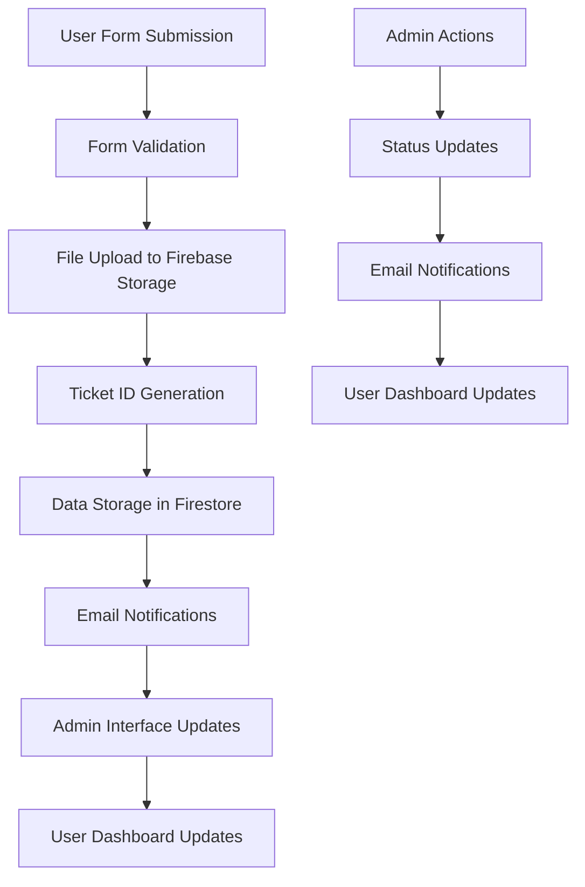

# Design Document: NEM Smart Protection Claims

## Overview

This design document outlines the implementation of 6 new NEM Insurance claim forms that integrate seamlessly with the existing claims system architecture. The feature adds support for Smart Motorist Protection, Smart Students Protection, Smart Traveller Protection, Smart Artisan Protection, Smart Generation Z Protection, and NEM Home Protection Policy claims.

The implementation follows established patterns from the existing MotorClaim.tsx component and integrates with the current form mappings, ticket ID generation, admin interface, email notifications, and file upload systems. The design ensures consistency, maintainability, and scalability while supporting unique field structures and conditional logic for each claim type.

## Architecture

### System Integration Points

The NEM Smart Protection Claims feature integrates with the following existing system components:

1. **Form Mappings System** (`src/config/formMappings.ts`)
   - Extends the FORM_MAPPINGS object with 6 new claim type configurations
   - Provides structured field definitions for admin interface rendering
   - Supports conditional field logic and array field management

2. **Ticket ID Generation** (`src/utils/ticketIdGenerator.ts`)
   - Adds 6 new form type prefixes to FORM_TYPE_PREFIXES mapping
   - Extends COLLECTIONS_TO_CHECK array for uniqueness validation
   - Maintains existing 8-digit ID format with unique prefixes

3. **Admin Interface** (`src/pages/admin/AdminUnifiedTable.tsx` & `src/pages/admin/FormViewer.tsx`)
   - Extends collection mapping for new claim types
   - Supports array field formatting for witnesses and property items
   - Maintains consistent styling and behavior across all claim types

4. **Email Service** (`src/services/emailService.ts`)
   - Extends notification templates for new claim types
   - Maintains existing confirmation and status update patterns
   - Supports automated stakeholder notifications

5. **File Upload System** (`src/services/fileService.ts`)
   - Leverages existing Firebase Storage integration
   - Supports signature uploads, supporting documents, and conditional medical certificates
   - Maintains organized folder structure for each claim type

6. **User Submissions Service** (`src/services/userSubmissionsService.ts`)
   - Extends FORM_COLLECTIONS array to include new claim collections
   - Maintains real-time subscription capabilities
   - Supports analytics and dashboard integration

### Data Flow Architecture



## Components and Interfaces

### React Form Components

Each claim type will have a dedicated React component following the established pattern from MotorClaim.tsx:

#### Component Structure
```typescript
interface ClaimFormProps {
  // No props needed - self-contained components
}

interface ClaimData {
  // Policy Information
  policyNumber: string;
  periodOfCoverFrom: Date;
  periodOfCoverTo: Date;
  
  // Insured Details
  nameOfInsured: string;
  title: string;
  dateOfBirth: Date;
  gender: string;
  address: string;
  phone: string;
  email: string;
  
  // Details of Loss (varies by claim type)
  // ... specific fields for each claim type
  
  // Array Fields
  witnesses?: Witness[];
  propertyItems?: PropertyItem[]; // For HOPP only
  
  // File Uploads
  signature: string; // Required
  supportingDocuments?: string[]; // Optional, multiple
  medicalCertificate?: string; // Conditional for HOPP
  
  // System Fields
  ticketId: string;
  submittedAt: Date;
  submittedBy: string;
  status: 'processing' | 'approved' | 'rejected';
}
```

#### Form Components to Create

1. **SmartMotoristProtectionClaim.tsx**
   - Personal accident coverage for motorists
   - Includes accident details, injury information, and witness management
   - Conditional fields for medical treatment and doctor information

2. **SmartStudentsProtectionClaim.tsx**
   - Personal accident coverage for students
   - Includes educational institution details and activity-specific fields
   - Conditional fields for school-related incidents

3. **SmartTravellerProtectionClaim.tsx**
   - Personal accident coverage for travelers
   - Includes travel details, destination information, and trip-specific fields
   - Conditional fields for international travel and medical emergencies

4. **SmartArtisanProtectionClaim.tsx**
   - Personal accident coverage for artisans and craftspeople
   - Includes occupation-specific details and workplace incident fields
   - Conditional fields for tool-related injuries and workplace safety

5. **SmartGenerationZProtectionClaim.tsx**
   - Personal accident coverage for young adults
   - Includes lifestyle and activity-specific fields
   - Conditional fields for sports and recreational activities

6. **NEMHomeProtectionClaim.tsx**
   - Property damage coverage for homes
   - Includes property details, damage assessment, and multiple property items
   - Conditional fields based on peril type and ownership structure

### Form Field Types and Validation

The components support the following field types with appropriate validation:

- **Text Fields**: Basic string inputs with length validation
- **Date Fields**: Date pickers with logical range validation
- **Time Fields**: Time inputs with format validation
- **Email Fields**: Email inputs with format validation
- **Phone Fields**: Phone inputs with format validation
- **Currency Fields**: Numeric inputs with positive value validation
- **Radio Groups**: Single selection from predefined options
- **Select Dropdowns**: Single selection with custom options
- **Textareas**: Multi-line text inputs with character limits
- **Checkboxes**: Boolean inputs for agreements and confirmations
- **File Uploads**: File inputs with type and size validation
- **Array Fields**: Dynamic lists for witnesses and property items

### Conditional Field Logic

The system implements conditional field visibility based on user selections:

#### Personal Accident Forms Conditional Logic
```typescript
// Doctor information appears when medical treatment is provided
if (doctorNameAddress && doctorNameAddress.trim() !== '') {
  showField('isUsualDoctor');
}
```

#### Home Protection Policy Conditional Logic
```typescript
// Property interest details
if (propertyInterest === 'Other') {
  showField('propertyInterestOther');
}

// Ownership details
if (isSoleOwner === 'No') {
  showField('otherOwnerDetails');
}

// Other insurance details
if (hasOtherInsurance === 'Yes') {
  showField('otherInsurerDetails');
}

// Medical certificate requirement
if (perilType === 'Flood/Water/Storm/Lightning/Explosion/Accident') {
  showField('medicalCertificateRequired');
  makeRequired('medicalCertificate');
}
```

### Array Field Management

#### Witnesses Array (Personal Accident Forms)
```typescript
interface Witness {
  name: string;
  address: string;
}

// Dynamic array management
const { fields, append, remove } = useFieldArray({
  control,
  name: 'witnesses'
});
```

#### Property Items Array (Home Protection Policy)
```typescript
interface PropertyItem {
  description: string;
  cost: number;
  purchaseDate: Date;
  valueAtLoss: number;
}

// Dynamic array management with validation
const { fields, append, remove } = useFieldArray({
  control,
  name: 'propertyItems'
});
```

## Data Models

### Firestore Collections

Each claim type will have its own Firestore collection for organized data storage:

1. `smart-motorist-protection-claims`
2. `smart-students-protection-claims`
3. `smart-traveller-protection-claims`
4. `smart-artisan-protection-claims`
5. `smart-generation-z-protection-claims`
6. `nem-home-protection-claims`

### Document Schema

Each document in the collections will follow this structure:

```typescript
interface ClaimDocument {
  // System Fields
  id: string;
  ticketId: string;
  formType: string;
  status: 'processing' | 'approved' | 'rejected';
  submittedAt: Timestamp;
  submittedBy: string;
  createdAt: Timestamp;
  updatedAt?: Timestamp;
  
  // Policy Information
  policyNumber: string;
  periodOfCoverFrom: Timestamp;
  periodOfCoverTo: Timestamp;
  
  // Insured Details
  nameOfInsured: string;
  title: string;
  dateOfBirth: Timestamp;
  gender: string;
  address: string;
  phone: string;
  email: string;
  
  // Claim-Specific Fields
  [key: string]: any;
  
  // File URLs
  signature: string;
  supportingDocuments?: string[];
  medicalCertificate?: string;
  
  // Array Fields
  witnesses?: Witness[];
  propertyItems?: PropertyItem[];
}
```

### Form Mappings Configuration

Each claim type will have a comprehensive form mapping configuration:

```typescript
'smart-motorist-protection-claims': {
  title: 'Smart Motorist Protection Claim',
  sections: [
    {
      title: 'Policy Information',
      fields: [
        { key: 'policyNumber', label: 'Policy Number', type: 'text', editable: true },
        { key: 'periodOfCoverFrom', label: 'Period of Cover From', type: 'date', editable: true },
        { key: 'periodOfCoverTo', label: 'Period of Cover To', type: 'date', editable: true }
      ]
    },
    {
      title: 'Insured Details',
      fields: [
        { key: 'nameOfInsured', label: 'Name of Insured', type: 'text', editable: true },
        { key: 'title', label: 'Title', type: 'text', editable: true },
        { key: 'dateOfBirth', label: 'Date of Birth', type: 'date', editable: true },
        { key: 'gender', label: 'Gender', type: 'text', editable: true },
        { key: 'address', label: 'Address', type: 'textarea', editable: true },
        { key: 'phone', label: 'Phone Number', type: 'text', editable: true },
        { key: 'email', label: 'Email', type: 'email', editable: true }
      ]
    },
    {
      title: 'Details of Loss',
      fields: [
        // Claim-specific fields for each form type
      ]
    },
    {
      title: 'Witnesses',
      fields: [
        { key: 'witnesses', label: 'Witnesses', type: 'array', editable: true }
      ]
    },
    {
      title: 'Declaration & Signature',
      fields: [
        { key: 'agreeToDataPrivacy', label: 'Agree to Data Privacy', type: 'boolean', editable: false },
        { key: 'signature', label: 'Signature', type: 'file', editable: false }
      ]
    }
  ]
}
```

## Correctness Properties

*A property is a characteristic or behavior that should hold true across all valid executions of a system-essentially, a formal statement about what the system should do. Properties serve as the bridge between human-readable specifications and machine-verifiable correctness guarantees.*

Before writing the correctness properties, I need to analyze the acceptance criteria to determine which ones are testable as properties, examples, or edge cases.

<function_calls>
<invoke name="prework">
<parameter name="featureName">nem-smart-protection-claims

## Correctness Properties

*A property is a characteristic or behavior that should hold true across all valid executions of a system-essentially, a formal statement about what the system should do. Properties serve as the bridge between human-readable specifications and machine-verifiable correctness guarantees.*

### Property 1: Form Mapping Retrieval

*For any* new claim form type (Smart Motorist Protection, Smart Students Protection, Smart Traveller Protection, Smart Artisan Protection, Smart Generation Z Protection, NEM Home Protection Policy), when getFormMapping is called with that form type, the system should return the corresponding schema configuration with all required sections.

**Validates: Requirements 1.7**

### Property 2: Ticket ID Generation Format

*For any* new claim form type, when generateTicketId is called, the system should return a unique ID with the correct 3-letter prefix followed by an 8-digit number in the format PREFIX-XXXXXXXX.

**Validates: Requirements 2.7**

### Property 3: Ticket ID Uniqueness

*For any* generated ticket ID, the system should ensure uniqueness across all existing collections including the 6 new claim collections by checking for conflicts before returning the ID.

**Validates: Requirements 2.8**

### Property 4: Form Section Rendering

*For any* new claim form component, when a user accesses the form, the system should render all required sections: Policy Information, Insured Details, Details of Loss, and Declaration & Signature.

**Validates: Requirements 3.7**

### Property 5: Form Validation

*For any* new claim form submission, when a user submits the form, the system should validate all required fields before allowing submission and reject submissions with missing or invalid required data.

**Validates: Requirements 3.8**

### Property 6: Field Type Support

*For any* new claim form component, the system should support all specified field types: text, date, time, email, tel, radio, select, textarea, currency, file, array, and checkbox with appropriate rendering and validation.

**Validates: Requirements 3.9**

### Property 7: Personal Accident Form Conditional Logic

*For any* personal accident form (Smart Motorist, Smart Students, Smart Traveller, Smart Artisan, Smart Generation Z), when the doctorNameAddress field is not empty, the system should show the isUsualDoctor field.

**Validates: Requirements 4.1**

### Property 8: Conditional Field Hiding

*For any* form with conditional fields, when the trigger conditions are not met, the system should hide the conditional fields and clear their values when they become hidden.

**Validates: Requirements 4.6, 4.7**

### Property 9: Personal Accident Witnesses Array

*For any* personal accident form, the system should provide a witnesses array field with name and address subfields, allowing users to add unlimited entries and remove individual entries.

**Validates: Requirements 5.1, 5.2, 5.3**

### Property 10: Array Field Validation

*For any* form with array fields, when the form is submitted, the system should validate that each array entry contains all required subfields before allowing submission.

**Validates: Requirements 5.7**

### Property 11: File Upload Support

*For any* new claim type, the file upload system should support signature upload (required) and supporting documents upload (optional, multiple files) with proper validation and storage.

**Validates: Requirements 6.1, 6.2**

### Property 12: File Storage Organization

*For any* uploaded file, the system should store files in Firebase Storage with an organized folder structure based on form type and field name.

**Validates: Requirements 6.5**

### Property 13: File Upload Validation

*For any* file upload attempt, the system should validate file types and sizes before upload and provide upload progress indicators for user feedback.

**Validates: Requirements 6.6, 6.7**

### Property 14: Admin Interface Display

*For any* new claim type viewed in the admin interface, the system should display all form sections with proper formatting, format array fields as readable lists, and provide download links for file uploads.

**Validates: Requirements 7.3, 7.4, 7.5**

### Property 15: Admin Interface Consistency

*For any* claim type in the admin interface, the system should maintain consistent styling and behavior and support filtering and searching functionality.

**Validates: Requirements 7.6, 7.7**

### Property 16: Email Notification Sending

*For any* new claim submission, the system should send confirmation emails to the claimant and notification emails to administrators using the appropriate templates.

**Validates: Requirements 8.7, 8.8**

### Property 17: Data Storage Integrity

*For any* claim submission, the system should store complete form data with proper field mapping and maintain data consistency and referential integrity across all collections.

**Validates: Requirements 9.7, 9.8**

### Property 18: Field Validation Rules

*For any* form field, the validation engine should apply appropriate validation rules: required field validation, email format validation for email fields, phone format validation for telephone fields, date format and logical range validation for date fields, and positive value validation for currency fields.

**Validates: Requirements 10.1, 10.2, 10.3, 10.4, 10.5**

### Property 19: Error Message Display

*For any* validation failure or network error, the system should display specific, user-friendly error messages with appropriate retry options and prevent duplicate submissions through proper loading states.

**Validates: Requirements 10.6, 10.7, 10.8**

### Property 20: PDF Generation Support

*For any* new claim type, when generating PDFs, the system should include all form sections with proper formatting and handle array fields by displaying all entries in readable format.

**Validates: Requirements 11.7, 11.8**

### Property 21: Mobile Responsiveness

*For any* new claim form on mobile devices (screen width below 768px), the system should render responsively with touch-friendly controls, optimized file upload interface, smooth array field management, appropriate keyboard types, consistent styling, and working conditional field logic.

**Validates: Requirements 12.1, 12.2, 12.3, 12.4, 12.5, 12.6, 12.7**

### Property 22: Form Schema Parsing

*For any* new claim form schema, the form parser should parse it into valid FormMapping objects, validate schema structure during parsing, and return descriptive error messages for invalid schemas.

**Validates: Requirements 13.1, 13.2, 13.3**

### Property 23: Data Formatting

*For any* claim form data, the pretty printer should format it into human-readable display format, handle array fields with proper spacing, and format conditional fields based on their visibility state.

**Validates: Requirements 13.4, 13.5, 13.6**

### Property 24: Round-trip Parsing

*For any* valid claim form schema, parsing then pretty printing then parsing should produce an equivalent FormMapping object (round-trip property).

**Validates: Requirements 13.7**

### Property 25: Performance Requirements

*For any* new claim form, the system should render within 2 seconds on standard broadband connections, complete form submissions within 5 seconds under normal conditions, handle concurrent submissions without data corruption, implement proper loading states, show progress indicators for file uploads with cancellation options, optimize rendering with lazy-loading, and implement proper error recovery for network issues.

**Validates: Requirements 14.1, 14.2, 14.3, 14.4, 14.5, 14.6, 14.7**

## Error Handling

The system implements comprehensive error handling across all components:

### Form Validation Errors
- **Field-level validation**: Real-time validation with specific error messages for each field type
- **Form-level validation**: Comprehensive validation before submission with error summary
- **Conditional field validation**: Dynamic validation based on field visibility and dependencies
- **Array field validation**: Validation of each array entry with subfield requirements

### File Upload Errors
- **File type validation**: Rejection of unsupported file types with clear messaging
- **File size validation**: Prevention of oversized uploads with size limit information
- **Upload failure recovery**: Retry mechanisms with exponential backoff for transient failures
- **Progress indication**: Real-time upload progress with cancellation capabilities

### Network and System Errors
- **Connection timeouts**: Graceful handling with retry options and user feedback
- **Server errors**: User-friendly error messages with technical details logged for debugging
- **Concurrent access**: Proper handling of simultaneous submissions without data corruption
- **Database errors**: Transaction rollback and data integrity preservation

### User Experience Errors
- **Loading states**: Clear indication of system processing to prevent user confusion
- **Duplicate submission prevention**: Form disabling and loading indicators during submission
- **Navigation errors**: Proper error boundaries with fallback UI components
- **Mobile-specific errors**: Touch-friendly error handling and responsive error displays

## Testing Strategy

The testing strategy employs a dual approach combining unit tests for specific scenarios and property-based tests for comprehensive coverage:

### Unit Testing Approach
Unit tests focus on specific examples, edge cases, and integration points:

- **Component rendering tests**: Verify that each claim form component renders correctly with all required sections
- **Conditional logic tests**: Test specific conditional field scenarios (e.g., HOPP form property interest logic)
- **File upload integration tests**: Test file upload workflows with mock Firebase Storage
- **Email template tests**: Verify email template generation for each claim type
- **Admin interface integration tests**: Test admin table and form viewer with new claim types
- **Database schema tests**: Verify Firestore collection creation and document structure

### Property-Based Testing Approach
Property-based tests verify universal properties across all inputs with minimum 100 iterations per test:

- **Form validation properties**: Test validation rules across randomly generated form data
- **Ticket ID generation properties**: Verify ID format and uniqueness across random form types
- **Conditional field properties**: Test conditional logic with random field combinations
- **Array field properties**: Test array management with random entry counts and data
- **File upload properties**: Test upload behavior with random file types and sizes
- **Mobile responsiveness properties**: Test responsive behavior across random screen sizes
- **Performance properties**: Test loading times and submission speeds under various conditions

### Property Test Configuration
Each property test is configured with:
- **Minimum 100 iterations** to ensure comprehensive coverage through randomization
- **Tagged comments** referencing design document properties: `Feature: nem-smart-protection-claims, Property {number}: {property_text}`
- **Appropriate test data generators** for each claim type and field combination
- **Assertion libraries** for complex property validation
- **Performance benchmarks** for timing-related properties

### Test Data Generation
The testing strategy includes comprehensive test data generators:
- **Form data generators**: Create valid and invalid form submissions for each claim type
- **File generators**: Generate various file types, sizes, and formats for upload testing
- **User interaction generators**: Simulate user behavior patterns for UI testing
- **Network condition simulators**: Test behavior under various network conditions
- **Concurrent access simulators**: Test system behavior under load

### Integration Testing
Integration tests verify end-to-end workflows:
- **Complete claim submission workflows**: From form rendering to email notification
- **Admin processing workflows**: From claim review to status updates
- **File upload and retrieval workflows**: Complete file lifecycle testing
- **Cross-browser compatibility**: Testing across different browsers and devices
- **Performance benchmarking**: Real-world performance measurement and optimization

The dual testing approach ensures both concrete bug detection through unit tests and comprehensive correctness verification through property-based testing, providing confidence in the system's reliability and maintainability.