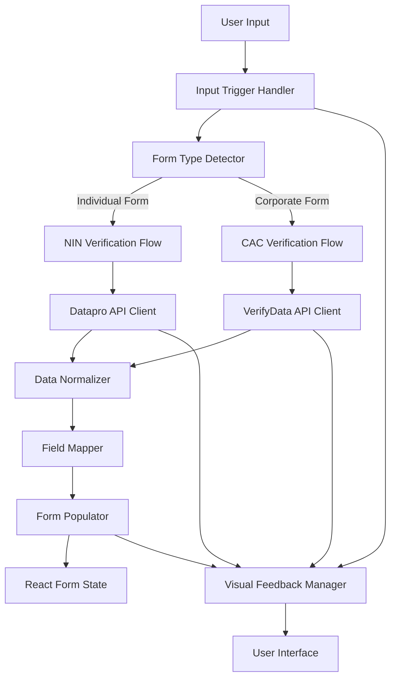
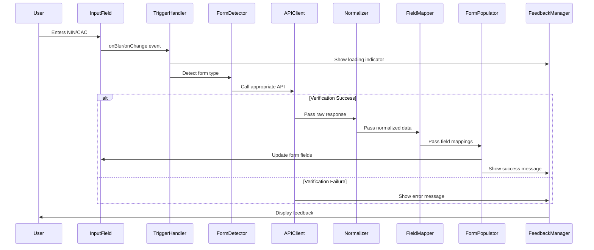

# Design Document: NIN/CAC Auto-Fill

## Overview

The NIN/CAC Auto-Fill system provides real-time form field population for KYC/CDD forms by integrating with external verification APIs (Datapro for NIN, VerifyData for CAC). When users complete entering their NIN or CAC number, the system immediately triggers verification, retrieves verified data, normalizes it, intelligently maps it to form fields, and populates the form in real-time.

The design follows a modular architecture with clear separation of concerns:
- **Trigger Layer**: Detects when users complete identifier entry
- **Verification Layer**: Calls appropriate API based on identifier type
- **Normalization Layer**: Standardizes data formats
- **Mapping Layer**: Matches API fields to form fields using flexible algorithms
- **Population Layer**: Updates form state with normalized, mapped data
- **Feedback Layer**: Provides real-time visual feedback to users

## Architecture

### High-Level Architecture



### Component Interaction Flow



## Components and Interfaces

### 1. Input Trigger Handler

**Purpose**: Detects when users complete entering NIN or CAC number and triggers verification.

**Interface**:
```typescript
interface InputTriggerHandler {
  // Attach to NIN/CAC input fields
  attachToField(fieldElement: HTMLInputElement, formType: FormType): void;
  
  // Detach from fields (cleanup)
  detachFromField(fieldElement: HTMLInputElement): void;
  
  // Validate identifier format before triggering
  validateIdentifier(value: string, type: IdentifierType): boolean;
  
  // Trigger verification
  triggerVerification(identifier: string, formType: FormType): Promise<void>;
}

type IdentifierType = 'NIN' | 'CAC';
type FormType = 'individual' | 'corporate' | 'mixed';
```

**Implementation Details**:
- Listen for `onBlur` event on NIN/CAC fields (primary trigger)
- Optionally listen for `onChange` with debouncing (500ms) for real-time validation
- Validate identifier format:
  - NIN: 11 digits
  - CAC/RC: Alphanumeric, may include "RC" prefix
- Prevent duplicate API calls if identifier hasn't changed
- Cancel pending requests if user modifies identifier

### 2. Form Type Detector

**Purpose**: Analyzes form structure to determine if it's individual, corporate, or mixed.

**Interface**:
```typescript
interface FormTypeDetector {
  // Detect form type by analyzing field names
  detectFormType(formElement: HTMLFormElement): FormType;
  
  // Check if specific identifier type is supported
  supportsIdentifierType(formElement: HTMLFormElement, type: IdentifierType): boolean;
  
  // Get identifier field element
  getIdentifierField(formElement: HTMLFormElement, type: IdentifierType): HTMLInputElement | null;
}
```

**Detection Logic**:
1. Scan form for field names containing: `nin`, `nationalId`, `national_id`
2. Scan form for field names containing: `cac`, `rc`, `rcNumber`, `registrationNumber`
3. If both found → `mixed` form type
4. If only NIN fields → `individual` form type
5. If only CAC fields → `corporate` form type
6. If neither found → return `null` (auto-fill not supported)

### 3. API Client Wrapper

**Purpose**: Unified interface for calling Datapro and VerifyData APIs with error handling.

**Interface**:
```typescript
interface VerificationAPIClient {
  // Verify NIN using Datapro
  verifyNIN(nin: string): Promise<NINVerificationResponse>;
  
  // Verify CAC using VerifyData
  verifyCAC(rcNumber: string): Promise<CACVerificationResponse>;
  
  // Cancel pending request
  cancelPendingRequest(): void;
  
  // Check if request is in progress
  isRequestPending(): boolean;
}

interface NINVerificationResponse {
  success: boolean;
  data?: {
    firstName: string;
    middleName?: string;
    lastName: string;
    gender: string;
    dateOfBirth: string;
    phoneNumber?: string;
    birthstate?: string;
    birthlga?: string;
    trackingId?: string;
  };
  error?: {
    code: string;
    message: string;
  };
}

interface CACVerificationResponse {
  success: boolean;
  data?: {
    name: string; // Company name
    registrationNumber: string;
    companyStatus: string;
    registrationDate: string;
    typeOfEntity?: string;
  };
  error?: {
    code: string;
    message: string;
  };
}
```

**Implementation Details**:
- Reuse existing `dataproClient.cjs` and `verifydataClient.cjs`
- Wrap API calls with timeout (5 seconds)
- Implement request cancellation using AbortController
- Standardize error responses across both APIs
- Handle network errors, timeouts, and API errors uniformly

### 4. Data Normalizer

**Purpose**: Standardizes data formats from API responses before form population.

**Interface**:
```typescript
interface DataNormalizer {
  // Normalize NIN response data
  normalizeNINData(rawData: any): NormalizedNINData;
  
  // Normalize CAC response data
  normalizeCACData(rawData: any): NormalizedCACData;
  
  // Individual field normalizers
  normalizeGender(value: string): string;
  normalizeDate(value: string): string;
  normalizePhone(value: string): string;
  normalizeString(value: string): string;
  normalizeCompanyName(value: string): string;
}

interface NormalizedNINData {
  firstName: string;
  middleName?: string;
  lastName: string;
  gender: 'male' | 'female';
  dateOfBirth: string; // YYYY-MM-DD format
  phoneNumber?: string;
  birthstate?: string;
  birthlga?: string;
}

interface NormalizedCACData {
  companyName: string;
  registrationNumber: string;
  registrationDate: string; // YYYY-MM-DD format
  companyStatus: string;
  typeOfEntity?: string;
}
```

**Normalization Rules**:

**Gender Normalization**:
- Input: `M`, `Male`, `MALE`, `m` → Output: `male`
- Input: `F`, `Female`, `FEMALE`, `f` → Output: `female`
- Invalid values → return empty string

**Date Normalization**:
- Parse formats: `DD/MM/YYYY`, `DD-MMM-YYYY`, `YYYY-MM-DD`
- Output format: `YYYY-MM-DD` (ISO 8601)
- Invalid dates → return empty string

**Phone Normalization**:
- Remove non-digit characters
- Handle `+234` prefix → convert to `0` prefix
- Validate 11-digit Nigerian format
- Invalid → return empty string

**String Normalization**:
- Trim whitespace
- Convert to lowercase (for comparison)
- Remove extra spaces (multiple spaces → single space)
- Preserve original casing for display

**Company Name Normalization**:
- Standardize `Ltd` → `Limited`
- Standardize `PLC` → `Public Limited Company`
- Remove extra whitespace
- Preserve casing

### 5. Field Mapper

**Purpose**: Maps normalized API response fields to form field names using flexible matching.

**Interface**:
```typescript
interface FieldMapper {
  // Map NIN data to form fields
  mapNINFields(normalizedData: NormalizedNINData, formElement: HTMLFormElement): FieldMapping[];
  
  // Map CAC data to form fields
  mapCACFields(normalizedData: NormalizedCACData, formElement: HTMLFormElement): FieldMapping[];
  
  // Find form field by flexible name matching
  findFormField(formElement: HTMLFormElement, fieldName: string): HTMLInputElement | null;
  
  // Generate field name variations
  generateFieldVariations(fieldName: string): string[];
}

interface FieldMapping {
  formFieldName: string;
  formFieldElement: HTMLInputElement;
  value: string;
  sourceField: string; // Original API field name
}
```

**Field Matching Algorithm**:

1. **Exact Match**: Try exact field name first
2. **Case-Insensitive Match**: Try lowercase comparison
3. **Variation Matching**: Generate and try variations:
   - `firstName` → `first_name`, `First Name`, `first name`, `firstname`, `FirstName`
   - `dateOfBirth` → `date_of_birth`, `Date Of Birth`, `dob`, `DOB`, `birthDate`
   - `companyName` → `company_name`, `Company Name`, `name`, `businessName`

4. **Fuzzy Matching**: Use Levenshtein distance for close matches (threshold: 2 edits)

**Field Mapping Table**:

| API Field (NIN) | Form Field Variations |
|-----------------|----------------------|
| firstName | firstName, first_name, First Name, firstname, FirstName |
| middleName | middleName, middle_name, Middle Name, middlename, MiddleName |
| lastName | lastName, last_name, Last Name, lastname, LastName, surname, Surname |
| gender | gender, Gender, sex, Sex |
| dateOfBirth | dateOfBirth, date_of_birth, Date Of Birth, dob, DOB, birthDate, birth_date |
| phoneNumber | phoneNumber, phone_number, Phone Number, phone, Phone, mobile, Mobile |

| API Field (CAC) | Form Field Variations |
|-----------------|----------------------|
| name | companyName, company_name, Company Name, name, Name, businessName |
| registrationNumber | registrationNumber, registration_number, rcNumber, rc_number, RC Number, cacNumber |
| registrationDate | registrationDate, registration_date, Registration Date, dateRegistered |
| companyStatus | companyStatus, company_status, Company Status, status, Status |

### 6. Form Populator

**Purpose**: Updates React form state with mapped field values.

**Interface**:
```typescript
interface FormPopulator {
  // Populate form fields with mapped data
  populateFields(mappings: FieldMapping[], formState: any, setFormState: Function): PopulationResult;
  
  // Mark fields as auto-filled
  markFieldsAsAutoFilled(fieldNames: string[]): void;
  
  // Check if field was auto-filled
  isFieldAutoFilled(fieldName: string): boolean;
  
  // Clear auto-fill markers
  clearAutoFillMarkers(): void;
}

interface PopulationResult {
  success: boolean;
  populatedFields: string[];
  skippedFields: string[];
  errors: FieldError[];
}

interface FieldError {
  fieldName: string;
  error: string;
}
```

**Population Strategy**:

1. **Check User Modifications**: Don't overwrite fields user has already filled
2. **Validate Before Population**: Ensure value passes field validation
3. **Update Form State**: Use React state setter to trigger re-render
4. **Mark Auto-Filled**: Add visual indicator to auto-filled fields
5. **Trigger Validation**: Run existing field validation after population
6. **Log Population**: Record which fields were populated for audit

**React Integration**:
```typescript
// For controlled components
const populateControlledField = (fieldName: string, value: string, formState: any, setFormState: Function) => {
  setFormState((prev: any) => ({
    ...prev,
    [fieldName]: value,
    [`${fieldName}_autoFilled`]: true
  }));
};

// For uncontrolled components
const populateUncontrolledField = (fieldElement: HTMLInputElement, value: string) => {
  fieldElement.value = value;
  fieldElement.dispatchEvent(new Event('input', { bubbles: true }));
  fieldElement.dispatchEvent(new Event('change', { bubbles: true }));
};
```

### 7. Visual Feedback Manager

**Purpose**: Provides real-time visual feedback during verification and auto-fill process.

**Interface**:
```typescript
interface VisualFeedbackManager {
  // Show loading indicator on identifier field
  showLoading(fieldElement: HTMLInputElement): void;
  
  // Hide loading indicator
  hideLoading(fieldElement: HTMLInputElement): void;
  
  // Show success message
  showSuccess(message: string, populatedFieldCount: number): void;
  
  // Show error message
  showError(message: string, errorType: ErrorType): void;
  
  // Mark field as auto-filled
  markFieldAutoFilled(fieldElement: HTMLInputElement): void;
  
  // Remove auto-fill marker
  removeAutoFillMarker(fieldElement: HTMLInputElement): void;
  
  // Disable field during verification
  disableField(fieldElement: HTMLInputElement): void;
  
  // Enable field after verification
  enableField(fieldElement: HTMLInputElement): void;
}

type ErrorType = 'network' | 'validation' | 'timeout' | 'api_error';
```

**Visual Indicators**:

1. **Loading State**:
   - Spinner icon inside identifier field
   - Disable identifier field
   - Optional: Dim other form fields

2. **Success State**:
   - Green checkmark icon on identifier field
   - Toast notification: "X fields auto-filled successfully"
   - Green border on auto-filled fields
   - Tooltip on hover: "Auto-filled from verified data"

3. **Error State**:
   - Red X icon on identifier field
   - Error message below field
   - Toast notification with error details
   - Re-enable identifier field for retry

4. **Auto-Fill Markers**:
   - Light green background on auto-filled fields
   - Small badge/icon indicating "Auto-filled"
   - Remove marker when user edits field

## Data Models

### Auto-Fill State

```typescript
interface AutoFillState {
  // Current verification status
  status: 'idle' | 'loading' | 'success' | 'error';
  
  // Identifier being verified
  identifier: string;
  identifierType: IdentifierType;
  
  // Form type
  formType: FormType;
  
  // Auto-filled fields tracking
  autoFilledFields: Set<string>;
  
  // Original auto-filled values (for audit)
  originalValues: Record<string, string>;
  
  // User-modified fields
  modifiedFields: Set<string>;
  
  // Error information
  error: {
    type: ErrorType;
    message: string;
  } | null;
  
  // Timestamp
  verificationTimestamp: Date | null;
}
```

### Audit Log Entry

```typescript
interface AutoFillAuditLog {
  // Unique log ID
  logId: string;
  
  // Timestamp
  timestamp: Date;
  
  // User information
  userId: string;
  formId: string;
  formType: FormType;
  
  // Verification details
  identifierType: IdentifierType;
  identifierHash: string; // Hashed for privacy
  apiProvider: 'datapro' | 'verifydata';
  
  // Results
  verificationSuccess: boolean;
  populatedFields: string[];
  populatedFieldCount: number;
  
  // User modifications
  modifiedFields: Array<{
    fieldName: string;
    originalValue: string;
    modifiedValue: string;
  }>;
  
  // Error information (if applicable)
  error: {
    type: ErrorType;
    message: string;
  } | null;
}
```

## Correctness Properties


A property is a characteristic or behavior that should hold true across all valid executions of a system—essentially, a formal statement about what the system should do. Properties serve as the bridge between human-readable specifications and machine-verifiable correctness guarantees.

### Property 1: API Trigger on Identifier Completion

*For any* valid identifier (NIN or CAC/RC number) entered in a form, when the user completes entry, the system should immediately call the appropriate verification API (Datapro for NIN, VerifyData for CAC).

**Validates: Requirements 1.1, 2.1**

### Property 2: Real-Time Field Population

*For any* successful API response containing verified data, all available fields (firstName, lastName, gender, dateOfBirth, phoneNumber for NIN; companyName, registrationNumber, registrationDate, companyStatus for CAC) should be immediately populated in the form.

**Validates: Requirements 1.3, 2.3**

### Property 3: Normalization Before Population

*For any* API response data, normalization transformations should be applied before populating form fields, ensuring all populated values are in standardized formats.

**Validates: Requirements 1.4**

### Property 4: Gender Normalization Consistency

*For any* gender value from API responses (M, Male, MALE, F, Female, FEMALE), the normalization service should consistently convert to lowercase "male" or "female".

**Validates: Requirements 4.1**

### Property 5: Multi-Format Date Parsing

*For any* date value in formats DD/MM/YYYY, DD-MMM-YYYY, or YYYY-MM-DD, the normalization service should successfully parse and convert to ISO 8601 format (YYYY-MM-DD).

**Validates: Requirements 4.2**

### Property 6: Phone Number Normalization

*For any* phone number with +234 prefix or non-digit characters, the normalization service should produce a clean 11-digit Nigerian phone format.

**Validates: Requirements 4.3**

### Property 7: Text Normalization Consistency

*For any* text field value with leading/trailing whitespace or multiple consecutive spaces, the normalization service should produce trimmed text with single spaces.

**Validates: Requirements 4.4**

### Property 8: Company Name Standardization

*For any* company name containing Ltd, Limited, or PLC variations, the normalization service should apply consistent standardization rules.

**Validates: Requirements 2.4, 4.5**

### Property 9: RC Prefix Removal

*For any* registration number containing "RC" prefix, the normalization service should remove the prefix before populating the form field.

**Validates: Requirements 2.5**

### Property 10: Field Name Variation Matching

*For any* form field and API response field representing the same logical data, the field mapper should successfully match them regardless of naming convention (camelCase, snake_case, Title Case, space-separated).

**Validates: Requirements 3.1, 3.2**

### Property 11: Missing Field Graceful Handling

*For any* API response field that doesn't have a corresponding form field, the field mapper should skip that field without causing errors or blocking other field population.

**Validates: Requirements 3.3**

### Property 12: Nested Form Traversal

*For any* form with nested structure, the field mapper should successfully locate and populate matching fields at any nesting level.

**Validates: Requirements 3.4**

### Property 13: Exact Match Priority

*For any* form containing multiple similar field names, the field mapper should prioritize exact matches over fuzzy matches when mapping API fields.

**Validates: Requirements 3.5**

### Property 14: High Mapping Success Rate

*For any* supported form type (individual-kyc, corporate-kyc, brokers-kyc, agentsCDD, partnersCDD, motor-claims), at least 90% of available API response fields should be successfully mapped to form fields.

**Validates: Requirements 3.6**

### Property 15: Form Type Detection Accuracy

*For any* form containing NIN fields, the system should classify it as individual and use Datapro API; for any form containing CAC/RC fields, the system should classify it as corporate and use VerifyData API.

**Validates: Requirements 5.1, 5.2, 5.4, 5.5**

### Property 16: Mixed Form Support

*For any* form containing both NIN and CAC fields, the system should support verification for both identifier types independently.

**Validates: Requirements 5.3**

### Property 17: Loading Indicator Display

*For any* verification API call initiation, a loading indicator should immediately appear on the identifier field and the field should be disabled.

**Validates: Requirements 1.2, 2.2, 6.1, 6.2**

### Property 18: Auto-Fill Visual Markers

*For any* successfully auto-filled field, a visual indicator should be applied to mark the field as auto-filled from verified data.

**Validates: Requirements 6.3**

### Property 19: Success Notification Display

*For any* successful verification and auto-fill operation, a success message should be displayed indicating the number of fields populated.

**Validates: Requirements 1.5, 2.7, 6.4**

### Property 20: Auto-Fill Marker Removal on Edit

*For any* auto-filled field that a user edits, the auto-fill visual indicator should be removed from that field.

**Validates: Requirements 6.7**

### Property 21: Field Editability Preservation

*For any* auto-filled field, the field should remain editable and accept user modifications.

**Validates: Requirements 1.6**

### Property 22: Error Handling and Recovery

*For any* API error (network error, timeout, non-200 status), the system should display an appropriate error message, re-enable the identifier field, and allow manual form completion.

**Validates: Requirements 1.7, 6.5, 7.5, 7.6, 7.7**

### Property 23: Response Validation Before Population

*For any* API response, the system should validate that required fields are present before attempting to populate the form.

**Validates: Requirements 7.1**

### Property 24: Null and Empty Value Handling

*For any* API response containing null or empty values, those fields should be skipped without blocking population of other valid fields.

**Validates: Requirements 7.3**

### Property 25: Normalization Error Isolation

*For any* field where normalization fails, the system should log the error and skip that field without blocking population of other fields.

**Validates: Requirements 4.6**

### Property 26: API Request Timeout

*For any* verification API call, if the response doesn't arrive within 5 seconds, the system should timeout and display a timeout message.

**Validates: Requirements 9.1, 9.2**

### Property 27: User Data Preservation

*For any* form field that a user has manually filled before API response arrives, the auto-fill system should not overwrite the user-entered data.

**Validates: Requirements 9.4**

### Property 28: Request Cancellation on Identifier Change

*For any* pending verification request, if the user modifies the identifier field, the system should cancel the pending request and clear any auto-filled fields.

**Validates: Requirements 9.5**

### Property 29: Validation Integration

*For any* auto-filled field, existing field validation rules should be triggered, and form submission should apply all validation logic to auto-filled fields.

**Validates: Requirements 10.1, 10.2**

### Property 30: React State Management

*For any* React controlled component, auto-fill should update component state through proper state setters, triggering appropriate re-renders.

**Validates: Requirements 10.3**

### Property 31: Graceful Degradation

*For any* form where auto-fill is disabled or unavailable, the form should function normally with manual data entry.

**Validates: Requirements 10.5**

### Property 32: Field Mapping Flexibility

*For any* form with changed field names, the field mapper should continue to function using flexible matching algorithms without requiring code changes.

**Validates: Requirements 10.6**

### Property 33: Configuration-Based Activation

*For any* form where auto-fill is configured as enabled, verification triggers should be active; where disabled, triggers should be hidden and the form should function as standard.

**Validates: Requirements 11.1, 11.2**

### Property 34: Custom Mapping Priority

*For any* field where custom mapping is defined in configuration, the custom mapping should take priority over default matching algorithms.

**Validates: Requirements 11.5**

### Property 35: Audit Log Completeness

*For any* auto-fill operation, an audit log entry should be created containing: populated fields, source API, timestamp, and response status.

**Validates: Requirements 8.1, 8.3**

### Property 36: Modification Tracking

*For any* auto-filled field that a user edits, both the original auto-filled value and the user-modified value should be recorded in the audit trail.

**Validates: Requirements 8.2**

### Property 37: Sensitive Data Masking in Logs

*For any* audit log entry, sensitive personal information (NIN, CAC numbers) should be masked or hashed, not stored in plain text.

**Validates: Requirements 8.4, 12.3**

### Property 38: Submission Metadata

*For any* form submission, metadata should indicate which fields were auto-filled versus manually entered.

**Validates: Requirements 8.5**

### Property 39: Error Logging

*For any* verification failure, an error log should be created containing error type, error message, and attempted identifier (masked).

**Validates: Requirements 8.6**

### Property 40: Session Data Cleanup

*For any* user navigation away from a form or session end, cached verification data should be cleared from memory.

**Validates: Requirements 12.4, 12.5**

### Property 41: Credential Protection in Errors

*For any* authentication error from APIs, the error message displayed to users should not expose API credentials or sensitive configuration.

**Validates: Requirements 12.6**

## Error Handling

### Error Categories

1. **Network Errors**
   - Connection timeout
   - DNS resolution failure
   - Network unreachable
   - **Handling**: Display "Network error. Please check your connection and try again." with retry button

2. **API Errors**
   - 400 Bad Request: Invalid identifier format
   - 401 Unauthorized: API credentials invalid
   - 404 Not Found: Identifier not found in database
   - 429 Too Many Requests: Rate limit exceeded
   - 500 Internal Server Error: API provider error
   - **Handling**: Display user-friendly message based on status code, log technical details

3. **Validation Errors**
   - Invalid identifier format (client-side)
   - Required fields missing in API response
   - Invalid data format in API response
   - **Handling**: Skip invalid fields, log validation errors, populate valid fields

4. **Timeout Errors**
   - API request exceeds 5-second timeout
   - **Handling**: Cancel request, display timeout message, enable manual entry

5. **Mapping Errors**
   - No matching form fields found
   - Ambiguous field matches
   - **Handling**: Log mapping failures, skip unmapped fields

### Error Recovery Strategies

1. **Automatic Retry**: For transient network errors (max 2 retries with exponential backoff)
2. **Manual Retry**: User-initiated retry button for all error types
3. **Graceful Degradation**: Always allow manual form completion
4. **Partial Success**: Populate successfully mapped fields even if some fail
5. **Error Logging**: Log all errors with context for debugging

### Error Messages

```typescript
const ERROR_MESSAGES = {
  NETWORK_ERROR: "Unable to connect. Please check your internet connection and try again.",
  TIMEOUT: "Verification is taking longer than expected. You can continue manually or try again.",
  INVALID_NIN: "Invalid NIN format. Please enter an 11-digit NIN.",
  INVALID_CAC: "Invalid CAC/RC number format. Please check and try again.",
  NOT_FOUND: "Identifier not found in verification database. Please verify and try again.",
  API_ERROR: "Verification service temporarily unavailable. You can continue manually.",
  RATE_LIMIT: "Too many verification attempts. Please wait a moment and try again.",
  VALIDATION_ERROR: "Some fields could not be auto-filled. Please review and complete manually."
};
```

## Testing Strategy

### Dual Testing Approach

The testing strategy employs both unit tests and property-based tests to ensure comprehensive coverage:

- **Unit Tests**: Verify specific examples, edge cases, error conditions, and integration points
- **Property Tests**: Verify universal properties across all inputs through randomization

Both approaches are complementary and necessary. Unit tests catch concrete bugs in specific scenarios, while property tests verify general correctness across a wide range of inputs.

### Property-Based Testing Configuration

**Library Selection**: 
- **Frontend (TypeScript/React)**: Use `fast-check` library
- **Backend (Node.js)**: Use `fast-check` library

**Test Configuration**:
- Minimum 100 iterations per property test (due to randomization)
- Each property test must reference its design document property
- Tag format: `Feature: nin-cac-autofill, Property {number}: {property_text}`

**Example Property Test Structure**:
```typescript
import fc from 'fast-check';

describe('Feature: nin-cac-autofill, Property 4: Gender Normalization Consistency', () => {
  it('should normalize all gender variations to lowercase male or female', () => {
    fc.assert(
      fc.property(
        fc.oneof(
          fc.constantFrom('M', 'Male', 'MALE', 'm'),
          fc.constantFrom('F', 'Female', 'FEMALE', 'f')
        ),
        (genderInput) => {
          const normalized = normalizeGender(genderInput);
          return normalized === 'male' || normalized === 'female';
        }
      ),
      { numRuns: 100 }
    );
  });
});
```

### Unit Testing Focus Areas

Unit tests should focus on:

1. **Specific Examples**:
   - Test with known NIN/CAC numbers and expected responses
   - Test specific form structures (individual-kyc, corporate-kyc, etc.)
   - Test specific field name variations

2. **Edge Cases**:
   - Empty API responses
   - Responses with all null values
   - Forms with no matching fields
   - Forms with duplicate field names
   - Very long field values
   - Special characters in data

3. **Error Conditions**:
   - Network failures
   - API timeouts
   - Invalid API responses
   - Malformed JSON
   - Missing required fields

4. **Integration Points**:
   - React component integration
   - Form validation integration
   - Existing API client integration
   - Audit logging integration

### Test Coverage Requirements

- **Code Coverage**: Minimum 80% line coverage
- **Property Coverage**: Each correctness property must have at least one property-based test
- **Form Coverage**: Test all supported form types (individual-kyc, corporate-kyc, brokers-kyc, agentsCDD, partnersCDD, motor-claims)
- **API Coverage**: Test both Datapro and VerifyData API integrations
- **Error Coverage**: Test all error categories and recovery strategies

### Testing Tools and Frameworks

- **Unit Testing**: Jest
- **Property-Based Testing**: fast-check
- **React Testing**: React Testing Library
- **API Mocking**: MSW (Mock Service Worker)
- **Coverage**: Jest coverage reports

## Implementation Notes

### Performance Considerations

1. **Debouncing**: Debounce identifier input changes (500ms) to prevent excessive API calls
2. **Request Cancellation**: Use AbortController to cancel pending requests
3. **Caching**: Cache verification results for the session (keyed by identifier)
4. **Lazy Loading**: Load auto-fill components only when needed
5. **Optimistic Updates**: Show loading state immediately without waiting for validation

### Security Considerations

1. **HTTPS Only**: All API calls must use HTTPS
2. **Credential Protection**: Store API credentials in environment variables, never in code
3. **Data Masking**: Mask identifiers in logs and error messages
4. **Session Cleanup**: Clear cached data on logout or session timeout
5. **Input Validation**: Validate identifier format before API calls
6. **Rate Limiting**: Implement client-side rate limiting to prevent abuse

### Accessibility Considerations

1. **Screen Reader Support**: Announce loading states and success/error messages
2. **Keyboard Navigation**: Ensure all functionality accessible via keyboard
3. **Focus Management**: Manage focus appropriately during loading and error states
4. **ARIA Labels**: Add appropriate ARIA labels to loading indicators and auto-filled fields
5. **Color Contrast**: Ensure visual indicators meet WCAG AA standards

### Browser Compatibility

- Support modern browsers: Chrome 90+, Firefox 88+, Safari 14+, Edge 90+
- Use polyfills for AbortController if needed
- Test on mobile browsers (iOS Safari, Chrome Mobile)

### Monitoring and Observability

1. **Success Rate Metrics**: Track percentage of successful auto-fills
2. **API Performance**: Monitor API response times
3. **Error Rates**: Track error types and frequencies
4. **Field Mapping Success**: Monitor mapping success rates per form type
5. **User Behavior**: Track how often users edit auto-filled fields

### Future Enhancements

1. **Offline Support**: Cache recent verifications for offline use
2. **Bulk Verification**: Support verifying multiple identifiers at once
3. **Smart Suggestions**: Suggest corrections for invalid identifiers
4. **Progressive Enhancement**: Gradually improve matching algorithms based on usage data
5. **Multi-Language Support**: Support field names in multiple languages
