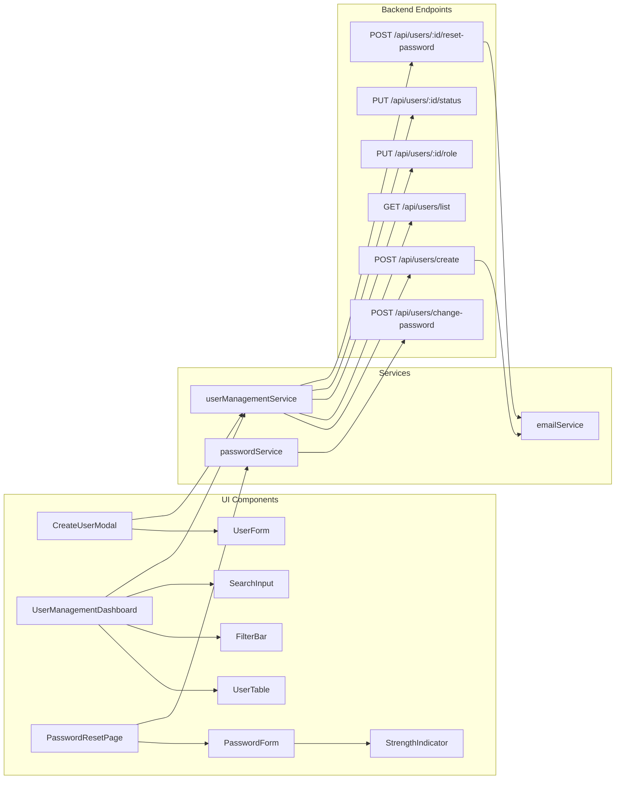
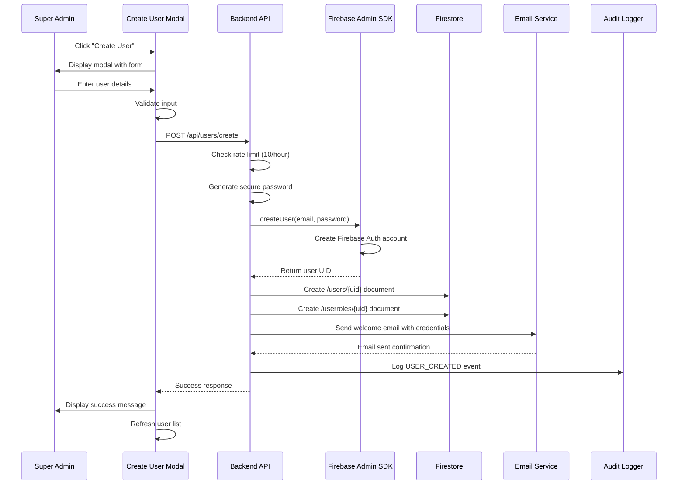
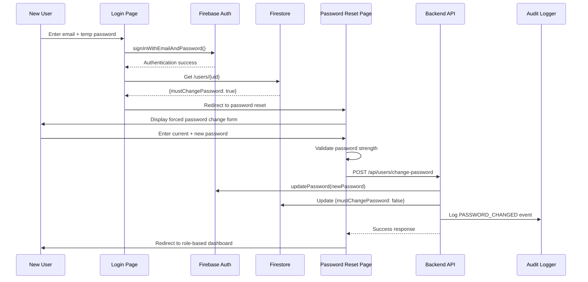

# Design Document: Super Admin User Management

## Overview

This design document specifies the architecture and implementation details for a comprehensive Super Admin User Management system. The system enables super administrators to create user accounts with automatically generated secure passwords, deliver credentials via email, and enforce mandatory password changes on first login.

### Key Features

- User account creation interface accessible from admin dashboard
- Automatic secure password generation (12+ characters with complexity requirements)
- Firebase Authentication integration using Firebase Admin SDK
- Firestore document creation for user profiles and roles
- Email delivery of credentials using existing email service infrastructure
- Forced password reset on first login with strength validation
- User management dashboard with filtering, search, and pagination
- Role modification, account disable/enable, and password reset capabilities
- Comprehensive audit logging for all security-relevant operations
- Rate limiting to prevent abuse (10 users per hour per super admin)
- Concurrent operation handling with atomic transactions

### Technology Stack

- **Frontend**: React + TypeScript + Vite
- **Backend**: Express.js (server.js)
- **Database**: Firebase Firestore
- **Authentication**: Firebase Authentication + Firebase Admin SDK
- **Email**: Nodemailer (existing email service)
- **Utilities**: Existing server-utils (audit logging, rate limiting, encryption)

### Design Principles

1. **Security First**: All sensitive operations are logged, passwords are never displayed to admins, and temporary passwords expire after 7 days
2. **User Experience**: Clear error messages, real-time validation, and intuitive interfaces
3. **Reliability**: Atomic operations, error recovery, and email retry mechanisms
4. **Scalability**: Pagination for large user lists, efficient Firestore queries
5. **Maintainability**: Reuse existing utilities and patterns, modular component design

## Architecture

### High-Level Architecture

```mermaid
graph TB
    subgraph "Frontend (React)"
        A[Admin Dashboard] --> B[User Creation Modal]
        A --> C[User Management Dashboard]
        A --> D[Password Reset Page]
        B --> E[Form Validation]
        C --> F[User Table with Filters]
        D --> G[Password Strength Validator]
    end
    
    subgraph "Backend (Express.js)"
        H[User Management API] --> I[Firebase Admin SDK]
        H --> J[Email Service]
        H --> K[Audit Logger]
        H --> L[Rate Limiter]
        I --> M[Firebase Auth]
        I --> N[Firestore]
    end
    
    subgraph "Data Layer"
        N --> O[/users/ collection]
        N --> P[/userroles/ collection]
        N --> Q[/auditLogs/ collection]
        M --> R[Firebase Authentication]
    end
    
    A --> H
    B --> H
    C --> H
    D --> H
    J --> S[SMTP Server]
    
    style A fill:#e1f5ff
    style H fill:#fff4e6
    style N fill:#f3e5f5
```

### Component Architecture



### Data Flow

#### User Creation Flow



#### First Login and Password Change Flow



## Components and Interfaces

### Frontend Components

#### 1. CreateUserModal Component

**Location**: `src/components/admin/CreateUserModal.tsx`

**Props**:
```typescript
interface CreateUserModalProps {
  open: boolean;
  onClose: () => void;
  onSuccess: () => void;
}
```

**State**:
```typescript
interface CreateUserFormState {
  fullName: string;
  email: string;
  role: UserRole;
  loading: boolean;
  errors: {
    fullName?: string;
    email?: string;
    role?: string;
    general?: string;
  };
}
```

**Key Features**:
- Form validation with real-time error display
- Role dropdown with all available roles
- Loading state during submission
- Error handling with user-friendly messages
- Auto-close on success with 2-second delay

#### 2. UserManagementDashboard Component

**Location**: `src/pages/admin/UserManagementDashboard.tsx`

**State**:
```typescript
interface UserManagementState {
  users: User[];
  loading: boolean;
  filters: {
    role: UserRole | 'all';
    searchText: string;
  };
  pagination: {
    currentPage: number;
    pageSize: number;
    totalPages: number;
  };
  selectedUser: User | null;
  actionDialogs: {
    editRole: boolean;
    resetPassword: boolean;
    disableAccount: boolean;
  };
}
```

**Key Features**:
- User table with sortable columns
- Role filter dropdown
- Search by name or email
- Pagination controls (50 users per page)
- Action buttons: Edit Role, Reset Password, Disable/Enable Account
- Real-time updates when actions complete
- Highlight newly created users for 5 seconds

#### 3. PasswordResetPage Component

**Location**: `src/pages/auth/PasswordResetPage.tsx`

**State**:
```typescript
interface PasswordResetState {
  currentPassword: string;
  newPassword: string;
  confirmPassword: string;
  passwordStrength: {
    hasMinLength: boolean;
    hasUppercase: boolean;
    hasLowercase: boolean;
    hasNumber: boolean;
    hasSpecialChar: boolean;
    score: 'weak' | 'medium' | 'strong';
  };
  errors: {
    currentPassword?: string;
    newPassword?: string;
    confirmPassword?: string;
    general?: string;
  };
  loading: boolean;
}
```

**Key Features**:
- Real-time password strength indicator
- Visual feedback for each requirement
- Prevent navigation until password changed
- Validation before submission
- Auto-redirect to role-based dashboard on success

#### 4. PasswordStrengthIndicator Component

**Location**: `src/components/auth/PasswordStrengthIndicator.tsx`

**Props**:
```typescript
interface PasswordStrengthIndicatorProps {
  password: string;
  requirements: {
    minLength: number;
    requireUppercase: boolean;
    requireLowercase: boolean;
    requireNumber: boolean;
    requireSpecialChar: boolean;
  };
}
```

**Display**:
- Visual progress bar (red → yellow → green)
- Checklist of requirements with checkmarks
- Overall strength label

### Backend API Endpoints

#### 1. Create User Endpoint

**Route**: `POST /api/users/create`

**Middleware**: `requireAuth`, `requireSuperAdmin`, `userCreationRateLimit`

**Request Body**:
```typescript
interface CreateUserRequest {
  fullName: string;
  email: string;
  role: UserRole;
}
```

**Response**:
```typescript
interface CreateUserResponse {
  success: boolean;
  user?: {
    uid: string;
    email: string;
    role: string;
  };
  error?: string;
}
```

**Implementation Steps**:
1. Validate request body
2. Check rate limit (10 users/hour per super admin)
3. Generate secure temporary password
4. Create Firebase Authentication account using Admin SDK
5. Create Firestore documents (/users and /userroles)
6. Send welcome email with credentials
7. Log audit event
8. Return success response

#### 2. List Users Endpoint

**Route**: `GET /api/users/list`

**Middleware**: `requireAuth`, `requireSuperAdmin`

**Query Parameters**:
```typescript
interface ListUsersQuery {
  role?: UserRole | 'all';
  search?: string;
  page?: number;
  pageSize?: number;
}
```

**Response**:
```typescript
interface ListUsersResponse {
  success: boolean;
  users: User[];
  pagination: {
    currentPage: number;
    pageSize: number;
    totalPages: number;
    totalUsers: number;
  };
  error?: string;
}
```

#### 3. Update User Role Endpoint

**Route**: `PUT /api/users/:userId/role`

**Middleware**: `requireAuth`, `requireSuperAdmin`

**Request Body**:
```typescript
interface UpdateRoleRequest {
  newRole: UserRole;
}
```

**Response**:
```typescript
interface UpdateRoleResponse {
  success: boolean;
  error?: string;
}
```

#### 4. Toggle User Status Endpoint

**Route**: `PUT /api/users/:userId/status`

**Middleware**: `requireAuth`, `requireSuperAdmin`

**Request Body**:
```typescript
interface ToggleStatusRequest {
  disabled: boolean;
}
```

**Response**:
```typescript
interface ToggleStatusResponse {
  success: boolean;
  error?: string;
}
```

#### 5. Reset User Password Endpoint

**Route**: `POST /api/users/:userId/reset-password`

**Middleware**: `requireAuth`, `requireSuperAdmin`

**Response**:
```typescript
interface ResetPasswordResponse {
  success: boolean;
  error?: string;
}
```

**Implementation Steps**:
1. Generate new temporary password
2. Update Firebase Authentication password
3. Set mustChangePassword flag in Firestore
4. Send password reset email
5. Log audit event

#### 6. Change Password Endpoint

**Route**: `POST /api/users/change-password`

**Middleware**: `requireAuth`

**Request Body**:
```typescript
interface ChangePasswordRequest {
  currentPassword: string;
  newPassword: string;
}
```

**Response**:
```typescript
interface ChangePasswordResponse {
  success: boolean;
  redirectUrl?: string;
  error?: string;
}
```

### Services

#### 1. Password Generation Service

**Location**: `server-utils/passwordGenerator.cjs`

**Function**: `generateSecurePassword()`

**Requirements**:
- Minimum 12 characters
- At least 1 uppercase letter
- At least 1 lowercase letter
- At least 1 number
- At least 1 special character (!@#$%^&*()_+-=[]{}|;:,.<>?)
- Cryptographically secure random generation

**Implementation**:
```javascript
const crypto = require('crypto');

function generateSecurePassword(length = 12) {
  const uppercase = 'ABCDEFGHIJKLMNOPQRSTUVWXYZ';
  const lowercase = 'abcdefghijklmnopqrstuvwxyz';
  const numbers = '0123456789';
  const special = '!@#$%^&*()_+-=[]{}|;:,.<>?';
  
  // Ensure at least one of each required character type
  let password = '';
  password += uppercase[crypto.randomInt(0, uppercase.length)];
  password += lowercase[crypto.randomInt(0, lowercase.length)];
  password += numbers[crypto.randomInt(0, numbers.length)];
  password += special[crypto.randomInt(0, special.length)];
  
  // Fill remaining length with random characters from all sets
  const allChars = uppercase + lowercase + numbers + special;
  for (let i = password.length; i < length; i++) {
    password += allChars[crypto.randomInt(0, allChars.length)];
  }
  
  // Shuffle the password to avoid predictable patterns
  return password.split('').sort(() => crypto.randomInt(-1, 2)).join('');
}
```

#### 2. User Management Service (Frontend)

**Location**: `src/services/userManagementService.ts`

**Functions**:
- `createUser(data: CreateUserRequest): Promise<CreateUserResponse>`
- `listUsers(filters: ListUsersQuery): Promise<ListUsersResponse>`
- `updateUserRole(userId: string, newRole: UserRole): Promise<UpdateRoleResponse>`
- `toggleUserStatus(userId: string, disabled: boolean): Promise<ToggleStatusResponse>`
- `resetUserPassword(userId: string): Promise<ResetPasswordResponse>`
- `changePassword(data: ChangePasswordRequest): Promise<ChangePasswordResponse>`

#### 3. Email Template Service

**Location**: `server-utils/emailTemplates.cjs`

**Function**: `generateWelcomeEmail(userData)`

**Template Structure**:
```html
<div style="font-family: Arial, sans-serif; max-width: 600px; margin: 0 auto;">
  <div style="background: linear-gradient(90deg, #800020, #DAA520); padding: 20px;">
    <h1 style="color: white;">Welcome to NEM Forms</h1>
  </div>
  <div style="padding: 20px;">
    <h2>Hello {{fullName}},</h2>
    <p>Your account has been created. Here are your login credentials:</p>
    <div style="background: #f5f5f5; padding: 15px; border-radius: 5px;">
      <p><strong>Email:</strong> {{email}}</p>
      <p><strong>Temporary Password:</strong> {{temporaryPassword}}</p>
    </div>
    <p style="color: #d32f2f; font-weight: bold;">
      ⚠️ You must change your password on first login
    </p>
    <p>
      <a href="{{loginUrl}}" style="background: #800020; color: white; padding: 12px 24px; text-decoration: none; border-radius: 5px; display: inline-block;">
        Login Now
      </a>
    </p>
    <p style="color: #666; font-size: 12px;">
      🔒 Security Notice: Never share your credentials with anyone. 
      This password is temporary and expires in 7 days.
    </p>
  </div>
</div>
```

**Function**: `generatePasswordResetEmail(userData)`

Similar structure but for password resets initiated by super admin.

## Data Models

### User Document (`/users/{userId}`)

```typescript
interface UserDocument {
  uid: string;
  email: string;
  name: string;
  mustChangePassword: boolean;
  passwordChangedAt: Timestamp | null;
  temporaryPasswordExpiresAt: Timestamp | null;
  createdBy: string; // Super admin UID
  createdAt: Timestamp;
  updatedAt: Timestamp;
  disabled: boolean;
}
```

**Firestore Indexes**:
- `createdAt` (descending)
- `email` (ascending)
- `mustChangePassword` (ascending)

### Role Document (`/userroles/{userId}`)

```typescript
interface RoleDocument {
  uid: string;
  email: string;
  name: string;
  role: UserRole;
  dateCreated: Timestamp;
  dateModified: Timestamp;
}
```

**Firestore Indexes**:
- `role` (ascending)
- `dateCreated` (descending)

### Audit Log Document (`/auditLogs/{logId}`)

```typescript
interface AuditLogDocument {
  eventType: 'USER_CREATED' | 'USER_CREATION_FAILED' | 'PASSWORD_CHANGED' | 
             'PASSWORD_CHANGE_FAILED' | 'PASSWORD_RESET_BY_ADMIN' | 
             'ROLE_CHANGED' | 'ACCOUNT_STATUS_CHANGED' | 'RATE_LIMIT_EXCEEDED';
  userId: string;
  userEmail: string;
  performedBy: string; // Super admin UID for admin actions
  performedByEmail: string;
  details: {
    // Event-specific details
    oldRole?: string;
    newRole?: string;
    newUserEmail?: string;
    errorMessage?: string;
    ipAddress?: string;
  };
  timestamp: Timestamp;
  severity: 'info' | 'warning' | 'error';
}
```

**Firestore Indexes**:
- `eventType` + `timestamp` (descending)
- `userId` + `timestamp` (descending)
- `performedBy` + `timestamp` (descending)

### Rate Limit Tracking Document (`/rateLimits/{superAdminId}`)

```typescript
interface RateLimitDocument {
  superAdminId: string;
  userCreationCount: number;
  windowStartTime: Timestamp;
  windowEndTime: Timestamp;
}
```

**Cleanup**: Documents are automatically deleted after window expires (1 hour).

## Error Handling

### Error Categories

#### 1. Validation Errors (400)

**Frontend Validation**:
- Empty required fields
- Invalid email format
- Password doesn't meet requirements
- Passwords don't match

**Backend Validation**:
- Missing required fields
- Invalid role value
- Invalid user ID format

**Response Format**:
```typescript
{
  success: false,
  error: "Validation failed",
  details: {
    field: "email",
    message: "Invalid email format"
  }
}
```

#### 2. Authentication Errors (401)

**Scenarios**:
- User not authenticated
- Invalid current password
- Expired temporary password (>7 days)

**Response Format**:
```typescript
{
  success: false,
  error: "Authentication failed",
  code: "AUTH_INVALID_PASSWORD"
}
```

#### 3. Authorization Errors (403)

**Scenarios**:
- Non-super admin attempting user creation
- User attempting to modify other users

**Response Format**:
```typescript
{
  success: false,
  error: "Insufficient permissions",
  code: "AUTH_INSUFFICIENT_PERMISSIONS"
}
```

#### 4. Rate Limit Errors (429)

**Scenario**: Super admin exceeds 10 user creations per hour

**Response Format**:
```typescript
{
  success: false,
  error: "Rate limit exceeded. Please try again in X minutes",
  code: "RATE_LIMIT_EXCEEDED",
  retryAfter: 1800 // seconds
}
```

#### 5. Conflict Errors (409)

**Scenario**: Email already exists in Firebase Authentication

**Response Format**:
```typescript
{
  success: false,
  error: "A user with this email already exists",
  code: "USER_ALREADY_EXISTS"
}
```

#### 6. Server Errors (500)

**Scenarios**:
- Firebase Admin SDK errors
- Firestore write failures
- Email delivery failures

**Response Format**:
```typescript
{
  success: false,
  error: "An unexpected error occurred. Please try again or contact support",
  code: "INTERNAL_SERVER_ERROR"
}
```

### Error Recovery Strategies

#### Email Delivery Failures

**Strategy**: Retry with exponential backoff

```javascript
async function sendEmailWithRetry(emailData, maxRetries = 3) {
  for (let attempt = 1; attempt <= maxRetries; attempt++) {
    try {
      await emailService.sendEmail(emailData);
      return { success: true };
    } catch (error) {
      if (attempt === maxRetries) {
        // Log failure and mark for manual retry
        await auditLogger.logSecurityEvent({
          eventType: 'EMAIL_DELIVERY_FAILED',
          severity: 'high',
          description: `Failed to send email after ${maxRetries} attempts`,
          userId: emailData.userId,
          metadata: { error: error.message }
        });
        return { success: false, error: error.message };
      }
      // Exponential backoff: 1s, 2s, 4s
      await new Promise(resolve => setTimeout(resolve, 1000 * Math.pow(2, attempt - 1)));
    }
  }
}
```

#### Atomic User Creation

**Strategy**: Rollback on partial failure

```javascript
async function createUserAtomic(userData) {
  let firebaseUser = null;
  
  try {
    // Step 1: Create Firebase Auth account
    firebaseUser = await admin.auth().createUser({
      email: userData.email,
      password: userData.temporaryPassword
    });
    
    // Step 2: Create Firestore documents
    await Promise.all([
      db.collection('users').doc(firebaseUser.uid).set({
        ...userData.userDoc,
        uid: firebaseUser.uid
      }),
      db.collection('userroles').doc(firebaseUser.uid).set({
        ...userData.roleDoc,
        uid: firebaseUser.uid
      })
    ]);
    
    return { success: true, uid: firebaseUser.uid };
    
  } catch (error) {
    // Rollback: Delete Firebase Auth account if Firestore failed
    if (firebaseUser) {
      try {
        await admin.auth().deleteUser(firebaseUser.uid);
        console.log('Rolled back Firebase Auth account creation');
      } catch (rollbackError) {
        console.error('Failed to rollback Firebase Auth account:', rollbackError);
      }
    }
    throw error;
  }
}
```

### User-Friendly Error Messages

**Mapping Firebase Error Codes**:

```typescript
const ERROR_MESSAGES: Record<string, string> = {
  'auth/email-already-exists': 'A user with this email already exists',
  'auth/invalid-email': 'The email address is invalid',
  'auth/operation-not-allowed': 'Email/password accounts are not enabled. Please contact support',
  'auth/weak-password': 'Password is too weak. Please use a stronger password',
  'auth/user-not-found': 'User not found',
  'auth/wrong-password': 'Current password is incorrect',
  'auth/too-many-requests': 'Too many failed attempts. Please try again later',
  'permission-denied': 'You do not have permission to perform this action',
  'not-found': 'The requested resource was not found',
  'already-exists': 'A resource with this identifier already exists',
  'resource-exhausted': 'Service quota exceeded. Please try again later',
  'unauthenticated': 'You must be logged in to perform this action'
};

function getUserFriendlyError(error: any): string {
  if (error.code && ERROR_MESSAGES[error.code]) {
    return ERROR_MESSAGES[error.code];
  }
  return 'An unexpected error occurred. Please try again or contact support';
}
```

## Testing Strategy

### Unit Testing

**Frontend Components**:
- CreateUserModal: Form validation, submission handling, error display
- UserManagementDashboard: Filtering, search, pagination, action buttons
- PasswordResetPage: Password validation, strength indicator, submission
- PasswordStrengthIndicator: Requirement checking, visual feedback

**Backend Services**:
- Password generation: Complexity requirements, randomness
- Email templates: Correct data interpolation, HTML structure
- Rate limiting: Token bucket algorithm, queue management
- Audit logging: Correct event types, data masking

**Test Framework**: Vitest + React Testing Library

**Example Unit Test**:
```typescript
describe('CreateUserModal', () => {
  it('should validate email format', () => {
    render(<CreateUserModal open={true} onClose={vi.fn()} onSuccess={vi.fn()} />);
    
    const emailInput = screen.getByLabelText('Email');
    fireEvent.change(emailInput, { target: { value: 'invalid-email' } });
    fireEvent.blur(emailInput);
    
    expect(screen.getByText('Invalid email format')).toBeInTheDocument();
  });
  
  it('should require all fields before submission', () => {
    render(<CreateUserModal open={true} onClose={vi.fn()} onSuccess={vi.fn()} />);
    
    const submitButton = screen.getByRole('button', { name: 'Create User' });
    expect(submitButton).toBeDisabled();
  });
});
```

### Integration Testing

**Test Scenarios**:
1. Complete user creation flow (UI → API → Firebase → Email)
2. First login and password change flow
3. User management operations (role change, disable, reset password)
4. Rate limiting enforcement
5. Concurrent user creation handling
6. Email delivery failure and retry

**Test Framework**: Vitest + Firebase Emulator Suite

**Example Integration Test**:
```typescript
describe('User Creation Integration', () => {
  beforeAll(async () => {
    // Start Firebase emulators
    await startEmulators();
  });
  
  it('should create user and send welcome email', async () => {
    const userData = {
      fullName: 'Test User',
      email: 'test@example.com',
      role: 'broker'
    };
    
    // Create user via API
    const response = await request(app)
      .post('/api/users/create')
      .set('Authorization', `Bearer ${superAdminToken}`)
      .send(userData);
    
    expect(response.status).toBe(200);
    expect(response.body.success).toBe(true);
    
    // Verify Firebase Auth account created
    const user = await admin.auth().getUserByEmail(userData.email);
    expect(user).toBeDefined();
    
    // Verify Firestore documents created
    const userDoc = await db.collection('users').doc(user.uid).get();
    expect(userDoc.exists).toBe(true);
    expect(userDoc.data().mustChangePassword).toBe(true);
    
    const roleDoc = await db.collection('userroles').doc(user.uid).get();
    expect(roleDoc.exists).toBe(true);
    expect(roleDoc.data().role).toBe('broker');
    
    // Verify audit log created
    const auditLogs = await db.collection('auditLogs')
      .where('eventType', '==', 'USER_CREATED')
      .where('userId', '==', user.uid)
      .get();
    expect(auditLogs.size).toBe(1);
    
    // Verify email sent (mock)
    expect(emailService.sendEmail).toHaveBeenCalledWith(
      expect.objectContaining({
        to: userData.email,
        subject: expect.stringContaining('Welcome')
      })
    );
  });
});
```


### Property-Based Testing

**Test Framework**: fast-check (JavaScript property-based testing library)

**Configuration**: Minimum 100 iterations per property test

**Example Property Test**:
```typescript
import fc from 'fast-check';

describe('Property-Based Tests: Password Generation', () => {
  it('Property 1: Generated passwords always meet complexity requirements', () => {
    fc.assert(
      fc.property(fc.constant(null), () => {
        const password = generateSecurePassword();
        
        expect(password.length).toBeGreaterThanOrEqual(12);
        expect(/[A-Z]/.test(password)).toBe(true);
        expect(/[a-z]/.test(password)).toBe(true);
        expect(/[0-9]/.test(password)).toBe(true);
        expect(/[!@#$%^&*()_+\-=\[\]{}|;:,.<>?]/.test(password)).toBe(true);
      }),
      { numRuns: 100 }
    );
  });
});
```

## Correctness Properties

*A property is a characteristic or behavior that should hold true across all valid executions of a system—essentially, a formal statement about what the system should do. Properties serve as the bridge between human-readable specifications and machine-verifiable correctness guarantees.*

### Property 1: Empty field validation rejection

*For any* form submission with empty or whitespace-only Full Name or Email fields, the system should display the appropriate "field is required" error message and prevent submission.

**Validates: Requirements 2.1, 2.2**

### Property 2: Email format validation

*For any* string that does not match valid email format (missing @, invalid domain, etc.), the system should display "Invalid email format" error message.

**Validates: Requirements 2.3**

### Property 3: Valid form enables submission

*For any* combination of non-empty Full Name, valid email format, and selected role, the "Create User" submit button should be enabled.

**Validates: Requirements 2.5**

### Property 4: Password complexity requirements

*For any* generated temporary password, it must contain at least 12 characters, at least one uppercase letter, at least one lowercase letter, at least one numeric digit, and at least one special character.

**Validates: Requirements 3.1, 3.2, 3.3, 3.4, 3.5**

### Property 5: Firebase account creation for valid data

*For any* valid user data (name, email, role), submitting the creation request should result in a Firebase Authentication account being created with the email as the username.

**Validates: Requirements 4.1, 4.2**

### Property 6: Temporary password authentication round trip

*For any* generated temporary password, a user should be able to authenticate with it immediately after account creation (before it expires).

**Validates: Requirements 4.3**

### Property 7: User document creation with required fields

*For any* successful Firebase Authentication account creation, a User_Document must be created at `/users/{userId}` with `mustChangePassword: true`, `createdBy` set to the super admin's UID, and `createdAt` set to a timestamp.

**Validates: Requirements 4.4, 4.5, 4.6, 4.7**

### Property 8: Role document creation consistency

*For any* user creation, both User_Document and Role_Document must be created atomically with matching userId and email, or neither should exist.

**Validates: Requirements 4.8, 28.4**

### Property 9: Duplicate email audit logging

*For any* attempt to create a user with an email that already exists, an audit log entry with event type "USER_CREATION_FAILED" must be created.

**Validates: Requirements 5.2**

### Property 10: Welcome email delivery

*For any* successfully created user account, an email must be sent to the user's email address with subject "Welcome to NEM Forms - Your Account Has Been Created".

**Validates: Requirements 6.1, 6.2**

### Property 11: Welcome email content completeness

*For any* welcome email sent, it must contain the user's full name, email address, temporary password in plaintext, login link, password change notice, and security notice.

**Validates: Requirements 6.3, 6.4, 6.5, 6.6, 6.7, 6.8**

### Property 12: Email failure audit logging

*For any* failed email delivery, an audit log entry must be created with the user ID and error details.

**Validates: Requirements 7.2**

### Property 13: Authentication triggers document retrieval

*For any* successful authentication, the system must retrieve the User_Document from `/users/{userId}` and check the `mustChangePassword` field.

**Validates: Requirements 8.2, 8.3**

### Property 14: Forced password reset redirection

*For any* authenticated user with `mustChangePassword: true`, the system must redirect to the Password_Reset_Page before any other navigation.

**Validates: Requirements 8.4**

### Property 15: Password strength validation

*For any* password input, the system must validate it contains minimum 8 characters, at least one uppercase letter, at least one lowercase letter, at least one numeric digit, and at least one special character.

**Validates: Requirements 10.1, 10.2, 10.3, 10.4, 10.5**

### Property 16: Strength indicator accuracy

*For any* password input, the visual strength indicator must accurately reflect which requirements are met, and display "Strong" only when all requirements are satisfied.

**Validates: Requirements 10.6, 10.7**

### Property 17: Invalid password rejection

*For any* password that does not meet all requirements, submitting the password change form should display "New password does not meet requirements" error.

**Validates: Requirements 11.2**

### Property 18: Password mismatch detection

*For any* pair of New Password and Confirm Password inputs where they differ, the system should display "Passwords do not match" error.

**Validates: Requirements 11.3**

### Property 19: Valid password change enables submission

*For any* password change form with correct current password, valid new password meeting all requirements, and matching confirmation, the "Change Password" button should be enabled.

**Validates: Requirements 11.5**

### Property 20: Password change updates Firebase and Firestore

*For any* valid password change submission, the system must update the password in Firebase Authentication, set `mustChangePassword: false`, and set `passwordChangedAt` to current timestamp in the User_Document.

**Validates: Requirements 12.1, 12.2, 12.3**

### Property 21: Password change audit logging

*For any* password change (successful or failed), an audit log entry must be created with the appropriate event type, user ID, and timestamp.

**Validates: Requirements 12.4, 22.1, 22.2, 22.3, 22.4**

### Property 22: Role-based dashboard redirection

*For any* user completing password change, the system must redirect to "/admin/dashboard" if role is admin/super admin/compliance/claims, or to "/dashboard" if role is broker/default.

**Validates: Requirements 12.6, 25.1, 25.2, 25.3, 25.4, 25.5, 25.6**

### Property 23: User table data display accuracy

*For any* user in the system, the User_Management_Dashboard must display their full name, email, role, status (Active/Disabled), formatted created date, and creator name in the correct columns.

**Validates: Requirements 14.3, 14.4, 14.5, 14.6, 14.7, 14.8**

### Property 24: Role filter correctness

*For any* role selected in the filter dropdown, the system must display only users whose role matches the selected value.

**Validates: Requirements 15.2**

### Property 25: Search filter correctness

*For any* search text entered, the system must display only users whose name or email contains the search text (case-insensitive).

**Validates: Requirements 15.4**

### Property 26: Pagination page size consistency

*For any* page in the paginated user list, the system must display exactly 50 users (or fewer on the last page).

**Validates: Requirements 16.2**

### Property 27: Pagination controls accuracy

*For any* paginated user list, the pagination controls must correctly display the current page number and total number of pages.

**Validates: Requirements 16.3**

### Property 28: Filter persistence across pagination

*For any* active role filter or search text, navigating between pages must maintain the same filter criteria.

**Validates: Requirements 16.5**

### Property 29: Role change updates Firestore

*For any* role change action, the system must update the Role_Document at `/userroles/{userId}` with the new role value.

**Validates: Requirements 17.3**

### Property 30: Role change audit logging

*For any* role change, an audit log entry must be created with event type "ROLE_CHANGED", including super admin ID, user ID, old role, new role, and timestamp.

**Validates: Requirements 17.4**

### Property 31: Account status toggle updates Firebase

*For any* disable or enable action, the system must update the Firebase Authentication account's disabled status accordingly.

**Validates: Requirements 18.1, 18.2**

### Property 32: Account status change audit logging

*For any* account status change, an audit log entry must be created with event type "ACCOUNT_STATUS_CHANGED", including super admin ID, user ID, action, and timestamp.

**Validates: Requirements 18.3**

### Property 33: Password reset generates new temporary password

*For any* password reset action by super admin, the system must generate a new temporary password, update Firebase Authentication, set `mustChangePassword: true`, and send a password reset email.

**Validates: Requirements 19.1, 19.2, 19.3, 19.4**

### Property 34: Password reset audit logging

*For any* password reset by super admin, an audit log entry must be created with event type "PASSWORD_RESET_BY_ADMIN", including both the super admin ID and the target user ID.

**Validates: Requirements 19.5, 22.5**

### Property 35: Rate limiting enforcement

*For any* super admin, attempting to create more than 10 users within a 60-minute window should result in a rate limit error for the 11th and subsequent attempts.

**Validates: Requirements 20.1**

### Property 36: Rate limit violation audit logging

*For any* rate limit violation, an audit log entry must be created with event type "RATE_LIMIT_EXCEEDED", including the super admin ID and timestamp.

**Validates: Requirements 20.3**

### Property 37: User creation success audit logging

*For any* successful user creation, an audit log entry must be created with event type "USER_CREATED", including super admin ID, new user ID, new user email, assigned role, and timestamp.

**Validates: Requirements 21.1, 21.2**

### Property 38: User creation failure audit logging

*For any* failed user creation, an audit log entry must be created with event type "USER_CREATION_FAILED", including super admin ID, attempted email, error message, and timestamp.

**Validates: Requirements 21.3, 21.4**

### Property 39: Firebase error message mapping

*For any* Firebase Authentication error during user creation, the system must display a user-friendly error message based on the error code, and log the full error details in the audit log.

**Validates: Requirements 23.1, 23.6**

### Property 40: Email service data completeness

*For any* email sent (welcome or password reset), the system must pass the user's full name, email address, temporary password, and login link to the email service.

**Validates: Requirements 26.3**

## Error Handling

### Comprehensive Error Handling Strategy

The system implements a layered error handling approach:

1. **Frontend Validation Layer**: Immediate feedback for user input errors
2. **Backend Validation Layer**: Server-side validation before processing
3. **Service Layer**: Error handling for external services (Firebase, Email)
4. **Audit Layer**: All errors are logged for monitoring and debugging

### Error Recovery Mechanisms

#### 1. Email Delivery Retry Logic

```javascript
async function sendEmailWithRetry(emailData, maxRetries = 3) {
  for (let attempt = 1; attempt <= maxRetries; attempt++) {
    try {
      await emailService.sendEmail(emailData);
      await auditLogger.logSecurityEvent({
        eventType: 'EMAIL_SENT',
        severity: 'info',
        description: 'Email sent successfully',
        userId: emailData.userId
      });
      return { success: true };
    } catch (error) {
      if (attempt === maxRetries) {
        await auditLogger.logSecurityEvent({
          eventType: 'EMAIL_DELIVERY_FAILED',
          severity: 'high',
          description: `Failed after ${maxRetries} attempts: ${error.message}`,
          userId: emailData.userId,
          metadata: { error: error.message, attempts: maxRetries }
        });
        return { success: false, error: error.message };
      }
      // Exponential backoff: 1s, 2s, 4s
      const delay = 1000 * Math.pow(2, attempt - 1);
      await new Promise(resolve => setTimeout(resolve, delay));
    }
  }
}
```

#### 2. Atomic User Creation with Rollback

```javascript
async function createUserAtomic(userData, superAdminId) {
  let firebaseUser = null;
  const db = admin.firestore();
  
  try {
    // Step 1: Create Firebase Auth account
    firebaseUser = await admin.auth().createUser({
      email: userData.email,
      password: userData.temporaryPassword,
      displayName: userData.fullName
    });
    
    const userId = firebaseUser.uid;
    const now = admin.firestore.FieldValue.serverTimestamp();
    const expiresAt = new Date(Date.now() + 7 * 24 * 60 * 60 * 1000); // 7 days
    
    // Step 2: Create Firestore documents atomically
    const batch = db.batch();
    
    batch.set(db.collection('users').doc(userId), {
      uid: userId,
      email: userData.email,
      name: userData.fullName,
      mustChangePassword: true,
      passwordChangedAt: null,
      temporaryPasswordExpiresAt: expiresAt,
      createdBy: superAdminId,
      createdAt: now,
      updatedAt: now,
      disabled: false
    });
    
    batch.set(db.collection('userroles').doc(userId), {
      uid: userId,
      email: userData.email,
      name: userData.fullName,
      role: userData.role,
      dateCreated: now,
      dateModified: now
    });
    
    await batch.commit();
    
    return { success: true, userId, temporaryPassword: userData.temporaryPassword };
    
  } catch (error) {
    // Rollback: Delete Firebase Auth account if Firestore operations failed
    if (firebaseUser) {
      try {
        await admin.auth().deleteUser(firebaseUser.uid);
        console.log(`✅ Rolled back Firebase Auth account for ${userData.email}`);
        
        await auditLogger.logSecurityEvent({
          eventType: 'USER_CREATION_ROLLBACK',
          severity: 'warning',
          description: 'Rolled back Firebase Auth account due to Firestore failure',
          userId: firebaseUser.uid,
          metadata: { email: userData.email, error: error.message }
        });
      } catch (rollbackError) {
        console.error(`❌ Failed to rollback Firebase Auth account:`, rollbackError);
        
        await auditLogger.logSecurityEvent({
          eventType: 'ROLLBACK_FAILED',
          severity: 'critical',
          description: 'Failed to rollback Firebase Auth account - manual cleanup required',
          userId: firebaseUser.uid,
          metadata: { 
            email: userData.email, 
            originalError: error.message,
            rollbackError: rollbackError.message
          }
        });
      }
    }
    
    throw error;
  }
}
```

#### 3. Concurrent User Creation Handling

Firebase Authentication's `createUser()` method is atomic and will return an error if the email already exists. This prevents duplicate accounts even with concurrent requests.

```javascript
app.post('/api/users/create', requireAuth, requireSuperAdmin, userCreationRateLimit, async (req, res) => {
  try {
    const { fullName, email, role } = req.body;
    const superAdminId = req.user.uid;
    
    // Generate secure temporary password
    const temporaryPassword = generateSecurePassword();
    
    // Attempt atomic user creation
    const result = await createUserAtomic({
      fullName,
      email,
      role,
      temporaryPassword
    }, superAdminId);
    
    // Send welcome email (non-blocking)
    sendEmailWithRetry({
      to: email,
      subject: 'Welcome to NEM Forms - Your Account Has Been Created',
      html: generateWelcomeEmail({
        fullName,
        email,
        temporaryPassword,
        loginUrl: `${process.env.APP_URL}/auth/signin`
      }),
      userId: result.userId
    }).catch(error => {
      console.error('Email delivery failed:', error);
      // Email failure is logged but doesn't fail the user creation
    });
    
    // Log successful creation
    await auditLogger.logSecurityEvent({
      eventType: 'USER_CREATED',
      severity: 'info',
      description: `User account created: ${email}`,
      userId: result.userId,
      metadata: {
        performedBy: superAdminId,
        newUserEmail: email,
        assignedRole: role
      }
    });
    
    res.json({
      success: true,
      user: {
        uid: result.userId,
        email,
        role
      }
    });
    
  } catch (error) {
    console.error('User creation error:', error);
    
    // Log failure
    await auditLogger.logSecurityEvent({
      eventType: 'USER_CREATION_FAILED',
      severity: 'warning',
      description: `Failed to create user: ${error.message}`,
      userId: req.user.uid,
      metadata: {
        attemptedEmail: req.body.email,
        error: error.message,
        errorCode: error.code
      }
    });
    
    // Return user-friendly error
    res.status(error.code === 'auth/email-already-exists' ? 409 : 500).json({
      success: false,
      error: getUserFriendlyError(error)
    });
  }
});
```

### Error Monitoring and Alerting

Critical errors trigger alerts:

- **Email delivery failures**: Alert after 3 consecutive failures
- **Rollback failures**: Immediate critical alert requiring manual intervention
- **Rate limit violations**: Alert if same super admin hits limit multiple times
- **Authentication errors**: Alert on unusual patterns (many failed attempts)

## Testing Strategy

### Dual Testing Approach

The system requires both unit tests and property-based tests for comprehensive coverage:

- **Unit tests**: Verify specific examples, edge cases, and error conditions
- **Property tests**: Verify universal properties across all inputs

Together, they provide comprehensive coverage where unit tests catch concrete bugs and property tests verify general correctness.

### Unit Testing Focus

Unit tests should focus on:
- Specific examples that demonstrate correct behavior
- Integration points between components
- Edge cases and error conditions
- UI interactions and state management

Avoid writing too many unit tests for scenarios that property tests can cover with randomized inputs.

### Property-Based Testing Configuration

- **Library**: fast-check for JavaScript/TypeScript
- **Minimum iterations**: 100 per property test
- **Tagging**: Each test must reference its design document property

**Tag format**: `Feature: super-admin-user-management, Property {number}: {property_text}`

**Example**:
```typescript
describe('Property-Based Tests: User Management', () => {
  it('Feature: super-admin-user-management, Property 4: Password complexity requirements', () => {
    fc.assert(
      fc.property(fc.constant(null), () => {
        const password = generateSecurePassword();
        
        expect(password.length).toBeGreaterThanOrEqual(12);
        expect(/[A-Z]/.test(password)).toBe(true);
        expect(/[a-z]/.test(password)).toBe(true);
        expect(/[0-9]/.test(password)).toBe(true);
        expect(/[!@#$%^&*()_+\-=\[\]{}|;:,.<>?]/.test(password)).toBe(true);
      }),
      { numRuns: 100 }
    );
  });
  
  it('Feature: super-admin-user-management, Property 18: Password mismatch detection', () => {
    fc.assert(
      fc.property(
        fc.string({ minLength: 8 }),
        fc.string({ minLength: 8 }),
        (password1, password2) => {
          fc.pre(password1 !== password2); // Only test when passwords differ
          
          const result = validatePasswordMatch(password1, password2);
          
          expect(result.valid).toBe(false);
          expect(result.error).toBe('Passwords do not match');
        }
      ),
      { numRuns: 100 }
    );
  });
});
```

### Test Coverage Requirements

- **Frontend Components**: 80% code coverage minimum
- **Backend API Endpoints**: 90% code coverage minimum
- **Utility Functions**: 95% code coverage minimum
- **Property Tests**: All 40 correctness properties must have corresponding tests

### Integration Test Scenarios

1. **Complete User Creation Flow**:
   - Super admin creates user → Firebase account created → Firestore documents created → Email sent → Audit log created

2. **First Login and Password Change Flow**:
   - User logs in with temp password → Redirected to reset page → Changes password → Redirected to dashboard → Audit log created

3. **User Management Operations**:
   - Role change → Firestore updated → Audit log created → UI refreshed
   - Account disable → Firebase updated → Login blocked → Audit log created
   - Password reset → New temp password generated → Email sent → Audit log created

4. **Rate Limiting**:
   - Create 10 users successfully → 11th attempt fails with rate limit error → Audit log created → Wait 60 minutes → Rate limit resets

5. **Concurrent Operations**:
   - Two super admins create user with same email simultaneously → Only one succeeds → Other receives error

6. **Error Recovery**:
   - Email service fails → Retry 3 times → Log failure → User account still created
   - Firestore write fails → Firebase account rolled back → Error returned to admin

### Test Data Management

Use Firebase Emulator Suite for integration tests:

```javascript
// test-setup.js
import { initializeTestEnvironment } from '@firebase/rules-unit-testing';

let testEnv;

beforeAll(async () => {
  testEnv = await initializeTestEnvironment({
    projectId: 'test-project',
    firestore: {
      host: 'localhost',
      port: 8080
    },
    auth: {
      host: 'localhost',
      port: 9099
    }
  });
});

afterAll(async () => {
  await testEnv.cleanup();
});

afterEach(async () => {
  await testEnv.clearFirestore();
  await testEnv.clearAuth();
});
```

### Performance Testing

While not part of correctness properties, performance should be monitored:

- User creation: < 2 seconds end-to-end
- User list loading: < 1 second for 1000 users
- Search/filter: < 300ms response time
- Password change: < 1 second end-to-end

## Security Considerations

### Password Security

1. **Generation**: Use cryptographically secure random number generator (`crypto.randomInt`)
2. **Transmission**: Passwords only sent via email (HTTPS) and never logged
3. **Storage**: Firebase Authentication handles password hashing (bcrypt)
4. **Expiration**: Temporary passwords expire after 7 days
5. **Complexity**: Enforced minimum requirements prevent weak passwords

### Audit Logging

All security-relevant events are logged:
- User creation (success and failure)
- Password changes
- Password resets by admin
- Role changes
- Account status changes
- Rate limit violations
- Authentication failures

Audit logs are immutable and stored in Firestore with timestamps.

### Rate Limiting

Prevents abuse by limiting user creation to 10 per hour per super admin. Uses token bucket algorithm with automatic refill.

### Access Control

- Only super admins can create users
- Only super admins can modify user roles and status
- Users can only change their own password
- Firestore security rules enforce these restrictions

### Data Privacy

- Sensitive data (passwords) never logged in plaintext
- Audit logs mask sensitive information
- Email delivery failures don't expose passwords in error messages

## Deployment Considerations

### Environment Variables

Required environment variables:

```bash
# Firebase Configuration
FIREBASE_PROJECT_ID=your-project-id
FIREBASE_PRIVATE_KEY=your-private-key
FIREBASE_CLIENT_EMAIL=your-client-email

# Application URLs
APP_URL=https://your-app-url.com
API_BASE_URL=https://your-api-url.com

# Email Configuration
SMTP_HOST=smtp.gmail.com
SMTP_PORT=587
SMTP_USER=your-email@gmail.com
SMTP_PASSWORD=your-app-password
SMTP_FROM=noreply@your-domain.com

# Rate Limiting
USER_CREATION_RATE_LIMIT=10
USER_CREATION_RATE_WINDOW=3600000
```

### Firestore Indexes

Required composite indexes:

```json
{
  "indexes": [
    {
      "collectionGroup": "users",
      "queryScope": "COLLECTION",
      "fields": [
        { "fieldPath": "createdAt", "order": "DESCENDING" }
      ]
    },
    {
      "collectionGroup": "userroles",
      "queryScope": "COLLECTION",
      "fields": [
        { "fieldPath": "role", "order": "ASCENDING" },
        { "fieldPath": "dateCreated", "order": "DESCENDING" }
      ]
    },
    {
      "collectionGroup": "auditLogs",
      "queryScope": "COLLECTION",
      "fields": [
        { "fieldPath": "eventType", "order": "ASCENDING" },
        { "fieldPath": "timestamp", "order": "DESCENDING" }
      ]
    },
    {
      "collectionGroup": "auditLogs",
      "queryScope": "COLLECTION",
      "fields": [
        { "fieldPath": "userId", "order": "ASCENDING" },
        { "fieldPath": "timestamp", "order": "DESCENDING" }
      ]
    }
  ]
}
```

### Firestore Security Rules

```javascript
rules_version = '2';
service cloud.firestore {
  match /databases/{database}/documents {
    
    // Helper function to check if user is super admin
    function isSuperAdmin() {
      return request.auth != null && 
             get(/databases/$(database)/documents/userroles/$(request.auth.uid)).data.role == 'super admin';
    }
    
    // Helper function to check if user is authenticated
    function isAuthenticated() {
      return request.auth != null;
    }
    
    // Users collection
    match /users/{userId} {
      // Super admins can read and write all user documents
      allow read, write: if isSuperAdmin();
      
      // Users can read their own document
      allow read: if isAuthenticated() && request.auth.uid == userId;
      
      // Users can only update password-related fields in their own document
      allow update: if isAuthenticated() && 
                      request.auth.uid == userId &&
                      request.resource.data.diff(resource.data).affectedKeys()
                        .hasOnly(['mustChangePassword', 'passwordChangedAt', 'updatedAt']);
    }
    
    // User roles collection
    match /userroles/{userId} {
      // Super admins can read and write all role documents
      allow read, write: if isSuperAdmin();
      
      // Users can read their own role document
      allow read: if isAuthenticated() && request.auth.uid == userId;
    }
    
    // Audit logs collection
    match /auditLogs/{logId} {
      // Only super admins can read audit logs
      allow read: if isSuperAdmin();
      
      // No one can write directly (only via backend)
      allow write: if false;
    }
    
    // Rate limits collection
    match /rateLimits/{adminId} {
      // Only accessible via backend
      allow read, write: if false;
    }
  }
}
```

### Migration Plan

For existing systems, migration steps:

1. **Deploy backend endpoints** (no breaking changes)
2. **Deploy frontend components** (new routes, no impact on existing)
3. **Update Firestore security rules** (additive, no breaking changes)
4. **Create Firestore indexes** (via Firebase CLI)
5. **Test with test super admin account**
6. **Roll out to production super admins**

### Monitoring and Alerts

Set up monitoring for:

- User creation success/failure rates
- Email delivery success/failure rates
- Rate limit violations
- Authentication errors
- Rollback events (critical)
- API response times

Use Firebase Cloud Functions or external monitoring service (e.g., Datadog, New Relic).

## Future Enhancements

Potential future improvements:

1. **Bulk User Creation**: Upload CSV to create multiple users at once
2. **User Import**: Import users from external systems
3. **Password Policy Configuration**: Allow super admins to configure password requirements
4. **Custom Email Templates**: Allow customization of welcome and reset emails
5. **User Activity Dashboard**: View user login history and activity
6. **Two-Factor Authentication**: Require 2FA for super admin accounts
7. **User Groups**: Organize users into groups for easier management
8. **Audit Log Export**: Export audit logs for compliance reporting
9. **User Deactivation Scheduling**: Schedule automatic account deactivation
10. **Password Expiration Policy**: Force password changes after X days

## Conclusion

This design provides a comprehensive, secure, and scalable solution for super admin user management. The system leverages existing infrastructure (Firebase, email service, audit logging) while adding new capabilities for user creation, password management, and user administration.

Key strengths:
- **Security-first approach** with comprehensive audit logging
- **Robust error handling** with rollback mechanisms
- **Property-based testing** for correctness guarantees
- **Scalable architecture** with pagination and efficient queries
- **User-friendly interfaces** with clear feedback and validation

The implementation follows best practices for Firebase integration, React component design, and Express.js API development, ensuring maintainability and extensibility for future enhancements.
