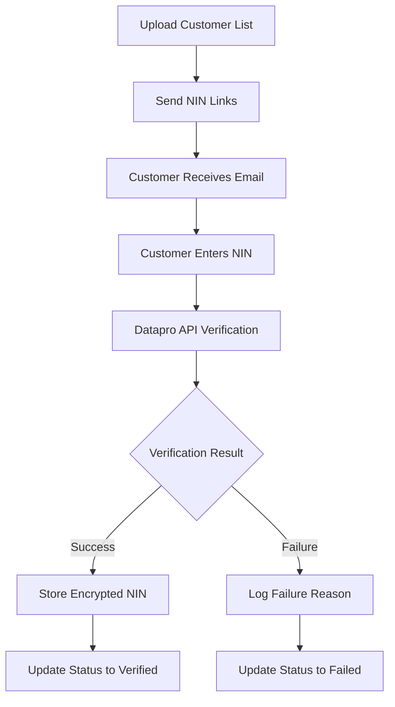

# Identity Collection System - Technical Documentation

## Executive Summary

The Identity Collection System is a comprehensive platform for insurance brokers to collect and verify customer identity information in compliance with NAICOM and NIIRA regulatory requirements. The system supports both individual (NIN) and corporate (CAC) identity verification through secure APIs and document management.

### Key Capabilities
- **Bulk Identity Collection**: Upload and process customer lists via CSV/Excel
- **Dual Verification Types**: NIN verification for individuals, CAC verification for corporates
- **Document Management**: Secure upload, storage, and preview of CAC documents
- **Real-time Processing**: Live verification status updates and progress tracking
- **Regulatory Compliance**: Built-in NAICOM/NIIRA compliance and audit logging
- **Cost Optimization**: Duplicate detection and bulk processing for cost efficiency

## System Architecture

### High-Level Architecture

```
┌─────────────────┐    ┌─────────────────┐    ┌─────────────────┐
│   Web Frontend  │    │  Backend API    │    │  External APIs  │
│   (React/TS)    │◄──►│   (Node.js)     │◄──►│  (Datapro/CAC)  │
└─────────────────┘    └─────────────────┘    └─────────────────┘
         │                       │                       │
         ▼                       ▼                       ▼
┌─────────────────┐    ┌─────────────────┐    ┌─────────────────┐
│   Firebase      │    │   File Storage  │    │   Audit Logs    │
│   (Auth/DB)     │    │   (Encrypted)   │    │   (Firestore)   │
└─────────────────┘    └─────────────────┘    └─────────────────┘
```

### Core Components

#### 1. Identity Lists Dashboard (`IdentityListsDashboard.tsx`)
- **Purpose**: Main admin interface for managing customer lists
- **Features**:
  - Upload new customer lists via drag-and-drop
  - View all lists with progress indicators
  - Filter by Individual/Corporate list types
  - Real-time status updates and document tracking
  - Export functionality for compliance reporting

#### 2. Upload Dialog (`UploadDialog.tsx`)
- **Purpose**: File upload and validation interface
- **Features**:
  - Template mode with validation against required columns
  - CSV/Excel file parsing with preview
  - Auto-detection of email and name columns
  - Data validation with error reporting
  - **Editable Preview Table**: Interactive data correction interface
    - Click any cell to edit data inline
    - Real-time validation with visual error indicators
    - Row-level save/cancel actions with checkmark and X icons
    - Automatic field type detection (email, name columns highlighted)
    - Keyboard shortcuts: Enter to save, Escape to cancel
    - Visual indicators for edited cells (green checkmark) and errors (red X)

#### 3. List Detail View (`IdentityListDetail.tsx`)
- **Purpose**: Detailed view of individual customer lists
- **Features**:
  - Dynamic DataGrid showing all customer data
  - Bulk verification operations
  - Individual link resending
  - CAC document viewing and management
  - Activity logging and audit trail

#### 4. Customer Verification Page (`CustomerVerificationPage.tsx`)
- **Purpose**: Public-facing verification interface for customers
- **Features**:
  - Token-based secure access
  - NIN input with validation
  - CAC document upload (3 required documents)
  - Real-time verification feedback
  - Mobile-responsive design

## API Integrations

### 1. Datapro API (NIN Verification)
```typescript
// Configuration
dataproApiUrl: 'https://api.datapronigeria.com'
endpoint: '/verifynin/?regNo={NIN}'
authentication: 'SERVICEID header'

// Request Flow
1. Validate NIN format (11 digits)
2. Send verification request to Datapro
3. Parse response and extract customer data
4. Perform field-level validation against expected data
5. Store encrypted results in database
```

### 2. VerifyData API (CAC Verification)
```typescript
// Configuration
verifydataApiUrl: 'https://vd.villextra.com'
endpoint: '/api/v1/cac/verify'
authentication: 'secret-key header'

// Request Flow
1. Validate CAC registration number
2. Upload and validate CAC documents
3. Send verification request with document references
4. Parse company registration data
5. Validate against expected company information
```

### 3. Cost Tracking and Optimization
```typescript
// Cost Calculator (server-utils/costCalculator.cjs)
- Tracks API usage per verification type
- Implements duplicate detection to avoid redundant calls
- Provides cost analytics and budget monitoring
- Supports bulk verification discounts
```

## Security Architecture

### 1. Data Encryption
```typescript
// Encryption Service (cacEncryptionService.ts)
- AES-256-GCM encryption for sensitive data
- Unique encryption keys per document
- Secure key derivation using PBKDF2
- Encrypted storage of customer PII
```

### 2. Access Control
```typescript
// Access Control (cacAccessControl.ts)
- Role-based permissions (broker, compliance, admin, super-admin)
- Document-level access restrictions
- Audit logging for all access attempts
- Session-based authentication
```

### 3. Document Security
```typescript
// Document Storage (cacStorageService.ts)
- Encrypted file storage in Firebase Storage
- Secure download URLs with expiration
- Document integrity validation
- Virus scanning integration
```

## Data Models

### 1. Identity Entry
```typescript
interface IdentityEntry {
  id: string;
  email: string;
  data: Record<string, any>; // Original customer data
  status: 'pending' | 'link_sent' | 'verified' | 'verification_failed';
  verificationType: 'NIN' | 'CAC';
  nin?: string; // Encrypted
  cac?: string; // Encrypted
  verificationDetails?: {
    fieldsValidated: string[];
    failedFields: string[];
    failureReason?: string;
  };
### 2. Edit State Management
```typescript
interface EditState {
  // Map structure: rowIndex -> columnName -> newValue
  // Only stores modified cells to minimize memory usage
  editedCells: Map<number, Map<string, any>>;
  
  // Validation results per row after edits
  validationState: Map<number, ValidationError[]>;
  
  // Currently active edit (only one cell at a time)
  editingCell: { rowIndex: number; column: string } | null;
}

// Helper Functions
getMergedRowData(originalRow, rowIndex, editState): Record<string, any>
updateEditState(editState, rowIndex, column, value): EditState
### 5. List Summary MetadataditState, rowIndex): EditState
hasRowEdits(editState, rowIndex): boolean
isCellEdited(editState, rowIndex, column): boolean
```

### 3. Editable Preview Components
```typescript
// EditablePreviewTable.tsx - Main table component
- Renders table with sticky header and scrollable body
- Maps rows/columns to EditableCell instances
- Conditionally shows RowActions for edited rows
- Switches to virtualized rendering for large datasets (>100 rows)
- Provides visual indicators for email/name columns

// EditableCell.tsx - Individual cell component
- View mode: displays value with pointer cursor
The Upload Dialog provides a comprehensive interface for file upload and data validation:

#### Features:
- **Drag-and-Drop Upload**: Intuitive file upload with progress tracking
- **Template Validation**: Ensures uploaded data matches required column structure
- **Auto-Detection**: Automatically identifies email, name, and policy columns
- **Data Preview**: Shows parsed data in editable table format
- **Error Reporting**: Detailed validation errors with suggested corrections
- **Bulk Operations**: Support for CSV and Excel files up to 10MB

#### Validation Pipeline:
1. **File Validation**: Type, size, and format checks
2. **Column Mapping**: Auto-detection of required fields
3. **Data Quality**: Email format, required field validation
4. **Duplicate Detection**: Identifies potential duplicate entries
5. **Interactive Correction**: Editable preview for data fixes

## Verification Workflowsnts

### 1. Editable Preview Table System
The system provides an interactive data editing interface that allows brokers to correct customer data before creating verification lists.

#### Core Features:
- **Click-to-Edit**: Any cell can be clicked to enter edit mode
- **Real-time Validation**: Immediate feedback on data quality and errors
- **Visual Indicators**: 
  - Green checkmark for successfully edited cells
  - Red X icon for cells with validation errors
  - Blue highlighting for detected name columns
  - Green highlighting for email columns
- **Row-level Actions**: Save/cancel buttons appear for rows with pending edits
- **Keyboard Navigation**: 
  - Enter key to save changes
  - Escape key to cancel edits
  - Tab navigation between cells
- **Performance Optimization**: Virtualized rendering for large datasets (>100 rows)

#### Edit Workflow:
1. **Cell Selection**: Click any cell to enter edit mode
2. **Data Entry**: TextField appears with auto-focus and text selection
3. **Validation**: Real-time validation as user types
4. **Save Options**:
   - Press Enter to save and move to next cell
   - Click outside cell to auto-save
   - Click checkmark icon to save entire row
5. **Cancel Options**:
   - Press Escape to revert to original value
   - Click X icon to cancel all row changes

#### State Management:
```typescript
// Edit state tracks only modified cells
EditState: Map<rowIndex, Map<columnName, newValue>>

// Validation state tracks errors per row
ValidationState: Map<rowIndex, ValidationError[]>

// Active edit tracking (one cell at a time)
EditingCell: { rowIndex: number; column: string } | null
```

### 2. Upload Dialog Interfaceeld with auto-focus and text selection
- Keyboard handling: Enter (save), Escape (cancel)
- Click outside: automatically saves changes
- Visual states: edited (green checkmark), error (red X)

// RowActions.tsx - Save/cancel buttons
- Displays save (checkmark) and cancel (X) icon buttons
- Only visible for rows with pending edits
- Tooltips for accessibility
- Compact design to minimize space usage
```
  verifiedAt?: Date;
  resendCount: number;
}
```

### 2. CAC Document Metadata
```typescript
interface CACDocumentMetadata {
  id: string;
  identityRecordId: string;
  documentType: 'certificate_of_incorporation' | 'particulars_of_directors' | 'share_allotment';
  filename: string;
  fileSize: number;
  mimeType: string;
  storagePath: string;
  encryptionMetadata: EncryptionMetadata;
  uploadedAt: Date;
  uploaderId: string;
  status: 'uploaded' | 'verified' | 'rejected';
}
```

### 3. List Summary
```typescript
interface ListSummary {
  id: string;
  name: string;
  listType: 'individual' | 'corporate' | 'flexible';
  totalEntries: number;
  verifiedCount: number;
  pendingCount: number;
  failedCount: number;
  progress: number; // Percentage
  createdAt: Date;
  originalFileName: string;
}
```

## Verification Workflows

### Individual (NIN) Verification Flow


### Corporate (CAC) Verification Flow
```mermaid
graph TD
    A[Upload Corporate List] --> B[Send CAC Links]
    B --> C[Customer Receives Email]
    C --> D[Customer Uploads 3 Documents]
    D --> E[Document Validation & Encryption]
    E --> F[Customer Enters CAC Number]
    F --> G[VerifyData API Verification]
    G --> H{Verification Result}
## File Processing Pipeline

### 1. Upload and Validation
```typescript
// File Parser (utils/fileParser.ts)
1. Validate file type (CSV/Excel) and size (max 10MB)
2. Parse file content and extract columns
3. Auto-detect email, name, and policy columns
4. Validate against template requirements (if template mode)
5. Perform data quality checks and corrections
6. Generate editable preview for user confirmation
```

### 2. Editable Preview System
```typescript
// EditablePreviewTable Component (EditablePreviewTable.tsx)
Features:
- Interactive cell editing with click-to-edit functionality
- Real-time validation with visual feedback
- Row-level save/cancel operations
- Keyboard navigation (Enter to save, Escape to cancel)
- Visual indicators for edited cells and validation errors
- Automatic field type detection and highlighting
- Virtualized rendering for large datasets (>100 rows)

// Edit State Management (types/editablePreview.ts)
- EditState: Map<rowIndex, Map<columnName, newValue>>
- ValidationState: Map<rowIndex, ValidationError[]>
- EditingCell: { rowIndex, column } for active edit tracking
- Helper functions for state management and data merging
```

### 3. Data Processing
```typescript
// Identity Validation (utils/validation/identityValidation.ts)
1. Validate email formats and uniqueness
2. Check required fields based on list type
3. Normalize phone numbers and names
4. Detect and flag potential duplicates
5. Generate validation report with errors
```

### 4. List Creation
```typescript
// List Creation Flow
1. Create list metadata in Firestore
2. Process entries in batches for performance
3. Generate unique verification tokens
4. Set up email templates and expiration dates
5. Initialize progress tracking and analytics
```List Creation Flow
1. Create list metadata in Firestore
2. Process entries in batches for performance
3. Generate unique verification tokens
4. Set up email templates and expiration dates
5. Initialize progress tracking and analytics
```

## Document Management System

### 1. Upload Process
```typescript
// CAC Document Upload (CACDocumentUpload.tsx)
1. Client-side file validation (type, size, content)
2. Progress tracking with real-time updates
3. Encryption before storage
4. Metadata storage in Firestore
5. Audit logging for compliance
```

### 2. Storage Architecture
```typescript
// Storage Structure
/cac-documents/
  /{identityRecordId}/
    /certificate_of_incorporation/
      /{documentId}.encrypted
    /particulars_of_directors/
      /{documentId}.encrypted
    /share_allotment/
      /{documentId}.encrypted
```

### 3. Preview System
```typescript
// Document Preview (CACDocumentPreview.tsx)
1. Permission-based access control
2. On-demand decryption for preview
3. Session caching for performance
4. PDF rendering and image zoom
5. Secure download functionality
```

## Performance Optimizations

### 1. Bulk Processing
- **Batch Operations**: Process verifications in configurable batches
- **Queue Management**: Background job processing for large lists
- **Rate Limiting**: Respect API rate limits with exponential backoff
- **Caching**: Redis caching for frequently accessed data

### 2. Frontend Optimizations
- **Virtual Scrolling**: Handle large customer lists efficiently
- **Lazy Loading**: Load data on-demand for better performance
- **Optimistic Updates**: Immediate UI feedback with background sync
- **Progressive Enhancement**: Core functionality works without JavaScript

### 3. Database Optimization
- **Indexed Queries**: Optimized Firestore indexes for common queries
- **Pagination**: Efficient pagination for large datasets
- **Aggregation**: Pre-computed statistics for dashboard metrics
- **Cleanup Jobs**: Automated cleanup of expired tokens and temp data

## Monitoring and Analytics

### 1. System Metrics
```typescript
// Key Performance Indicators
- Verification success rates by type (NIN/CAC)
- Average processing time per verification
- API response times and error rates
- Document upload success rates
- User engagement and adoption metrics
```

### 2. Cost Analytics
```typescript
// Cost Tracking
- API usage costs per broker and time period
- Cost per verification by type
- Duplicate detection savings
- Budget alerts and usage forecasting
```

### 3. Audit Logging
```typescript
// Audit Events
- User authentication and authorization
- File uploads and downloads
- Verification attempts and results
- Data access and modifications
- System configuration changes
```

## Analytics and Reporting Dashboard

### 1. Admin Analytics Dashboard (`AdminAnalyticsDashboard.tsx`)
The system provides a comprehensive analytics dashboard for monitoring API usage, costs, and performance metrics.

#### Core Features:
- **Real-time Metrics**: Live dashboard with auto-refresh capabilities
- **Cost Tracking**: Budget monitoring with alerts and projections
- **Usage Analytics**: Daily usage trends and patterns visualization
- **User Attribution**: Detailed breakdown of usage by broker/user
- **Audit Logging**: Complete verification attempt tracking
- **Report Generation**: Export capabilities in PDF, Excel, and CSV formats
- **Responsive Design**: Mobile-optimized interface with collapsible charts

#### Dashboard Components:

##### Metrics Overview (`MetricsOverview.tsx`)
- **Total API Calls**: Aggregated call counts with period comparisons
- **Total Cost**: Spending tracking with trend indicators
- **Success Rate**: Verification success percentages
- **Provider Breakdown**: Usage split between Datapro (NIN) and VerifyData (CAC)
- **Period Comparisons**: Month-over-month change indicators

##### Usage Charts (`UsageCharts.tsx`)
- **Daily API Calls**: Line chart showing call volume trends
- **Cost Comparison**: Bar chart comparing provider costs
- **Success/Failure Rate**: Pie chart showing verification outcomes
- **Cost Trends**: Area chart displaying spending patterns
- **Mobile Optimization**: Collapsible charts for mobile devices

##### Cost Tracker (`CostTracker.tsx`)
- **Budget Monitoring**: Real-time budget utilization tracking
- **Alert System**: Warning and critical threshold notifications
- **Projected Costs**: End-of-month spending projections
- **Budget Configuration**: Admin interface for setting spending limits
- **Visual Indicators**: Progress bars and color-coded alerts

##### User Attribution Table (`UserAttributionTable.tsx`)
- **Broker Usage**: Detailed breakdown by individual users
- **Sorting & Filtering**: Multi-column sorting with pagination
- **Anomaly Detection**: Identification of unusual usage patterns
- **Expandable Rows**: Detailed user information on demand
- **CSV Export**: Data export functionality

##### Report Generator (`ReportGenerator.tsx`)
- **Multiple Formats**: PDF, Excel, and CSV export options
- **Customizable Sections**: Selective data inclusion
- **Date Range Selection**: Flexible reporting periods
- **Progress Tracking**: Real-time generation progress
- **Large Dataset Handling**: Optimized for high-volume data

### 2. Data Models and Types

#### Analytics Summary
```typescript
interface AnalyticsSummary {
  totalCalls: number;
  totalCost: number;
  successRate: number;
  dataproCalls: number;
  verifydataCalls: number;
  previousPeriodComparison: {
    callsChange: number;
    costChange: number;
    successRateChange: number;
  };
}
```

#### Usage Data Points
```typescript
interface UsageDataPoint {
  date: string;
  dataproCalls: number;
  verifydataCalls: number;
  totalCost: number;
  successCount: number;
  failureCount: number;
}
```

#### Broker Usage Attribution
```typescript
interface BrokerUsage {
  brokerId: string;
  userName: string;
  userEmail: string;
  totalCalls: number;
  totalCost: number;
  successRate: number;
  lastActivity: Date;
}
```

### 3. Backend API Requirements

#### Analytics Endpoints
```typescript
// Dashboard Overview
GET /api/analytics/overview
Query: { startDate, endDate, provider?, status? }
Response: AnalyticsSummary

// Daily Usage Data
GET /api/analytics/daily-usage
Query: { startDate, endDate, provider? }
Response: UsageDataPoint[]

// User Attribution
GET /api/analytics/user-attribution
Query: { startDate, endDate, limit?, offset? }
Response: BrokerUsage[]

// Cost Tracking
GET /api/analytics/cost-tracking
Response: CostTrackingData

// Budget Configuration
GET /api/analytics/budget-config
POST /api/analytics/budget-config
Body: BudgetConfig
```

### 4. Real-time Features

#### Auto-refresh System
- **Configurable Intervals**: 30-second default refresh rate
- **Connection Status**: Visual indicators for API connectivity
- **Error Handling**: Graceful degradation with retry mechanisms
- **Background Updates**: Non-intrusive data refreshing

#### Budget Monitoring
- **Real-time Alerts**: Immediate notifications for threshold breaches
- **Projection Calculations**: Dynamic end-of-month cost estimates
- **Visual Indicators**: Color-coded progress bars and status icons

### 5. Performance Optimizations

#### Data Handling
- **Pagination**: Efficient handling of large datasets
- **Virtualization**: Optimized rendering for extensive tables
- **Caching**: Client-side data caching for improved performance
- **Lazy Loading**: On-demand component loading

#### Mobile Responsiveness
- **Adaptive Layout**: Responsive grid system
- **Touch Optimization**: Mobile-friendly interactions
- **Collapsible UI**: Space-efficient mobile interface
- **Progressive Enhancement**: Core functionality on all devices

### 6. Security and Access Control

#### Role-based Access
- **Super Admin Only**: Analytics dashboard restricted to super admin users
- **Data Isolation**: User-specific data filtering
- **Audit Trail**: Complete access logging
- **Secure Endpoints**: Authentication-protected API routes

#### Data Privacy
- **PII Protection**: Sensitive data masking in reports
- **Encrypted Storage**: Secure data transmission and storage
- **Access Logging**: Complete audit trail for compliance

## Compliance and Regulatory Features

### 1. NAICOM Compliance
- **Mandatory NIN Collection**: Enforced for all individual policies
- **CAC Verification**: Required for corporate policies
- **Audit Trail**: Complete logging for regulatory inspections
- **Data Retention**: Configurable retention policies

### 2. NDPR Compliance
- **Data Minimization**: Collect only necessary information
- **Encryption**: All PII encrypted at rest and in transit
- **Access Controls**: Role-based access to sensitive data
- **Right to Erasure**: Data deletion capabilities

### 3. Security Standards
- **ISO 27001**: Information security management
- **SOC 2**: Security and availability controls
- **PCI DSS**: Payment card data security (if applicable)
- **OWASP**: Web application security best practices

## Deployment Architecture

### 1. Production Environment
```yaml
# Infrastructure Components
Frontend: Firebase Hosting (CDN, SSL, Global)
Backend: Google Cloud Run (Auto-scaling, Serverless)
Database: Firestore (NoSQL, Real-time, Global)
Storage: Firebase Storage (Encrypted, Secure)
Authentication: Firebase Auth (OAuth, MFA)
Monitoring: Google Cloud Monitoring + Logging
```

### 2. Development Workflow
```yaml
# CI/CD Pipeline
Source Control: Git with feature branches
Testing: Jest (Unit), Cypress (E2E), Property-based
Code Quality: ESLint, Prettier, TypeScript strict mode
Deployment: Automated via GitHub Actions
Environments: Development, Staging, Production
```

### 3. Scalability Considerations
- **Horizontal Scaling**: Auto-scaling backend services
- **Database Sharding**: Partition data by broker/region
- **CDN Distribution**: Global content delivery
- **Load Balancing**: Distribute traffic across regions

## API Documentation

### 1. Identity Lists API
```typescript
// Create List
POST /api/identity/lists
Body: {
  name: string;
  columns: string[];
  emailColumn: string;
  entries: Record<string, any>[];
  listType: 'individual' | 'corporate';
}

// Get Lists
GET /api/identity/lists
Query: { page?, limit?, status?, search? }

// Get List Details
GET /api/identity/lists/:id
Response: ListDetails with entries

// Send Verification Links
POST /api/identity/lists/:id/send-links
Body: {
  entryIds: string[];
  verificationType: 'NIN' | 'CAC';
}
```

### 2. Verification API
```typescript
// Validate Token
GET /api/identity/verify/:token
Response: TokenValidationResponse

// Submit Verification
POST /api/identity/verify/:token
Body: {
  identityNumber: string;
  documentIds?: Record<string, string>;
}

// Upload Document
POST /api/identity/verify/:token/upload-document
Body: FormData with file and documentType
```

### 3. Analytics API
```typescript
// Get Dashboard Metrics
GET /api/analytics/dashboard
Response: {
  totalLists: number;
  totalEntries: number;
  verificationRate: number;
  costMetrics: CostSummary;
}

// Export Data
POST /api/analytics/export
Body: {
  listIds: string[];
  format: 'csv' | 'excel' | 'pdf';
  includeDocuments?: boolean;
}
```

## Error Handling and Recovery

### 1. Client-Side Error Handling
```typescript
// Error Boundaries for React components
// Retry mechanisms for failed API calls
// User-friendly error messages
// Offline support with service workers
```

### 2. Server-Side Error Handling
```typescript
// Structured error responses
// Automatic retry for transient failures
// Circuit breaker pattern for external APIs
// Dead letter queues for failed jobs
```

### 3. Data Recovery
```typescript
// Database backups and point-in-time recovery
// File storage redundancy and versioning
// Audit log preservation for compliance
// Disaster recovery procedures
```

## Future Enhancements

### 1. Planned Features
- **Mobile App**: Native iOS/Android applications
- **WhatsApp Integration**: Send verification links via WhatsApp
- **Advanced Analytics**: Machine learning for fraud detection
- **API Webhooks**: Real-time notifications for external systems

### 2. Scalability Improvements
- **Multi-tenancy**: Support for multiple insurance companies
- **Regional Deployment**: Data residency compliance
- **Edge Computing**: Reduce latency with edge processing
- **Blockchain Integration**: Immutable audit trails

### 3. Integration Opportunities
- **CRM Systems**: Salesforce, HubSpot integration
- **Policy Management**: Core insurance system integration
- **Payment Gateways**: Automated premium collection
- **Regulatory Reporting**: Direct submission to NAICOM

## Conclusion

The Identity Collection System provides a comprehensive, secure, and compliant solution for insurance brokers to collect and verify customer identity information. With its robust architecture, extensive security measures, and regulatory compliance features, the system enables brokers to efficiently meet NAICOM and NIIRA requirements while providing an excellent user experience for both brokers and their customers.

The system's modular design, comprehensive API coverage, and extensive monitoring capabilities make it suitable for deployment at scale while maintaining high security and compliance standards.